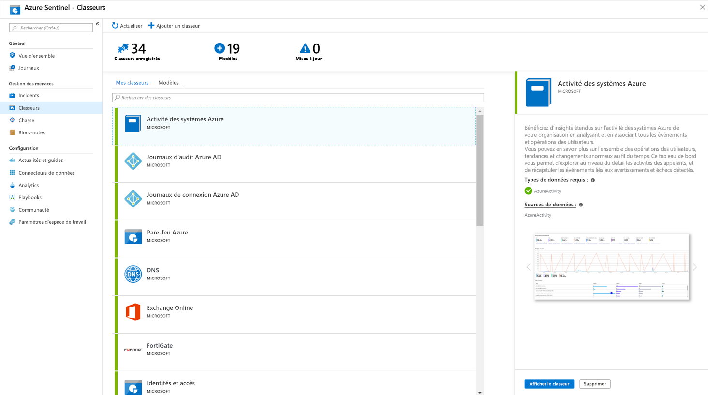
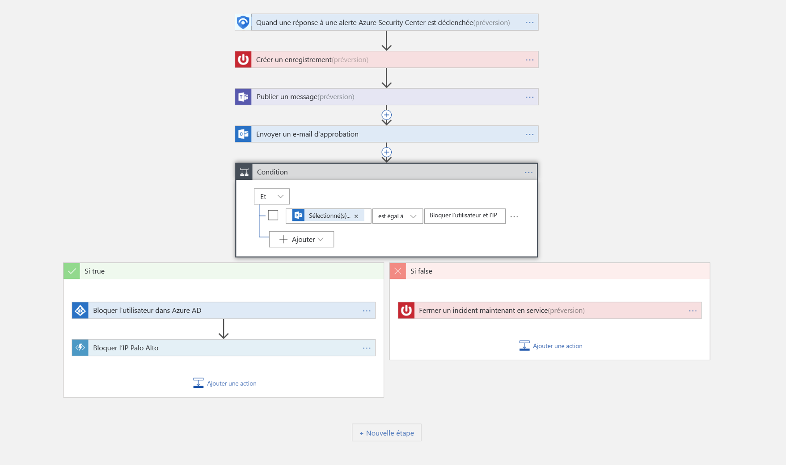
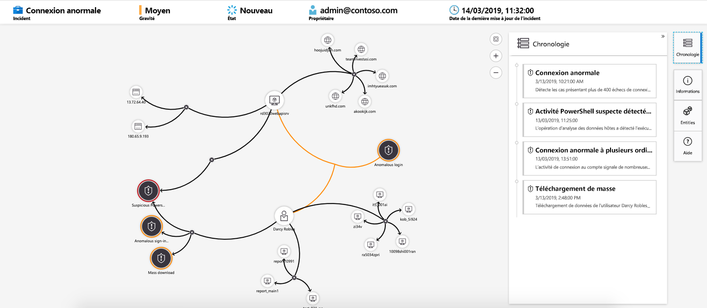
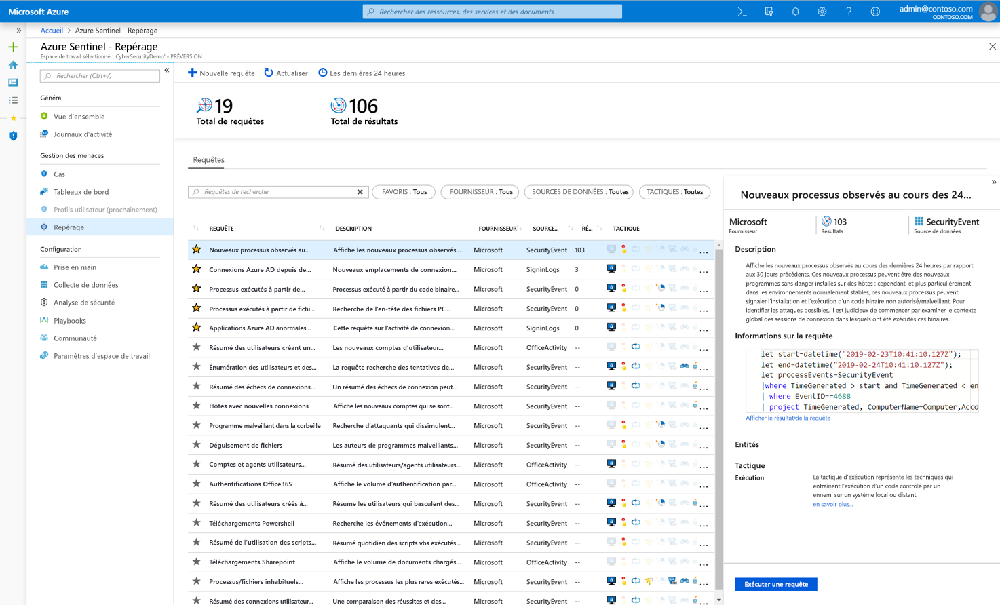

# Qu’est-ce qu’Azure Sentinel ?

Microsoft Azure Sentinel est une solution native cloud et scalable de type **SIEM (Security Information and Event Management)** et **SOAR (Security Orchestrated Automated Response)** . Azure Sentinel assure une analyse de sécurité intelligente et fournit des informations sur les menaces dans l’ensemble de l’entreprise. Elle constitue une solution unique pour la détection des alertes, la visibilité des menaces, la chasse proactive et la réponse face aux menaces. 

Azure Sentinel est votre observatoire global sur l’ensemble de l’entreprise et atténue le stress dû à des attaques de plus en plus sophistiquées, à l’augmentation des volumes d’alertes et à la durée de résolution.

- **Collectez des données à l’échelle du cloud** sur l’ensemble des utilisateurs, appareils, applications et infrastructures, tant locaux que dans de multiples clouds. 

- **Détectez les menaces non détectées précédemment** et réduisez les faux positifs en vous appuyant sur l’analytique et les systèmes de renseignement incomparables sur les menaces fournis par Microsoft. 

- **Investiguez les menaces à l’aide de l’intelligence artificielle** et recherchez les activités suspectes à grande échelle en profitant des années de travail que Microsoft a consacrées à la cybersécurité. 

- **Répondez aux incidents rapidement** avec une orchestration et une automatisation intégrées des tâches courantes.

S’appuyant sur la gamme complète des services Azure existants, Azure Sentinel intègre de façon native les éléments de base comme Log Analytics et Logic Apps. Azure Sentinel enrichit vos opérations d’investigation et de détection avec l’intelligence artificielle et fournit les flux d’informations sur les menaces venant de Microsoft et vous permet de mettre en place votre propre intelligence face aux menaces. 

## Connexion à toutes vos données

Pour intégrer Azure Sentinel, vous devez d’abord [vous connecter à vos sources de sécurité](connect-data-sources.md). Azure Sentinel est fourni avec plusieurs connecteurs pour les solutions Microsoft, disponibles par défaut et offrant une intégration en temps réel, y compris les solutions Microsoft Threat Protection, et les sources Microsoft 365, dont Office 365, Azure AD, Azure ATP et Microsoft Cloud App Security, et bien plus encore. En outre, il existe des connecteurs intégrés pour la connexion aux écosystèmes de sécurité élargis pour les solutions non Microsoft. Vous pouvez également utiliser le format d’événement commun, Syslog ou l’API REST pour connecter vos sources de données à Azure Sentinel.  

[!INCLUDE [azure-lighthouse-supported-service](../../includes/azure-lighthouse-supported-service.md)]

## Workbooks

Après avoir  [connecté vos sources de données](quickstart-onboard.md) à Azure Sentinel, vous pouvez superviser les données à l’aide de l’intégration Azure Sentinel avec des classeurs Azure Monitor, ce qui offre une grande souplesse lors de la création de classeurs personnalisés. Même si les classeurs s’affichent différemment dans Azure Sentinel, il peut être utile de voir comment [créer des rapports interactifs avec les classeurs Azure Monitor](../azure-monitor/platform/workbooks-overview.md). Azure Sentinel vous permet de créer des classeurs personnalisés sur l’ensemble de vos données. Il est également fourni avec des modèles de classeurs intégrés avec lesquels vous obtenez rapidement des insights sur vos données dès que vous connectez une source de données.

## Analytics

Pour vous aider à réduire le niveau de bruit et à réduire le nombre d’alertes que vous devez examiner, Azure Sentinel utilise l’[analytique pour mettre en corrélation les alertes et les incidents](tutorial-detect-threats-built-in.md). Les **incidents** sont des groupes d’alertes liées qui, prises ensemble, constituent une menace exploitable que vous pouvez examiner et résoudre. Utilisez les règles de corrélation intégrées telles quelles ou utilisez-les comme point de départ pour créer vos propres règles. Azure Sentinel fournit également des règles d’apprentissage machine pour mapper le comportement de votre réseau et rechercher les possibles anomalies sur vos ressources. Ces analyses connectent ensuite les informations en transformant les alertes basse fidélité sur différentes entités en incidents de sécurité potentiels de haute fidélité.

## Automatisation et orchestration de la sécurité

Automatisez les tâches courantes et [simplifiez l’orchestration de la sécurité avec des playbooks](tutorial-respond-threats-playbook.md) qui s’intègrent aux services Azure et à vos outils. Basée sur Azure Logic Apps, la solution d’automatisation et d’orchestration d’Azure Sentinel offre une architecture hautement extensible qui permet une automatisation capable d’évoluer avec les nouvelles technologies et les nouvelles menaces. Pour créer des playbooks avec Azure Logic Apps, vous pouvez faire votre choix dans une galerie croissante de playbooks intégrés. Ceux-ci incluent [plus de 200 connecteurs](https://docs.microsoft.com/azure/connectors/apis-list) pour différents services comme Azure Functions. Ces connecteurs vous permettent d’appliquer une logique personnalisée dans votre code, ServiceNow, Jira, Zendesk, les requêtes HTTP, Microsoft Teams, Slack, Windows Defender ATP et Cloud App Security.

Par exemple, si vous utilisez le système de tickets ServiceNow, vous pouvez utiliser les outils fournis pour utiliser Azure Logic Apps et automatiser vos flux de travail et ouvrir un ticket dans ServiceNow chaque fois qu’un événement en particulier est détecté.

## Investigation

Actuellement en préversion, les outils d’[investigation approfondie](tutorial-investigate-cases.md) Azure Sentinel vous permettent de mieux comprendre l’étendue d’une menace de sécurité potentielle et d’en identifier la cause racine. Vous pouvez choisir une entité sur le graphique interactif pour poser des questions sur une entité spécifique et approfondir cette entité et ses connexions pour arriver à la cause racine de la menace. 

## Chasse

Utilisez les [puissants outils de recherche et de requête](hunting.md) d’Azure Sentinel, basés sur l’infrastructure MITRE, et qui vous permettent de façon proactive de rechercher les menaces de sécurité sur toutes les sources de données de votre organisation avant même le déclenchement d’une alerte. Une fois que vous avez découvert quelle requête de recherche fournit des informations d’importance sur les attaques possibles, vous pouvez également créer des règles de détection personnalisées basées sur cette requête et communiquer ces informations sous forme d’alertes au personnel en charge de la gestion des incidents de sécurité. Lors de la recherche, vous pouvez créer des signets pour les événements intéressants, ce qui vous permet d’y revenir plus tard, de les partager avec d’autres utilisateurs et de les regrouper avec d’autres événements en corrélation pour créer un incident d’investigation solide.

## Communauté

La communauté Azure Sentinel est une ressource importante pour l’automatisation et la détection des menaces. Nos analystes de sécurité Microsoft créent et ajoutent constamment de nouveaux classeurs, de nouveaux playbooks, de nouvelles requêtes de recherche, entre autres, et les publient dans la communauté pour que vous puissiez les utiliser dans votre environnement. Vous pouvez télécharger l’exemple de contenu à partir du [dépôt](https://aka.ms/asicommunity) GitHub de la communauté privée pour créer des classeurs, requêtes de recherche, notebooks et playbooks personnalisés pour Azure Sentinel. 

## Étapes suivantes

- Pour utiliser Azure Sentinel, vous devez disposer d’un abonnement à Microsoft Azure. Si vous n’avez pas d’abonnement, vous pouvez vous inscrire à un [essai gratuit](https://azure.microsoft.com/free/).
- Découvrez comment [intégrer vos données à Azure Sentinel](quickstart-onboard.md) et [obtenir une visibilité de vos données et des menaces potentielles](quickstart-get-visibility.md).
