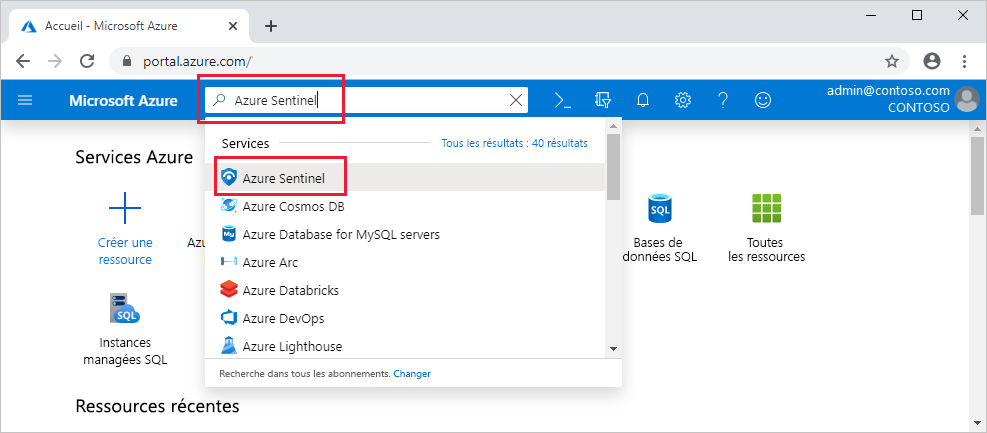

# Aperçu de la sentinelle Azure intégrée

> [!IMPORTANT]
> Sentinel Azure est actuellement en version préliminaire publique.
> Cette préversion est fournie sans contrat de niveau de service et n’est pas recommandée pour les charges de travail de production. Certaines fonctionnalités peuvent être limitées ou non prises en charge. Pour plus d’informations, consultez [Conditions d’Utilisation Supplémentaires relatives aux Évaluations Microsoft Azure](https://azure.microsoft.com/support/legal/preview-supplemental-terms/).

Dans ce démarrage rapide, vous allez apprendre comment intégrer Sentinel d’Azure. 

Pour intégrer Azure Sentinel, vous devez d’abord vous connecter à vos sources de données. Sentinel Azure est fourni avec plusieurs connecteurs pour les solutions de Microsoft, disponibles en dehors de la zone et fournissant l’intégration en temps réel, notamment des solutions de Protection contre les menaces de Microsoft, Microsoft 365 sources, y compris Office 365, Azure AD, Azure ATP, et Microsoft Cloud App Security et bien plus encore. En outre, il existe des connecteurs intégrés à la plus large écosystème de sécurité pour les solutions non Microsoft. Vous pouvez également utiliser le format d’événement commun, Syslog ou l’API REST pour vous connecter vos sources de données avec Azure Sentinel.  

Une fois que vous vous connectez vos sources de données, choisissez parmi une galerie de tableaux de bord créé de manière experte surface insights basés sur vos données. Ces tableaux de bord permettre être facilement adapté à vos besoins.

## Conditions préalables globales

- Si vous n’avez pas d’abonnement Azure, créez un [compte gratuit](https://azure.microsoft.com/free/?WT.mc_id=A261C142F) avant de commencer.

- Ouvrez une session espace de travail Analytique. Découvrez comment [créer un espace de travail Analytique de journal](../log-analytics/log-analytics-quick-create-workspace.md)

- Autorisations collaborateur à votre client pour activer Azure Sentinel

- Client global ou des autorisations d’administrateur de sécurité
 

## Activer Azure Sentinel 

1. Accédez au portail Azure.
2. Assurez-vous que l’abonnement dans lequel Azure Sentinel est créé, est sélectionné. 
3. Recherchez Azure Sentinel. 
   

1. Cliquez sur **+Ajouter**.
1. Sélectionnez l’espace de travail que vous souhaitez utiliser ou créez-en un. Vous pouvez exécuter Azure Sentinel sur plus d’un espace de travail, mais les données sont isolées sur un seul espace de travail.

   

   >[!NOTE] 
   > - **Emplacement de l’espace de travail** il est important de comprendre que toutes les données que vous diffusez sur Azure Sentinel est stockée dans l’emplacement géographique de l’espace de travail que vous avez sélectionné.  
   > - Espaces de travail par défaut créés par Azure Security Center n’apparaîtra pas dans la liste ; Vous ne pouvez pas installer Azure Sentinel dessus.
   > - Sentinel Azure peut s’exécuter sur les espaces de travail qui sont déployés dans une des régions suivantes :  Sud-est de l’Australie, centre du Canada, centre de l’Inde, est des États-Unis, est des États-Unis 2-EUAP (Canaries), est du Japon, Asie du Sud-est, Royaume-Uni Sud, Europe de l’ouest, ouest des États-Unis 2.

6. Cliquez sur **ajouter Azure Sentinel**.
  

## Connecter des sources de données

Sentinel Azure crée la connexion aux services et applications en vous connectant au service et de transfert des événements et les journaux à Azure Sentinel. Pour les ordinateurs et les machines virtuelles, vous pouvez installer l’agent Sentinel Azure qui collecte les journaux et les transfère à Azure Sentinel. Pour les pare-feux et proxys, Sentinel Azure utilise un serveur Linux Syslog. L’agent est installé sur celui-ci et à partir de laquelle l’agent collecte les fichiers journaux et les transfère à Azure Sentinel. 
 
1. Cliquez sur **collecte des données**.
2. Il existe une vignette pour chaque source de données que vous pouvez vous connecter. 
Par exemple, cliquez sur **Azure Active Directory**. Si vous vous connectez à cette source de données, vous diffusez tous les journaux à partir d’Azure AD dans Azure Sentinel. Vous pouvez sélectionner le type de journaux que vous souhaitez pour obtenir - journaux de connexion et/ou les journaux d’audit.  
En bas, Sentinel Azure fournit des recommandations pour les tableaux de bord, vous devez installer pour chaque connecteur afin de vous pouvez immédiatement obtenir des intéressants insights sur vos données.   Suivez les instructions d’installation ou [consultez le guide de connexion pertinentes](connect-data-sources.md) pour plus d’informations. Pour plus d’informations sur les connecteurs de données, consultez [services Microsoft de se connecter](connect-data-sources.md).

Une fois que vos données sources sont connectés, vos données démarre la diffusion en continu dans Azure Sentinel et sont prêtes à commencer à utiliser. Vous pouvez afficher les journaux dans le [tableaux de bord intégrés](quickstart-get-visibility.md) et commencez à créer des requêtes dans Analytique de journal à [examiner les données](tutorial-investigate-cases.md).

## Étapes suivantes
Dans ce document, vous avez appris sur la connexion des sources de données à Azure Sentinel. Pour en savoir plus sur Azure Sentinel, consultez les articles suivants :
- Découvrez comment [obtenez une visibilité sur vos données et les menaces potentielles](quickstart-get-visibility.md).
- Prise en main [détecter des menaces avec Azure Sentinel](tutorial-detect-threats.md).
- Données à partir de Stream [appliances de Format d’erreur commun](connect-common-event-format.md) dans Azure Sentinel.
