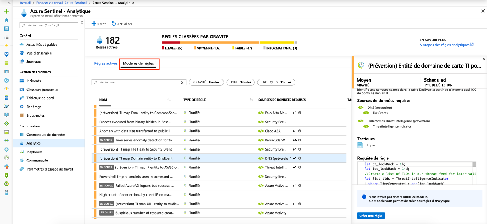

# Tutoriel : Détection des menaces prête à l’emploi

> [!IMPORTANT]
> La détection des menaces prête à l’emploi est actuellement en préversion publique.
> Cette fonctionnalité est fournie sans contrat de niveau de service et est déconseillée pour les charges de travail de production.
> Pour plus d’informations, consultez [Conditions d’Utilisation Supplémentaires relatives aux Évaluations Microsoft Azure](https://azure.microsoft.com/support/legal/preview-supplemental-terms/).

Après avoir  [connecté vos sources de données](quickstart-onboard.md) à Azure Sentinel, vous souhaitez être averti en cas d’activité suspecte. Pour vous permettre de l’être, Azure Sentinel vous fournit des modèles intégrés prêts à l’emploi. Ces modèles ont été conçus par l’équipe d’analystes et d’experts en sécurité de Microsoft en fonction de menaces connues, de vecteurs d’attaque courants et de chaînes d’escalade d’activités suspectes. Une fois ces modèles activés, ils recherchent automatiquement toute activité qui semble suspecte dans votre environnement. La plupart des modèles peuvent être personnalisés pour rechercher des activités ou les filtrer, en fonction de vos besoins. Les alertes générées par ces modèles vont créer des incidents que vous pouvez affecter et examiner dans votre environnement.

Ce tutoriel vous aide à détecter les menaces avec Azure Sentinel :

> [!div class="checklist"]
> * Utiliser des détections prêtes à l’emploi
> * Automatiser les réponses aux menaces

## À propos des détections prêtes à l’emploi

Pour voir toutes les détections prêtes à l’emploi, accédez à **Analytique**, puis à **Modèles de règle**. Cet onglet contient toutes les règles intégrées Azure Sentinel.

   

Les types de modèles suivants sont disponibles :

- **Sécurité Microsoft** : les modèles de sécurité Microsoft créent automatiquement des incidents Azure Sentinel à partir des alertes générées dans d’autres solutions de sécurité Microsoft, en temps réel. Vous pouvez utiliser des règles de sécurité Microsoft comme modèle pour créer des règles ayant une logique similaire. Pour plus d’informations sur les règles de sécurité, consultez [Créer automatiquement des incidents à partir d’alertes de sécurité Microsoft](create-incidents-from-alerts.md).
- **Fusion** : basée sur la technologie Fusion, la détection avancée des attaques en plusieurs étapes dans Azure Sentinel utilise des algorithmes de Machine Learning évolutifs qui peuvent mettre en corrélation un grand nombre d’alertes et d’événements basse fidélité sur plusieurs produits dans des incidents haute fidélité et exploitables. La fusion est activée par défaut. Étant donné que la logique est masquée, vous ne pouvez pas l’utiliser comme modèle pour créer plusieurs règles.
- **Analytique comportementale du Machine Learning** : ces modèles sont basés sur des algorithmes Microsoft Machine Learning propriétaires. Vous ne pouvez donc pas voir la logique interne de leur fonctionnement et du moment de leur exécution. Étant donné que la logique est masquée, vous ne pouvez pas l’utiliser comme modèle pour créer plusieurs règles.
-   **Planifié** : les règles d’analytique planifiées sont des requêtes planifiées écrites par des experts en sécurité de Microsoft. Vous pouvez voir la logique de la requête et y apporter des changements. Vous pouvez utiliser des règles planifiées comme modèle pour créer des règles ayant une logique similaire.

## Utiliser des détections prêtes à l’emploi

1. Pour utiliser un modèle intégré, cliquez sur **Créer une règle** pour créer une règle active basée sur ce modèle. Chaque entrée comprend une liste de sources de données nécessaires qui sont automatiquement vérifiées, ce qui peut entraîner la désactivation de **Créer une règle**.
  
   
 
1. Cette opération ouvre l’Assistant Création de règles, en fonction du modèle sélectionné. Tous les détails sont remplis automatiquement. Pour **Règles planifiées** ou **Règles de sécurité Microsoft**, vous pouvez personnaliser la logique afin de l’adapter au mieux à votre organisation, ou créer des règles supplémentaires basées sur le modèle intégré. Une fois les étapes de l’Assistant Création de règles effectuées et la création d’une règle basée sur le modèle terminé, la nouvelle règle s’affiche sous l’onglet **Règles actives**.

Pour plus d’informations sur les champs de l’Assistant, consultez [Tutoriel : Créer des règles d’analytique personnalisées pour détecter les menaces suspectes](tutorial-detect-threats-custom.md).

## Étapes suivantes
Dans ce didacticiel, vous avez appris à prendre en main la détection des menaces en utilisant Azure Sentinel. 

Pour découvrir comment automatiser vos réponses aux menaces, consultez [Configurer des réponses automatisées aux menaces dans Azure Sentinel](tutorial-respond-threats-playbook.md).

