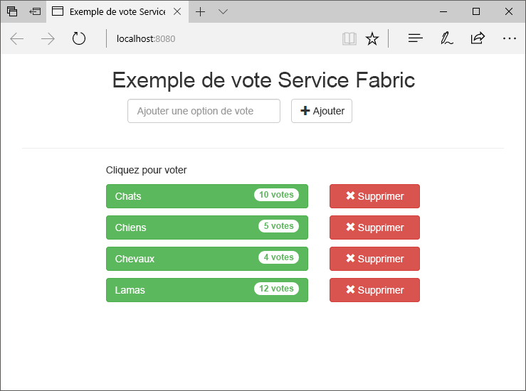
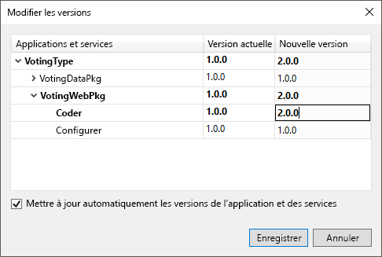
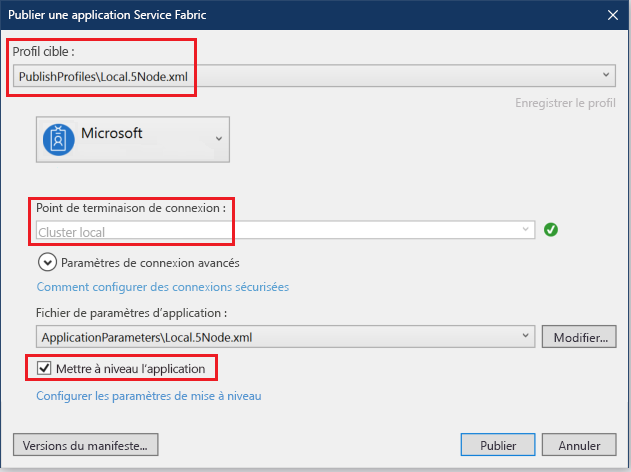
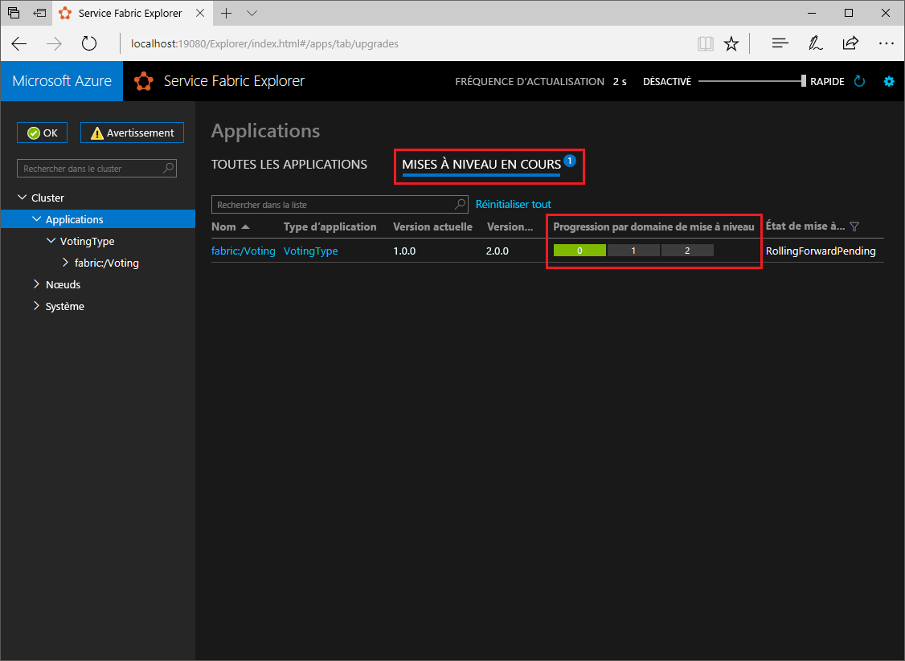

# <a name="quickstart-deploy-a-net-reliable-services-application-to-service-fabric"></a>Démarrage rapide : Déployer une application de services fiables .NET sur Service Fabric

Azure Service Fabric est une plateforme de systèmes distribués pour le déploiement et la gestion de microservices et conteneurs extensibles et fiables.

Ce démarrage rapide montre comment déployer votre première application .NET sur Service Fabric. Lorsque vous avez terminé, vous disposez d’une application de vote avec un composant web frontal ASP.NET Core qui enregistre les résultats de vote dans un service principal avec état dans le cluster.



Cette application vous permet d’apprendre à :

* Créer une application à l’aide de .NET et Service Fabric
* Utiliser ASP.NET Core en tant que service frontal web
* Stocker des données d’application dans un service avec état
* Déboguez votre application localement
* Déployer l’application sur un cluster dans Azure
* Mettre à l’échelle avec une montée en puissance parallèle sur plusieurs nœuds
* Effectuer une mise à niveau propagée d’application

## <a name="prerequisites"></a>Prérequis

Pour suivre ce guide de démarrage rapide :

1. [Installez Visual Studio 2017](https://www.visualstudio.com/) avec les charges de travail **Développement Azure** et **Développement web et ASP.NET**.
2. [Installez Git](https://git-scm.com/)
3. [Installez le Kit de développement logiciel (SDK) Microsoft Azure Service Fabric](https://www.microsoft.com/web/handlers/webpi.ashx?command=getinstallerredirect&appid=MicrosoftAzure-ServiceFabric-CoreSDK)
4. Exécutez la commande suivante pour permettre à Visual Studio de déployer sur le cluster Service Fabric local :
    ```powershell
    Set-ExecutionPolicy -ExecutionPolicy Unrestricted -Force -Scope CurrentUser
    ```

>[!NOTE]
> L’exemple d’application de ce démarrage rapide utilise des fonctionnalités qui ne sont pas disponibles sur Windows 7.
>

## <a name="download-the-sample"></a>Télécharger l’exemple

Dans une fenêtre Commande, exécutez la commande suivante pour cloner le référentiel de l’exemple d’application sur votre ordinateur local.

```git
git clone https://github.com/Azure-Samples/service-fabric-dotnet-quickstart
```

## <a name="run-the-application-locally"></a>Exécuter l’application localement

Dans le Menu Démarrer, cliquez avec le bouton droit sur l’icône Visual Studio, puis choisissez **Exécuter en tant qu’administrateur**. Pour attacher le débogueur à vos services, vous devez exécuter Visual Studio en tant qu’administrateur.

Ouvrez la solution Visual Studio **Voting.sln** à partir du référentiel que vous avez cloné.

Par défaut, l’application de vote est définie pour écouter sur le port 8080.  Le port de l’application est défini dans le fichier */VotingWeb/PackageRoot/ServiceManifest.xml*.  Vous pouvez changer le port de l’application en mettant à jour l’attribut **Port** de l’élément **Endpoint**.  Pour déployer et exécuter l’application localement, le port de l’application doit être ouvert et disponible sur votre ordinateur.  Si vous changez le port de l’application, remplacez « 8080 » par la nouvelle valeur de port d’application tout au long de cet article.

Pour déployer l’application, appuyez sur **F5**.

> [!NOTE]
> La première fois que vous exécutez et déployez l’application, Visual Studio crée un cluster local pour le débogage. Cette opération peut prendre un certain temps. L’état de la création du cluster est affiché dans la fenêtre Sortie Visual Studio.  Dans la sortie, vous voyez le message « L’URL d’application n’est pas définie ou n’est pas une URL HTTP/HTTPS. L’application ne sera pas ouverte à partir du navigateur. »  Ce message n’indique pas une erreur, mais qu’un navigateur ne peut pas démarrer automatiquement.

Une fois le déploiement terminé, lancez un navigateur et ouvrez cette page : `http://localhost:8080` - service frontal web de l’application.


Vous pouvez à présent ajouter un ensemble d’options de vote et commencer à enregistrer les votes. L’application s’exécute et stocke toutes les données dans votre cluster Service Fabric, sans recourir à une base de données séparée.

## <a name="walk-through-the-voting-sample-application"></a>Guide de l’exemple d’application de vote

L’application de vote se compose de deux services :

* Service frontal web (VotingWeb) : service frontal web ASP.NET Core qui fait office de page web et expose les API web pour communiquer avec le service principal.
* Service principal (VotingData) : service web ASP.NET Core qui expose une API pour stocker les résultats de vote dans un dictionnaire fiable rendu persistant sur disque.


Lorsque vous votez dans l’application, les événements suivants se produisent :

1. Un JavaScript envoie la demande de vote à l’API web dans le service frontal web en tant que demande HTTP PUT.

2. Le service frontal web utilise un proxy pour localiser et transférer une demande HTTP PUT au service principal.

3. Le service principal accepte la demande entrante, puis stocke le résultat mis à jour dans un dictionnaire fiable, qui est répliqué sur plusieurs nœuds au sein du cluster et rendu persistant sur disque. Toutes les données de l’application étant stockées dans le cluster, aucune base de données n’est nécessaire.

## <a name="debug-in-visual-studio"></a>Déboguer dans Visual Studio

L’application doit fonctionner correctement, mais vous pouvez utiliser le débogueur pour voir comment fonctionnent les éléments clés de l’application. Lors du débogage d’application dans Visual Studio, vous utilisez un cluster de développement Service Fabric local. Vous avez la possibilité d’adapter votre expérience de débogage à votre scénario. Dans cette application, les données sont stockées dans notre service backend à l’aide d’un dictionnaire fiable. Visual Studio supprime l’application par défaut lorsque vous arrêtez le débogueur. La suppression de l’application a pour effet de supprimer également les données dans le service principal. Pour rendre les données persistantes entre les sessions de débogage, vous pouvez modifier le **Mode de débogage de l'application** en tant que propriété sur le projet **Voting** dans Visual Studio.

Pour examiner ce qui se produit dans le code, procédez comme suit :

1. Ouvrez le fichier **/VotingWeb/Controllers/VotesController.cs** et définissez un point d’arrêt dans la méthode **Put** de l’API web (ligne 69). Vous pouvez rechercher le fichier dans l’Explorateur de solutions dans Visual Studio.

2. Ouvrez le fichier **/VotingData/Controllers/VoteDataController.cs** et définissez un point d’arrêt dans la méthode **Put** de l’API web (ligne 54).

3. Revenez en arrière dans le navigateur, puis cliquez sur une option de vote ou ajoutez une nouvelle option de vote. Vous avez atteint le premier point d’arrêt dans le contrôleur d’api du service frontal web.
    * Il s’agit de l’emplacement où le JavaScript dans le navigateur envoie une demande au contrôleur d’API web dans le service frontal.

    

    * Tout d’abord, créez l’URL du ReverseProxy pour notre service backend **(1)**.
    * Ensuite, envoyez la requête HTTP PUT au ReverseProxy **(2)**.
    * Pour finir, retournez la réponse du service backend au client **(3)**.

4. Appuyez sur **F5** pour continuer.
    - Si le navigateur vous y invite, accordez des autorisations de lecture et d’exécution au groupe ServiceFabricAllowedUsers pour le mode débogage.
    - Vous êtes à présent au point d’arrêt dans le service principal.

    

    * Dans la première ligne de la méthode **(1)**, le `StateManager` obtient ou ajoute un dictionnaire fiable nommé `counts`.
    * Toutes les interactions avec des valeurs d’un dictionnaire fiable requièrent une transaction. Cette instruction using **(2)** crée cette transaction.
    * Dans la transaction, mettez à jour la valeur de la clé appropriée pour l’option de vote et validez l’opération **(3)**. Lorsque la méthode commit retourne des données, celles-ci sont mises à jour dans le dictionnaire et répliquées sur d’autres nœuds du cluster. Les données sont à présent stockées en sécurité dans le cluster, et le service principal peut basculer vers d’autres nœuds, tout en gardant les données disponibles.
5. Appuyez sur **F5** pour continuer.

Pour arrêter la session de débogage, appuyez sur **Maj+F5**.

## <a name="deploy-the-application-to-azure"></a>Déploiement de l’application dans Azure

Pour déployer l’application sur Azure, vous avez besoin d’un cluster Service Fabric qui exécute l’application.

### <a name="join-a-party-cluster"></a>Rejoindre un cluster Party

Les clusters tiers sont des clusters Service Fabric gratuits et limités dans le temps, hébergés sur Azure et gérés par l’équipe Service Fabric, où chacun peut déployer des applications et découvrir la plateforme. Le cluster utilise un seul certificat auto-signé pour la sécurité de nœud à nœud et de client à nœud.

Connectez-vous et [rejoignez un cluster Windows](https://aka.ms/tryservicefabric). Téléchargez le certificat PFX sur votre ordinateur en cliquant sur le lien **PFX**. Cliquez sur le lien **Comment se connecter à un cluster tiers sécurisé ?** et copiez le mot de passe du certificat. Le certificat, le mot de passe du certificat et la valeur **Point de terminaison de connexion** sont utilisés dans les étapes suivantes.


> [!Note]
> Le nombre de clusters tiers disponibles par heure est limité. Si vous obtenez une erreur lors de votre inscription à un cluster tiers, attendez un peu et réessayez, ou suivez ces étapes dans le didacticiel [Déployer une application .NET](https://docs.microsoft.com/azure/service-fabric/service-fabric-tutorial-deploy-app-to-party-cluster#deploy-the-sample-application) pour créer un cluster Service Fabric dans votre abonnement Azure et déployez-y l’application. Si vous n’avez pas d’abonnement Azure, vous pouvez créer un [compte gratuit](https://azure.microsoft.com/free/?WT.mc_id=A261C142F). Après avoir déployé et vérifié l’application dans votre cluster, vous pouvez passer à l’étape [Mise à l’échelle d’applications et de services dans un cluster](#scale-applications-and-services-in-a-cluster) de ce guide de démarrage rapide.
>

Sur votre ordinateur Windows, installez le certificat PFX dans le magasin de certificats *CurrentUser\My*.

```powershell
PS C:\mycertificates> Import-PfxCertificate -FilePath .\party-cluster-873689604-client-cert.pfx -CertStoreLocation Cert:\CurrentUser\My -Password (ConvertTo-SecureString 873689604 -AsPlainText -Force)


   PSParentPath: Microsoft.PowerShell.Security\Certificate::CurrentUser\My

Thumbprint                                Subject
----------                                -------
3B138D84C077C292579BA35E4410634E164075CD  CN=zwin7fh14scd.westus.cloudapp.azure.com
```

N’oubliez pas l’empreinte numérique, elle sera utilisée dans une étape suivante.

> [!Note]
> Par défaut, le service frontend web est configuré pour écouter le trafic entrant sur le port 8080. Le port 8080 est ouvert dans le cluster Party.  Si vous devez changer le port de l’application, remplacez-le par l’un des ports ouverts dans le cluster Party.
>

### <a name="deploy-the-application-using-visual-studio"></a>Déployer l’application à l’aide de Visual Studio

À présent que l’application est prête, vous pouvez la déployer sur un cluster directement à partir de Visual Studio.

1. Dans l’Explorateur de solutions, cliquez avec le bouton droit sur **Voting**, puis choisissez **Publier**. La boîte de dialogue Publier s’affiche.

2. Copiez le **Point de terminaison de connexion** depuis la page du cluster tiers dans le champ **Point de terminaison de connexion**. Par exemple : `zwin7fh14scd.westus.cloudapp.azure.com:19000`. Cliquez sur **Paramètres de connexion avancés** et veillez à ce que les valeurs *FindValue* et *ServerCertThumbprint* doivent correspondre à l’empreinte numérique du certificat installé lors d’une étape précédente.

    

    Chaque application du cluster doit avoir un nom unique.  Toutefois, les clusters Party constituent un environnement public partagé et un conflit avec une application existante peut se présenter.  S’il existe un conflit de noms, renommez le projet Visual Studio et recommencez le déploiement.

3. Cliquez sur **Publier**.

4. Ouvrez un navigateur et tapez l’adresse du cluster suivie de « :8080 » pour accéder à l’application dans le cluster, par exemple, `http://zwin7fh14scd.westus.cloudapp.azure.com:8080`. Vous devez à présent voir l’application en cours d’exécution dans le cluster dans Azure.

    

## <a name="scale-applications-and-services-in-a-cluster"></a>Mettre à l’échelle les applications et services dans un cluster

Les services Service Fabric peuvent facilement être mis à l’échelle dans un cluster pour prendre en compte une modification de la charge sur les services. Pour mettre à l’échelle un service, vous modifiez le nombre d’instances s’exécutant dans le cluster. Plusieurs méthodes sont disponibles pour mettre à l’échelle vos services. Vous pouvez utiliser des scripts ou des commandes de PowerShell ou de l’interface CLI de Service Fabric (sfctl). Dans cet exemple, utilisez Service Fabric Explorer.

Service Fabric Explorer s’exécute dans tous les clusters Service Fabric et est accessible à partir d’un navigateur, en accédant au port de gestion HTTP des clusters (19080), par exemple, `http://zwin7fh14scd.westus.cloudapp.azure.com:19080`.

Vous pouvez recevoir un avertissement de navigateur mentionnant que l’emplacement n’est pas approuvé. Cela vient du fait que le certificat est auto-signé. Vous pouvez choisir d’ignorer l’avertissement et de continuer.
1. Lorsque vous y êtes invité par le navigateur, sélectionnez le certificat installé pour vous connecter. Le certificat de cluster tiers que vous sélectionnez dans la liste doit correspondre au cluster tiers auquel vous tentez d’accéder. Par exemple, win243uja6w62r.westus.cloudapp.azure.com.
2. Si le navigateur vous y invite, accordez l’accès à votre clé privée CryptoAPI pour cette session.

Pour mettre à l’échelle le service frontal web, procédez comme suit :

1. Ouvrez Service Fabric Explorer dans votre cluster. Par exemple, `http://zwin7fh14scd.westus.cloudapp.azure.com:19080`.

2. Dans l’arborescence, développez **Applications**->**VotingType**->**fabric:/Voting**. Cliquez sur le bouton de sélection (points de suspension) à côté du nœud **fabric:/Voting/VotingWeb** dans l’arborescence, puis choisissez **Scale Service** (Mettre à l’échelle le service).

    

    Vous pouvez maintenant choisir de mettre à l’échelle le nombre d’instances du service frontal web.

3. Définissez le nombre sur **2**, puis cliquez sur **Scale Service** (Mettre à l’échelle le service).
4. Cliquez sur le nœud **fabric:/Voting/VotingWeb** dans l’arborescence, puis développez le nœud de la partition (représenté par un GUID).

    

    Après un délai, vous constatez que le service a deux instances.  Dans l’arborescence, vous voyez quels sont les nœuds sur lesquels les instances s’exécutent.

Par cette tâche de gestion simple, les ressources disponibles pour permettre à notre service frontal de traiter la charge utilisateur ont doublé. Il est important de comprendre que vous n’avez pas besoin de plusieurs instances d’un service pour que celui-ci s’exécute de manière fiable. En cas de défaillance d’un service, Service Fabric veille à ce qu'une nouvelle instance du service s’exécute dans le cluster.

## <a name="perform-a-rolling-application-upgrade"></a>Effectuer une mise à niveau propagée d’application

Lors du déploiement de nouvelles mises à jour de votre application, Service Fabric procède au déploiement en toute sécurité. Les mises à niveau propagées n’occasionnent aucun temps d'arrêt, et assurent une restauration automatique en cas d’erreur.

Pour mettre à niveau l'application, procédez comme suit :

1. Ouvrez le fichier **/VotingWeb/Views/Home/Index.cshtml** dans Visual Studio.
2. Modifiez le titre sur la page en ajoutant ou en mettant à jour le texte. Par exemple, remplacez l’en-tête par « Exemple de vote Service Fabric v2 ».
3. Enregistrez le fichier.
4. Dans l’Explorateur de solutions, cliquez avec le bouton droit sur **Voting**, puis choisissez **Publier**. La boîte de dialogue Publier s’affiche.
5. Cliquez sur le bouton **Version du manifeste** pour modifier la version du service et de l’application.
6. Modifiez la version de l’élément **Code** sous **VotingWebPkg**, par exemple sur « 2.0.0 », puis cliquez sur **Enregistrer**.

    
7. Dans la boîte de dialogue **Publier une application Service Fabric**, activez la case à cocher Mettre à niveau l'application, puis cliquez sur **Publier**.

    

    Pendant l’exécution de la mise à niveau, vous pouvez continuer à utiliser l’application. Étant donné que vous avez deux instances du service en cours d’exécution dans le cluster, certaines de vos demandes peuvent obtenir une version mise à niveau de l’application, et d’autres utilisateurs l’ancienne version.

8. Ouvrez votre navigateur et accédez à l’adresse de cluster sur le port 19080, par exemple, `http://zwin7fh14scd.westus.cloudapp.azure.com:19080`.
9. Cliquez sur le nœud **Applications** dans l’arborescence, puis sur **Mises à niveau en cours d’exécution** dans le volet droit. Vous voyez comment la mise à niveau se déroule au travers des domaines de mise à niveau dans votre cluster, en s’assurant que chaque domaine est intègre avant de passer au suivant. Un domaine de mise à niveau dans la barre de progression apparaît en vert quand l’intégrité du domaine a été vérifiée.
    

    Service Fabric sécurise les mises à niveau en attendant deux minutes après la mise à niveau du service sur chaque nœud du cluster. La mise à jour entière prend environ huit minutes.

## <a name="next-steps"></a>Étapes suivantes

Dans ce démarrage rapide, vous avez appris comment :

* Créer une application à l’aide de .NET et Service Fabric
* Utiliser ASP.NET Core en tant que service frontal web
* Stocker des données d’application dans un service avec état
* Déboguez votre application localement
* Déployer l’application sur un cluster dans Azure
* Mettre à l’échelle avec une montée en puissance parallèle sur plusieurs nœuds
* Effectuer une mise à niveau propagée d’application

Pour plus d’informations sur Service Fabric et .NET, suivez ce didacticiel :
> [!div class="nextstepaction"]
> [Application .NET sur Service Fabric](service-fabric-tutorial-create-dotnet-app.md)
