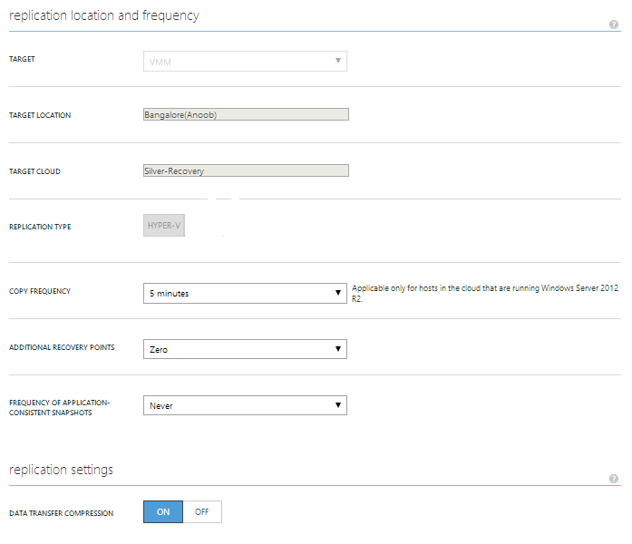
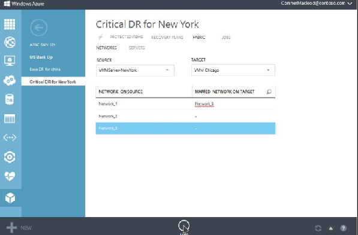
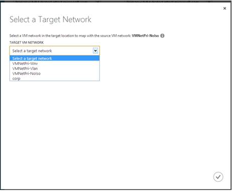
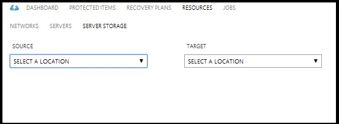
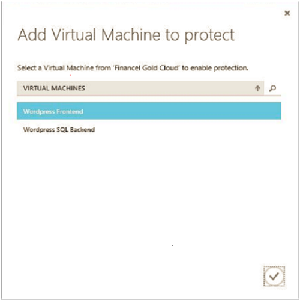
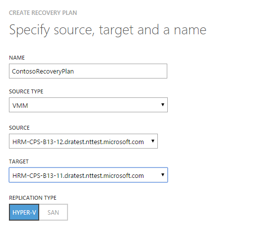
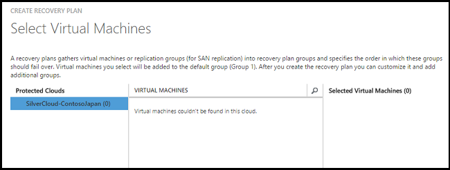
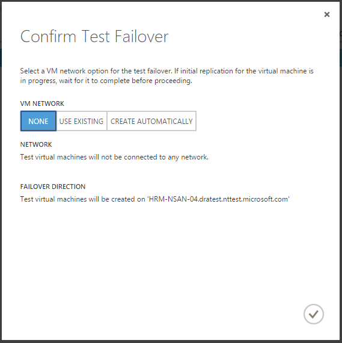

<properties 
	pageTitle="Configuration de la protection entre des sites VMM locaux "
	description="Azure Site Recovery coordonne la réplication, le basculement et la récupération des machines virtuelles Hyper-V entre des sites VMM locaux." 
	services="site-recovery" 
	documentationCenter="" 
	authors="raynew" 
	manager="jwhit" 
	editor="tysonn"/>

<tags 
	ms.service="site-recovery" 
	ms.workload="backup-recovery" 
	ms.tgt_pltfrm="na" 
	ms.devlang="na" 
	ms.topic="article" 
	ms.date="03/19/2015" 
	ms.author="raynew"/>

# Configuration de la protection entre des sites VMM locaux

## Vue d'ensemble

Azure Site Recovery contribue à mettre en œuvre la stratégie de continuité des activités et de récupération d'urgence de votre entreprise en coordonnant la réplication, le basculement et la récupération de machines virtuelles dans divers scénarios de déploiement. Pour obtenir la liste complète des scénarios de déploiement, consultez [Vue d'ensemble d'Azure Site Recovery](hyper-v-recovery-manager-overview.md).

Ce guide de scénario décrit comment déployer la  	Récupération de sites pour orchestrer et automatiser la protection des charges de travail exécutées sur des machines virtuelles sur des serveurs hôtes Hyper-V qui se trouvent dans des clouds privés VMM. Dans ce scénario, les machines virtuelles sont répliquées d'un site VMM principal vers un site VMM secondaire à l'aide de Hyper-V Replica.

Le guide indique les conditions prérequises pour le scénario et montre comment configurer un coffre Récupération de sites, installer le fournisseur Azure Site Recovery sur les serveurs VMM source et cible, inscrire les serveurs dans le coffre, configurer les paramètres de protection des clouds VMM qui seront appliqués à toutes les machines virtuelles protégées, puis activer la protection pour ces machines virtuelles. Pour finir, vous pourrez tester le basculement pour vous assurer que tout fonctionne comme prévu.

Si vous rencontrez des problèmes lors de la configuration de ce scénario, soumettez vos questions sur le [Forum Azure Recovery Services](http://go.microsoft.com/fwlink/?LinkId=313628).

## Avant de commencer
Assurez-vous que les conditions préalables sont remplies :
### Conditions préalables pour Azure

- Vous aurez besoin d'un compte [Microsoft Azure](http://azure.microsoft.com/). Si vous n'en possédez pas, commencez avec une [version d'évaluation gratuite](http://aka.ms/try-azure). Vous pouvez aussi consulter la [tarification Azure Site Recovery Manager](http://go.microsoft.com/fwlink/?LinkId=378268).
- Pour comprendre comment les informations et les données sont utilisées, lisez la [Déclaration de confidentialité de Microsoft Azure](http://go.microsoft.com/fwlink/?LinkId=324899) et les <a href="#privacy">Informations de confidentialité pour Azure Site Recovery</a> supplémentaires fournies à la fin de cette rubrique.

### Configuration requise pour VMM
- Vous aurez besoin d'au moins un serveur VMM.
- Le serveur VMM doit exécuter au moins System Center 2012 SP1 avec les dernières mises à jour cumulatives. 
- Tout serveur VMM contenant des machines virtuelles à protéger doit exécuter le fournisseur Azure Site Recovery. Celui-ci est installé lors du déploiement d'Azure Site Recovery.
- Si vous souhaitez configurer la protection avec un seul serveur VMM, vous aurez besoin d'au moins deux clouds configurés sur le serveur.
- Si vous souhaitez déployer la protection avec deux serveurs VMM, chaque serveur doit avoir au moins un cloud configuré sur le serveur VMM principal que vous souhaitez protéger et un cloud configuré sur le serveur VMM secondaire que vous souhaitez utiliser pour la protection et la récupération.
- Tous les clouds VMM doivent avoir le profil Capacité Hyper-V défini.
- Le cloud source à protéger doit comporter les éléments suivants :
	- un ou plusieurs groupes hôtes VMM ;
	- un ou plusieurs serveurs hôtes Hyper-V dans chaque groupe hôte ;
	- une ou plusieurs machines virtuelles sur le serveur hôte. 
- Pour en savoir plus sur la configuration des clouds VMM :
	- Lisez la documentation sur les clouds privés VMM dans [Nouveautés de VMM dans System Center 2012 R2](http://go.microsoft.com/fwlink/?LinkId=324952) et [VMM 2012 et les clouds](http://go.microsoft.com/fwlink/?LinkId=324956). 
	- En savoir plus sur la [Configuration de l'infrastructure de cloud VMM](https://msdn.microsoft.com/library/azure/dn469075.aspx#BKMK_Fabric)
	- Une fois vos éléments d'infrastructure de cloud en place, consultez la documentation sur la création de clouds privés dans [Création d'un cloud privé dans VMM](http://go.microsoft.com/fwlink/?LinkId=324953) et [Procédure pas à pas : création de clouds privés avec System Center 2012 SP1 VMM](http://go.microsoft.com/fwlink/?LinkId=324954).

### Conditions préalables liées à Hyper-V

- Les serveurs Hyper-V hôte et cible doivent exécuter au moins Windows Server 2012 avec le rôle Hyper-V et les dernières mises à jour doivent être installées.
- Si vous utilisez Hyper-V dans un cluster, notez que le service Broker du cluster n'est pas créé automatiquement si vous avez un cluster basé sur des adresses IP statiques. Vous devez configurer manuellement le service Broker du cluster. Pour obtenir des instructions, consultez [Configurer le service Broker de réplication Hyper-V](http://go.microsoft.com/fwlink/?LinkId=403937)..
- Tout cluster ou serveur hôte Hyper-V pour lequel vous souhaitez gérer la protection doit être inclus dans un cloud VMM.
 
### Conditions préalables liées au mappage réseau
Le mappage réseau garantit que les machines virtuelles de réplication sont placées de manière optimale sur les serveurs hôtes Hyper-V après le basculement et que ces machines virtuelles peuvent se connecter aux réseaux de machines virtuelles appropriés. Si vous ne configurez pas le mappage réseau, les machines virtuelles de réplication ne seront pas connectées aux réseaux de machines virtuelles après le basculement. Si vous souhaitez déployer le mappage réseau, les conditions suivantes doivent être remplies :

- Les machines virtuelles que vous souhaitez protéger sur le serveur VMM source doivent être connectées à un réseau de machines virtuelles. Ce réseau doit être lié à un réseau logique lui-même associé au cloud.
- Le cloud cible sur le serveur VMM secondaire que vous utilisez pour la récupération doit avoir un réseau de machines virtuelles correspondant configuré, qui lui-même doit être lié à un réseau logique correspondant associé au cloud cible.

En savoir plus sur le mappage réseau :

- [Configuration de la mise en réseau logique dans VMM](http://go.microsoft.com/fwlink/?LinkId=386307)
- [Configuration de réseaux d'ordinateurs virtuels et de passerelles dans VMM](http://go.microsoft.com/fwlink/?LinkId=386308)

### Conditions préalables liées au mappage de stockage
Par défaut, quand vous répliquez une machine virtuelle sur un serveur hôte Hyper-V source vers un serveur hôte Hyper-V cible, les données répliquées sont stockées à l'emplacement par défaut indiqué pour l'hôte Hyper-V cible dans le Gestionnaire Hyper-V. Si vous souhaitez mieux contrôler l'emplacement de stockage des données de réplication, vous pouvez configurer le mappage de stockage. Pour cela, vous devez configurer des classifications de stockage sur les servers VMM source et cible avant de commencer le déploiement.
Pour obtenir des instructions, consultez [Comment créer des classifications de stockage dans VMM](http://go.microsoft.com/fwlink/?LinkId=400937).

## Étape 1 : créer un coffre de Récupération de sites

1. Connectez-vous au [Portail de gestion](https://portal.azure.com) à partir du serveur VMM à inscrire.

2. Développez **Services de données** > **Services de récupération**, puis cliquez sur **Coffre Site Recovery**.

3. Cliquez sur **Créer un nouveau** > **Création rapide**.
	
4. Dans **Nom**, entrez un nom convivial permettant d'identifier le coffre.

5. Dans **Région**, sélectionnez la région géographique du coffre. Pour découvrir les régions prises en charge, référez-vous à la disponibilité géographique de la page [Tarification d'Azure Site Recovery](http://go.microsoft.com/fwlink/?LinkId=389880).</a>

6. Cliquez sur **Créer un coffre**.

	

Dans la barre d'état, vérifiez que le coffre a été créé. Le coffre apparaît comme **Actif** dans la page Recovery Services principale.

## Étape 2 : générer une clé d'inscription du coffre

Générez une clé d'inscription dans le coffre. Une fois que vous aurez téléchargé et installé le fournisseur Azure Site Recovery sur le serveur VMM, vous utiliserez cette clé pour inscrire le serveur VMM dans le coffre.

1. Dans la page <b>Recovery Services</b>, cliquez sur le coffre pour ouvrir la page Démarrage rapide. Vous pouvez également ouvrir la page Démarrage rapide à tout moment au moyen de l'icône.

	

2. Dans la liste déroulante, sélectionnez **Entre deux sites Hyper-V locaux**.
3. Dans **Préparer les serveurs VMM**, cliquez sur **Générer le fichier de clé d'inscription**. Le fichier de clé est généré automatiquement et est valide pendant cinq jours après sa création. Si vous n'accédez pas au portail Azure à partir du serveur VMM, vous devez copier ce fichier sur le serveur. 

	
	
## Étape 3 : installer le fournisseur Azure Site Recovery	

1. Dans la page <b>Démarrage rapide</b>, dans **Préparer les serveurs VMM**, cliquez sur <b>Télécharger le fournisseur Microsoft Azure Site Recovery pour une installation sur les serveurs VMM</b> pour obtenir la dernière version du fichier d'installation du fournisseur.

2. Exécutez ce fichier sur les serveurs VMM source et cible. Si VMM est déployé dans un cluster et que vous installez le fournisseur pour la première fois, installez-le sur un nœud actif et terminez l'installation pour inscrire le serveur VMM dans le coffre. Ensuite, installez le fournisseur sur les autres nœuds. Notez que si vous mettez à niveau le fournisseur, vous devez le mettre à niveau sur tous les nœuds, car ils doivent tous exécuter la même version du fournisseur.

3. Dans **Vérification de la configuration requise**, indiquez d'arrêter le service VMM pour lancer l'installation du fournisseur. Le service s'arrête et redémarre automatiquement une fois l'installation terminée. Si vous installez sur un cluster VMM, vous serez invité à arrêter le rôle de cluster.

	

4. Dans **Microsoft Update**, vous pouvez opter pour l'installation de mises à jour. En activant ce paramètre, les mises à jour du fournisseur seront installées en fonction de votre stratégie Microsoft Update.

	

Une fois le fournisseur installé, poursuivez l'installation afin d'enregistrer le serveur dans le coffre.

5. Dans la page Connexion Internet, indiquez la façon dont le fournisseur s'exécutant sur le serveur VMM se connecte à Internet. Sélectionnez <b>Utiliser les paramètres du proxy système par défaut</b> pour utiliser les paramètres de connexion Internet par défaut configurés sur le serveur.

	

	- Si vous souhaitez utiliser un proxy personnalisé, vous devez le configurer avant d'installer le fournisseur. Quand vous configurez les paramètres de proxy personnalisé, un test s'exécute pour vérifier la connexion proxy.
	- Si vous n'utilisez pas de proxy personnalisé ou si votre proxy par défaut nécessite une authentification, vous devez saisir les détails du proxy, y compris l'adresse du proxy et le port.
	- Vous devez exempter les adresses suivantes du routage via le proxy :
		- L'URL pour la connexion à Azure Site Recovery : *.hypervrecoverymanager.windowsazure.com
		- *.accesscontrol.windows.net
		- *.backup.windowsazure.com
		- *.blob.core.windows.net 
		- *.store.core.windows.net 
	- Si vous souhaitez autoriser les connexions sortantes à un contrôleur de domaine Azure, autorisez les adresses IP décrites dans [Plages d'adresses IP du centre de données Azure](http://go.microsoft.com/fwlink/?LinkId=511094) et autorisez les protocoles HTTP (80) et HTTPS (443). 
	- Si vous utilisez un proxy personnalisé, un compte RunAs VMM (DRAProxyAccount) est créé automatiquement avec les informations d'identification du proxy spécifiées. Configurez le serveur proxy pour que ce compte puisse s'authentifier correctement. Vous pouvez modifier les paramètres du compte RunAs VMM dans la console VMM. Pour cela, ouvrez l'espace de travail Paramètres, développez Sécurité, cliquez sur  	Comptes d'identification, puis modifiez le mot de passe de DRAProxyAccount. Vous devez redémarrer le service VMM pour que ce paramètre prenne effet.
6. Dans **Clé d'inscription**, indiquez que la clé a été téléchargée depuis Azure Site Recovery et copiée sur le serveur VMM.
7. Dans **Nom du coffre**, vérifiez le nom du coffre dans lequel le serveur sera inscrit.
8. Dans **Nom du serveur**, entrez un nom convivial permettant d'identifier le serveur VMM dans le coffre. Dans une configuration de cluster, spécifiez le nom de rôle de cluster VMM. 

	

9. Dans **Synchronisation initiale des métadonnées du cloud**, indiquez si vous souhaitez synchroniser les métadonnées de tous les clouds sur le serveur VMM avec le coffre. Cette action se produit une seule fois sur chaque serveur. Si vous ne souhaitez pas synchroniser tous les clouds, vous pouvez désactiver ce paramètre et synchroniser individuellement chaque cloud via les propriétés du cloud de la console VMM.

7. L'option **Chiffrement des données** ne s'applique pas à la protection de type " local à local ".

	

8. Cliquez sur <b>Inscrire</b> pour terminer le processus. Les métadonnées du serveur VMM sont récupérées par Azure Site Recovery. Le serveur apparaît sous l'onglet **Ressources** de la page **Serveurs** du coffre.

Après l'inscription, vous pouvez modifier les paramètres du fournisseur dans la console VMM ou à partir de la ligne de commande.

## Étape 4 : configurer les paramètres de protection de cloud

Une fois les serveurs VMM inscrits, vous pouvez configurer les paramètres de protection de cloud. Si vous avez activé l'option **Synchroniser les données du cloud avec le coffre** lors de l'installation du fournisseur, tous les clouds du serveur VMM apparaissent sous l'onglet <b>Éléments protégés</b> du coffre. Si ce n'est pas le cas, vous pouvez synchroniser un cloud spécifique avec Azure Site Recovery sous l'onglet **Général** de la page de propriétés du cloud dans la console VMM.

1. Dans la page Démarrage rapide, cliquez sur **Configurer la protection pour les clouds VMM**.
2. Sous l'onglet **Clouds VMM**, sélectionnez le cloud à configurer, puis accédez à l'onglet **Configuration**. 
3. Dans <b>Cible</b>, sélectionnez <b>VMM</b>.
4. Dans <b>Emplacement cible</b>, sélectionnez le serveur VMM local qui gère le cloud à utiliser pour la récupération.
4. Dans <b>Cloud cible</b>, sélectionnez le cloud cible à utiliser pour le basculement des machines virtuelles du cloud source. Notez les points suivants :
	- Nous vous recommandons de choisir un cloud cible qui remplisse les conditions requises pour la récupération des machines virtuelles que vous prévoyez de protéger.
	- Un cloud ne peut appartenir qu'à une seule paire de clouds, que ce soit en qualité de cloud principal ou de cloud cible.
6. Dans <b>Fréquence de copie</b>, spécifiez la fréquence de synchronisation des données entre les emplacements source et cible. Notez que ce paramètre est pertinent uniquement quand l'hôte Hyper-V exécute Windows Server 2012 R2. Les autres serveurs utilisent un paramétrage par défaut de cinq minutes.
7. Dans <b>Points de récupération supplémentaires</b>, spécifiez si vous souhaitez créer des points de récupération supplémentaires. La valeur par défaut (zéro) indique que seul le point de récupération le plus récent d'une machine virtuelle principale est stocké sur un serveur hôte de réplication. Notez que l'activation de plusieurs points de récupération nécessite un stockage supplémentaire pour les instantanés qui sont stockés à chaque point de récupération. Par défaut, des points de récupération sont créés toutes les heures, pour que chacun contienne une heure de données. La valeur de point de récupération que vous attribuez à la machine virtuelle dans la console VMM ne doit pas être inférieure à la valeur que vous attribuez dans la console Azure Site Recovery.
8. Dans <b>Fréquence des instantanés cohérents avec l'application</b>, spécifiez la fréquence de création des instantanés cohérents au niveau de l'application. Hyper-V utilise deux types de sauvegardes : une sauvegarde standard qui fournit une sauvegarde incrémentielle de la machine virtuelle complète et un instantané cohérent avec l'application qui prend un instantané des données d'application d'une machine virtuelle. Les instantanés cohérents avec l'application utilisent le service VSS (Volume Shadow Copy Service) pour s'assurer que les applications sont dans un état cohérent lors de la prise des instantanés. Notez que si vous activez les instantanés cohérents avec l'application, cela affectera les performances des applications exécutées sur les machines virtuelles sources. Assurez-vous que la valeur définie est inférieure au nombre de points de récupération supplémentaires que vous configurez.

	

9. Dans <b>Compression du transfert de données</b>, indiquez si les données répliquées transférées doivent être compressées. 
10. Dans <b>Authentification</b>, indiquez le mode d'authentification du trafic entre les serveurs hôtes Hyper-V principaux et de récupération. Sélectionnez HTTPS, sauf si vous avez configuré un environnement Kerberos opérationnel. Azure Site Recovery configurera automatiquement des certificats pour l'authentification HTTPS. Aucune configuration manuelle n'est nécessaire. Si vous sélectionnez Kerberos, un ticket Kerberos est utilisé pour l'authentification mutuelle des serveurs hôtes. Par défaut, les ports 8083 et 8084 (pour les certificats) seront ouverts dans le Pare-feu Windows sur les serveurs hôtes Hyper-V. Notez que ce paramètre n'est utile que pour les serveurs hôtes Hyper-V s'exécutant sur Windows Server 2012 R2.
11. Dans <b>Port</b>, modifiez le numéro de port sur lequel les ordinateurs hôtes source et cible écoutent le trafic de réplication. Par exemple, vous pouvez modifier ce paramètre si vous souhaitez appliquer la limitation de bande passante réseau de Qualité de service (QoS) pour le trafic de réplication. Vérifiez que le port n'est utilisé par aucune autre application et qu'il est ouvert dans les paramètres du pare-feu.
12. Dans <b>Méthode de réplication</b>, indiquez comment sera traitée la réplication de données initiale entre les emplacements source et cible avant que la réplication normale ne démarre. 
	- <b>Sur le réseau</b> :la copie de données sur le réseau peut demander du temps et des ressources. Nous vous recommandons d'utiliser cette option si le cloud contient des machines virtuelles dotées de disques durs virtuels relativement petits et si le serveur VMM principal est connecté au serveur VMM secondaire sur une connexion à large bande passante. Vous pouvez opter pour un démarrage immédiat de la copie ou sélectionner une heure. Si vous utilisez la réplication réseau, nous vous recommandons de la planifier sur des heures creuses.
	- <b>Hors connexion</b> : cette méthode précise que la réplication initiale s'exécute à l'aide d'un support externe. Elle est indiquée si vous voulez éviter une dégradation des performances réseau ou pour les emplacements éloignés géographiquement. Pour utiliser cette méthode, il convient de spécifier l'emplacement d'exportation sur le cloud source et l'emplacement d'importation sur le cloud cible. Lorsque vous activez la protection pour une machine virtuelle, le disque dur virtuel est copié vers l'emplacement d'exportation spécifié. Vous l'envoyez vers le site cible et le copiez vers l'emplacement d'importation. Le système copie les informations importées vers les machines virtuelles de réplication. Pour connaître les détails de la configuration requise pour la réplication hors ligne, consultez l'<a href="http://go.microsoft.com/fwlink/?LinkId=323469">Étape 3 : Configuration des paramètres de protection des clouds VMM</a> du guide de déploiement.
13. Sélectionnez **Supprimer une machine virtuelle de réplica** pour indiquer que la machine virtuelle de réplication doit être supprimée si vous cessez de protéger la machine virtuelle en sélectionnant l'option **Désactiver la protection pour la machine virtuelle** sous l'onglet Machines virtuelles des propriétés du cloud. Si vous activez ce paramètre et que vous désactivez la protection, la machine virtuelle est supprimée d'Azure Site Recovery, les paramètres Site Recovery de la machine virtuelle sont supprimés de la console VMM et le réplica est supprimé.
	

Suite à l'enregistrement des paramètres, une tâche est créée que vous pouvez surveiller sous l'onglet <b>Tâches</b>. Tous les serveurs hôte Hyper-V du cloud VMM source sont configurés pour la réplication. Les paramètres du cloud peuvent être modifiés sous l'onglet <b>Configurer</b>. Pour modifier l'emplacement cible ou le cloud cible, vous devez supprimer la configuration du cloud, puis reconfigurer ce dernier.

### Préparer la réplication initiale hors connexion

Vous devez effectuer plusieurs actions pour préparer la réplication initiale hors connexion :

- Sur le serveur source, vous allez spécifier un emplacement de chemin d'accès à partir duquel l'exportation des données aura lieu. Attribuez des autorisations de partage et de contrôle total pour NTFS au service VMM sur le chemin d'exportation. Sur le serveur cible, vous allez spécifier un emplacement de chemin d'accès à partir duquel l'importation des données aura lieu. Attribuez les mêmes autorisations sur ce chemin d'accès d'importation. 
- Si le chemin d'accès d'importation ou d'exportation est partagé, attribuez l'appartenance au groupe Administrateur, Utilisateur avec pouvoir, Opérateur d'impression ou Opérateur de serveur pour le compte de service VMM sur l'ordinateur distant sur lequel le partage réside.
- Si vous utilisez des comptes d'identification pour ajouter des hôtes, sur les chemins d'accès d'importation et d'exportation, attribuez des autorisations de lecture et d'écriture aux comptes d'identification dans VMM.
- Les partages d'importation et d'exportation ne doivent pas se trouver sur un ordinateur utilisé comme serveur hôte Hyper-V, car la configuration en boucle n'est pas prise en charge par Hyper-V.
- Dans Active Directory, sur chaque serveur hôte Hyper-V qui contient des machines virtuelles à protéger, activez et configurez la délégation de contrainte pour approuver les ordinateurs distants sur lesquels se trouvent les chemins d'accès d'importation et d'exportation, comme suit :
	1. Sur le contrôleur de domaine, ouvrez **Utilisateurs et ordinateurs Active Directory**.
	2. Dans l'arborescence de la console, cliquez sur **nom_domaine** > **Ordinateurs**.
	3. Cliquez sur le nom du serveur hôte Hyper-V > **Propriétés**.
	4. Sous l'onglet **Délégation**, cliquez sur **N'approuver cet ordinateur que pour la délégation aux services spécifiés**.
	5. Cliquez sur **Utiliser tout protocole d'authentification**.
	6. Cliquez sur **Ajouter** > **Utilisateurs et ordinateurs**.
	7. Tapez le nom de l'ordinateur qui héberge le chemin d'exportation > **OK**. Dans la liste des services disponibles, maintenez la touche Ctrl enfoncée et cliquez sur **cifs** > **OK**. Répétez ces étapes pour le nom de l'ordinateur qui héberge le chemin d'accès d'importation. Répétez cette procédure pour les serveurs hôtes Hyper-V supplémentaires.
	
## Étape 5 : configurer le mappage réseau
1. Dans la page de démarrage rapide, cliquez sur **Mapper les réseaux**.
2. Sélectionnez le serveur VMM source à partir duquel vous souhaitez mapper des réseaux, puis le serveur VMM cible auquel les réseaux seront mappés. La liste des réseaux sources et leurs réseaux cibles associés s'affiche à l'écran. Une valeur vide est indiquée pour les réseaux qui ne sont pas mappés. Cliquez sur l'icône d'information en regard du nom des réseaux source et cible pour afficher les sous-réseaux de chaque réseau.
3. Sélectionnez un réseau dans **Réseau sur la source** > **Mapper**. Le service détecte les réseaux de machines virtuelles sur le serveur cible et les affiche. 

	

4. Dans la boîte de dialogue, sélectionnez l'un des réseaux de machines virtuelles du serveur VMM cible.

	

5. Quand vous sélectionnez un réseau cible, les clouds protégés qui utilisent le réseau source sont affichés. Les réseaux cibles disponibles qui sont associés aux clouds utilisés pour la protection sont également affichés. Nous vous recommandons de sélectionner un réseau cible qui est accessible à tous les clouds utilisés pour la protection.
6. Cliquez sur la coche pour terminer le processus de mappage. Une tâche de suivi du processus de mappage démarre. Vous pouvez l'afficher sur l'onglet **Tâches**.

## Étape 6 : configurer le mappage de stockage
Par défaut, quand vous répliquez une machine virtuelle sur un serveur hôte Hyper-V source vers un serveur hôte Hyper-V cible, les données répliquées sont stockées à l'emplacement par défaut indiqué pour l'hôte Hyper-V cible dans le Gestionnaire Hyper-V. Si vous souhaitez mieux contrôler l'emplacement de stockage des données de réplication, vous pouvez configurer des mappages de stockage comme suit :

- Définissez des classifications de stockage sur les serveurs VMM source et cible. Pour obtenir des instructions, consultez [Comment créer des classifications de stockage dans VMM](http://go.microsoft.com/fwlink/?LinkId=400937). Les classifications doivent accessibles aux serveurs hôtes Hyper-V dans les clouds source et cible. Il n'est pas obligatoire qu'elles aient le même type de stockage. Par exemple, vous pouvez mapper une classification source contenant des partages SMB à une classification cible contenant des volumes partagés de cluster.
- Une fois les classifications en place, vous pouvez créer des mappages.
1. Dans la page **Démarrage rapide** > **Mapper le stockage**.
1. Cliquez sur l'onglet **Stockage** > **Mapper les classifications de stockage**.
1. Sous l'onglet **Mapper les classifications de stockage**, sélectionnez les classifications sur les serveurs VMM source et cible. Enregistrez vos paramètres.

	

## Étape 7 : activer la protection des machines virtuelles
Dès lors que les serveurs, les clouds et les réseaux ont été configurés correctement, vous pouvez activer la protection pour les machines virtuelles du cloud.

1. Sous l'onglet **Machines virtuelles** du cloud dans lequel se trouve la machine virtuelle, cliquez sur **Activer la protection** > **Ajouter des machines virtuelles**. 
2. Dans la liste des machines virtuelles du cloud, sélectionnez celle que vous voulez protéger.

Vous pouvez suivre la progression de l'action d'activation de la protection, y compris la réplication initiale, sous l'onglet **Tâches**. Lorsque la tâche de finalisation de la protection s'exécute, la machine virtuelle est prête à être basculée. Une fois la protection activée et les machines virtuelles répliquées, celles-ci sont affichées dans Azure.

Notez que vous pouvez également activer la protection des machines virtuelles dans la console VMM. Cliquez sur Activer la protection dans la barre d'outils sous l'onglet Azure Site Recovery dans les propriétés de la machine virtuelle.

### Intégrer des machines virtuelles existantes
Si vous avez des machines virtuelles existantes dans VMM qui sont répliquées à l'aide de Hyper-V Replica, vous devez les intégrer à la protection Azure Site Recovery comme suit :
1. Vérifiez que vous avez un cloud principal et un cloud secondaire. Vérifiez que le serveur Hyper-V qui héberge la machine virtuelle se trouve dans le cloud principal et que le serveur Hyper-V qui héberge la machine virtuelle de réplication se trouve dans le cloud secondaire. Assurez-vous que vous avez configuré les paramètres de protection pour les clouds. Les paramètres doivent correspondre à ceux actuellement configurés pour la réplication Hyper-V. Sinon, la réplication de machine virtuelle risque de ne pas fonctionner comme prévu.
2. Ensuite, activez la protection de la machine virtuelle principale. Azure Site Recovery et VMM s'assureront que la même machine virtuelle et hôte de réplication seront détectés, et Azure Site Recovery réutilisera et rétablira la réplication à l'aide des paramètres configurés lors de la configuration du cloud.

## Tester votre déploiement

Pour tester votre déploiement, vous pouvez exécuter un test de basculement pour une seule machine virtuelle, ou créer un plan de récupération comportant plusieurs machines virtuelles et exécuter sur lui un test de basculement.  Il simule votre mécanisme de basculement et de récupération dans un réseau isolé.

### Créer un plan de récupération

1. Sous l'onglet **Plans de récupération**, cliquez sur **Créer un plan de récupération**.
2. Spécifiez un nom pour le plan de récupération et les serveurs VMM source et cible. Le basculement et la récupération doivent être activés sur les machines virtuelles du serveur source. Sélectionnez **Hyper-V** pour afficher uniquement les clouds configurés pour la réplication Hyper-V.

	

3. Dans **Sélectionner les machines virtuelles**, sélectionnez les groupes de réplication. Toutes les machines virtuelles associées au groupe de réplication sont sélectionnées et ajoutées au plan de récupération. Ces machines virtuelles sont ajoutées au groupe par défaut du plan de récupération, à savoir le groupe 1. Vous pouvez ajouter d'autres groupes si nécessaire. Notez qu'après la réplication, les machines virtuelles démarrent dans l'ordre des groupes du plan de récupération.

		

Une fois un plan de récupération créé, celui-ci apparaît dans la liste sous l'onglet **Plans de récupération**. 

###Exécution d'un test de basculement

1. Sous l'onglet **Plans de récupération**, sélectionnez le plan et cliquez sur **Test de basculement**.
2. Dans la page **Confirmer le test de basculement**, sélectionnez **Aucun**. Si cette option est activée, les machines virtuelles de réplication basculées ne sont connectées à aucun réseau. Le test vérifie que la machine virtuelle bascule comme prévu, mais il ne vérifie pas l'environnement de votre réseau de réplication. Si vous souhaitez exécuter un test de basculement plus complet, consultez la page <a href="http://go.microsoft.com/fwlink/?LinkId=522291">Tester un déploiement d'un serveur local vers un serveur local sur MSDN</a>.

	

7. La machine virtuelle de test est créée sur le même hôte que celui sur lequel la machine virtuelle de réplication existe. Elle n'est pas ajoutée au cloud où se trouve la machine virtuelle de réplication.

### Exécuter un plan de récupération
Après la réplication, la machine virtuelle de réplication possède une adresse IP différente de celle de la machine virtuelle principale. Si vous émettez des adresses à partir de DHCP, DNS est mis à jour automatiquement. Si vous n'utilisez pas DHCP et que vous souhaitez vous assurer que les adresses sont identiques, vous devez exécuter quelques scripts.

#### Script pour récupérer l'adresse IP
Exécutez cet exemple de script pour récupérer l'adresse IP.
    **$vm = Get-SCVirtualMachine -Name <VM_NAME>
	$na = $vm[0].VirtualNetworkAdapters>
	$ip = Get-SCIPAddress -GrantToObjectID $na[0].id
	$ip.address**  

#### Script pour mettre à jour le système DNS
Exécutez cet exemple de script pour mettre à jour DNS, en spécifiant l'adresse IP que vous avez récupérée à l'aide de l'exemple de script précédent.

	**[string]$Zone,
	[string]$name,
	[string]$IP
	)
	$Record = Get-DnsServerResourceRecord -ZoneName $zone -Name $name
	$newrecord = $record.clone()
	$newrecord.RecordData[0].IPv4Address  =  $IP
	Set-DnsServerResourceRecord -zonename com -OldInputObject $record -NewInputObject $Newrecord**

<h2>Informations de confidentialité pour Azure Site Recovery</h2>

Cette section fournit des informations supplémentaires sur la confidentialité pour le service Microsoft Azure Site Recovery (" Service "). Pour afficher la déclaration de confidentialité pour les services Microsoft Azure, consultez la
[Déclaration de confidentialité de Microsoft Azure](http://go.microsoft.com/fwlink/?LinkId=324899)

**Fonctionnalité : Inscription**

- **Ce qu'elle fait** : inscrit le serveur auprès du service pour que les machines virtuelles puissent être protégées.
- **Informations recueillies** : après l'inscription, le Service recueille, traite et transmet les informations de certificat de gestion à partir du serveur VMM qui est désigné pour fournir la récupération d'urgence à l'aide du nom du Service du serveur VMM et du nom des clouds de machines virtuelles sur votre serveur VMM.
- **Utilisation des informations** :
	- Certificat de gestion : aide à identifier et à authentifier le serveur VMM inscrit pour l'accès au Service. Le Service utilise la partie clé publique du certificat pour sécuriser un jeton auquel seul le serveur VMM inscrit peut accéder. Le serveur doit utiliser ce jeton pour accéder aux fonctionnalités du Service.
	- Nom du serveur VMM : le nom du serveur VMM est nécessaire pour identifier et communiquer avec le serveur VMM approprié sur lequel se trouvent les clouds.
	- Noms de clouds du serveur VMM : le nom de cloud est nécessaire lors de l'utilisation de la fonctionnalité de couplage/découplage décrite ci-dessous. Quand vous décidez de coupler votre cloud d'un centre de données principal avec un autre cloud dans le centre de données de récupération, les noms de tous les clouds du centre de données de récupération sont présentés.

- **Choix** : ces informations constituent une partie essentielle du processus d'inscription du Service, car elles vous aident (vous et le Service) à identifier le serveur VMM pour lequel vous souhaitez fournir une protection Azure Site Recovery, ainsi qu'à identifier le serveur VMM inscrit approprié. Si vous ne souhaitez pas envoyer ces informations au Service, n'utilisez pas ce Service. Si vous inscrivez votre serveur et que vous souhaitez ensuite annuler son inscription, vous pouvez le faire en supprimant les informations du serveur VMM à partir du portail de Service (qui est le portail Azure).

**Fonctionnalité : activer la protection Azure Site Recovery**

- **Ce qu'elle fait** : le fournisseur Azure Site Recovery installé sur le serveur VMM est le conduit permettant de communiquer avec le Service. Le fournisseur est une bibliothèque de liens dynamiques (DLL) hébergée dans le processus VMM. Une fois le fournisseur installé, la fonctionnalité " Récupération de centre de données " est activée dans la console Administrateur VMM. Toute machine virtuelle nouvelle ou existante dans un cloud peut activer une propriété nommée " Récupération de centre de données " pour aider à protéger la machine virtuelle. Une fois cette propriété définie, le fournisseur envoie le nom et l'ID de la machine virtuelle au Service. La protection virtuelle est activée par la technologie de réplication Hyper-V de Windows Server 2012 ou Windows Server 2012 R2. Les données de la machine virtuelle sont répliquées d'un hôte Hyper-V à un autre (généralement situé dans un centre de données de " récupération " différent).

- **Informations recueillies** : le Service recueille, traite et transmet les métadonnées de la machine virtuelle, ce qui comprend le nom, l'ID, le réseau virtuel et le nom du cloud 
auquel elle appartient.

- **Utilisation des informations** : le Service utilise les informations ci-dessus pour renseigner les informations de machine virtuelle sur votre portail de Service.

- **Choix** : ceci constitue une partie essentielle du service et ne peut pas être désactivé. Si vous ne souhaitez pas envoyer ces informations au Service, n'activez pas la protection Azure Site Recovery pour les machines virtuelles. Notez que toutes les données envoyées par le fournisseur au Service sont envoyées via le protocole HTTPS.

**Fonctionnalité : plan de récupération**

- **Ce qu'elle fait** : cette fonctionnalité vous aide à créer un plan d'orchestration pour le centre de données de " récupération ". Vous pouvez définir l'ordre dans lequel les machines virtuelles ou un groupe de machines virtuelles doivent être démarrées sur le site de récupération. Vous pouvez également spécifier des scripts automatisés à exécuter, ou une action manuelle à effectuer, au moment de la récupération pour chaque machine virtuelle. Le basculement (décrit dans la section suivante) est généralement déclenché au niveau du Plan de récupération pour la récupération coordonnée.

- **Informations recueillies** : le Service recueille, traite et transmet les métadonnées pour le plan de récupération, y compris les métadonnées des machines virtuelles et les métadonnées des éventuels scripts d'automatisation et notes d'actions manuelles.

- **Utilisation des informations** : les métadonnées décrites ci-dessus sont utilisées pour générer le plan de récupération dans votre portail de Service.

- **Choix** : ceci constitue une partie essentielle du service et ne peut pas être désactivé. Si vous ne souhaitez pas envoyer ces informations au Service, ne créez pas de Plan de récupération dans ce Service.

**Fonctionnalité : mappage réseau**

- **Ce qu'elle fait** : cette fonctionnalité vous permet de mapper les informations réseau du centre de données principal au centre de données de récupération. Quand les machines virtuelles sont récupérées sur le site de récupération, ce mappage aide à établir la connectivité réseau pour ces machines virtuelles.

- **Informations recueillies** : dans le cadre de la fonctionnalité de mappage réseau, le Service recueille, traite et transmet les métadonnées des réseaux logiques pour chaque site (principal et centre de données).

- **Utilisation des informations** : le Service utilise les métadonnées pour renseigner votre portail de Service, où vous pouvez mapper les informations réseau.

- **Choix** : ceci constitue une partie essentielle du Service et ne peut pas être désactivé. Si vous ne souhaitez pas envoyer ces informations au Service, n'utilisez pas la fonctionnalité de mappage réseau.

**Fonctionnalité : basculement - planifié, non planifié et test**

- **Ce qu'elle fait** : cette fonctionnalité facilite le basculement d'une machine virtuelle d'un centre de données géré VMM vers un autre. L'action de basculement est déclenchée par l'utilisateur sur son portail de Service. Les raisons possibles pour un basculement incluent un événement non planifié (par exemple en cas de catastrophe naturelle ; un événement planifié (par exemple l'équilibrage de la charge du centre de données) ; un test de basculement (par exemple une répétition de plan de récupération).

Le fournisseur sur le serveur VMM est averti de l'événement à partir du Service et exécute une action de basculement sur l'hôte Hyper-V via les interfaces VMM. Le basculement réel de la machine virtuelle d'un hôte Hyper-V vers un autre (généralement exécuté dans un centre de données de " récupération " différent) est géré par la technologie de réplication Hyper-V de Windows Server 2012 ou Windows Server 2012 R2. Une fois le basculement terminé, le fournisseur installé sur le serveur VMM du centre de données de " récupération " envoie les informations de réussite au Service.

- **Informations recueillies** : le Service utilise les informations ci-dessus pour renseigner l'état des informations d'action de basculement sur votre portail de Service.

- **Utilisation des informations** : le Service utilise les informations ci-dessus comme suit :

	- Certificat de gestion : aide à identifier et à authentifier le serveur VMM inscrit pour l'accès au Service. Le Service utilise la partie clé publique du certificat pour sécuriser un jeton auquel seul le serveur VMM inscrit peut accéder. Le serveur doit utiliser ce jeton pour accéder aux fonctionnalités du Service.
	- Nom du serveur VMM : le nom du serveur VMM est nécessaire pour identifier et communiquer avec le serveur VMM approprié sur lequel se trouvent les clouds.
	- Noms de clouds du serveur VMM : le nom de cloud est nécessaire lors de l'utilisation de la fonctionnalité de couplage/découplage décrite ci-dessous. Quand vous décidez de coupler votre cloud d'un centre de données principal avec un autre cloud dans le centre de données de récupération, les noms de tous les clouds du centre de données de récupération sont présentés.

- **Choix** : ceci constitue une partie essentielle du service et ne peut pas être désactivé. Si vous ne souhaitez pas envoyer ces informations au Service, n'utilisez pas ce Service.

<!--HONumber=49-->