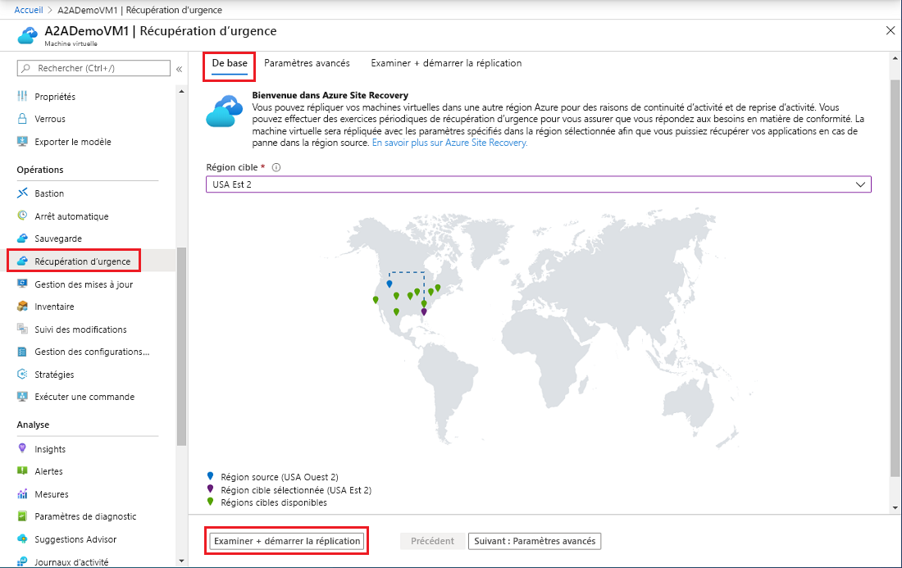
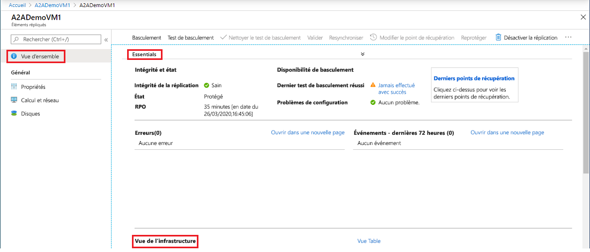

# Configurer la récupération d’urgence vers une région Azure secondaire pour une machine virtuelle Azure 

Le service [Azure Site Recovery](site-recovery-overview.md) contribue à votre stratégie de récupération d’urgence et de continuité d’activité en garantissant le bon fonctionnement et la disponibilité de vos applications métier pendant les interruptions planifiées et non planifiées. Site Recovery gère et orchestre la récupération d’urgence des machines locales et des machines virtuelles Azure, notamment la réplication, le basculement et la récupération.

Ce démarrage rapide explique comment répliquer une machine virtuelle Azure vers une autre région.

Si vous n’avez pas d’abonnement Azure, créez un [compte gratuit](https://azure.microsoft.com/free/?WT.mc_id=A261C142F) avant de commencer.

> [!NOTE]
> Cet article a pour but de guider les utilisateurs novices tout au long de leur expérience avec Azure Site Recovery en ce qui concerne les options par défaut et la personnalisation minimum. Si vous voulez en savoir plus sur les différents paramètres qui peuvent être personnalisés, reportez-vous au [didacticiel d’activation de la réplication des machines virtuelles Azure](azure-to-azure-tutorial-enable-replication.md)

## Connexion à Azure

Connectez-vous au portail Azure sur http://portal.azure.com.

## Activer la réplication des machines virtuelles Azure

1. Dans le portail Azure, cliquez sur **Machines virtuelles**, puis sélectionnez la machine virtuelle à répliquer.
2. Dans **Opérations**, cliquez sur **Récupération d’urgence**.
3. Dans **Configurer la récupération d’urgence** > **Région cible**, sélectionnez la région cible vers laquelle vous allez effectuer la réplication.
4. Pour ce démarrage rapide, acceptez les autres paramètres par défaut.
5. Cliquez sur **Activer la réplication**. Cette opération démarre un travail consistant à activer la réplication pour la machine virtuelle.

    

## Vérifier les paramètres

Une fois le travail de réplication terminé, vous pouvez vérifier l’état de la réplication, modifier les paramètres de réplication et tester le déploiement.

1. Dans le menu Machine virtuelle, cliquez sur **Récupération d’urgence**.
2. Vous pouvez vérifier l’intégrité de la réplication, les points de récupération qui ont été créés ainsi que les régions sources et cibles sur la carte.

   

## Supprimer des ressources

La réplication de la machine virtuelle dans la région principale cesse quand vous désactivez la réplication pour cette machine :

- Les paramètres de réplication source sont automatiquement nettoyés. Notez que l’extension Site Recovery installée lors de la réplication n’est pas supprimée et doit être supprimée manuellement. 
- La facturation Site Recovery pour la machine virtuelle cesse également.

Arrêtez la réplication comme suit :

1. Sélectionnez la machine virtuelle.
2. Dans **Récupération d’urgence**, cliquez sur **Désactiver la réplication**.

   

## Étapes suivantes

Dans ce démarrage rapide, vous avez répliqué une seule machine virtuelle vers une région secondaire. Vous pouvez désormais explorer d’autres options et réessayer la réplication d’un ensemble de machines virtuelles Azure à l’aide d’un plan de récupération.

> [!div class="nextstepaction"]
> [Configurer la récupération d’urgence pour des machines virtuelles Azure](azure-to-azure-tutorial-enable-replication.md)
