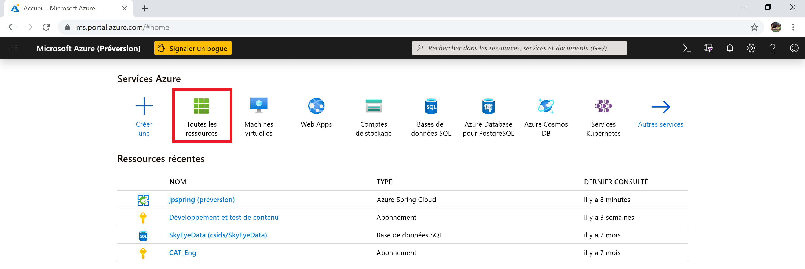
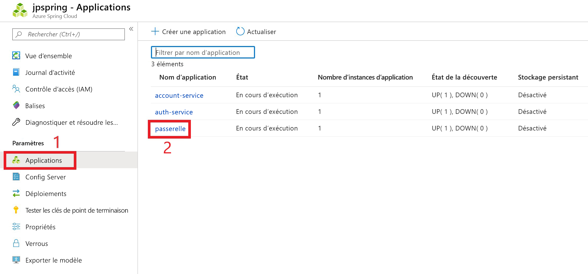
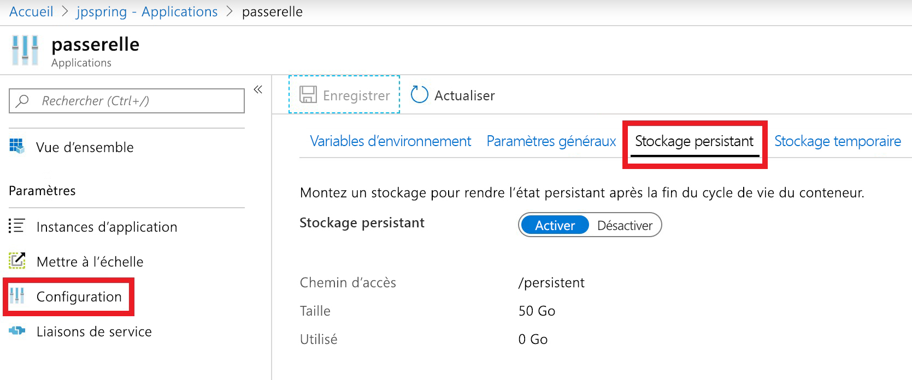

# <a name="how-to-use-persistent-storage-in-azure-spring-cloud"></a>Guide pratique pour utiliser le stockage persistant dans Azure Spring Cloud

Azure Spring Cloud fournit deux types de stockage pour votre application : persistant et temporaire.  Azure Spring Cloud active le stockage temporaire par défaut pour chaque instance d’application. Le stockage temporaire est limité à 5 Go avec un chemin de montage par défaut : `/tmp`.

> [!WARNING]
> Le redémarrage d’une instance d’application va supprimer définitivement son stockage temporaire associé.

Le stockage persistant est un conteneur de partage de fichiers géré par Azure et alloué par application. Les données stockées dans le stockage persistant sont partagées entre toutes les instances de l’application. Une instance du service Azure Spring Cloud peut avoir un maximum de 10 applications avec un disque persistant activé. Chaque application reçoit 50 Go de stockage persistant. Le chemin de montage par défaut pour le stockage persistant est `/persistent`.

> [!WARNING]
> La *désactivation* du stockage persistant va désallouer le stockage pour cette application.  Toutes les données de ce compte de stockage sont alors perdues. 

## <a name="enable-persistent-storage-using-the-azure-portal"></a>Activer le stockage persistant avec le portail Azure

1. Dans l’écran d’accueil de votre Portail Azure, sélectionnez **Toutes les ressources**.

     >

1. Recherchez et sélectionnez la ressource Azure Spring Cloud qui nécessite un stockage persistant.  Dans notre exemple, l’application est appelée *jpspring*.

    > 

1. Sous l’en-tête **Paramètres**, sélectionnez **Applications**.

1. Vos services Spring Cloud s’affichent dans le tableau.  Sélectionnez le service auquel vous souhaitez ajouter un stockage persistant.  Dans cet exemple, nous allons sélectionner notre service de **passerelle**.

    > 

1. Dans le panneau de configuration du service, sélectionnez **Configuration**

1. Sélectionnez l’onglet **Stockage persistant** et activez le stockage persistant.

    > 

Lorsque le stockage persistant est activé, sa taille et son chemin d’accès sont affichés sur cette page.

## <a name="use-the-azure-cli-to-modify-persistent-storage"></a>Utiliser l’interface de ligne de commande Azure pour modifier le stockage persistant

Si nécessaire, installez l’extension Spring Cloud pour l’interface de ligne de commande Azure :

```azurecli
az extension add --name spring-cloud
```

Créez une application avec un disque persistant activé :
 
```azurecli
az spring-cloud app create -n <app> -g <resource-group> -s <service-name> --enable-persistent-storage true
```

Activez le stockage persistant dans une application existante :

```azurecli
az spring-cloud app update -n <app> -g <resource-group> -s <service-name> --enable-persistent-storage true
``` 

Désactivez le stockage persistant dans une application existante :

> [!WARNING]
> La désactivation du stockage persistant va désallouer le stockage pour cette application, ce qui entraîne la perte définitive de toutes les données qui y étaient stockées. 

```azurecli
az spring-cloud app update -n <app> -g <resource-group> -s <service-name> --enable-persistent-storage false
```

## <a name="next-steps"></a>Étapes suivantes

Découvrez les [quotas pour les applications et les services](spring-cloud-quotas.md) ou la [mise à l’échelle manuelle de votre application](spring-cloud-tutorial-scale-manual.md).