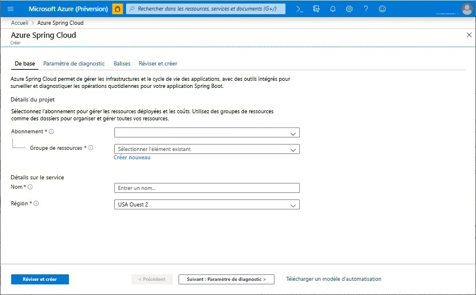
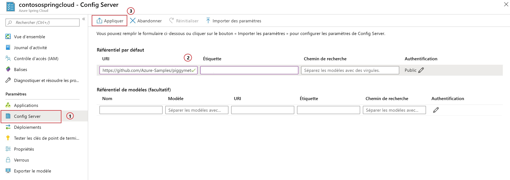

# <a name="quickstart-launch-an-azure-spring-cloud-app-using-the-maven-plug-in"></a>Démarrage rapide : Lancer une application Azure Spring Cloud à l’aide du plug-in Maven

Le plug-in Maven d’Azure Spring Cloud vous permet de créer et de mettre à jour facilement vos applications Azure Spring Cloud. En prédéfinissant une configuration, vous pouvez déployer des applications sur votre service Azure Spring Cloud existant. Dans cet article, vous utilisez un exemple d’application appelé PiggyMetrics pour illustrer cette fonctionnalité.

Dans ce guide de démarrage rapide, vous découvrez comment :

> [!div class="checklist"]
> * Provisionner une instance de service
> * Configurer un serveur de configuration pour une instance
> * Cloner et générer localement une application de microservices
> * Déployer chaque microservice
> * Affecter un point de terminaison public pour votre application

>[!Note]
> Azure Spring Cloud est actuellement disponible en préversion publique. Les offres en préversion publique permettent aux clients de tester les nouvelles fonctionnalités avant leur publication officielle.  Les fonctionnalités et services en préversion publique ne sont pas destinés à une utilisation en contexte de production.  Pour en savoir plus sur le support offert avec les préversions, consultez notre [FAQ](https://azure.microsoft.com/support/faq/) ou soumettez une [demande de support](https://docs.microsoft.com/azure/azure-supportability/how-to-create-azure-support-request).


>[!TIP]
> Azure Cloud Shell est un interpréteur de commandes interactif gratuit, qui vous permet d’exécuter les commandes de cet article. Il comporte une préinstallation des outils Azure usuels, notamment les dernières versions de Git, du JDK (Java Development Kit), de Maven et d’Azure CLI. Si vous êtes connecté à votre abonnement Azure, lancez [Azure Cloud Shell](https://shell.azure.com). Pour plus d’informations, voir la [présentation d’Azure Cloud Shell](../cloud-shell/overview.md).

Pour suivre ce guide de démarrage rapide :

1. [Installer Git](https://git-scm.com/).
2. [Installez le kit JDK 8](https://docs.microsoft.com/java/azure/jdk/?view=azure-java-stable).
3. [Installez Maven 3.0 ou ultérieur](https://maven.apache.org/download.cgi).
4. [Inscrivez-vous pour un abonnement gratuit à Azure](https://azure.microsoft.com/free/).

## <a name="provision-a-service-instance-on-the-azure-portal"></a>Provisionner une instance de service sur le portail Azure

1. Dans un navigateur web, ouvrez [ce lien vers Azure Spring Cloud dans le portail Azure](https://ms.portal.azure.com/#create/Microsoft.AppPlatform) et connectez-vous à votre compte.

1. Indiquez les **Détails du projet** pour l’exemple d’application de la manière suivante :

    1. Sélectionnez l’**abonnement** auquel sera associée l’application.
    1. Sélectionnez ou créez un groupe de ressources pour l’application. Nous vous recommandons de créer un groupe de ressources.  L’exemple suivant illustre un nouveau groupe de ressources appelé `myspringservice`.
    1. Indiquez un nom pour le nouveau service Azure Spring Cloud.  Le nom doit comporter entre 4 et 32 caractères, et contenir uniquement des lettres minuscules, des chiffres et des traits d’union. Le premier caractère du nom du service doit être une lettre, et le dernier doit être une lettre ou un chiffre.  Dans l’exemple ci-dessous, le service est appelé `contosospringcloud`.
    1. Sélectionnez un emplacement pour votre application parmi les options proposées.  Pour cet exemple, nous sélectionnons `East US`.
    1. Sélectionnez **Vérifier + créer** pour consulter un récapitulatif de votre nouveau service.  Si tout est correct, sélectionnez **Créer**.

    > [!div class="mx-imgBorder"]
    > 

Le déploiement du service prend environ 5 minutes. Une fois le service déployé, sélectionnez **Accéder à la ressource**. La page **Vue d’ensemble** de l’instance de service s’affiche.

## <a name="set-up-your-configuration-server"></a>Configurer votre serveur de configuration

1. Dans la page **Vue d’ensemble** du service, sélectionnez **Serveur de configuration**.
1. Dans la section **Dépôt par défaut**, affectez à **URI** la valeur **https://github.com/Azure-Samples/piggymetrics** , affectez à **Étiquette** la valeur **config**, puis sélectionnez **Appliquer** pour enregistrer les changements apportés.

    > [!div class="mx-imgBorder"]
    > 

## <a name="clone-and-build-the-sample-application-repository"></a>Cloner et générer le dépôt d’exemples d’applications

1. Lancez [Azure Cloud Shell](https://shell.azure.com).

1. Clonez le dépôt Git en exécutant la commande suivante :

    ```azurecli
    git clone https://github.com/Azure-Samples/PiggyMetrics
    ```
  
1. Changez d’annuaire, puis générez le projet en exécutant la commande suivante :

    ```azurecli
    cd piggymetrics
    mvn clean package -DskipTests
    ```

## <a name="generate-configurations-and-deploy-to-the-azure-spring-cloud"></a>Générer des configurations et déployer vers Azure Spring Cloud

1. Générez des configurations en exécutant la commande suivante dans le dossier racine de PiggyMetrics contenant le fichier POM parent :

    ```azurecli
    mvn com.microsoft.azure:azure-spring-cloud-maven-plugin:1.0.0:config
    ```

    a. Sélectionnez les modules `gateway`, `auth-service` et `account-service`.

    b. Sélectionnez votre abonnement et le cluster de services Azure Spring Cloud.

    c. Dans la liste des projets fournis, entrez le numéro qui correspond à `gateway` pour lui donner un accès public.
    
    d. Confirmez la configuration.

1. Le fichier POM contient désormais les dépendances et les configurations du plug-in. Déployez les applications à l’aide de la commande suivante :

   ```azurecli
   mvn azure-spring-cloud:deploy
   ```

1. Une fois le déploiement terminé, vous pouvez accéder à PiggyMetrics à l’aide de l’URL fournie dans la sortie de la commande précédente.

## <a name="next-steps"></a>Étapes suivantes

Dans ce guide de démarrage rapide, vous avez déployé une application Spring Cloud à partir d’un dépôt Maven. Pour en savoir plus sur Azure Spring Cloud, passez au tutoriel sur la préparation de votre application au déploiement.

> [!div class="nextstepaction"]
> [Préparer le déploiement de votre application Azure Spring Cloud](spring-cloud-tutorial-prepare-app-deployment.md)
> [En savoir plus sur les plug-ins Maven pour Azure](https://github.com/microsoft/azure-maven-plugin)

D’autres exemples sont disponibles sur GitHub : [Exemples Azure Spring Cloud](https://github.com/Azure-Samples/Azure-Spring-Cloud-Samples/tree/master/service-binding-cosmosdb-sql).
