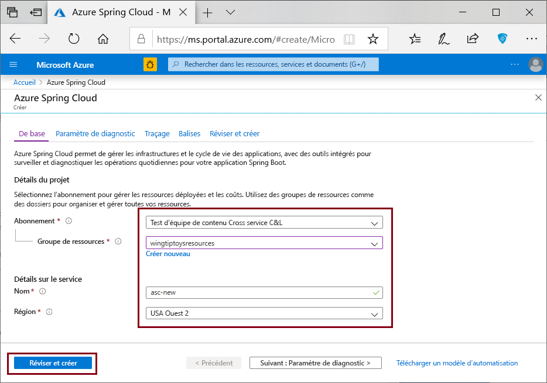

# <a name="quickstart-provision-azure-spring-cloud-service"></a>Démarrage rapide : Provisionner le service Azure Spring Cloud

Vous pouvez instancier Azure Spring Cloud en utilisant le portail Azure ou Azure CLI.  Les deux méthodes sont expliquées dans les procédures suivantes.
## <a name="prerequisites"></a>Prérequis

* [Installez JDK 8](https://docs.microsoft.com/java/azure/jdk/?view=azure-java-stable)
* [Souscrire à un abonnement Azure](https://azure.microsoft.com/free/)
* (Facultatif) [Installez Azure CLI version 2.0.67 ou ultérieure](https://docs.microsoft.com/cli/azure/install-azure-cli?view=azure-cli-latest) et installez l’extension Azure Spring Cloud avec la commande : `az extension add --name spring-cloud`
* (Facultatif) [Installez Azure Toolkit for IntelliJ](https://plugins.jetbrains.com/plugin/8053-azure-toolkit-for-intellij/) et [connectez-vous](https://docs.microsoft.com/azure/developer/java/toolkit-for-intellij/create-hello-world-web-app#installation-and-sign-in).

## <a name="provision-an-instance-of-azure-spring-cloud"></a>Provisionner une instance d’Azure Spring Cloud

#### <a name="portal"></a>[Portail](#tab/Azure-portal)

La procédure suivante crée une instance d’Azure Spring Cloud en utilisant le portail Azure.

1. Sous un nouvel onglet, ouvrez le [portail Azure](https://ms.portal.azure.com/). 

2. Dans la zone de recherche supérieure, recherchez **Azure Spring Cloud**.

3. Sélectionnez **Azure Spring Cloud** dans les résultats.

    

4. Dans la page Azure Spring Cloud, cliquez sur **+ Ajouter**.

    

5. Remplissez le formulaire sur la page **Créer** Azure Spring Cloud.  Tenez compte des recommandations suivantes :
    - **Abonnement**: Sélectionnez l’abonnement à facturer pour cette ressource.
    - **Groupe de ressources** : Une bonne pratique consiste à créer des groupes de ressources pour les nouvelles ressources. Notez que ceci sera utilisé dans des étapes ultérieures en tant que **\<resource group name\>** .
    - **Détails/Nom du service** : Spécifiez **\<service instance name\>** .  Le nom doit comporter entre 4 et 32 caractères, et contenir uniquement des lettres minuscules, des chiffres et des traits d’union.  Le premier caractère du nom du service doit être une lettre, et le dernier doit être une lettre ou un chiffre.
    - **Emplacement** : Sélectionnez l’emplacement de votre instance de service.

    

6. Cliquez sur **Vérifier et créer**.

> [!div class="nextstepaction"]
> [J’ai rencontré un problème](https://www.research.net/r/javae2e?tutorial=asc-cli-quickstart&step=public-endpoint)

#### <a name="cli"></a>[INTERFACE DE LIGNE DE COMMANDE](#tab/Azure-CLI)

La procédure suivante utilise l’extension Azure CLI pour provisionner une instance d’Azure Spring Cloud.

1. Connectez-vous à Azure CLI et choisissez votre abonnement actif. Veillez à choisir l’abonnement actif qui est dans la liste verte pour Azure Spring Cloud.

    ```azurecli
    az login
    az account list -o table
    az account set --subscription <Name or ID of subscription, skip if you only have 1 subscription>
    ```

1. Préparez un nom pour votre service Azure Spring Cloud.  Le nom doit comporter entre 4 et 32 caractères, et contenir uniquement des lettres minuscules, des chiffres et des traits d’union.  Le premier caractère du nom du service doit être une lettre, et le dernier doit être une lettre ou un chiffre.

1. Créez un groupe de ressources destiné à contenir votre service Azure Spring Cloud.

    ```azurecli
    az group create --location eastus --name <resource group name>
    ```

    Obtenez plus d’informations sur les [groupes de ressources Azure](../azure-resource-manager/management/overview.md).

1. Ouvrez une fenêtre Azure CLI et exécutez les commandes suivantes pour provisionner une instance d’Azure Spring Cloud.

    ```azurecli
    az spring-cloud create -n <service instance name> -g <resource group name>
    ```

    Le déploiement de l’instance de service prend environ cinq minutes.
---

## <a name="next-steps"></a>Étapes suivantes
> [!div class="nextstepaction"]
> [Configurer un serveur de configuration](spring-cloud-quickstart-setup-config-server.md)


