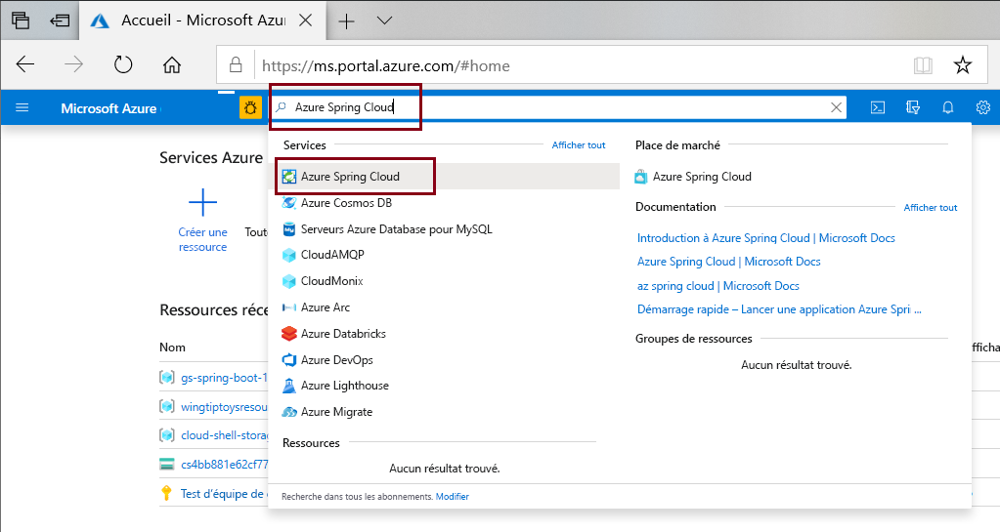
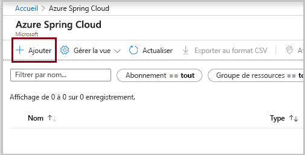

# <a name="quickstart-deploy-your-first-azure-spring-cloud-application"></a>Démarrage rapide : Déployer votre première application Azure Spring Cloud

Ce guide de démarrage rapide explique comment déployer une application de microservices Azure Spring Cloud à exécuter sur Azure. 

Le code d’application utilisé dans ce tutoriel est une application simple générée avec Spring Initializr. Une fois que vous avez terminé cet exemple, l’application est accessible en ligne et peut être gérée via le portail Azure.

Ce guide de démarrage rapide explique comment :

> [!div class="checklist"]
> * Générer un projet Spring Cloud de base
> * Provisionner une instance de service
> * Générer et déployer l’application avec un point de terminaison public
> * Effectuer le streaming des journaux en temps réel

## <a name="prerequisites"></a>Prérequis

Pour suivre ce guide de démarrage rapide :

* [Installez JDK 8](https://docs.microsoft.com/java/azure/jdk/?view=azure-java-stable)
* [Souscrire à un abonnement Azure](https://azure.microsoft.com/free/)
* (Facultatif) [Installez Azure CLI version 2.0.67 ou ultérieure](https://docs.microsoft.com/cli/azure/install-azure-cli?view=azure-cli-latest) et l’extension Azure Spring Cloud avec la commande : `az extension add --name spring-cloud`
* (Facultatif) [Installez Azure Toolkit for IntelliJ](https://plugins.jetbrains.com/plugin/8053-azure-toolkit-for-intellij/) et [connectez-vous](https://docs.microsoft.com/azure/developer/java/toolkit-for-intellij/create-hello-world-web-app#installation-and-sign-in).

## <a name="generate-a-spring-cloud-project"></a>Générer un projet Spring Cloud

Commencez avec [Spring Initializr](https://start.spring.io/#!type=maven-project&language=java&platformVersion=2.3.3.RELEASE&packaging=jar&jvmVersion=1.8&groupId=com.example&artifactId=hellospring&name=hellospring&description=Demo%20project%20for%20Spring%20Boot&packageName=com.example.hellospring&dependencies=web,cloud-eureka,actuator,cloud-starter-sleuth,cloud-starter-zipkin) pour générer un exemple de projet avec des dépendances recommandées pour Azure Spring Cloud. L’image suivante montre la configuration d’Initializr pour cet exemple de projet.
```url
https://start.spring.io/#!type=maven-project&language=java&platformVersion=2.3.3.RELEASE&packaging=jar&jvmVersion=1.8&groupId=com.example&artifactId=hellospring&name=hellospring&description=Demo%20project%20for%20Spring%20Boot&packageName=com.example.hellospring&dependencies=web,cloud-eureka,actuator,cloud-starter-sleuth,cloud-starter-zipkin
```

  

1. Cliquez sur **Generate** quand toutes les dépendances sont définies. Téléchargez et décompressez le package, puis créez un contrôleur web pour une application web simple en ajoutant `src/main/java/com/example/hellospring/HelloController.java` comme suit :

    ```java
    package com.example.hellospring;
    
    import org.springframework.web.bind.annotation.RestController;
    import org.springframework.web.bind.annotation.RequestMapping;
    
    @RestController
    public class HelloController {
    
        @RequestMapping("/")
        public String index() {
            return "Greetings from Azure Spring Cloud!";
        }
    
    }
    ```
## <a name="provision-an-instance-of-azure-spring-cloud"></a>Provisionner une instance Azure Spring Cloud

La procédure suivante crée une instance Azure Spring Cloud en utilisant le portail Azure.

1. Sous un nouvel onglet, ouvrez le [portail Azure](https://ms.portal.azure.com/). 

2. Dans la zone de recherche supérieure, recherchez *Azure Spring Cloud*.

3. Sélectionnez *Azure Spring Cloud* dans les résultats.

    

4. Dans la page Azure Spring Cloud, cliquez sur **+ Ajouter**.

    

5. Remplissez le formulaire sur la page **Créer** Azure Spring Cloud.  Tenez compte des recommandations suivantes :
    - **Abonnement**: Sélectionnez l’abonnement à facturer pour cette ressource.
    - **Groupe de ressources** : Une bonne pratique consiste à créer des groupes de ressources pour les nouvelles ressources. Ceci sera utilisé dans des étapes ultérieures en tant que **\<resource group name\>** .
    - **Détails/Nom du service** : Spécifiez **\<service instance name\>** .  Le nom doit comporter entre 4 et 32 caractères, et contenir uniquement des lettres minuscules, des chiffres et des traits d’union.  Le premier caractère du nom du service doit être une lettre, et le dernier doit être une lettre ou un chiffre.
    - **Emplacement** : Sélectionnez la région pour votre instance de service.

    

6. Cliquez sur **Vérifier et créer**.

## <a name="build-and-deploy-the-app"></a>Génération et déploiement de l’application
    
#### <a name="cli"></a>[INTERFACE DE LIGNE DE COMMANDE](#tab/Azure-CLI)
La procédure suivante génère et déploie l’application en utilisant Azure CLI. Exécutez la commande suivante à la racine du projet.

1. Générez le projet avec Maven :

    ```console
    mvn clean package -DskipTests
    ```

1. (Si vous ne l’avez pas encore fait) Installez l’extension Azure Spring Cloud pour Azure CLI :

    ```azurecli
    az extension add --name spring-cloud
    ```
    
1. Créez l’application avec un point de terminaison public affecté :

    ```azurecli
    az spring-cloud app create -n hellospring -s <service instance name> -g <resource group name> --is-public
    ```

1. Déployez le fichier Jar pour l’application :

    ```azurecli
    az spring-cloud app deploy -n hellospring -s <service instance name> -g <resource group name> --jar-path target\hellospring-0.0.1-SNAPSHOT.jar
    ```
    
1. Le déploiement de l’application prend quelques minutes. Pour vérifier qu’elle a été déployée, accédez au panneau **Applications** dans le portail Azure. Vous voyez normalement l’état de l’application.

#### <a name="intellij"></a>[IntelliJ](#tab/IntelliJ)

La procédure suivante utilise le plug-in IntelliJ pour Azure Spring Cloud afin de déployer l’exemple d’application dans IntelliJ IDEA.  

### <a name="import-project"></a>Importer le projet

1. Ouvrez la boîte de dialogue **Welcome** (Bienvenue) d’IntelliJ et sélectionnez **Import Project** (Importer un projet) pour ouvrir l’Assistant Importation.
1. Sélectionnez le dossier `hellospring`.

    

### <a name="deploy-the-app"></a>Déployer l’application
Pour déployer sur Azure, vous devez vous connecter avec votre compte Azure et choisir votre abonnement.  Pour plus d’informations sur la connexion, consultez [Installation et connexion](https://docs.microsoft.com/azure/developer/java/toolkit-for-intellij/create-hello-world-web-app#installation-and-sign-in).

1. Cliquez avec le bouton droit sur votre projet dans l’explorateur de projets IntelliJ, puis sélectionnez **Azure** -> **Deploy to Azure Spring Cloud**.

    [  ](media/spring-cloud-quickstart-java/intellij-deploy-azure-1.png#lightbox)

1. Acceptez le nom de l’application dans le champ **Name**. **Name** fait référence à la configuration, pas au nom de l’application. Les utilisateurs n’ont généralement pas besoin de le changer.
1. Dans la zone de texte **Artifact**, sélectionnez *hellospring-0.0.1-SNAPSHOT.jar*.
1. Dans la zone de texte **Subscription** (Abonnement), vérifiez votre abonnement.
1. Dans la zone de texte **Spring Cloud**, sélectionnez l’instance Azure Spring Cloud que vous avez créée dans [Provisionner une instance Azure Spring Cloud](https://docs.microsoft.com/azure/spring-cloud/spring-cloud-quickstart-provision-service-instance).
1. Définissez **Public Endpoint** (Point de terminaison public) sur *Enable* (Activer).
1. Dans la zone de texte **App:** , sélectionnez **Create app...** .
1. Entrez *hellospring*, puis cliquez sur **OK**.

    [  ](media/spring-cloud-quickstart-java/intellij-deploy-to-azure.png#lightbox)

1. Démarrez le déploiement en cliquant sur le bouton **Run** (Exécuter) en bas de la boîte de dialogue **Deploy Azure Spring Cloud app** (Déployer l’application Azure Spring Cloud). Le plug-in va exécuter la commande `mvn package` sur l’application `hellospring`, puis va déployer le fichier jar généré par la commande `package`.
---

Une fois le déploiement terminé, vous pouvez accéder à l’application sur `https://<service instance name>-hellospring.azuremicroservices.io/`.

  [  ](media/spring-cloud-quickstart-java/access-app-browser.png#lightbox)

## <a name="streaming-logs-in-real-time"></a>Streaming des journaux en temps réel

#### <a name="cli"></a>[INTERFACE DE LIGNE DE COMMANDE](#tab/Azure-CLI)

Utilisez la commande suivante pour récupérer des journaux en temps réel de l’application.

```azurecli
az spring-cloud app logs -n hellospring -s <service instance name> -g <resource group name> --lines 100 -f

```
Les journaux apparaissent dans les résultats :

[  ](media/spring-cloud-quickstart-java/streaming-logs.png#lightbox)

>[!TIP]
> Utilisez `az spring-cloud app logs -h` pour explorer davantage de paramètres et de fonctionnalités du streaming de journaux.

#### <a name="intellij"></a>[IntelliJ](#tab/IntelliJ)

1. Sélectionnez **Azure Explorer**, puis **Spring Cloud**.
1. Cliquez avec le bouton droit sur l’application en cours d’exécution.
1. Sélectionnez **Journaux de streaming** dans la liste déroulante.
1. Sélectionnez une instance.

    [  ](media/spring-cloud-quickstart-java/intellij-get-streaming-logs.png)

1. Le journal de streaming est visible dans la fenêtre de sortie.

    [  ](media/spring-cloud-quickstart-java/intellij-streaming-logs-output.png)
---

Pour des informations sur les fonctionnalités avancées de l’analytique des journaux, consultez l’onglet **Journaux** dans le menu sur le [portail Azure](https://portal.azure.com/). Les journaux ont ici une latence de quelques minutes.

[  ](media/spring-cloud-quickstart-java/logs-analytics.png#lightbox)

## <a name="clean-up-resources"></a>Nettoyer les ressources
Au cours des étapes précédentes, vous avez créé des ressources Azure au sein d’un groupe de ressources. Si vous ne pensez pas avoir besoin de ces ressources plus tard, supprimez le groupe de ressources du portail en exécutant la commande suivante dans Cloud Shell :
```azurecli
az group delete --name <your resource group name; for example: hellospring-1558400876966-rg> --yes
```

Dans ce démarrage rapide, vous avez appris comment :

> [!div class="checklist"]
> * Générer un projet Azure Spring Cloud de base
> * Provisionner une instance de service
> * Générer et déployer l’application avec un point de terminaison public
> * Streaming des journaux en temps réel
## <a name="next-steps"></a>Étapes suivantes
> [!div class="nextstepaction"]
> [Créer et exécuter des microservices](spring-cloud-quickstart-sample-app-introduction.md)

D’autres exemples sont disponibles sur GitHub : [Exemples Azure Spring Cloud](https://github.com/Azure-Samples/Azure-Spring-Cloud-Samples/tree/master/service-binding-cosmosdb-sql).
