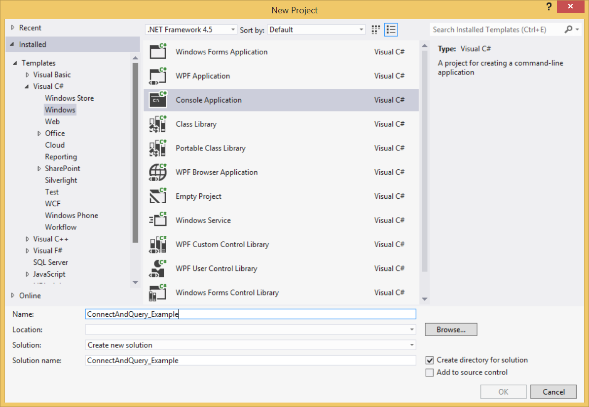

<properties 
	pageTitle="Connexion et interrogation d'une base de données SQL avec C#" 
	description="Exemple de code pour un client C# utilisant ADO.NET pour se connecter à la base de données AdventureWorks et interagir avec celle-ci dans le service cloud de la base de données SQL Azure."
	services="sql-database" 
	documentationCenter="" 
	authors="ckarst" 
	manager="jeffreyg" 
	editor=""/>

<tags 
	ms.service="sql-database" 
	ms.workload="data-management" 
	ms.tgt_pltfrm="na" 
	ms.devlang="dotnet" 
	ms.topic="article" 
	ms.date="04/14/2015" 
	ms.author="cakarst"/>

# Connexion et interrogation d'une base de données SQL avec C# 

Cette rubrique fournit un exemple de code C# qui vous explique comment vous connecter à une base de données SQL AdventureWorks à l'aide d'ADO.NET. L'exemple se compile en une application console qui interroge la base de données et affiche les résultats.

## Conditions préalables

- Une base de données AdventureWorks existante dans la base de données SQL Azure. [En créer une en quelques minutes](sql-database-get-started.md).
- [Visual Studio avec .NET Framework](https://www.visualstudio.com/fr-fr/visual-studio-homepage-vs.aspx)

## Étape 1 : application console

1. Créez une application console C# à l'aide de Visual Studio.

## Étape 2 : exemple de code SQL

1. Copiez et collez l'exemple de code ci-dessous dans votre application console.

> [AZURE.WARNING]L'exemple de code est conçu pour être aussi court que possible pour le rendre facile à comprendre. L'exemple n'est pas destiné à être utilisé en production.

Ce code n'est pas destiné à la production. Si vous souhaitez implémenter du code prêt pour la production, vous trouverez ci-dessous les meilleures pratiques du secteur :

- Gestion des exceptions.
- Logique de nouvelles tentatives pour les erreurs temporaires.
- Stockage sécurisé des mots de passe dans un fichier de configuration.

### Code source pour l'exemple C#

Collez ce code source dans le fichier **Program.cs**.

	using System;  // C#
	using System.Collections.Generic;
	using System.Linq;
	using System.Text;
	using System.Threading.Tasks;
	using System.Data.SqlClient;
	
	namespace ConnectandQuery_Example
	{
		class Program
		{
			static void Main()
			{
				string SQLConnectionString = "[Your_Connection_String]";
				// Create a SqlConnection from the provided connection string.
				using (SqlConnection connection = new SqlConnection(SQLConnectionString))
				{
					// Begin to formulate the command.
					SqlCommand command = new SqlCommand();
					command.Connection = connection;

					// Specify the query to be executed.
					command.CommandType = System.Data.CommandType.Text;
						command.CommandText =
						@"SELECT TOP 10
						CustomerID, NameStyle, Title, FirstName, LastName
						FROM SalesLT.Customer";

					// Open connection to database.
					connection.Open();

					// Read data from the query.
					SqlDataReader reader = command.ExecuteReader();
					while (reader.Read())
					{
						// Formatting will depend on the contents of the query.
						Console.WriteLine("Value: {0}, {1}, {2}, {3}, {4}",
							reader[0], reader[1], reader[2], reader[3], reader[4]);
					}
				}
				Console.WriteLine("Press any key to continue...");
				Console.ReadKey();
			}
		}
	}

## Étape 3 : trouver la chaîne de connexion pour votre base de données.

1. Ouvrez le [portail Azure](http://portal.azure.com/).
2. Cliquez sur **Parcourir** > **Bases de données SQL** > **Base de données « Adventure Works »** > **Propriétés** > **Afficher les chaînes de connexion de la base de données**.

Dans le volet des chaînes de connexion de la base de données, les chaînes de connexion appropriées s'affichent pour ADO.NET, ODBC, PHP et JDBC.

## Étape 4 : remplacer les informations de connexion réelles

-Dans le code source que vous avez collé, remplacez l'espace réservé *[Your_Connection_String]* par la chaîne de connexion et veillez à remplacer *your_password_here* dans cette chaîne par votre mot de passe réel.

## Étape 5 : exécution de l'application

1. Pour générer et exécuter votre application, cliquez sur **DÉBOGAGE** > **Démarrer le débogage**.
2. Le programme imprime les résultats de la requête dans la fenêtre de la console.

<!---HONumber=58-->