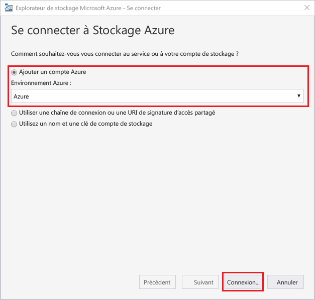
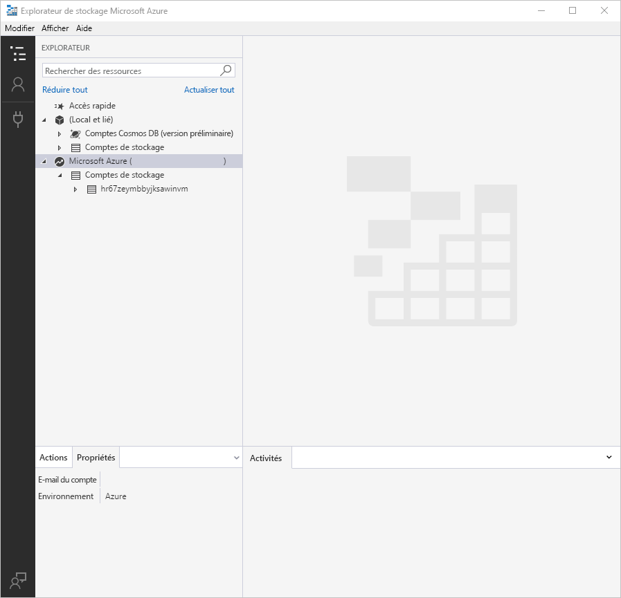

# Utiliser l'Explorateur Stockage Azure pour gérer les répertoires, les fichiers et les listes de contrôle d'accès dans Azure Data Lake Storage Gen2

Cet article explique comment utiliser [Azure Storage Explorer](https://azure.microsoft.com/features/storage-explorer/) pour créer et gérer des répertoires, des fichiers et des autorisations sur des comptes de stockage pour lesquels un espace de noms hiérarchique (HNS) est activé.

## Conditions préalables requises

> [!div class="checklist"]
> * Un abonnement Azure. Consultez la page [Obtention d’un essai gratuit d’Azure](https://azure.microsoft.com/pricing/free-trial/).
> * Un compte de stockage doté d’un espace de noms hiérarchique (HNS) activé. Pour créer un test, suivez [ces](data-lake-storage-quickstart-create-account.md) instructions.
> * Explorateur Stockage Azure installé sur votre ordinateur local. Pour installer l’Explorateur Stockage Azure pour Windows, Macintosh ou Linux, consultez [Explorateur Stockage Azure](https://azure.microsoft.com/features/storage-explorer/).

## Se connecter à l’Explorateur Stockage

Lors du premier démarrage de l’Explorateur Stockage, la fenêtre **Microsoft Azure Storage Explorer - Connect** (Explorateur Stockage Microsoft Azure - Connexion) s’affiche. Bien que l’Explorateur Stockage propose plusieurs méthodes de connexion aux comptes de stockage, une seule est actuellement prise en charge pour la gestion des ACL.

|Tâche|Objectif|
|---|---|
|Ajouter un compte Azure | Vous redirige vers la page de connexion de votre organisation afin de vous authentifier sur Azure. Il s’agit actuellement de la seule méthode d’authentification prise en charge si vous souhaitez gérer et définir des ACL.|
|Utiliser un URI de chaîne de connexion ou de signature d’accès partagé | Peut être utilisé pour accéder directement à un conteneur ou un compte de stockage avec un jeton SAP ou une chaîne de connexion partagée. |
|Utiliser le nom et la clé d’un compte de stockage| Utilisez le nom et la clé et de votre compte de stockage pour vous connecter à Stockage Azure.|

Sélectionnez **Ajouter un compte Azure**, puis cliquez sur **Connexion..** . Suivez les instructions de connexion à votre compte Azure qui s’affichent à l’écran.

Une fois que la connexion est établie, l’Explorateur Stockage Azure se charge avec l’onglet **Explorateur** affiché. Cette vue vous donne accès à l’ensemble de vos comptes Stockage Azure, ainsi qu’au stockage local configuré via les comptes de l’[émulateur de stockage Azure](../common/storage-use-emulator.md?toc=%2fazure%2fstorage%2fblobs%2ftoc.json), [Cosmos DB](../../cosmos-db/storage-explorer.md?toc=%2fazure%2fstorage%2fblobs%2ftoc.json) ou les environnements [Azure Stack](/azure-stack/user/azure-stack-storage-connect-se?toc=%2fazure%2fstorage%2fblobs%2ftoc.json).

## Créez un conteneur.

Un conteneur contient des répertoires et des fichiers. Pour en créer un, développez le compte de stockage que vous avez créé à l'étape précédente. Sélectionnez **Conteneurs d’objets blob**, cliquez avec le bouton droit, puis sélectionnez **Créer un conteneur d’objets blob**. Entrez le nom de votre conteneur. Consultez la section [Créer un conteneur](storage-quickstart-blobs-dotnet.md#create-a-container) pour obtenir la liste des règles et restrictions applicables aux noms de conteneurs. Quand vous avez terminé, appuyez sur **Entrée** pour créer le conteneur. Une fois le conteneur créé, il apparaît sous le dossier **Conteneurs d'objets blob** correspondant au compte de stockage sélectionné.

## Créer un répertoire

Pour créer un répertoire, sélectionnez le conteneur que vous avez créé à l'étape précédente. Sur le ruban du conteneur, choisissez le bouton **Nouveau dossier**. Entrez le nom de votre répertoire. Lorsque vous avez terminé, appuyez sur **Entrée** pour créer le répertoire. Une fois le répertoire créé, il apparaît dans la fenêtre de l'éditeur.

## Charger des objets blob dans le répertoire

Sur le ruban du répertoire, choisissez le bouton **Charger**. Ce faisant, vous avez la possibilité de télécharger un dossier ou un fichier.

Choisissez les fichiers ou le dossier à télécharger.

Lorsque vous sélectionnez **OK**, les fichiers sélectionnés sont mis en file d’attente de téléchargement ; ils sont traités un à un. Une fois le téléchargement terminé, les résultats s’affichent dans la fenêtre **Activités**.

## Afficher les objets blob d’un répertoire

Dans l’application **Explorateur Stockage Azure**, sélectionnez un répertoire sous un compte de stockage. Le volet principal affiche une liste des objets blobs hébergés dans le répertoire sélectionné.

## Télécharger des objets blob

Pour télécharger un fichier à l'aide de l'**Explorateur Stockage Azure**, sélectionnez le fichier, puis choisissez **Télécharger** sur le ruban. La boîte de dialogue qui s’ouvre vous permet de saisir un nom de fichier. Sélectionnez **Enregistrer** pour lancer le téléchargement d'un fichier à l'emplacement local.

## Gestion de l’accès

Vous pouvez définir des autorisations à la racine de votre conteneur. Pour ce faire, vous devez être connecté à l’Explorateur de stockage Azure avec votre compte spécifique disposant des droits adaptés (par opposition à une chaîne de connexion). Cliquez avec le bouton droit sur votre conteneur, puis sélectionnez **Gérer les autorisations**, ce qui fait apparaître la boîte de dialogue **Gérer les autorisations**.

La boîte de dialogue **Gérer les autorisations** vous permet de gérer les autorisations pour le propriétaire et le groupe de propriétaires. Elle vous permet également d’ajouter de nouveaux utilisateurs et groupes à la liste de contrôle d’accès pour lesquels vous pouvez ensuite gérer les autorisations.

Pour ajouter un nouvel utilisateur ou un nouveau groupe à la liste de contrôle d’accès, sélectionnez le champ **Ajouter un utilisateur ou groupe**.

Entrez l’entrée Azure Active Directory (AAD) correspondante que vous souhaitez ajouter à la liste, puis sélectionnez **Ajouter**.

L’utilisateur ou le groupe apparaît alors dans le champ **Utilisateurs et groupes**, ce qui vous permet de commencer à gérer leurs autorisations.

> [!NOTE]
> Créer un groupe de sécurité dans AAD et mettre à jour les autorisations au niveau du groupe plutôt qu’au niveau des utilisateurs individuels est recommandé et constitue une meilleure pratique. Pour plus d’informations sur cette recommandation ainsi que sur les autres meilleures pratiques, consultez [Meilleures pratiques pour Data Lake Storage Gen2](data-lake-storage-best-practices.md).

Il existe deux catégories d’autorisations pouvant être attribuées : les ACL d’accès et les ACL par défaut.

* **Accès** : Les ACL d’accès contrôlent l’accès à un objet. Les fichiers et les répertoires ont tous des ACL d’accès.

* **Par défaut** : Un modèle d’ACL associées à un répertoire, qui détermine les ACL d’accès pour tous les éléments enfants créés dans ce répertoire. Les fichiers n’ont pas d’ACL par défaut.

Dans ces deux catégories, il existe trois autorisations, que vous pouvez ensuite attribuer à des fichiers ou des répertoires : **Lire**, **écrire** et **exécuter**.

>[!NOTE]
> Les sélections faites ici ne définiront pas d’autorisations sur tous les éléments existants actuellement au sein du répertoire. Vous devez accéder à chaque élément et définir les autorisations manuellement, si le fichier existe déjà.

Vous pouvez gérer les autorisations sur des répertoires individuels, ainsi que sur des fichiers individuels, permettant un contrôle d’accès précis. Le processus de gestion des autorisations pour les répertoires et les fichiers est identique à celui décrit ci-dessus. Faites un clic droit sur le fichier ou le répertoire dont vous souhaitez gérer les autorisations et suivez le même processus.

## Étapes suivantes

Découvrez les listes de contrôle d'accès disponibles dans Data Lake Storage Gen2.

> [!div class="nextstepaction"]
> [Contrôle d’accès dans Azure Data Lake Storage Gen2](https://docs.microsoft.com/azure/storage/blobs/data-lake-storage-access-control)
