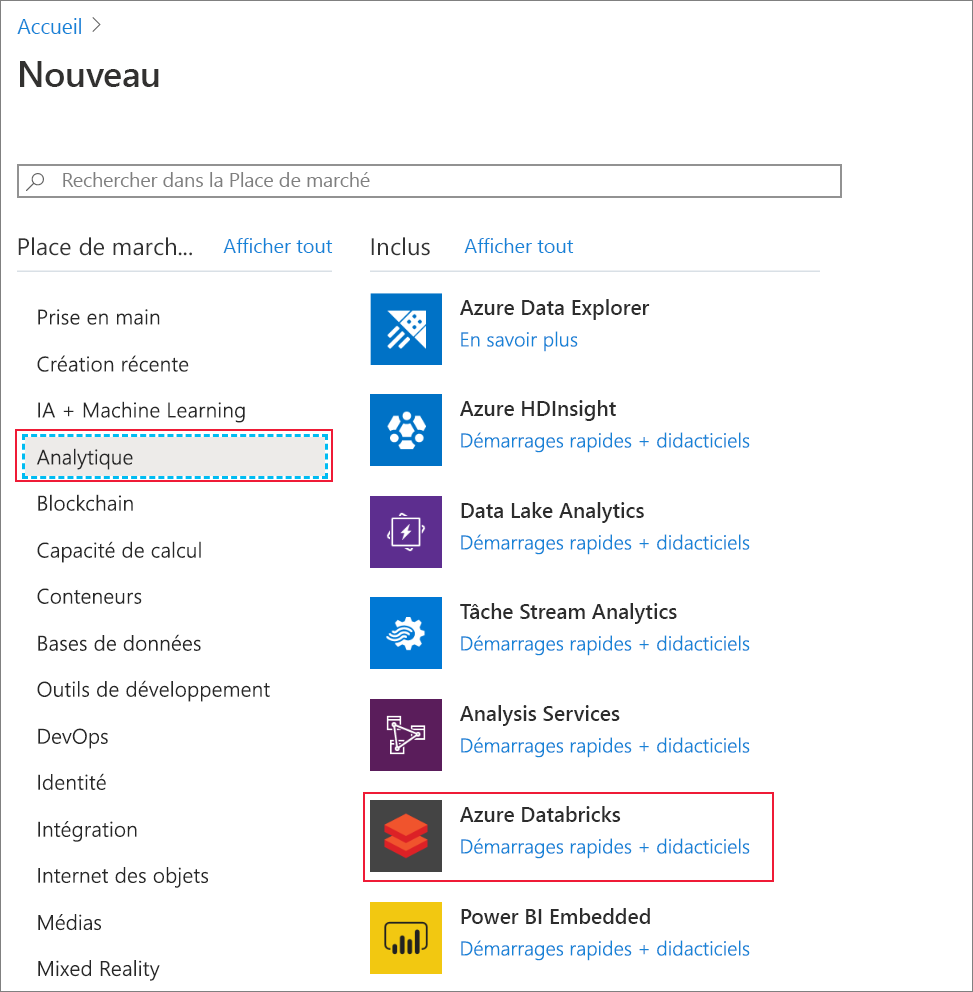
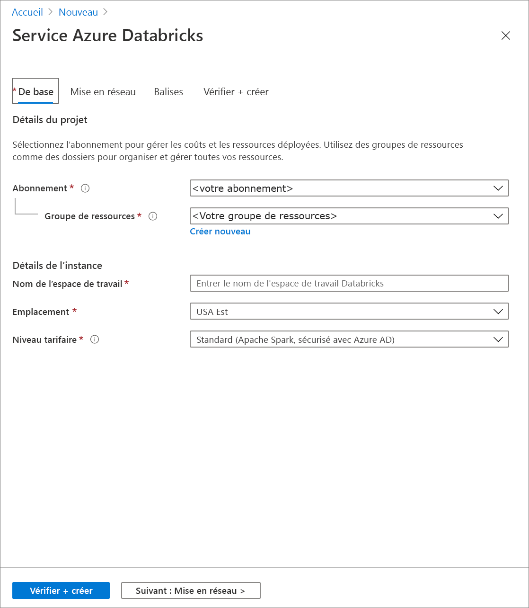
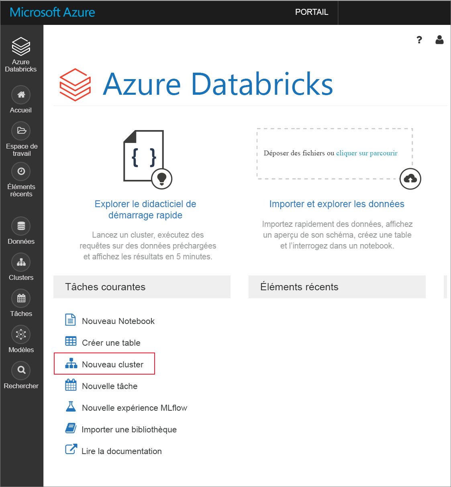
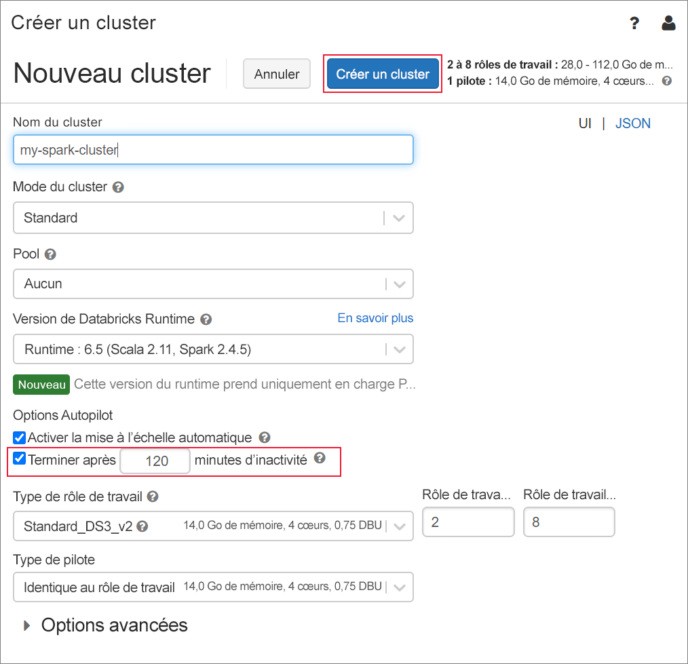
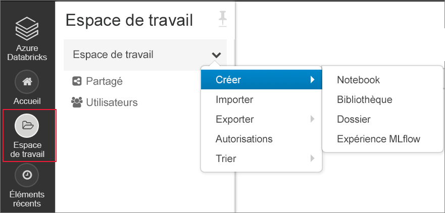
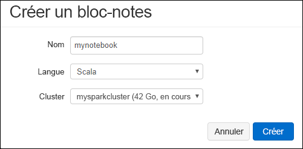
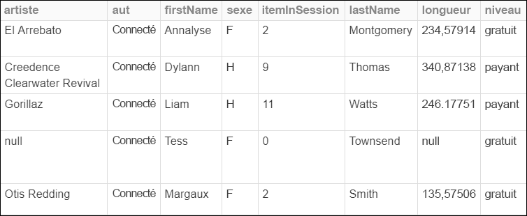
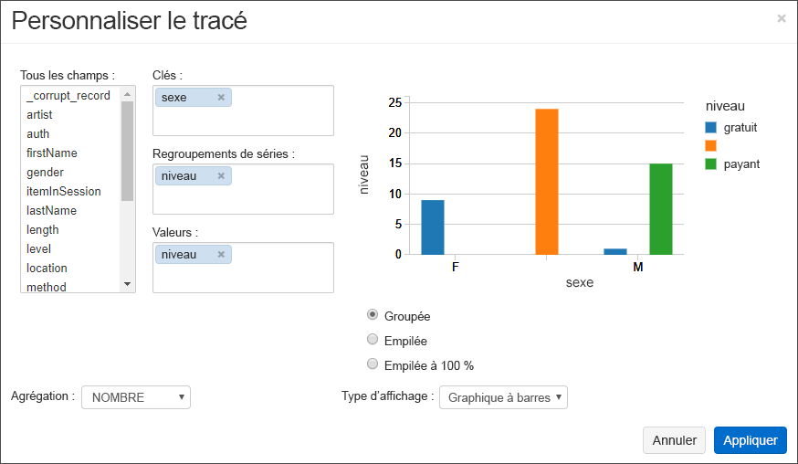
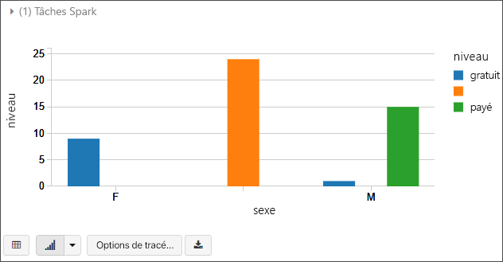
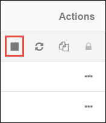

# <a name="quickstart-analyze-data-with-databricks"></a>Démarrage rapide : Analyser des données avec Databricks

Dans ce guide de démarrage rapide, vous exécutez un travail Apache Spark avec Azure Databricks pour effectuer une analytique sur des données stockées dans un compte de stockage. Dans le cadre du travail Spark, vous allez analyser des données d’abonnement à une station de radio pour obtenir des insights sur l’utilisation gratuite/payante en fonction de données démographiques.

## <a name="prerequisites"></a>Conditions préalables requises

* Compte Azure avec un abonnement actif. [Créez un compte gratuitement](https://azure.microsoft.com/free/?ref=microsoft.com&utm_source=microsoft.com&utm_medium=docs&utm_campaign=visualstudio).

* Nom de votre compte de stockage Azure Data Lake Storage Gen2. [Créez un compte de stockage Azure Data Lake Storage Gen2](data-lake-storage-quickstart-create-account.md).

* L’ID de locataire, l’ID d’application et le mot de passe d’un principal de service Azure auquel un rôle **Contributeur aux données blob du stockage** est attribué. [Créez un principal du service](../../active-directory/develop/howto-create-service-principal-portal.md).

  > [!IMPORTANT]
  > Attribuez le rôle dans l’étendue du compte de stockage Data Lake Storage Gen2. Vous pouvez attribuer un rôle à l’abonnement ou au groupe de ressources parent, mais des erreurs d’autorisation sont générées tant que ces attributions de rôles ne sont pas propagées au compte de stockage.

## <a name="create-an-azure-databricks-workspace"></a>Créer un espace de travail Azure Databricks

Dans cette section, vous créez un espace de travail Azure Databricks en utilisant le portail Azure.

1. Dans le portail Azure, sélectionnez **Créer une ressource** >  **Analytique** > **Azure Databricks**.

    

2. Sous **Service Azure Databricks**, renseignez les valeurs pour créer un espace de travail Databricks.

    

    Renseignez les valeurs suivantes :

    |Propriété  |Description  |
    |---------|---------|
    |**Nom de l’espace de travail**     | Renseignez un nom pour votre espace de travail Databricks.        |
    |**Abonnement**     | Sélectionnez votre abonnement Azure dans la liste déroulante.        |
    |**Groupe de ressources**     | Indiquez si vous souhaitez créer un groupe de ressources Azure ou utiliser un groupe existant. Un groupe de ressources est un conteneur réunissant les ressources associées d’une solution Azure. Pour plus d’informations, consultez [Présentation des groupes de ressources Azure](../../azure-resource-manager/management/overview.md). |
    |**Lieu**     | Sélectionnez **USA Ouest 2**. N’hésitez pas à sélectionner une autre région publique si vous préférez.        |
    |**Niveau tarifaire**     |  Choisissez entre **Standard** ou **Premium**. Pour plus d’informations sur ces niveaux, consultez la [page de tarification Databricks](https://azure.microsoft.com/pricing/details/databricks/).       |

3. La création du compte prend quelques minutes. Pour superviser l’état de l’opération, regardez la barre de progression située en haut.

4. Sélectionnez **Épingler au tableau de bord**, puis sélectionnez **Créer**.

## <a name="create-a-spark-cluster-in-databricks"></a>Créer un cluster Spark dans Databricks

1. Dans le portail Azure, accédez à l’espace de travail Databricks que vous avez créé, puis sélectionnez **Initialiser l’espace de travail**.

2. Vous êtes redirigé vers le portail Azure Databricks. Dans le portail, sélectionnez **Nouveau** > **Cluster**.

    

3. Dans la page **Nouveau cluster**, renseignez les valeurs pour créer un cluster.

    

    Renseignez les champs suivants et acceptez les valeurs par défaut pour les autres champs :

    - Entrez un nom pour le cluster.
     
    - Veillez à cocher la case **Arrêter après 120 minutes d’inactivité**. Spécifiez une durée (en minutes) pour arrêter le cluster, si le cluster n’est pas utilisé.

4. Sélectionnez **Créer un cluster**. Une fois que le cluster est en cours d’exécution, vous pouvez y attacher des notebooks et exécuter des travaux Spark.

Pour plus d’informations sur la création de clusters, consultez [Créer un cluster Spark dans Azure Databricks](https://docs.azuredatabricks.net/user-guide/clusters/create.html).

## <a name="create-storage-account-container"></a>Créer un conteneur de comptes de stockage

Dans cette section, vous créez un bloc-notes dans l’espace de travail Azure Databricks, puis exécutez les extraits de code pour configurer le compte de stockage.

1. Dans le [portail Azure](https://portal.azure.com), accédez à l’espace de travail Azure Databricks que vous avez créé, puis sélectionnez **Initialiser l’espace de travail**.

2. Dans le volet gauche, sélectionnez **Espace de travail**. Dans la liste déroulante **Espace de travail**, sélectionnez **Créer** > **Notebook**.

    

3. Dans la boîte de dialogue **Créer un bloc-notes**, entrez un nom pour le bloc-notes. Sélectionnez **Scala** comme langage, puis sélectionnez le cluster Spark que vous avez créé précédemment.

    

    Sélectionnez **Create** (Créer).

4. Copiez et collez le bloc de code suivant dans la première cellule, mais n’exécutez pas ce code pour l’instant.

   ```scala
   spark.conf.set("fs.azure.account.auth.type.<storage-account-name>.dfs.core.windows.net", "OAuth")
   spark.conf.set("fs.azure.account.oauth.provider.type.<storage-account-name>.dfs.core.windows.net", "org.apache.hadoop.fs.azurebfs.oauth2.ClientCredsTokenProvider")
   spark.conf.set("fs.azure.account.oauth2.client.id.<storage-account-name>.dfs.core.windows.net", "<appID>")
   spark.conf.set("fs.azure.account.oauth2.client.secret.<storage-account-name>.dfs.core.windows.net", "<password>")
   spark.conf.set("fs.azure.account.oauth2.client.endpoint.<storage-account-name>.dfs.core.windows.net", "https://login.microsoftonline.com/<tenant-id>/oauth2/token")
   spark.conf.set("fs.azure.createRemoteFileSystemDuringInitialization", "true")
   dbutils.fs.ls("abfss://<container-name>@<storage-account-name>.dfs.core.windows.net/")
   spark.conf.set("fs.azure.createRemoteFileSystemDuringInitialization", "false")

   ```

    > [!NOTE]
    > Ce bloc de code accède directement au point de terminaison Data Lake Gen2 via OAuth. Toutefois, il existe d’autres moyens de connecter l’espace de travail Databricks à votre compte Data Lake Storage Gen2. Par exemple, vous pouvez monter le conteneur à l’aide d’OAuth ou utiliser un accès direct par clé partagée. <br>Pour voir des exemples de ces approches, consultez l’article [Azure Data Lake Storage Gen2](https://docs.azuredatabricks.net/spark/latest/data-sources/azure/azure-datalake-gen2.html) sur le site web Azure Databricks.

5. Dans ce bloc de code, remplacez les valeurs d’espace réservé `storage-account-name`, `appID`, `password` et `tenant-id` par les valeurs que vous avez collectées au moment de la création du principal de service. Affectez le nom de conteneur de votre choix à la valeur d’espace réservé `container-name`.

    > [!NOTE]
    > Dans un environnement de production, songez à stocker votre clé d’authentification dans Azure Databricks. Ensuite, ajoutez une clé de recherche à votre bloc de code au lieu de la clé d’authentification. Après avoir suivi ce guide de démarrage rapide, consultez l’article [Azure Data Lake Storage Gen2](https://docs.azuredatabricks.net/spark/latest/data-sources/azure/azure-datalake-gen2.html) sur le site web Azure Databricks pour voir des exemples de cette approche.

6. Appuyez sur les touches **Maj +Entrée** pour exécuter le code de ce bloc.

## <a name="ingest-sample-data"></a>Ingérer des exemples de données

Avant de commencer cette section, vous devez effectuer les prérequis suivants :

Entrez le code suivant dans une cellule du bloc-notes :

    %sh wget -P /tmp https://raw.githubusercontent.com/Azure/usql/master/Examples/Samples/Data/json/radiowebsite/small_radio_json.json

Dans la cellule, appuyez sur **Maj+Entrée** pour exécuter le code.

À présent, dans une nouvelle cellule en dessous de celle-ci, entrez le code suivant et remplacez les valeurs entre crochets par les valeurs que vous avez utilisées plus tôt :

    dbutils.fs.cp("file:///tmp/small_radio_json.json", "abfss://<container-name>@<storage-account-name>.dfs.core.windows.net/")

Dans la cellule, appuyez sur **Maj+Entrée** pour exécuter le code.

## <a name="run-a-spark-sql-job"></a>Exécuter un travail SQL Spark

Effectuez les tâches suivantes pour exécuter une tâche SQL Spark sur les données.

1. Exécutez une instruction SQL pour créer une table temporaire en utilisant les données de l’exemple de fichier de données JSON, **small_radio_json.json**. Dans l’extrait de code suivant, remplacez les valeurs des espaces réservés par le nom de votre conteneur et par le nom de votre compte de stockage. À l’aide du bloc-notes que vous avez créé précédemment, collez l’extrait de code dans une nouvelle cellule de code du bloc-notes, puis appuyez sur Maj+Entrée.

    ```sql
    %sql
    DROP TABLE IF EXISTS radio_sample_data;
    CREATE TABLE radio_sample_data
    USING json
    OPTIONS (
     path  "abfss://<container-name>@<storage-account-name>.dfs.core.windows.net/small_radio_json.json"
    )
    ```

    Une fois la commande terminée, vous avez toutes les données du fichier JSON sous forme de table dans le cluster Databricks.

    La commande magic `%sql` vous permet d’exécuter du code SQL à partir du notebook, même si celui-ci est d’un autre type. Pour plus d’informations, consultez [Mélange de langages dans un notebook](https://docs.azuredatabricks.net/user-guide/notebooks/index.html#mixing-languages-in-a-notebook).

2. Examinons un instantané des données JSON pour mieux comprendre la requête que vous exécutez. Collez l’extrait de code suivant dans une cellule de code, puis appuyez sur **Maj+Entrée**.

    ```sql
    %sql
    SELECT * from radio_sample_data
    ```

3. Vous voyez une sortie tabulaire, comme celle qui est montrée dans la capture d’écran suivante (seules certaines colonnes apparaissent) :

    

    Parmi d’autres informations, les exemples de données indiquent quel est le sexe des auditeurs d’une chaîne de radio (le nom de la colonne est **gender**), et si leur abonnement est gratuit ou payant (le nom de colonne est **level**).

4. Vous créez maintenant une représentation visuelle de ces données de façon à montrer, pour chaque sexe, le nombre d’utilisateurs avec un abonnement gratuit et avec un abonnement payant. Dans le bas de la sortie tabulaire, cliquez sur l’icône **Graphique à barres**, puis cliquez sur **Options de traçage**.

    

5. Dans **Personnaliser le traçage**, faites un glisser-déplacer des valeurs comme indiqué dans la capture d’écran.

    

    - Définissez **Clés** sur **gender**.
    - Définissez **Regroupements de séries** sur **level**.
    - Définissez **Valeurs** sur **level**.
    - Définissez **Agrégation** sur **COUNT**.

6. Cliquez sur **Appliquer**.

7. La sortie montre la représentation visuelle, comme illustré dans la capture d’écran suivante :

     

## <a name="clean-up-resources"></a>Nettoyer les ressources

Une fois que vous avez fini la lecture de cet article, vous pouvez arrêter le cluster. Dans l’espace de travail Azure Databricks, sélectionnez **Clusters** et recherchez le cluster que vous voulez arrêter. Déplacez le curseur sur les points de suspension dans la colonne **Actions**, puis sélectionnez l’icône **Terminer**.



Si vous n’arrêtez pas le cluster manuellement, il s’arrête automatiquement, à condition d’avoir coché la case **Arrêter après \_\_ minutes d’inactivité** lors de la création du cluster. Si vous définissez cette option, le cluster s’arrête après le délai d’inactivité spécifié.

## <a name="next-steps"></a>Étapes suivantes

Dans cet article, vous avez créé un cluster Spark dans Azure Databricks et exécuté un travail Spark à l’aide des données dans un compte de stockage dans Data Lake Storage Gen2 activé. Vous pouvez également consulter [Sources de données Spark](https://docs.azuredatabricks.net/spark/latest/data-sources/index.html) pour découvrir comment importer des données à partir d’autres sources de données dans Azure Databricks. Passez à l’article suivant pour savoir comment effectuer une opération ETL (extraction, transformation et chargement de données) à l’aide d’Azure Databricks.

> [!div class="nextstepaction"]
>[Extraire, transformer et charger des données à l’aide d’Azure Databricks](../../azure-databricks/databricks-extract-load-sql-data-warehouse.md)
