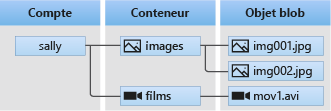

# Présentation du Stockage Blob

Le Stockage Blob Azure est un service permettant de stocker de gros volumes de données d’objets non structurées, telles que du texte ou des données binaires, accessibles depuis n’importe où dans le monde via HTTP ou HTTPS. Vous pouvez utiliser le stockage d'objets blob pour exposer les données publiquement dans le monde ou pour le stockage privé de données d'applications.

Voici quelques utilisations courantes du stockage d’objets blob :

* Mise à disposition d’images ou de documents directement dans un navigateur
* Stockage de fichiers pour un accès distribué
* Streaming de contenu vidéo et audio
* Stockage de données pour la sauvegarde et la restauration, la récupération d’urgence et l’archivage
* Stockage des données pour l’analyse par un service local ou hébergé par Azure

## Concepts du service BLOB

Le service d’objets blob contient les composants suivants :

* **Compte de stockage :** tout accès au stockage Azure s'effectue via un compte de stockage. Ce compte de stockage peut être un **compte de stockage à usage général** ou un **compte de stockage d’objets blob** spécialisé pour le stockage d’objets/objets blob. Pour plus d’informations, voir [À propos des comptes de stockage Azure](../common/storage-create-storage-account.md?toc=%2fazure%2fstorage%2fblobs%2ftoc.json).

* **Conteneur :** un conteneur regroupe un ensemble d'objets blob. Tous les objets blob doivent figurer dans un conteneur. Un compte peut contenir un nombre illimité de conteneurs. Un conteneur peut stocker un nombre illimité d’objets blob. Notez que le nom du conteneur doit être en minuscules.

* **Objet blob :** fichier de tout type et de toute taille. Azure Storage propose trois types d’objets blob : les objets blob de blocs, les objets blob d’ajouts et les objets blob de pages.
  
    Les *objets blob de blocs* sont parfaits pour le stockage des fichiers texte ou binaires, tels que les documents et les fichiers multimédias. Les *objets blob d’ajout* sont similaires aux objets blob de blocs dans la mesure où ils sont composés de blocs. Cependant, ils sont optimisés pour les opérations d’ajouts et sont donc utiles pour les scénarios de journalisation. Un objet blob de blocs ou d’ajouts peut contenir jusqu’à 50 000 blocs de 100 Mo chacun, soit une taille totale légèrement supérieure à 4,75 Go (100 Mo x 50 000). Un objet blob d’ajout peut contenir jusqu’à 50 000 blocs de 4 Mo chacun, soit une taille totale légèrement supérieure à 195 Go (4 Mo x 50 000).
  
    La taille maximale des *objets blob de pages* peut atteindre 1 To. Ces objets sont plus efficaces pour les opérations fréquentes de lecture/écriture. Les machines virtuelles Azure utilisent les objets blob de pages comme disques de données et disques de système d’exploitation.
  
    Pour plus de détails sur l’affectation de noms aux conteneurs et objets blob, consultez [Affectation de noms et références aux conteneurs, objets blob et métadonnées](/rest/api/storageservices/Naming-and-Referencing-Containers--Blobs--and-Metadata).

## Étapes suivantes

* [Créer un compte de stockage](../common/storage-create-storage-account.md?toc=%2fazure%2fstorage%2fblobs%2ftoc.json)
* [Prise en main du Stockage Blob avec .NET](storage-dotnet-how-to-use-blobs.md?toc=%2fazure%2fstorage%2fblobs%2ftoc.json)
