# Démarrage rapide : Créer et gérer le partage Azure Files avec des machines virtuelles Windows

L’article décrit les étapes de base à suivre pour créer et utiliser un partage Azure Files. Dans ce guide de démarrage rapide, l’accent est mis sur la configuration rapide d’un partage Azure Files, afin de vous faire découvrir le fonctionnement du service. Si vous avez besoin d’instructions plus détaillées sur la création et l’utilisation de partages de fichiers Azure dans votre propre environnement, consultez [Utiliser un partage de fichiers Azure avec Windows](storage-how-to-use-files-windows.md).

Si vous n’avez pas d’abonnement Azure, créez un [compte gratuit](https://azure.microsoft.com/free/?WT.mc_id=A261C142F) avant de commencer.

## Connexion à Azure

Connectez-vous au [portail Azure](https://portal.azure.com).

## Préparation de votre environnement

Ce démarrage rapide configure les éléments suivants :

- Un compte de stockage Azure et un partage de fichiers Azure
- Une machine virtuelle Windows Server 2016 Datacenter

### Créez un compte de stockage.

Avant de pouvoir utiliser un partage de fichiers Azure, vous devez créer un compte de stockage Azure. Un compte de stockage v2 universel fournit un accès à tous les services de Stockage Azure : objets blob, fichiers, files d’attente et tables. Le guide de démarrage rapide crée un compte de stockage v2 universel, mais les étapes de création d’un autre type de compte de stockage sont similaires. Un compte de stockage peut contenir un nombre illimité de partages. Un partage peut stocker un nombre illimité de fichiers, dans les limites de capacité du compte de stockage.

[!INCLUDE [storage-create-account-portal-include](../../../includes/storage-create-account-portal-include.md)]

### Crée un partage de fichiers Azure

Ensuite, créez un partage de fichiers.

1. Une fois le déploiement du compte de stockage Azure terminé, sélectionnez **Accéder à la ressource**.
1. Sélectionnez **Fichiers** dans le volet du compte de stockage.

    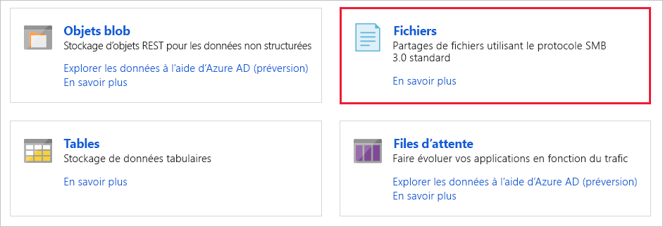

1. Sélectionnez **Partage de fichiers**.

    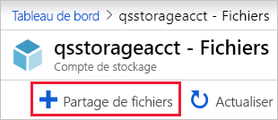

1. Nommez le nouveau partage de fichiers *qsfileshare*, entrez « 1 » pour le **Quota**, puis sélectionnez **Créer**. La valeur du quota peut être de 5 Tio au maximum, mais vous avez besoin uniquement de 1 Gio pour ce guide de démarrage rapide.
1. Créez un fichier txt nommé *qsTestFile* sur votre ordinateur local.
1. Sélectionnez le nouveau partage de fichiers puis, à l’emplacement de celui-ci, cliquez sur **Charger**.

    

1. Accédez à l’emplacement où vous avez créé votre fichier .txt, puis sélectionnez *qsTestFile.txt* et **Charger**.

Jusqu’ici, vous avez créé un compte de stockage Azure et un partage de fichiers contenant un seul fichier dans Azure. Vous allez maintenant créer la machine virtuelle Azure avec Windows Server 2016 Datacenter pour représenter le serveur local dans ce guide de démarrage rapide.

### Déployer une machine virtuelle

1. Ensuite, développez le menu à gauche du portail Azure et choisissez **Créer une ressource** dans le coin supérieur gauche.
1. Dans la zone de recherche au-dessus de la liste des ressources de la **Place de marché Azure**, recherchez et sélectionnez **Windows Server 2016 Datacenter**, puis choisissez **Créer**.
1. Sous l’onglet **De base**, sous **Détails du projet**, sélectionnez le groupe de ressources que vous avez créé pour ce guide de démarrage rapide.

   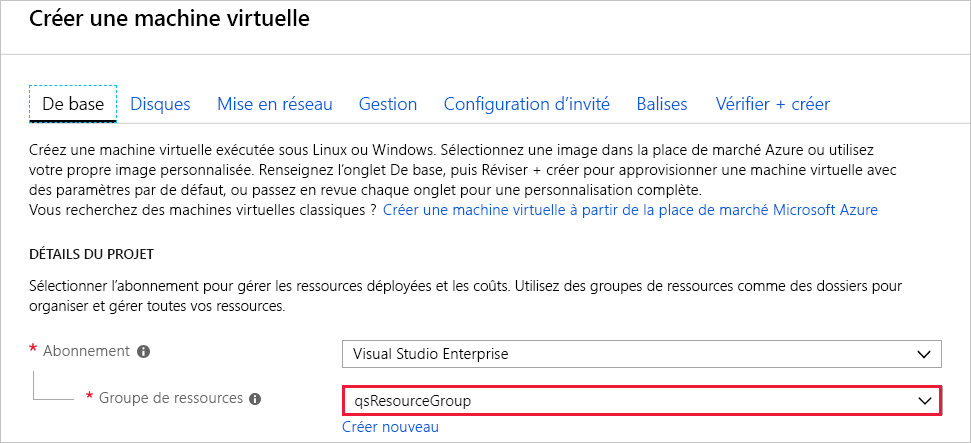

1. Sous **Détails de l’instance**, nommez la machine virtuelle *qsVM*.
1. Conservez les paramètres par défaut pour la **Région**, les **Options de disponibilité**, l’**Image**, et la **Taille**.
1. Sous **Compte d’administrateur**, ajoutez *VMadmin* comme **Nom d’utilisateur** et entrez un **Mot de passe** pour la machine virtuelle.
1. Sous **Règles des ports d’entrée**, choisissez **Autoriser les ports sélectionnés**, puis sélectionnez **RDP (3389)** et **HTTP** dans la liste déroulante.
1. Sélectionnez **Revoir + créer**.
1. Sélectionnez **Create** (Créer). La création d’une machine virtuelle prend plusieurs minutes.

1. Une fois le déploiement de votre machine virtuelle terminé, sélectionnez **Accéder à la ressource**.

À ce stade, vous avez créé une machine virtuelle et attaché un disque de données. Vous devez maintenant vous connecter à la machine virtuelle.

### Connexion à votre machine virtuelle

1. Sélectionnez **Se connecter** dans la page de propriétés de la machine virtuelle.

   

1. Dans la page **Se connecter à la machine virtuelle**, conservez les options par défaut pour vous connecter par **adresse IP** sur le **numéro de port** *3389* et sélectionnez **Télécharger le fichier RDP**.
1. Ouvrez le fichier RDP téléchargé et, à l’invite, sélectionnez **Connecter**.
1. Dans la fenêtre **Sécurité Windows**, sélectionnez **Plus de choix**, puis **Utiliser un autre compte**. Tapez le nom d’utilisateur sous la forme *localhost\username*, où &lt;username&gt; est le nom d’utilisateur administrateur que vous avez créé pour la machine virtuelle. Entrez le mot de passe que vous avez créé pour la machine virtuelle, puis sélectionnez **OK**.

   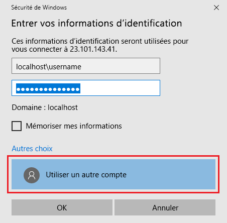

1. Un avertissement de certificat peut s’afficher pendant le processus de connexion. Sélectionnez **Oui** ou **Continuer** pour créer la connexion.

## Mapper le partage de fichiers Azure à un lecteur Windows

1. Dans le portail Azure, accédez au partage de fichiers *qsfileshare* et sélectionnez **Se connecter**.
1. Copiez le contenu de la deuxième zone et collez-le dans le **Bloc-notes**.

   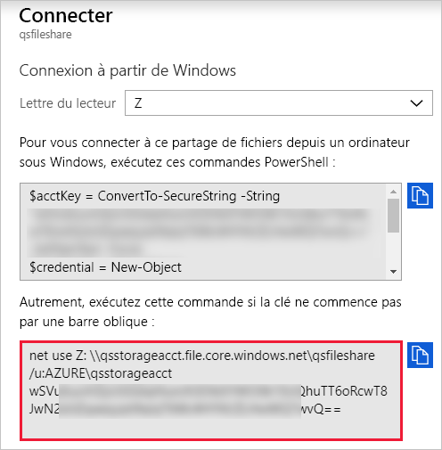

1. Dans la machine virtuelle, ouvrez l’**Explorateur de fichiers** et sélectionnez **Ce PC** dans la fenêtre. Cette sélection change les menus disponibles dans le ruban. Dans le menu **Ordinateur**, sélectionnez **Mapper un lecteur réseau**.
1. Sélectionnez la lettre de lecteur et entrez le chemin d’accès UNC. Si vous avez suivi les suggestions de nommage dans ce guide de démarrage rapide, copiez *\\qsstorageacct.file.core.windows.net\qsfileshare* à partir du **Bloc-notes**.

   Vérifiez que les deux cases sont cochées.

   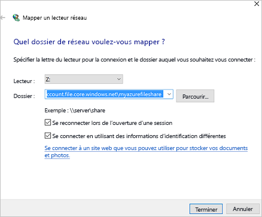

1. Sélectionnez **Terminer**.
1. Dans la boîte de dialogue **Sécurité Windows** :

   - À partir du Bloc-notes, copiez le nom du compte de stockage avec le préfixe AZURE\ et collez-le dans la boîte de dialogue **Sécurité Windows** comme nom d’utilisateur. Si vous avez suivi les suggestions de nommage dans ce guide de démarrage rapide, copiez *AZURE\qsstorageacct*.
   - À partir du Bloc-notes, copiez la clé du compte et collez-la dans la boîte de dialogue **Sécurité Windows** comme mot de passe.

      

## Créer un instantané de partage

Maintenant que vous avez mappé le lecteur, vous pouvez créer un instantané.

1. Dans le portail, accédez à votre partage de fichiers et sélectionnez **Créer un instantané**.

   

1. Dans la machine virtuelle, ouvrez *qstestfile.txt*, tapez « ce fichier a été modifié », puis enregistrez et fermez le fichier.
1. Créez un autre instantané.

## Parcourir un instantané de partage

1. Dans votre partage de fichiers, sélectionnez **Afficher les instantanés**.
1. Dans le volet **Instantanés de partage de fichiers**, sélectionnez le premier instantané dans la liste.

   

1. Dans le volet de cet instantané, sélectionnez *qsTestFile.txt*.

## Restaurer à partir d’un instantané

1. Dans le panneau de la capture instantanée du partage de fichiers, cliquez avec le bouton droit sur *qsTestFile*, puis sélectionnez le bouton **Restaurer**.
1. Sélectionnez **Remplacer le fichier d’origine**.

   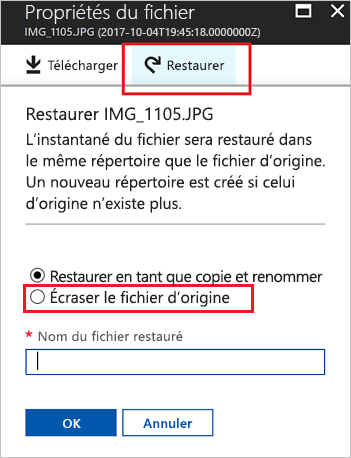

1. Dans la machine virtuelle, ouvrez le fichier. La version non modifiée a été restaurée.

## Supprimer un instantané de partage

1. Dans votre partage de fichiers, sélectionnez **Afficher les instantanés**.
1. Dans le volet **Instantanés de partage de fichiers**, sélectionnez le dernier instantané dans la liste, puis cliquez sur **Supprimer**.

   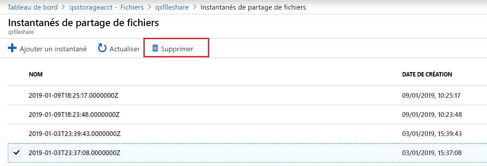

## Utiliser un instantané de partage dans Windows

Comme pour les instantanés VSS locaux, vous pouvez afficher les instantanés à partir de votre partage de fichiers Azure monté à l’aide de l’onglet Versions précédentes.

1. Dans l’Explorateur de fichiers, recherchez le partage monté.

   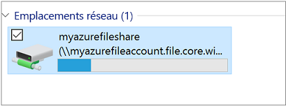

1. Sélectionnez *qsTestFile.txt*, faites un clic droit, puis sélectionnez **Propriétés** dans le menu.

   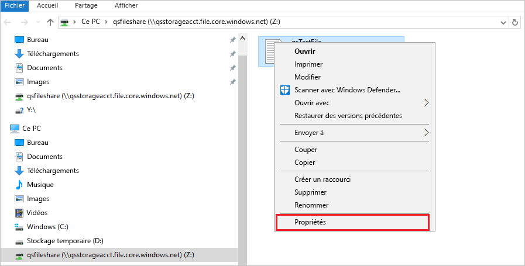

1. Sélectionnez **Versions précédentes** pour afficher la liste des instantanés de partage pour ce répertoire.

1. Sélectionnez **Ouvrir** pour ouvrir l’instantané.

   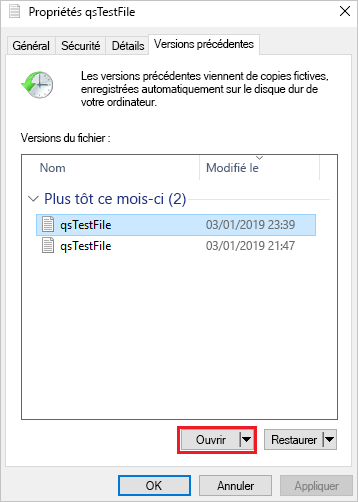

## Restaurer à partir d’une version précédente

1. Sélectionnez **Restaurer**. Cette action copie le contenu de l’ensemble du répertoire de manière récursive à l’emplacement d’origine au moment de la création de l’instantané de partage.

   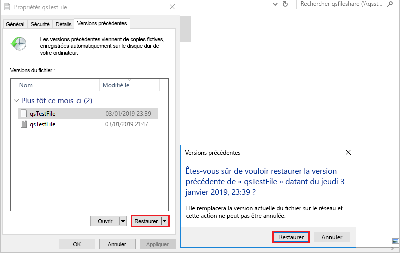 Remarque : Si votre fichier n’a pas changé, vous ne verrez pas une version précédente de ce fichier, car ce fichier est de la même version que l’instantané. Ceci est cohérent avec la façon dont cela fonctionne sur un serveur de fichiers Windows.

## Nettoyer les ressources

[!INCLUDE [storage-files-clean-up-portal](../../../includes/storage-files-clean-up-portal.md)]

## Étapes suivantes

> [!div class="nextstepaction"]
> [Utiliser un partage de fichiers Azure avec Windows](storage-how-to-use-files-windows.md)
