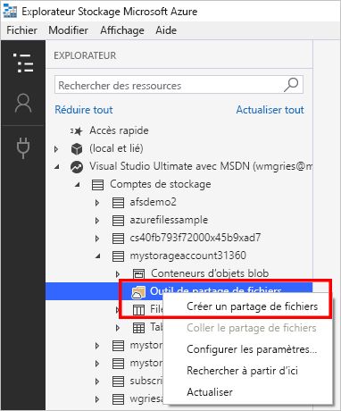
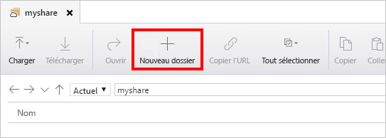

# Gestion des partages de fichiers Azure avec l’Explorateur Stockage Azure 
[Azure Files](storage-files-introduction.md) est le système de fichiers cloud facile à utiliser de Microsoft. Ce guide vous explique les bases de l’utilisation du partage de fichiers avec l’[Explorateur Stockage Azure](https://azure.microsoft.com/features/storage-explorer/). L’Explorateur Stockage Azure est un outil client répandu, disponible sur Windows, macOs et Linux pour gérer des partages de fichiers Azure et d’autres ressources de stockage.

Pour exécuter ce guide de démarrage rapide, vous devez posséder une instance installée de l’Explorateur Stockage Azure. Si vous devez l’installer, accédez à [Explorateur Stockage Azure](https://azure.microsoft.com/features/storage-explorer/) afin de le télécharger.

Dans cet article, vous apprendrez comment :

> [!div class="checklist"]
> * Créer un groupe de ressources et un compte de stockage
> * Crée un partage de fichiers Azure 
> * Créer un répertoire
> * Charger un fichier
> * Téléchargement d’un fichier
> * Créer et utiliser un instantané de partage

Si vous n’avez pas d’abonnement Azure, vous pouvez créer un [compte gratuit](https://azure.microsoft.com/free/?WT.mc_id=A261C142F) avant de commencer.

## Créez un compte de stockage.
L’Explorateur Stockage Azure ne permet pas de créer des ressources. Dans le cadre de cette démonstration, créez le compte de stockage avec le [portail Azure](https://portal.azure.com/). 

[!INCLUDE [storage-files-create-storage-account-portal](../../../includes/storage-files-create-storage-account-portal.md)]

## Connexion de l’Explorateur Stockage Azure aux ressources Azure
Au premier lancement, la fenêtre **Explorateur Stockage Microsoft Azure - Se connecter** s’affiche. L’Explorateur Stockage Azure offre de nombreuses façons de se connecter à des comptes de stockage : 

- **Connexion via votre compte Azure** : vous permet de vous connecter avec les identifiants de connexion utilisateur de votre organisation ou de votre compte Microsoft. 
- **Se connecter à un compte de stockage spécifique avec une chaîne de connexion ou un jeton SAS** : une chaîne de connexion est une chaîne spéciale contenant le nom du compte de stockage et la clé du compte de stockage/jeton SAS qui permet à l’Explorateur Stockage Azure d’accéder directement au compte de stockage (plutôt que de juste voir tous les comptes de stockage au sein d’un compte Azure). Pour plus d’informations sur les chaînes de connexion, consultez [Configuration des chaînes de connexion du Stockage Azure](../common/storage-configure-connection-string.md?toc=%2fazure%2fstorage%2ffiles%2ftoc.json).
- **Se connecter à un compte de stockage spécifique avec un nom et une clé de compte de stockage** : utilisez le nom et la clé du compte de stockage de votre compte pour vous connecter au Stockage Azure.

Dans le cadre de ce guide de démarrage rapide, connectez-vous avec votre compte Azure. Sélectionnez **Ajouter un compte Azure**, puis cliquez sur **Connexion**. Suivez les instructions de connexion à votre compte Azure qui s’affichent à l’écran.

### Créer un partage de fichiers
Pour créer votre premier partage de fichiers Azure au sein du compte de stockage *storageacct<random number>* :

1. Développez le compte de stockage que vous avez créé.
2. Cliquez avec le bouton droit sur **Partages de fichiers** et sélectionnez **Créer un partage de fichier**.  
    

3. Saisissez *myshare* pour le partage de fichiers et appuyez sur **Entrée**.

> [!Important]  
> Le nom des partages ne doit contenir que des minuscules, des nombres et des traits d’union uniques, mais ne peut commencer par un trait d’union. Pour plus d’informations sur la façon de nommer des partages de fichiers et des fichiers, consultez la rubrique [Affectation de noms et références aux partages, répertoires, fichiers et métadonnées](https://docs.microsoft.com/rest/api/storageservices/Naming-and-Referencing-Shares--Directories--Files--and-Metadata).

Une fois le partage de fichiers créé, le volet droit ouvre un onglet pour votre partage de fichiers. 

## Manipulation du contenu du partage de fichiers Azure
Maintenant que vous avez créé un partage de fichiers Azure, vous pouvez monter le partage de fichiers avec SMB sur [Windows](storage-how-to-use-files-windows.md), [Linux](storage-how-to-use-files-linux.md) ou [macOS](storage-how-to-use-files-mac.md). Vous pouvez également manipuler votre partage de fichiers avec le portail Azure. Toutes les requêtes faites via le portail Azure sont faites avec l’API REST File, ce qui vous permet de créer, modifier et supprimer des fichiers et répertoires sur des clients sans accès SMB.

### Créer un répertoire
L’ajout d’un répertoire fournit une structure hiérarchique pour gérer votre partage de fichiers. Vous pouvez créer plusieurs niveaux, mais avant de créer un sous-répertoire, vous devez vous assurer que tous les répertoires parents existent. Par exemple, pour le chemin myDirectory/mySubDirectory, vous devez d’abord créer le répertoire *myDirectory*, avant de créer *mySubDirectory*. 

1. Sous l’onglet du partage de fichiers, dans le menu supérieur, cliquez sur le bouton **+ Nouveau dossier**. La page **Créer un nouveau répertoire** s’ouvre.
    

2. Saisissez *myDirectory* comme nom et cliquez sur **OK**. 

Le répertoire *myDirectory* sera répertorié sur l’onglet du partage de fichiers *myshare*.

### Charger un fichier 
Chargez un fichier depuis votre ordinateur local vers le nouveau répertoire dans votre partage de fichiers. Vous pouvez charger un dossier entier ou un seul fichier.

1. Dans le menu supérieur, sélectionnez **Charger**. Vous avez alors l’option de charger un dossier ou un fichier.

2. Sélectionnez **Charger un fichier**, et choisissez un fichier à charger dans votre ordinateur local.

3. Dans **Charger vers un répertoire**, saisissez *myDirectory* et cliquez sur **Charger**. 

Une fois terminé, le fichier apparaît dans la liste sur la page **myDirectory**.

### Téléchargement d’un fichier
Vous pouvez télécharger une copie d’un fichier de votre partage de fichiers en cliquant dessus avec le bouton droit et en sélectionnant **Télécharger**. Choisissez où placer le fichier sur votre ordinateur local et cliquez sur **Enregistrer**.

Vous verrez la progression du téléchargement dans le volet **Activités** en bas de la fenêtre.

## Créer et modifier des instantanés de partage
Un instantané conserve une copie d’un point dans le temps d’un partage de fichiers Azure. Les instantanés de partage de fichiers sont similaires à d’autres technologies que vous connaissez peut-être déjà comme :
- Le [service VSS](https://docs.microsoft.com/previous-versions/windows/it-pro/windows-server-2008-R2-and-2008/ee923636) pour les systèmes de fichiers Windows comme NTFS et ReFS.
- Les instantanés du [Gestionnaire de Volume logique (LVM)](https://en.wikipedia.org/wiki/Logical_Volume_Manager_(Linux)#Basic_functionality) pour les systèmes Linux
- Les instantanés du [système de fichiers Apple (APFS)](https://developer.apple.com/library/content/documentation/FileManagement/Conceptual/APFS_Guide/Features/Features.html) pour macOS. 

Pour créer un instantané de partage :

1. Ouvrez l’onglet du partage de fichiers *myshare*.
2. Dans le menu en haut de l’onglet, cliquez sur **Créer un instantané** (l’option peut être cachée derrière **... Plus**, en fonction des dimensions de la fenêtre de l’Explorateur Stockage Azure).  
    

### Répertorier et parcourir les instantanés de partage
Une fois l’instantané créé, vous pouvez cliquer sur **Afficher les instantanés du partage de fichiers** (l’option peut être cachée derrière **... Plus**, en fonction des dimensions de la fenêtre de l’Explorateur Stockage Azure) afin de répertorier les instantanés du partage. Double-cliquez sur un instantané de partage pour le parcourir.

### Restaurer à partir d’un instantané de partage
Pour illustrer la restauration d’un fichier d’un instantané de partage, nous devons d’abord supprimer un fichier du partage de fichiers Azure. Accédez au dossier *myDirectory*, cliquez avec le bouton droit sur le fichier chargé et cliquez sur **Supprimer**. Ensuite, pour restaurer ce fichier depuis l’instantané de partage :

1. Cliquez sur **Afficher les instantanés du partage de fichiers** (l’option peut être cachée derrière **... Plus**, en fonction des dimensions de la fenêtre de l’Explorateur Stockage Azure).
2. Sélectionnez un instantané de partage depuis la liste et double-cliquez dessus pour y accéder.
3. Parcourez l’instantané jusqu’à trouver le fichier supprimé, sélectionnez-le et cliquez sur **Restaurer l’instantané** (l’option peut être cachée derrière **... Plus**, en fonction des dimensions de la fenêtre de l’Explorateur Stockage Azure). Vous recevrez un avertissement disant que la restauration du fichier remplacera le contenu du partage de fichiers, et que l’opération est irréversible. Sélectionnez **OK**.
4. Le fichier doit maintenant avoir retrouvé sa place dans le partage de fichiers Azure.

### Supprimer un instantané de partage
Pour supprimer un instantané de partage, [accédez à la liste des instantanés de partage](#list-and-browse-share-snapshots). Cliquez avec le bouton droit sur l’instantané de partage que vous voulez supprimer, et sélectionnez Supprimer.

## Supprimer des ressources
L’Explorateur Stockage Azure ne permet pas de supprimer des ressources. Vous pouvez supprimer celles de ce guide de démarrage rapide via le [portail Azure](https://portal.azure.com/). 

[!INCLUDE [storage-files-clean-up-portal](../../../includes/storage-files-clean-up-portal.md)]

## Étapes suivantes
- [Gestion des partages de fichiers avec le portail Azure](storage-how-to-use-files-portal.md)
- [Gestion des partages de fichiers avec Azure PowerShell](storage-how-to-use-files-powershell.md)
- [Gestion des partages de fichiers avec Azure CLI](storage-how-to-use-files-cli.md)
- [Planification d’un déploiement Azure Files](storage-files-planning.md)