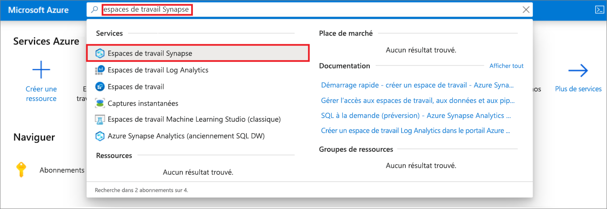
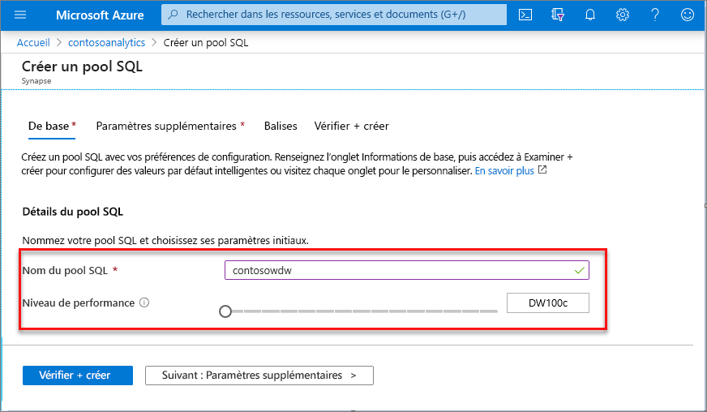
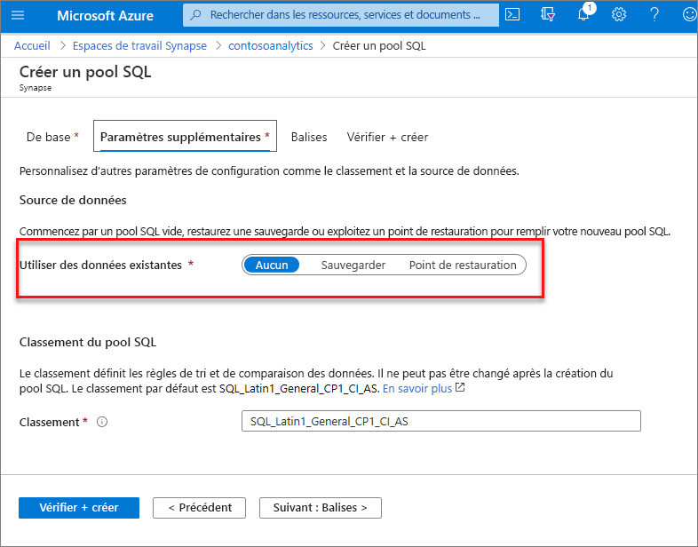
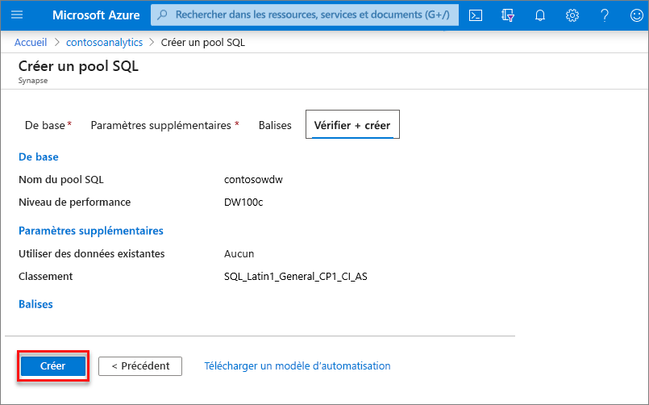
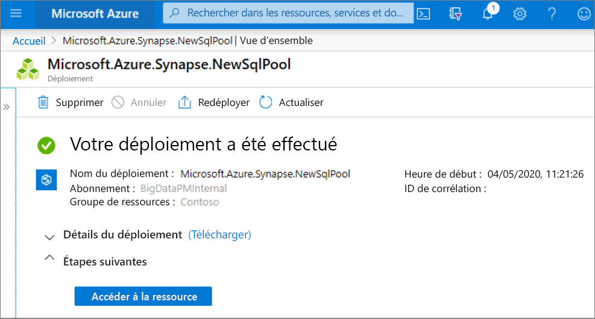
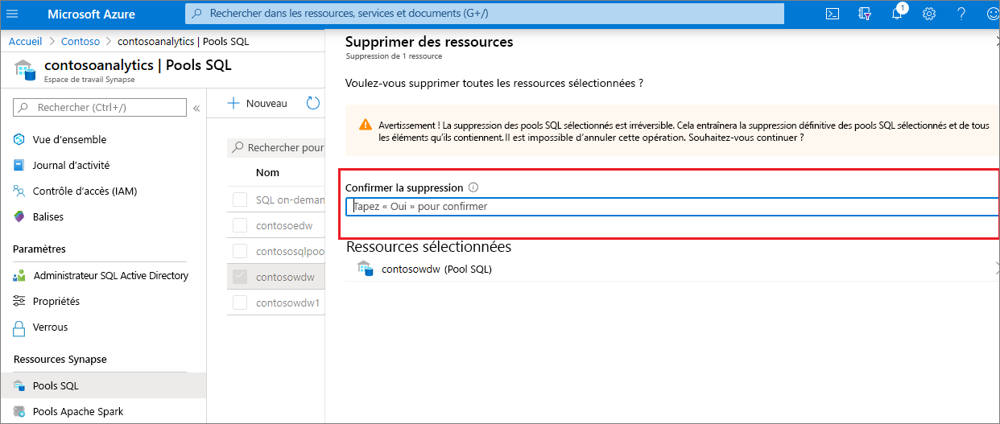

# Démarrage rapide : Créer un pool SQL Synapse (préversion) à l’aide du portail Azure

Azure Synapse Analytics propose différents moteurs d’analytique pour vous aider à ingérer, transformer, modéliser et analyser vos données. Un pool SQL offre des fonctionnalités de calcul et de stockage basées sur T-SQL. Après avoir créé un pool SQL dans votre espace de travail Synapse, vous pouvez charger, modéliser, traiter et distribuer les données pour obtenir plus rapidement des insights.

Dans ce guide de démarrage rapide, vous allez apprendre à créer un pool SQL dans un espace de travail Synapse à l’aide du portail Azure.

Si vous n’avez pas d’abonnement Azure, [créez un compte gratuit avant de commencer](https://azure.microsoft.com/free/).

## Prérequis

- Abonnement Azure : [créez-en un gratuitement](https://azure.microsoft.com/free/)
- [Espace de travail Synapse](./quickstart-create-workspace.md)

## Connectez-vous au portail Azure.

Connectez-vous au [portail Azure](https://portal.azure.com/)

## Accéder à l’espace de travail Synapse

1. Accédez à l’espace de travail Synapse dans lequel vous allez créer le pool SQL en saisissant le nom du service (ou directement le nom de la ressource) dans la barre de recherche.
. 
1. Dans la liste des espaces de travail, saisissez le nom (ou une partie du nom) de l’espace de travail à ouvrir. Pour cet exemple, nous allons utiliser un espace de travail nommé **contosoanalytics**.

## Créer un pool SQL

1. Dans l’espace de travail Synapse où vous souhaitez créer le pool SQL, sélectionnez **Nouveau pool SQL** dans la barre supérieure.

2. Sous l’onglet **Informations de base**, entrez ce qui suit :

    | Paramètre | Valeur suggérée | Description |
    | :------ | :-------------- | :---------- |
    | **Nom du pool SQL** | Nom valide | Nom du pool SQL. |
    | **Niveau de performances** | DW100c | Plus petite taille définie pour réduire les coûts de ce guide de démarrage rapide |

  
    
    > [!IMPORTANT]
    > Notez que les noms que vous pouvez attribuer aux pools SQL sont soumis à des limitations spécifiques. Les noms ne peuvent pas contenir de caractères spéciaux, ne doivent pas dépasser 15 caractères, ne doivent pas contenir de mots réservés et doivent être uniques dans l’espace de travail.

3. Sélectionnez **Suivant : Paramètres supplémentaires**.
4. Sélectionnez **Aucune** pour provisionner le pool SQL sans données. Laissez le classement par défaut tel quel.

5. Sélectionnez **Revoir + créer**.
6. Vérifiez que les informations reflètent bien ce que vous avez entré. Sélectionnez **Create** (Créer).

7. À ce stade, le flux de provisionnement des ressources démarre.
 

8. Quand vous revenez à l’espace de travail au terme du provisionnement, une entrée apparaît pour le pool SQL nouvellement créé.
 

Une fois le pool SQL créé, vous pouvez l’utiliser dans l’espace de travail pour charger des données, traiter des flux, lire dans le lac, etc.

## Nettoyer les ressources

Effectuez les étapes ci-dessous pour supprimer le pool SQL de l’espace de travail.
> [!WARNING]
> Le fait de supprimer un pool SQL supprime à la fois le moteur d’analytique et les données stockées dans la base de données du pool SQL supprimé de l’espace de travail. Il n’est plus possible de se connecter au pool SQL, et l’ensemble des requêtes, pipelines et notebooks qui lisent ou écrivent dans ce pool SQL ne fonctionnent plus.

Si vous souhaitez supprimer le pool SQL, effectuez les étapes suivantes :

1. Accédez au panneau des pools SQL du panneau de l’espace de travail.
1. Sélectionnez le pool SQL à supprimer (dans ce cas, **contosowdw**)
1. Une fois le pool sélectionné, appuyez sur **Supprimer**
1. Confirmez la suppression, puis appuyez sur le bouton **Supprimer** 
1. À la fin du processus, le pool SQL ne figure plus dans la liste des ressources de l’espace de travail.

## Étapes suivantes

- Consultez [Démarrage rapide : Créer un pool Apache Spark dans Synapse Studio à l’aide des outils web](quickstart-apache-spark-notebook.md).
- Consultez [Démarrage rapide : Créer un pool Apache Spark à l’aide du portail Azure](quickstart-create-apache-spark-pool-portal.md).
