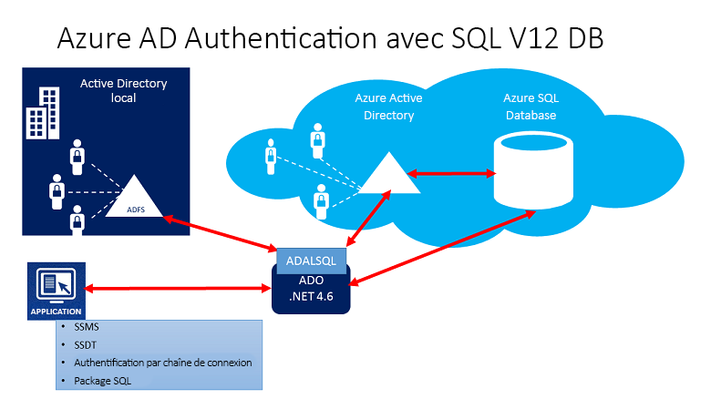
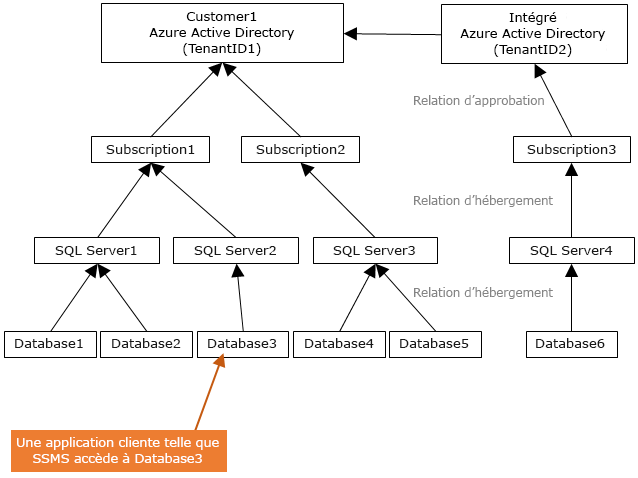
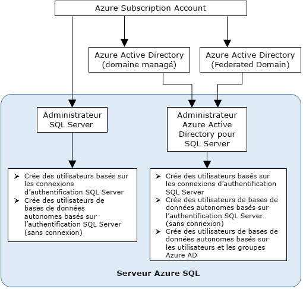

# Utiliser l’authentification Azure Active Directory pour l’authentification auprès de Synapse SQL

L’authentification Azure Active Directory constitue un mécanisme de connexion à [Azure Synapse Analytics](../overview-faq.md) en utilisant des identités dans Azure AD (Azure Active Directory).

Avec l’authentification Azure AD, vous pouvez gérer de manière centralisée les identités des utilisateurs ayant accès à Azure Synapse pour simplifier la gestion des autorisations. Les avantages suivants sont inclus :

- Elle fournit une alternative à l’authentification par nom d’utilisateur et mot de passe standard.
- Elle permet de bloquer la prolifération des identités utilisateur sur plusieurs serveurs.
- Permet une rotation du mot de passe dans un emplacement unique.
- Les clients peuvent gérer les autorisations à l’aide de groupes (Azure AD) externes.
- Il peut éliminer le stockage des mots de passe en activant l’authentification intégrée Windows et les autres formes d’authentification prises en charge par Azure Active Directory.
- Azure AD prend en charge l’authentification basée sur des jetons pour les applications se connectant à Azure Synapse.
- L’authentification Azure AD prend en charge ADFS (fédération de domaine) ou l’authentification utilisateur natif/mot de passe pour un répertoire Azure Active Directory local sans synchronisation du domaine.
- Azure AD prend en charge les connexions à partir de SQL Server Management Studio qui utilisent l’authentification universelle Active Directory, et notamment Multi-Factor Authentication (MFA).  MFA comprend une authentification forte avec une gamme d’options de vérification simples (appel téléphonique, SMS, cartes à puce avec code PIN ou notification d’application mobile). Pour plus d’informations, consultez [Prise en charge de SSMS pour Azure AD MFA avec Synapse SQL](mfa-authentication.md).
- Azure AD prend en charge des connexions similaires à partir de SQL Server Data Tools (SSDT) qui utilisent l’authentification interactive Active Directory. Pour plus d’informations, consultez [Prise en charge d’Azure Active Directory dans SQL Server Data Tools (SSDT)](/sql/ssdt/azure-active-directory?toc=/azure/synapse-analytics/toc.json&bc=/azure/synapse-analytics/breadcrumb/toc.json&view=azure-sqldw-latest).

Les étapes de configuration incluent les procédures suivantes pour configurer et utiliser l’authentification Azure Active Directory.

1. Créer et renseigner Azure AD.
2. Créer une identité Azure Active Directory
3. Attribuer un rôle à l’identité Azure Active Directory créée dans l’espace de travail Azure Synapse (préversion)
4. Se connecter à Synapse Studio au moyen des identités Azure AD

## Transfert AAD dans Azure Synapse Analytics

Azure Synapse Analytics vous permet d’accéder aux données du lac de données à l’aide de votre identité Azure Active Directory.

Définir des droits d’accès sur les fichiers et les données qui sont respectées dans différents moteurs de données vous permet de simplifier vos solutions de lac de données en utilisant un emplacement unique où les autorisations sont définies, plutôt que de devoir les définir dans plusieurs emplacements.

## Architecture d’approbation

Le diagramme général suivant résume l’architecture de la solution utilisant l’authentification Azure AD avec Synapse SQL. Pour prendre en charge les mots de passe d’utilisateurs natifs d’Azure AD, seuls la partie cloud et Azure AD/Synapse SQL sont pris en considération. Pour prendre en charge l’authentification fédérée (ou utilisateur/mot de passe pour les informations d’identification Windows), la communication avec le bloc ADFS est requise. Les flèches indiquent les voies de communication.

Le diagramme suivant indique la fédération, l’approbation et les relations d’hébergement qui autorisent un client à se connecter à une base de données en soumettant un jeton. Le jeton est authentifié par une instance Azure AD, et approuvé par la base de données. 

Le client 1 peut représenter un répertoire Azure Active Directory avec des utilisateurs natifs ou un répertoire Azure AD avec des utilisateurs fédérés. Le client 2 représente une solution possible incluant des utilisateurs importés, qui dans cet exemple proviennent d’un répertoire Azure Active Directory fédéré avec la synchronisation d’ADFS avec Azure Active Directory. 

Il est important de comprendre que l’accès à une base de données à l’aide de l’authentification Azure AD exige que l’abonnement d’hébergement soit associé à Azure AD. Le même abonnement doit être utilisé pour créer le serveur SQL Server hébergeant la base de données Azure SQL ou le pool SQL.

## Structure de l’administrateur

En cas d’utilisation de l’authentification Azure AD, il existe deux comptes administrateur pour l’instance Synapse SQL ; l’administrateur SQL Server d’origine et l’administrateur Azure AD. Seul l’administrateur basé sur un compte Azure AD peut créer le premier utilisateur de la base de données autonome Azure AD dans une base de données utilisateur. 

La connexion d’administrateur Azure AD peut être un utilisateur Azure AD ou un groupe Azure AD. Lorsque l’administrateur est un compte de groupe, il peut être utilisé par n’importe quel membre du groupe, autorisant plusieurs administrateurs Azure AD à accéder à l’instance Synapse SQL. 

L’utilisation d’un compte de groupe en tant qu’administrateur facilite la gestion en vous permettant de centraliser l’ajout et la suppression des membres du groupe dans Azure AD, sans modifier les utilisateurs ou les autorisations dans l’espace de travail Synapse Analytics. Seul un administrateur Azure AD (utilisateur ou groupe) peut être configuré à tout moment.

## Autorisations

Pour créer de nouveaux utilisateurs, vous devez disposer de l’autorisation `ALTER ANY USER` dans la base de données. L’autorisation `ALTER ANY USER` peut être octroyée à un utilisateur de base de données. L’autorisation `ALTER ANY USER` est également détenue par les comptes d’administrateur de serveur et les utilisateurs de base de données avec les autorisations `CONTROL ON DATABASE` ou `ALTER ON DATABASE` pour cette base de données et par les membres du rôle de base de données `db_owner`.

Pour créer un utilisateur de base de données autonome dans Synapse SQL, vous devez vous connecter à la base de données ou à l’instance à l’aide d’une identité Azure AD. Pour créer le premier utilisateur de la base de données autonome, vous devez vous connecter à la base de données à l’aide d’un administrateur Azure AD (le propriétaire de la base de données). 

L’authentification Azure AD n’est possible que si l’administrateur Azure AD a été créé pour Synapse SQL. Si l’administrateur Azure Active Directory a été supprimé du serveur, les utilisateurs Azure Active Directory existants créés précédemment dans Synapse SQL ne peuvent plus se connecter à la base de données à l’aide de leurs informations d’identification Azure Active Directory.
 
## Limitations et fonctionnalités azure AD

- Les membres suivants d’Azure AD peuvent être provisionnés dans Synapse SQL :

  - Membre natif : membre créé dans Azure AD dans le domaine géré ou le domaine client. Pour plus d’informations, consultez [Ajout de votre nom de domaine personnalisé à Azure AD](../../active-directory/fundamentals/add-custom-domain.md?toc=/azure/synapse-analytics/toc.json&bc=/azure/synapse-analytics/breadcrumb/toc.json).
  - Membre de domaine fédéré : membre créé dans Azure AD avec un domaine fédéré. Pour plus d’informations, consultez [Microsoft Azure prend désormais en charge la fédération avec Windows Server Active Directory](https://azure.microsoft.com/blog/20../../windows-azure-now-supports-federation-with-windows-server-active-directory/).
  - Membres importés à partir d’autres répertoires Azure AD qui sont des membres natifs ou de domaine fédéré.
  - Groupes Active Directory créés en tant que groupes de sécurité.

- Les utilisateurs Azure AD qui font partie d’un groupe doté du rôle serveur `db_owner` ne peuvent pas utiliser la syntaxe **[CREATE DATABASE SCOPED CREDENTIAL](/sql/t-sql/statements/create-database-scoped-credential-transact-sql?toc=/azure/synapse-analytics/toc.json&bc=/azure/synapse-analytics/breadcrumb/toc.json&view=azure-sqldw-latest)** dans Synapse SQL. Vous voyez l’erreur suivante :

    `SQL Error [2760] [S0001]: The specified schema name 'user@mydomain.com' either does not exist or you do not have permission to use it.`

    Accordez le rôle `db_owner` directement à l’utilisateur Azure AD individuel pour atténuer le problème lié à **CREATE DATABASE SCOPED CREDENTIAL**.

- Ces fonctions système retournent des valeurs NULL lors de leur exécution sous des entités Azure AD :

  - `SUSER_ID()`
  - `SUSER_NAME(<admin ID>)`
  - `SUSER_SNAME(<admin SID>)`
  - `SUSER_ID(<admin name>)`
  - `SUSER_SID(<admin name>)`

## Connexion à l’aide des identités Azure AD

L’authentification Azure Active Directory prend en charge les méthodes suivantes de connexion à une base de données à l’aide d’identités Azure AD :

- Mot de passe Azure Active Directory
- Intégration d’Azure Active Directory
- Authentification universelle Azure Active Directory avec MFA
- À l’aide de l’authentification par jeton d’application

Les méthodes d’authentification suivantes sont prises en charge pour les principaux de serveur (connexions) Azure AD (**préversion publique**) :

- Mot de passe Azure Active Directory
- Intégration d’Azure Active Directory
- Authentification universelle Azure Active Directory avec MFA

### Considérations supplémentaires

- Pour améliorer la facilité de gestion, nous vous conseillons de mettre en service un groupe Azure AD dédié en tant qu’administrateur.
- Seul un administrateur Azure AD (utilisateur ou groupe) peut être configuré à tout moment pour un pool Synapse SQL.
  - L’ajout de principaux de serveur (connexions) Azure AD pour SQL à la demande (préversion) permet de créer plusieurs principaux de serveur (connexions) Azure AD pouvant être ajoutés au rôle `sysadmin`.
- Seul un administrateur Azure AD pour Synapse SQL peut se connecter initialement à l’instance Synapse SQL au moyen d’un compte Azure Active Directory. L’administrateur Active Directory peut configurer les utilisateurs de base de données Azure AD suivants.
- Nous vous conseillons de définir l’expiration du délai de connexion à 30 secondes.
- SQL Server 2016 Management Studio et SQL Server Data Tools pour Visual Studio 2015 (version 14.0.60311.1 d’avril 2016 ou ultérieure) prennent en charge l’authentification Azure Active Directory. (L’authentification Azure AD est prise en charge par le **Fournisseur de données .NET Framework pour SQL Server** ; .NET Framework version 4.6 minimum). Par conséquent, les dernières versions de ces outils et applications de la couche Données (DAC et .bacpac) peuvent utiliser l’authentification Azure AD.
- À partir de la version 15.0.1, l’[utilitaire sqlcmd](/sql/tools/sqlcmd-utility?toc=/azure/synapse-analytics/toc.json&bc=/azure/synapse-analytics/breadcrumb/toc.json&view=azure-sqldw-latest) et l’[utilitaire bcp](/sql/tools/bcp-utility?toc=/azure/synapse-analytics/toc.json&bc=/azure/synapse-analytics/breadcrumb/toc.json&view=azure-sqldw-latest) prennent en charge l’authentification interactive Active Directory avec MFA.
- SQL Server Data Tools pour Visual Studio 2015 requiert la version d’avril 2016 (version 14.0.60311.1) ou une version ultérieure. Actuellement, les utilisateurs Azure AD ne sont pas affichés dans l’Explorateur d’objets SSDT. Comme solution de contournement, vous pouvez afficher les utilisateurs dans [sys.database_principals](/sql/relational-databases/system-catalog-views/sys-database-principals-transact-sql?toc=/azure/synapse-analytics/toc.json&bc=/azure/synapse-analytics/breadcrumb/toc.json&view=azure-sqldw-latest).
- Le [pilote Microsoft JDBC 6.0 pour SQL Server](https://www.microsoft.com/download/details.aspx?id=11774) prend en charge l’authentification Azure AD. Consultez également [Définition des propriétés de connexion](/sql/connect/jdbc/setting-the-connection-properties?toc=/azure/synapse-analytics/toc.json&bc=/azure/synapse-analytics/breadcrumb/toc.json&view=azure-sqldw-latest).

## Étapes suivantes

- Pour obtenir une vue d’ensemble de l’accès et du contrôle dans Synapse SQL, consultez [Contrôle d’accès Synapse SQL](../sql/access-control.md).
- Pour en savoir plus sur les principaux de base de données, voir [Principaux](/sql/relational-databases/security/authentication-access/principals-database-engine?toc=/azure/synapse-analytics/toc.json&bc=/azure/synapse-analytics/breadcrumb/toc.json&view=azure-sqldw-latest).
- Pour en savoir plus sur les rôles de base de données, voir [Rôles de base de données](/sql/relational-databases/security/authentication-access/database-level-roles?toc=/azure/synapse-analytics/toc.json&bc=/azure/synapse-analytics/breadcrumb/toc.json&view=azure-sqldw-latest).

 