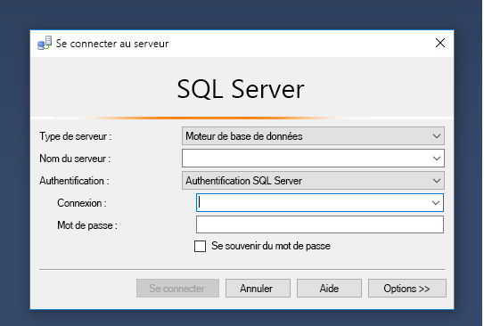
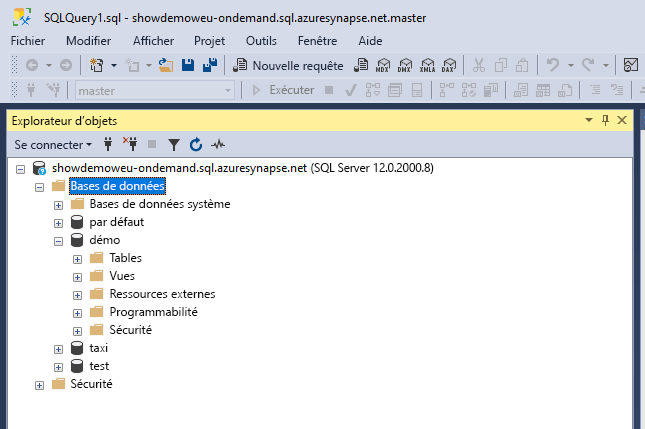
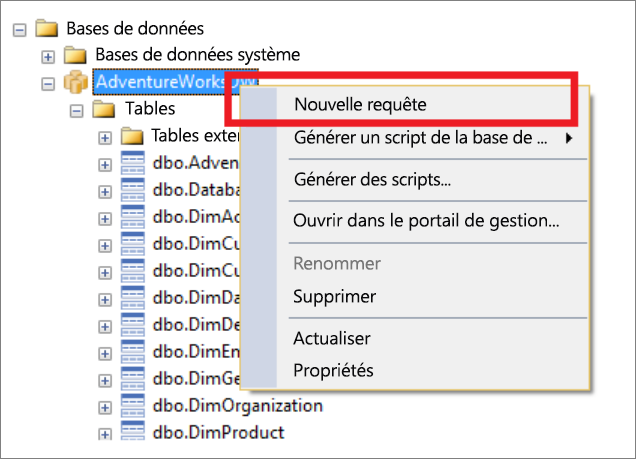
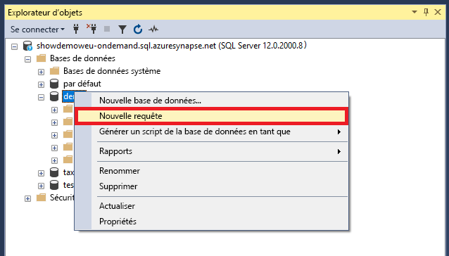

# <a name="connect-to-synapse-sql-with-sql-server-management-studio-ssms"></a>Se connecter à Synapse SQL avec SQL Server Management Studio (SSMS)
> [!div class="op_single_selector"]
> * [Azure Data Studio](get-started-azure-data-studio.md)
> * [Power BI](get-started-power-bi-professional.md)
> * [Visual Studio](../sql-data-warehouse/sql-data-warehouse-query-visual-studio.md?toc=/azure/synapse-analytics/toc.json&bc=/azure/synapse-analytics/breadcrumb/toc.json)
> * [sqlcmd](../sql/get-started-connect-sqlcmd.md)
> * [SSMS](get-started-ssms.md)
> 
> 

Vous pouvez utiliser [SQL Server Management Studio (SSMS)](/sql/ssms/download-sql-server-management-studio-ssms) pour vous connecter à Synapse SQL et l’interroger dans Azure Synapse Analytics par le biais de SQL à la demande (préversion) ou des ressources du pool SQL. 

### <a name="supported-tools-for-sql-on-demand-preview"></a>Outils pris en charge pour SQL à la demande (préversion)

La suite d’outils SSMS est partiellement prise en charge à partir de la version 18.5, avec des fonctionnalités limitées telles que la connexion et l’interrogation. [Azure Data Studio](/sql/azure-data-studio/download-azure-data-studio) est entièrement pris en charge.

## <a name="prerequisites"></a>Prérequis

Avant de commencer, vérifiez que les conditions préalables suivantes sont remplies :  

* [SQL Server Management Studio (SSMS)](/sql/ssms/download-sql-server-management-studio-ssms). 
* Pour le pool SQL, vous avez besoin d’un entrepôt de données existant. Pour en créer un, consultez la page [Créer un pool SQL](../quickstart-create-sql-pool.md). Pour SQL à la demande, un tel entrepôt est déjà provisionné dans votre espace de travail au moment de la création. 
* Le nom complet du serveur SQL Server. Pour le trouver, consultez [Se connecter à Synapse SQL](connect-overview.md).

## <a name="connect"></a>Se connecter

### <a name="sql-pool"></a>Pool SQL

Pour vous connecter à Synapse SQL au moyen d’un pool SQL, suivez ces étapes : 

1. Ouvrez SQL Server Management Studio (SSMS). 
1. Dans la boîte de dialogue **Se connecter au serveur**, renseignez les champs, puis sélectionnez **Se connecter** : 
  
    
   
   * **Nom du serveur** : Saisissez le **nom du serveur** précédemment identifié.
   * **Authentification** :  Choisissez un type d’authentification, tel que **Authentification SQL Server** ou **Authentification intégrée à Active Directory**.
   * **Nom d’utilisateur** et **Mot de passe** : Entrez votre nom d’utilisateur et votre mot de passe si l’authentification SQL Server a été sélectionnée plus haut.

1. Développez votre serveur Azure SQL Server dans l’**Explorateur d’objets**. Vous pouvez afficher les bases de données associées au serveur, telles que l’exemple de base de données AdventureWorksDW. Vous pouvez développer la base de données pour afficher les tables :
   
    


### <a name="sql-on-demand-preview"></a>SQL à la demande (préversion)

Pour vous connecter à Synapse SQL à l’aide de SQL à la demande, suivez ces étapes : 

1. Ouvrez SQL Server Management Studio (SSMS).
1. Dans la boîte de dialogue **Se connecter au serveur**, renseignez les champs, puis sélectionnez **Se connecter** : 
   
    
   
   * **Nom du serveur** : Saisissez le **nom du serveur** précédemment identifié.
   * **Authentification** : Choisissez un type d’authentification, tel que **Authentification SQL Server** ou **Authentification intégrée à Active Directory** :
   * **Nom d’utilisateur** et **Mot de passe** : Entrez votre nom d’utilisateur et votre mot de passe si l’authentification SQL Server a été sélectionnée plus haut.
   * Cliquez sur **Connecter**.

4. Pour voir plus d’informations, développez votre serveur SQL Azure. Vous pouvez afficher les bases de données associées au serveur. Développez la *démonstration* pour voir le contenu dans votre exemple de base de données.
   
    


## <a name="run-a-sample-query"></a>Exécuter un exemple de requête

### <a name="sql-pool"></a>Pool SQL

À présent qu’une connexion de base de données a été établie, vous pouvez interroger les données.

1. Cliquez avec le bouton droit sur votre base de données dans l’Explorateur d’objets SQL Server.
2. Sélectionnez **Nouvelle requête**. Une nouvelle fenêtre de requête s’ouvre.
   
    
3. Copiez la requête T-SQL suivante dans la fenêtre de requête :
   
    ```sql
    SELECT COUNT(*) FROM dbo.FactInternetSales;
    ```
4. Exécute la requête. Pour ce faire, cliquez sur `Execute` ou utilisez le raccourci `F5`.
   
    
5. Passez en revue les résultats de la requête. Dans cet exemple, la table FactInternetSales a 60 398 lignes.
   
    

### <a name="sql-on-demand"></a>SQL à la demande

À présent que vous avez établi une connexion de base de données, vous pouvez interroger les données.

1. Cliquez avec le bouton droit sur votre base de données dans l’Explorateur d’objets SQL Server.
2. Sélectionnez **Nouvelle requête**. Une nouvelle fenêtre de requête s’ouvre.
   
    
3. Copiez la requête T-SQL suivante dans la fenêtre de requête :
   
    ```sql
    SELECT COUNT(*) FROM demo.dbo.usPopulationView
    ```
4. Exécute la requête. Pour ce faire, cliquez sur `Execute` ou utilisez le raccourci `F5`.
   
    
5. Passez en revue les résultats de la requête. Dans cet exemple, la vue usPopulationView contient 3664512 lignes.
   
    

## <a name="next-steps"></a>Étapes suivantes
Maintenant que vous pouvez vous connecter et exécuter des requêtes, essayez de [visualiser les données avec Power BI](get-started-power-bi-professional.md).

Afin de configurer votre environnement pour l’authentification Azure Active Directory, consultez [S’authentifier auprès de Synapse SQL](../sql-data-warehouse/sql-data-warehouse-authentication.md?toc=/azure/synapse-analytics/toc.json&bc=/azure/synapse-analytics/breadcrumb/toc.json).

