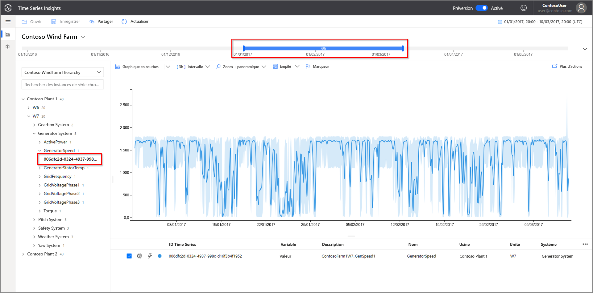
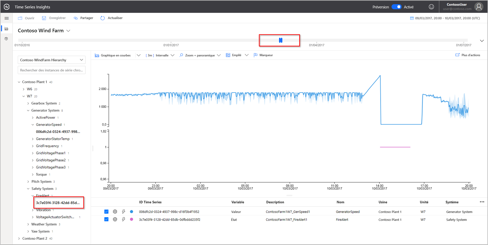
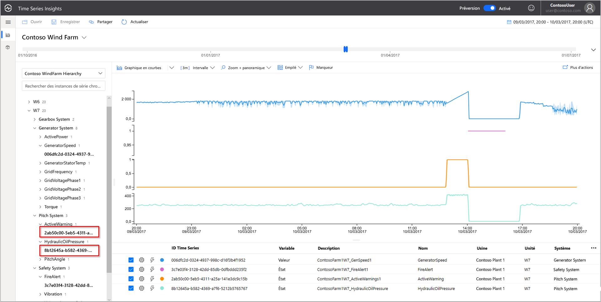
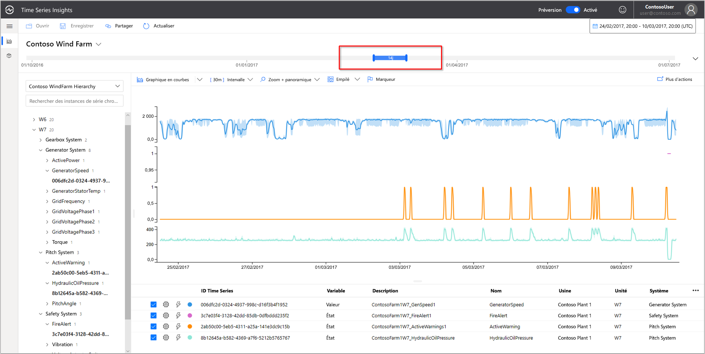
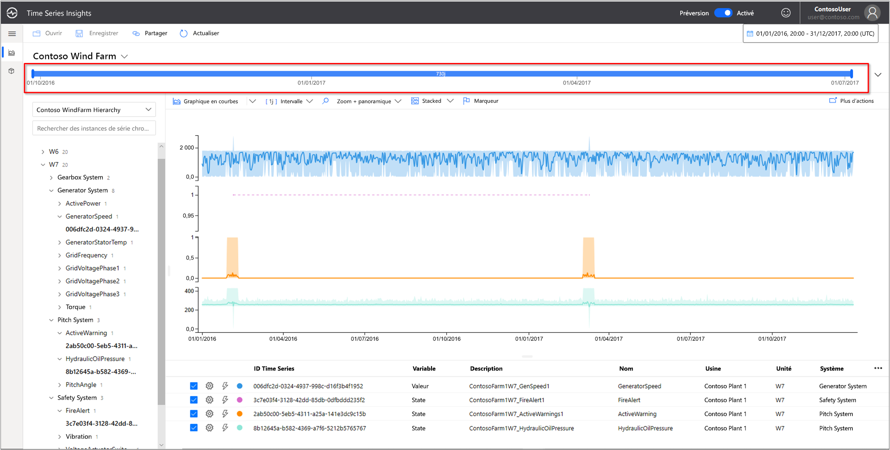
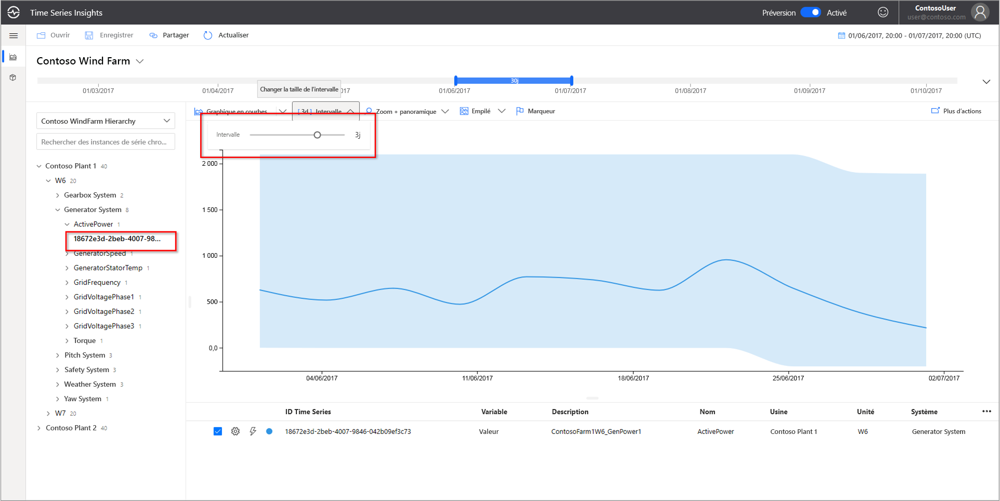
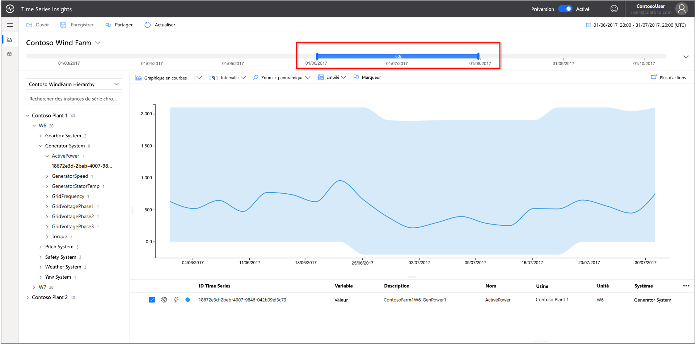
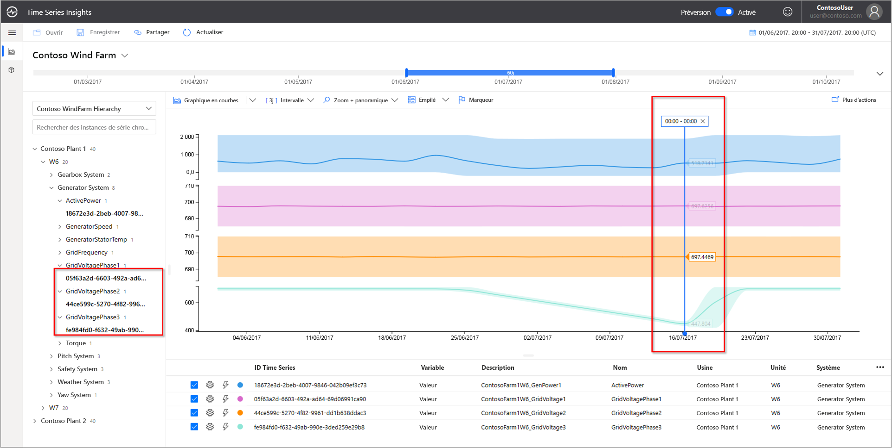
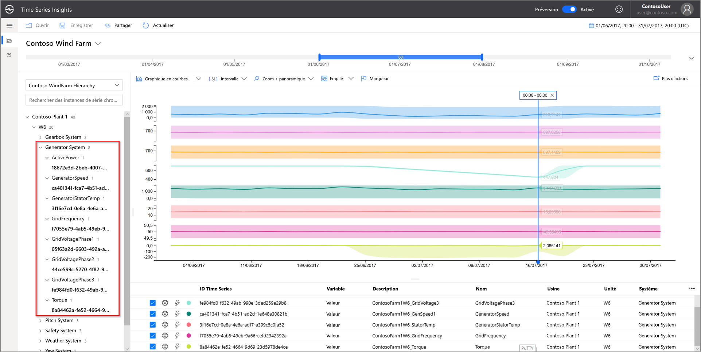

# Démarrage rapide : Explorer l’environnement de démonstration Azure Time Series Insights Gen2

Ce démarrage rapide vous permet de vous familiariser avec un environnement Azure Time Series Insights Gen2. La démonstration gratuite vous permet de découvrir les fonctionnalités clés qui ont été ajoutées à Azure Time Series Insights Gen2.

L’environnement de démonstration Azure Time Series Insights Gen2 contient une société fictive, Contoso, qui exploite deux parcs éoliens. Chaque parc contient 10 éoliennes. chacune dotée de 20 capteurs qui transmettent des données toutes les minutes à Azure IoT Hub. Les capteurs collectent des informations sur les conditions météorologiques, le pas des pales et la position de lacet. Ils capturent également des donnés sur les performances de la génératrice, le comportement du multiplicateur et les moniteurs de sécurité.

Ce démarrage rapide explique comment utiliser Azure Time Series Insights Gen2 pour rechercher des insights actionnables dans les données de Contoso. Vous allez également effectuer une brève analyse des causes racines pour mieux prédire les défaillances critiques et les tâches de maintenance.

> [!IMPORTANT]
> Créez un [compte Azure gratuit](https://azure.microsoft.com/free/?ref=microsoft.com&utm_source=microsoft.com&utm_medium=docs&utm_campaign=visualstudio) si vous n’en avez pas.

## Découvrir l’Explorateur Azure Time Series Insights Gen2 dans un environnement de démonstration

L’Explorateur Azure Time Series Insights Gen2 présente une analyse de données historiques et de cause racine. Pour commencer :

1. Accédez à l’environnement de  [démonstration Contoso Wind Farm](https://insights.timeseries.azure.com/preview/samples).  

1. Si vous y êtes invité, connectez-vous à l’Explorateur Azure Time Series Insights Gen2 à l’aide de vos informations d’identification de compte Azure.

## Utiliser les données d’historique

1. Intéressons-nous à l’éolienne **W7** du parc **Contoso Plant 1**.  

   1. Remplacez la plage d’affichage par **Du 01/01/17 20:00:00.00 au 10/03/17 20:00:00.00 (UTC)** .
   1. Pour sélectionner un capteur, choisissez **Contoso Plant 1** > **W7** > **Generator System** > **GeneratorSpeed**. Ensuite, passez en revue les valeurs qui sont affichées.

      

1. Dernièrement, Contoso a détecté un incendie sur l’éolienne **W7**. Les opinions varient sur ce qui a provoqué l’incendie. Dans Azure Time Series Insights Gen2, le capteur d’alerte incendie qui a été activé au cours de l’incendie est affiché.

   1. Remplacez la plage d’affichage par **Du 09/03/17 20:00:00.00 au 10/03/17 20:00:00.00 (UTC)** .
   1. Sélectionnez **Safety System** > **FireAlert**.

      

1. Passez en revue les autres événements qui se sont produits au moment de l’incendie pour comprendre ce qui s’est passé. Notez l’augmentation de la pression de l’huile et des avertissements actifs avant l’incendie.

   1. Sélectionnez **Pitch System** > **HydraulicOilPressure**.
   1. Sélectionnez **Pitch System** > **ActiveWarning**.

      

1. Notez l’augmentation des capteurs associés à la pression de l’huile et aux avertissements actifs juste avant l’incendie. Développez la série chronologique affichée pour déterminer la présence d’autres signes précurseurs de l’incendie. Les deux capteurs ont fluctué de manière cohérente au fil du temps. Les fluctuations indiquent un modèle persistant et préoccupant.

    * Remplacez la plage d’affichage par **Du 24/02/17 20:00:00.00 au 10/03/17 20:00:00.00 (UTC)** .

      

1. L’examen des deux années de données d’historique révèle un autre événement d’incendie associé à la même fluctuation des capteurs.

    * Modifiez la plage d’affichage sur **01/01/16 au 31/12/17** (toutes les données).

      

Azure Time Series Insights Gen2 et la télémétrie du capteur nous ont permis de découvrir une tendance à long terme dans les données historiques. Avec ces nouveaux insights, nous pouvons :

* Expliquer ce qui s’est réellement passé.
* Corriger le problème.
* Mettre en place de meilleurs systèmes de notification d’alerte.

## Analyse de la cause racine

1. Certains scénarios exigent une analyse sophistiquée pour découvrir des indices dans les données. Sélectionnez l’éolienne **W6** en date du **25/6**.

    1. Remplacez la plage d’affichage par **Du 01/06/17 20:00:00.00 au 01/07/17 20:00:00.00 (UTC)** .
    1. Sélectionnez **Contoso Plant 1** > **W6** > **Safety System** > **VoltageActuatorSwitchWarning**.

       

1. L’avertissement indique un problème au niveau de la tension du générateur. La puissance de sortie totale du générateur se trouve dans les paramètres normaux dans l’intervalle actuel. Si nous augmentons notre intervalle, une autre tendance se dégage. Il se produit une nette baisse.

    1. Supprimez le capteur **VoltageActuatorSwitchWarning**.
    1. Sélectionnez **Generator System** > **ActivePower**.
    1. Modifiez l’intervalle sur **3d**.

       

1. En développant l’intervalle de temps, nous pouvons déterminer si le problème s’est arrêté ou s’il persiste.

    * Faites passer l’intervalle de temps à 60 jours.

      

1. Vous pouvez ajouter d’autres points de données de capteur pour fournir davantage de contexte. Plus il y a de capteurs, plus il est facile de cerner le problème. Nous allons placer un marqueur pour afficher les valeurs réelles. 

    1. Sélectionnez **Generator System**, puis sélectionnez trois capteurs : **GridVoltagePhase1**, **GridVoltagePhase2** et **GridVoltagePhase3**.
    1. Placez un marqueur sur le dernier point de données dans la zone visible.

       

    Deux des capteurs de tension fonctionnent de manière comparable et dans les limites de la normale. Il semble que le capteur **GridVoltagePhase3** soit la cause du problème.

1. Avec l’ajout de données hautement contextuelles, la baisse au niveau de la phase 3 apparaît encore plus comme le problème. Maintenant, nous avons une bonne piste sur la cause de l’avertissement. Nous sommes prêts à signaler le problème à notre équipe de maintenance.  

    * Modifiez l’affichage pour superposer tous les capteurs **Generator System** sur la même échelle de graphique.

      

## Nettoyer les ressources

Maintenant que vous avez suivi le démarrage rapide, nettoyez les ressources que vous avez créées :

1. Dans le menu de gauche du [portail Azure](https://portal.azure.com), sélectionnez **Toutes les ressources**, puis recherchez votre groupe de ressources Azure Time Series Insights Gen2.
1. Vous pouvez supprimer l’intégralité du groupe de ressources (et toutes les ressources qu’il contient) en sélectionnant **Supprimer** ou supprimer chaque ressource individuellement.

## Étapes suivantes

Vous êtes prêt à créer votre propre environnement Azure Time Series Insights Gen2. Pour commencer :

> [!div class="nextstepaction"]
> [Planifier votre environnement Azure Time Series Insights Gen2](time-series-insights-update-plan.md)

Apprenez à utiliser la démonstration et ses fonctionnalités :

> [!div class="nextstepaction"]
> [Explorateur Azure Time Series Insights Gen2](time-series-insights-update-explorer.md)