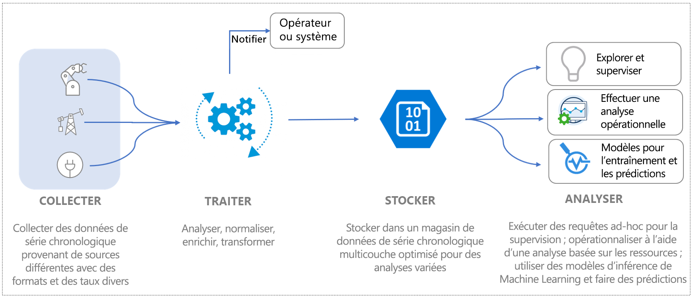
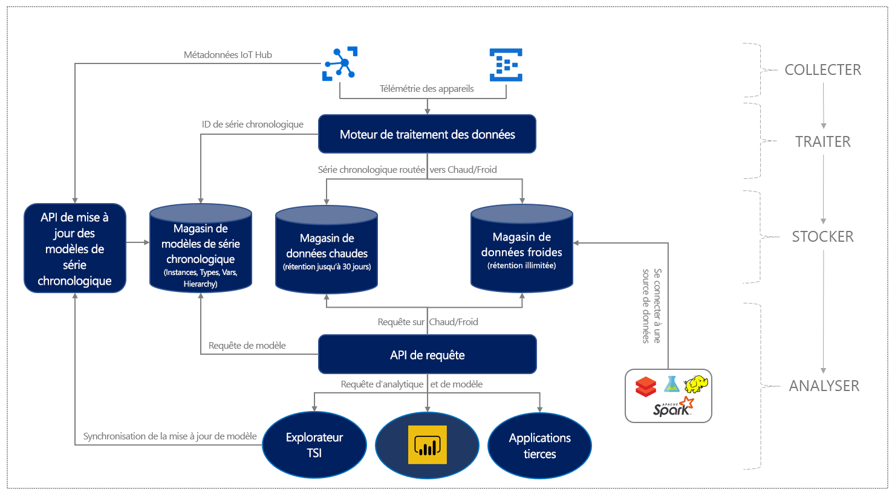

# Qu’est-ce qu’Azure Time Series Insights (préversion) ?

La préversion d’Azure Time Series Insights est une offre PaaS (platform-as-a-service) de bout en bout. Elle est utilisée pour collecter, traiter, stocker, analyser et interroger des données à l’échelle IoT optimisées pour une série chronologique hautement contextualisée. Time Series Insights est idéal pour l’exploration de données ad hoc et l’analyse opérationnelle. Time Series Insights est une offre de service personnalisée et extensible de manière unique qui répond aux besoins étendus des déploiements IoT sectoriels.

> [!TIP]
> Pour les fonctionnalités en disponibilité générale, consultez la [Vue d’ensemble d’Azure Time Series Insights en disponibilité générale](time-series-insights-overview.md).

## Vidéo

### Découvrez Azure Time Series Insights (préversion).  

> [!VIDEO https://channel9.msdn.com/Shows/Internet-of-Things-Show/Azure-Time-Series-Insights-e2e-solution-for-industrial-IoT-analytics/player]

## Définir des données IoT

Les données IoT sont des données « sectorielles » qui se trouvent dans des organisations qui utilisent un nombre considérable de ressources. Les données IoT sont souvent fortement déstructurées car elles sont envoyées à partir de ressources enregistrant des mesures assez bruyantes. Ces mesures incluent la température, le mouvement et l’humidité. Ces flux de données se caractérisent souvent par des lacunes importantes, des messages corrompus et des relevés erronés. Les données de ces flux doivent être nettoyées avant de pouvoir faire l’objet d’une analyse.

Les données IoT sont souvent utiles uniquement dans le contexte d’entrées de données supplémentaires provenant de sources internes, comme CRM ou ERP. Les entrées proviennent également de sources de données tierces, comme la météo ou l’emplacement.

De ce fait, seule une fraction de ces données est utilisée à des fins opérationnelles et commerciales. Ces données sont des sources d’information cohérentes, complètes, actuelles et fiables qui permettent de créer des rapports d’entreprise et de procéder à des analyses. La transformation des données IoT collectées en informations exploitables nécessite :

* Un traitement des données pour nettoyer, filtrer, interpoler, transformer et préparer les données en vue de leur analyse.
* Une structuration des données pour pouvoir les explorer et les comprendre, la normalisation et la contextualisation des données.
* Stocker à peu de frais l’équivalent de plusieurs décennies de données traitées ou dérivées et brutes dans l’optique d’une conservation longue ou infinie.

Un flux de données IoT classique est illustré dans l’image suivante.

  

## Azure Time Series Insights pour l’IoT sectoriel

Le paysage actuel de l’IoT est divers et varié, Les clients couvrent la fabrication, l’industrie automobile, l’énergie, les utilitaires, les bâtiments intelligents et le secteur du conseil. Les scénarios incluent l’exploration de données ad hoc où la forme des données est inconnue. Les scénarios incluent également l’analyse du fonctionnement sur des données schématisées ou explicitement modélisées, pour renforcer l’efficacité. En général, ces scénarios coexistent et supportent différents cas d’usage. Les fonctionnalités de plateforme essentielles à la réussite des entreprises IoT de l’industrie et de leur révolution numérique incluent :

- Le stockage multicouche, chaud et froid.
- La capacité de stocker des dizaines d’années de données de séries chronologiques.
- La possibilité de modéliser explicitement et d’optimiser les requêtes pour l’intelligence opérationnelle basée sur des ressources.

Time Series Insights est une offre PaaS complète, destinée à explorer les données IoT et à tirer des insights opérationnels. Time Series Insights offre un service cloud entièrement géré dédié à l’analyse de données de séries chronologiques IoT.

Vous pouvez stocker des données brutes dans un magasin en mémoire sans schéma. Vous pouvez ensuite effectuer des requêtes ad hoc interactives via un moteur et une API de requête distribuée. Tirer parti de l’expérience utilisateur riche pour visualiser des milliards d’événements en quelques secondes. En savoir plus sur les [fonctionnalités d’exploration de données](./time-series-insights-overview.md).

Time Series Insights propose également des fonctionnalités d’insights opérationnels qui sont pour l’instant disponibles dans une préversion. Grâce à l’exploration de données interactive et à l’intelligence opérationnelle, vous pouvez utiliser Time Series Insights pour mieux exploiter les données collectées auprès des ressources IoT. L’offre de préversion prend en charge :

* Un magasin de données de séries chronologiques scalable et optimisé en termes de performances et de coûts. Cette solution IoT basée sur le cloud peut donner une tendance de données de séries chronologiques portant sur plusieurs années et en seulement quelques secondes.
* Modèle sémantique permettant de décrire le domaine et les métadonnées associés aux signaux dérivés et non dérivés de ressources et d’appareils.
* Expérience utilisateur améliorée qui combine des insights de données basés sur des ressources et des analytiques données détaillées ad hoc. Cette combinaison pousse l’intelligence opérationnelle et de métier.
* Intégration avec des outils avancés d’apprentissage automatique et d’analyse. Ces outils incluent Azure Databricks, Apache Spark, Azure Machine Learning, les notebooks Jupyter et Power BI. Ces outils vous aident à résoudre les défis liés aux données de séries chronologies et améliorent l’efficacité.

L’offre couplée des insights opérationnels et de l’exploration de données obéit à un modèle de paiement à l’utilisation simple pour le traitement, le stockage et l’interrogation de données. Ce modèle de facturation est adapté aux besoins de votre entreprise.

Ce diagramme de flux de données de haut niveau montre les mises à jour.

  

Avec l’introduction de ces fonctionnalités IoT sectorielles clés, Time Series Insights offre les avantages suivants.

| | |
| ---| ---|
| Stockage multicouche pour les données de séries chronologiques IoT | Avec un pipeline de traitement des données courantes pour le traitement de données, vous pouvez stocker des données dans un stockage à chaud pour les requêtes interactives. Vous pouvez également stocker des données dans un stockage à froid pour les gros volumes de données. Tirer parti des [requêtes](./time-series-insights-update-tsq.md) à hautes performances basées sur des ressources. |
| Modèle de séries chronologiques pour la contextualisation des données de télémétrie brutes et la dérivation d’insights basés sur les ressources | Contextualiser des données de télémétrie brutes avec le [modèle de séries chronologiques](./time-series-insights-update-tsm.md) descriptif. Dériver une intelligence opérationnelle riche avec des requêtes basées sur les appareils qui sont hautement performantes et économiques. |
| Intégration fluide et continue à d’autres solutions de données | Les données dans Time Series Insights sont [stockées](./time-series-insights-update-storage-ingress.md) dans des fichiers Apache Parquet open source. Cette intégration avec d’autres solutions de données, premières parties ou tierces, est facile pour les scénarios de bout en bout. Ces scénarios incluent l’aide à la décision, l’apprentissage profond avancé et l’analyse prédictive. |
| Exploration de données en quasi temps réel | L’expérience utilisateur de [l’explorateur de la préversion d’Azure Time Series Insights](./time-series-insights-update-explorer.md) permet de visualiser toutes les données diffusées en continu via le pipeline d’ingestion. Peu de temps après la connexion à une source d’événement, vous pouvez afficher, explorer et interroger des données d’événements. De cette façon, vous pouvez vérifier si un appareil émet des données comme prévu. Vous pouvez également surveiller l’intégrité, la productivité et l’efficacité globale d’une ressource IoT. |
| Analyse de la cause première et détection des anomalies | [L’explorateur de la préversion d’Azure Time Series Insights](./time-series-insights-update-explorer.md) prend en charge des modèles et des vues de perspective pour effectuer et enregistrer des analyses des causes racine à plusieurs étapes. Vous pouvez combiner Time Series Insights et Azure Stream Analytics pour détecter les alertes et les anomalies en quasi temps réel. |
| Applications personnalisées créées sur la plateforme Time Series Insights | Time Series Insights prend en charge le [kit SDK JavaScript](https://github.com/microsoft/tsiclient/blob/master/docs/API.md). Le kit SDK fournit des contrôles complets et un accès simplifié aux requêtes. Utilisez le kit SDK afin de créer des applications IoT personnalisées sur Time Series Insights et répondant à vos besoins professionnels spécifiques. Vous pouvez également utiliser les [API de requête](./time-series-insights-update-tsq.md) Time Series Insights directement pour intégrer directement des données dans des applications IoT personnalisées. |

## Étapes suivantes

Prenez en main Azure Time Series Insights (préversion) :

> [!div class="nextstepaction"]
> [Lire le guide de démarrage rapide](./time-series-insights-update-quickstart.md)

Découvrez les cas d’utilisation :

> [!div class="nextstepaction"]
> [Cas d’utilisation de la préversion d’Azure Time Series Insights](./time-series-insights-update-use-cases.md)
