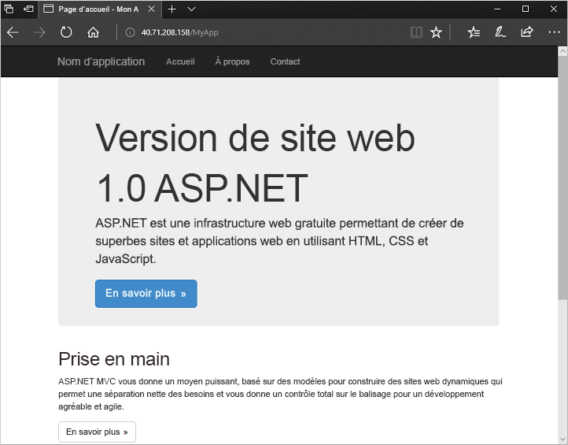

# <a name="quickstart-create-a-virtual-machine-scale-set-with-azure-powershell"></a>Démarrage rapide : créer un groupe de machines virtuelles identiques à l’aide d’Azure PowerShell
Un groupe de machines virtuelles identiques vous permet de déployer et de gérer un ensemble de machines virtuelles identiques prenant en charge la mise à l’échelle automatique. Vous pouvez mettre à l’échelle manuellement le nombre de machines virtuelles du groupe identique ou définir des règles de mise à l’échelle automatique en fonction de l’utilisation des ressources telles que l’UC, la demande de mémoire ou le trafic réseau. Un équilibreur de charge Azure distribue ensuite le trafic vers les instances de machine virtuelle du groupe identique. Dans cet article de démarrage rapide, vous créez un groupe de machines virtuelles identiques et déployez un exemple d’application avec Azure PowerShell.

Si vous n’avez pas d’abonnement Azure, créez un [compte gratuit](https://azure.microsoft.com/free/?WT.mc_id=A261C142F) avant de commencer.

[!INCLUDE [cloud-shell-powershell.md](../../includes/cloud-shell-powershell.md)]

Si vous choisissez d’installer et d’utiliser PowerShell en local, ce didacticiel requiert le module Azure PowerShell version 6.0.0 ou ultérieure. Exécutez `Get-Module -ListAvailable AzureRM` pour trouver la version. Si vous devez effectuer une mise à niveau, consultez [Installer le module Azure PowerShell](/powershell/azure/install-azurerm-ps). Si vous exécutez PowerShell en local, vous devez également exécuter `Connect-AzureRmAccount` pour créer une connexion avec Azure.


## <a name="create-a-scale-set"></a>Créer un groupe identique
Créez un groupe identique de machines virtuelles avec [New-AzureRmVmss](/powershell/module/azurerm.compute/new-azurermvmss). L’exemple suivant crée un groupe identique nommé *myScaleSet* qui utilise l’image de plateforme *Windows Server 2016 Datacenter*. Les ressources réseau Azure pour le réseau virtuel, l’adresse IP publique et l’équilibreur de charge sont automatiquement créées. Lorsque vous y êtes invité, vous pouvez définir vos propres informations d’identification d’administration pour les instances de machine virtuelle du groupe identique :

```azurepowershell-interactive
New-AzureRmVmss `
  -ResourceGroupName "myResourceGroup" `
  -Location "EastUS" `
  -VMScaleSetName "myScaleSet" `
  -VirtualNetworkName "myVnet" `
  -SubnetName "mySubnet" `
  -PublicIpAddressName "myPublicIPAddress" `
  -LoadBalancerName "myLoadBalancer" `
  -UpgradePolicyMode "Automatic"
```

La création et la configuration des l’ensemble des ressources et des machines virtuelles du groupe identique prennent quelques minutes.


## <a name="deploy-sample-application"></a>Déployer un exemple d’application
Pour tester votre groupe identique, installez une application web de base. L’extension de script personnalisé Azure permet de télécharger et d’exécuter un script qui installe IIS sur les instances de machine virtuelle. Cette extension est utile pour la configuration post-déploiement, l’installation de logiciels ou toute autre tâche de configuration ou de gestion. Pour plus d’informations, consultez [Vue d’ensemble de l’extension de script personnalisé](../virtual-machines/windows/extensions-customscript.md).

Utilisez l’extension de script personnalisé pour installer un serveur web IIS de base. Appliquez l’extension de script personnalisé qui installe IIS comme suit :

```azurepowershell-interactive
# Define the script for your Custom Script Extension to run
$publicSettings = @{
    "fileUris" = (,"https://raw.githubusercontent.com/Azure-Samples/compute-automation-configurations/master/automate-iis.ps1");
    "commandToExecute" = "powershell -ExecutionPolicy Unrestricted -File automate-iis.ps1"
}

# Get information about the scale set
$vmss = Get-AzureRmVmss `
            -ResourceGroupName "myResourceGroup" `
            -VMScaleSetName "myScaleSet"

# Use Custom Script Extension to install IIS and configure basic website
Add-AzureRmVmssExtension -VirtualMachineScaleSet $vmss `
    -Name "customScript" `
    -Publisher "Microsoft.Compute" `
    -Type "CustomScriptExtension" `
    -TypeHandlerVersion 1.8 `
    -Setting $publicSettings

# Update the scale set and apply the Custom Script Extension to the VM instances
Update-AzureRmVmss `
    -ResourceGroupName "myResourceGroup" `
    -Name "myScaleSet" `
    -VirtualMachineScaleSet $vmss
```

## <a name="allow-traffic-to-application"></a>Autoriser le trafic vers l’application

 Pour autoriser l’accès à l’application web de base, créez un groupe de sécurité réseau avec [New-AzureRmNetworkSecurityRuleConfig](/powershell/module/azurerm.compute/new-azurermnetworksecurityruleconfig) et [New-AzureRmNetworkSecurityGroup](/powershell/module/azurerm.compute/new-azurermnetworksecuritygroup). Pour plus d’informations, consultez [Fonctionnalités réseau pour les groupes de machines virtuelles identiques Azure](virtual-machine-scale-sets-networking.md).

 ```azurepowershell-interactive
 # Get information about the scale set
 $vmss = Get-AzureRmVmss `
             -ResourceGroupName "myResourceGroup" `
             -VMScaleSetName "myScaleSet"

 #Create a rule to allow traffic over port 80
 $nsgFrontendRule = New-AzureRmNetworkSecurityRuleConfig `
   -Name myFrontendNSGRule `
   -Protocol Tcp `
   -Direction Inbound `
   -Priority 200 `
   -SourceAddressPrefix * `
   -SourcePortRange * `
   -DestinationAddressPrefix * `
   -DestinationPortRange 80 `
   -Access Allow

 #Create a network security group and associate it with the rule
 $nsgFrontend = New-AzureRmNetworkSecurityGroup `
   -ResourceGroupName  "myResourceGroup" `
   -Location EastUS `
   -Name myFrontendNSG `
   -SecurityRules $nsgFrontendRule

 $vnet = Get-AzureRmVirtualNetwork `
   -ResourceGroupName  "myResourceGroup" `
   -Name myVnet

 $frontendSubnet = $vnet.Subnets[0]

 $frontendSubnetConfig = Set-AzureRmVirtualNetworkSubnetConfig `
   -VirtualNetwork $vnet `
   -Name mySubnet `
   -AddressPrefix $frontendSubnet.AddressPrefix `
   -NetworkSecurityGroup $nsgFrontend

 Set-AzureRmVirtualNetwork -VirtualNetwork $vnet

 # Update the scale set and apply the Custom Script Extension to the VM instances
 Update-AzureRmVmss `
     -ResourceGroupName "myResourceGroup" `
     -Name "myScaleSet" `
     -VirtualMachineScaleSet $vmss
 ```

## <a name="test-your-scale-set"></a>Tester votre groupe identique
Pour voir votre groupe identique en action, accédez à l’exemple d’application web dans un navigateur web. Obtenez l’adresse IP publique de votre équilibreur de charge avec [Get-AzureRmPublicIpAddress](/powershell/module/azurerm.network/get-azurermpublicipaddress). L’exemple suivant affiche l’adresse IP créée dans le groupe de ressources *myResourceGroup* :

```azurepowershell-interactive
Get-AzureRmPublicIpAddress -ResourceGroupName "myResourceGroup" | Select IpAddress
```

Saisissez l’adresse IP publique de l’équilibreur de charge dans un navigateur web. L’équilibreur de charge répartit le trafic vers l’une de vos instances de machine virtuelle, comme illustré dans l’exemple suivant :




## <a name="clean-up-resources"></a>Supprimer des ressources
Quand vous n’en avez plus besoin, vous pouvez utiliser [Remove-AzureRmResourceGroup](/powershell/module/azurerm.resources/remove-azurermresourcegroup) pour supprimer le groupe de ressources, le groupe identique et toutes les ressources associées comme suit. Le paramètre `-Force` confirme que vous souhaitez supprimer les ressources sans passer par une invite supplémentaire à cette fin. Le paramètre `-AsJob` retourne le contrôle à l’invite de commandes sans attendre que l’opération se termine.

```azurepowershell-interactive
Remove-AzureRmResourceGroup -Name "myResourceGroup" -Force -AsJob
```


## <a name="next-steps"></a>Étapes suivantes
Dans cet article de démarrage rapide, vous avez créé un groupe identique de base et vous avez utilisé l’extension de script personnalisé afin d’installer un serveur web IIS de base sur les instances de machine virtuelle. Pour en savoir plus, passez au didacticiel pour savoir comment créer et gérer des groupes de machines virtuelles identiques Azure.

> [!div class="nextstepaction"]
> [Créer et gérer des groupes de machines virtuelles identiques Azure](tutorial-create-and-manage-powershell.md)
