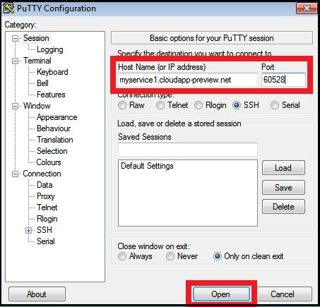

<properties linkid="manage-linux-howto-logon-linux-vm" urlDisplayName="Log on to a VM" pageTitle="Log on to a virtual machine running Linux in Azure" metaKeywords="Azure Linux vm, Linux SSH" description="Learn how to log on to an Azure virtual machine running Linux by using a Secure Shell (SSH) client." metaCanonical="" services="virtual-machines" documentationCenter="" title="How to Log on to a Virtual Machine Running Linux" authors="" solutions="" manager="" editor="" />

Connexion à une machine virtuelle exécutant Linux
=================================================

Pour une machine virtuelle exécutant le système d'exploitation Linux, vous devez utiliser un client SSH (Secure Shell) pour vous connecter.

Installez un client SSH sur l’ordinateur utilisé pour vous connecter à la machine virtuelle. Vous pouvez opérer votre choix parmi de nombreux clients SSH, dont :

-   Si vous utilisez un ordinateur qui exécute un système d’exploitation Windows, vous pouvez utiliser un client SSH tel que PuTTY. Pour plus d’informations, consultez la page [Téléchargement PuTTY](http://www.chiark.greenend.org.uk/~sgtatham/putty/download.html).
-   Si vous utilisez un ordinateur qui exécute un système d’exploitation Linux, vous pouvez utiliser un client SSH comme OpenSSH. Pour plus d’informations, consultez la page [OpenSSH](http://www.openssh.org/).

Cette procédure montre comment utiliser le programme PuTTY pour accéder à la machine virtuelle.

1.  Recherchez le **Nom d’hôte** et les **Informations sur le port** dans le [Portail de gestion](http://manage.windowsazure.com). Les informations dont vous avez besoin sont disponibles dans le tableau de bord de la machine virtuelle. Cliquez sur le nom de la machine virtuelle, puis recherchez **Détails SSH** dans la section **Aperçu rapide** du tableau de bord.

    

2.  Ouvrez le programme PuTTY.

3.  Entrez le nom d'hôte et les informations de port disponibles dans le tableau de bord, puis cliquez sur **Ouvrir**.

    

4.  Connectez-vous à la machine virtuelle à l’aide du compte spécifié à la création de la machine.

    

    Vous pouvez désormais utiliser la machine virtuelle tout comme vous le feriez avec un serveur.

