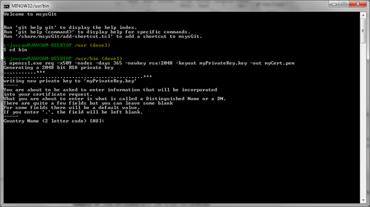

<properties urlDisplayName="Use SSH" pageTitle="Utilisation de SSH pour se connecter à des machines virtuelles Linux dans Azure" metaKeywords="Azure SSH keys Linux, Linux vm SSH" description="Learn how to generate and use SSH keys with a Linux virtual machine on Azure." metaCanonical="" services="virtual-machines" documentationCenter="" title="How to Use SSH with Linux on Azure" authors="szarkos" solutions="" manager="timlt" editor="" />

<tags ms.service="virtual-machines" ms.workload="infrastructure-services" ms.tgt_pltfrm="vm-linux" ms.devlang="na" ms.topic="article" ms.date="10/15/2014" ms.author="szarkos" />

#Utilisation de SSH avec Linux sur Azure

La version actuelle du portail de gestion Azure accepte uniquement les clés publiques SSH encapsulées dans un certificat X509. Pour générer et utiliser des clés SSH avec Azure, procédez comme suit :

## Génération de clés compatibles avec Azure sous Linux ##

1. Installez l'utilitaire `openssl` si nécessaire :

	**CentOS / Oracle Linux**

		# sudo yum install openssl

	**Ubuntu**

		# sudo apt-get install openssl

	**SLES & openSUSE**

		# sudo zypper install openssl

2. Utilisez `openssl` pour générer un certificat X509 avec une paire de clés RSA 2048 bits. Veuillez répondre aux quelques questions posées par `openssl` (ou vous pouvez les laisser vides). Le contenu de ces champs n'est pas utilisé par la plateforme :

		# openssl req -x509 -nodes -days 365 -newkey rsa:2048 -keyout myPrivateKey.key -out myCert.pem

3.	Modifiez les autorisations sur la clé privée pour la sécuriser.

		# chmod 600 myPrivateKey.key

4.	Téléchargez `myCert.pem` lors de la création de la machine virtuelle Linux. Le processus de déploiement installe automatiquement la clé publique de ce certificat dans le fichier `authorized_keys` pour l'utilisateur spécifié dans la machine virtuelle.

5.	Si vous utilisez l'API directement, et non le portail de gestion, convertissez `myCert.pem` en `myCert.cer` (certificat codé DER X509) à l'aide de la commande suivante :

		# openssl  x509 -outform der -in myCert.pem -out myCert.cer

## Génération d'une clé à partir d'une clé existante compatible OpenSSH
L'exemple précédent décrit la création d'une clé à utiliser avec Azure. Il se peut que vous possédiez déjà une paire de clés publique et privée compatible OpenSSH et que vous utilisiez ces clés avec Microsoft Azure.

Les clés privées OpenSSH sont directement accessibles en lecture à partir de l'utilitaire `openssl`. La commande suivante prend une clé privée SSH existante (id_rsa dans l'exemple ci-dessous) et crée la clé publique `.pem` requise par Microsoft Azure :

	# openssl req -x509 -key ~/.ssh/id_rsa -nodes -days 365 -newkey rsa:2048 -out myCert.pem

Le fichier  **myCert.pem** est la clé publique à utiliser pour déployer une machine virtuelle Linux sur Microsoft Azure. Lors du déploiement, le fichier `.pem` est converti en clé publique compatible `openssh` et placé dans `~/.ssh/authorized_keys`.

## Connexion à une machine virtuelle Azure à partir de Linux

1. Dans certains cas, le point de terminaison SSH pour une machine virtuelle Linux peut être configuré pour un port autre que le port par défaut (port 22). Le numéro de port correct est visible dans le tableau de bord de la machine virtuelle, dans le portail de gestion (sous "Détails SSH").

2.	Connectez-vous à la machine virtuelle Linux à l'aide de `ssh`. Lors de la première connexion, vous êtes invité à accepter l'empreinte digitale de la clé publique de l'hôte.

		# ssh -i  myPrivateKey.key -p <port> username@servicename.cloudapp.net

3.	(Facultatif) Vous pouvez copier `myPrivateKey.key` vers `~/.ssh/id_rsa` pour que votre client openssh puisse sélectionner la clé automatiquement sans utiliser l'option `-i`.

## Obtention d'OpenSSL sur Windows ##
### Utilisation de msysgit ###

1.	Téléchargez et installez msysgit à partir de l'emplacement suivant : [http://msysgit.github.com/](http://msysgit.github.com/)
2.	Exécutez `msys` à partir du répertoire installé (par exemple : c:\msysgit\msys.exe)
3.	Basculez vers le répertoire `bin` en tapant `cd bin`

###Utilisation de GitHub pour Windows####

1.	Téléchargez et installez GitHub pour Windows à partir de l'emplacement suivant : [http://windows.github.com/](http://windows.github.com/)
2.	Exécutez Git Shell à partir du menu Démarrer > Tous les programmes > GitHub, Inc

###Utilisation de cygwin###

1.	Téléchargez et installez Cygwin à partir de l'emplacement suivant : [http://cygwin.com/](http://cygwin.com/)
2.	Vérifiez que le package OpenSSL et toutes ses dépendances sont installés.
3.	Exécutez `cygwin`

## Création d'une clé privée sur Windows ##

1.	Suivez une des procédures ci-dessus pour pouvoir exécuter `openssl.exe`
2.	Tapez la commande suivante :

		# openssl.exe req -x509 -nodes -days 365 -newkey rsa:2048 -keyout myPrivateKey.key -out myCert.pem

3.	Votre écran doit ressembler à ce qui suit :

	

4.	Répondez aux questions posées.
5.	Deux fichiers doivent être créés : `myPrivateKey.key` et `myCert.pem`.
6.	Si vous utilisez l'API directement, et non le portail de gestion, convertissez `myCert.pem` en `myCert.cer` (certificat codé DER X509) à l'aide de la commande suivante :

		# openssl.exe  x509 -outform der -in myCert.pem -out myCert.cer

## Création d'une clé privée pour Putty ##

1. Téléchargez et installez Puttygen à partir de l'emplacement suivant : [http://www.chiark.greenend.org.uk/~sgtatham/putty/download.html](http://www.chiark.greenend.org.uk/~sgtatham/putty/download.html)

2. Puttygen ne pourra peut-être pas lire la clé privée créée précédemment (`myPrivateKey.key`). Exécutez la commande suivante pour la transformer en clé privée RSA interprétable par Puttygen :

		# openssl rsa -in ./myPrivateKey.key -out myPrivateKey_rsa
		# chmod 600 ./myPrivateKey_rsa

	La commande ci-dessus doit produire une nouvelle clé privée myPrivateKey_rsa.

3. Exécutez `puttygen.exe`

4. Cliquez sur le menu : Fichier > Charger une clé privée

5. Recherchez votre clé privée, que nous avons nommée `myPrivateKey_rsa` plus haut. Vous devrez modifier le filtre de fichiers pour afficher **Tous les fichiers (\*.\*)**

6. Cliquez sur **Ouvrir**. Vous devez voir apparaître une boîte de dialogue ressemblant à ceci :

	

7. Cliquez sur **OK**

8. Cliquez sur **Enregistrer la clé privée**, qui est mis en surbrillance dans la capture d'écran ci-dessous :

	

9. Enregistrez le fichier au format PPK.

## Utilisation de Putty pour se connecter à une machine Linux ##

1.	Téléchargez et installez putty à partir de l'emplacement suivant : [http://www.chiark.greenend.org.uk/~sgtatham/putty/download.html](http://www.chiark.greenend.org.uk/~sgtatham/putty/download.html)
2.	Exécutez putty.exe
3.	Remplissez le nom d'hôte à l'aide de l'adresse IP du portail de gestion :

	

4.	Avant de sélectionner **Ouvrir**, cliquez sur l'onglet Connexion > SSH > Auth pour choisir votre clé. Examinez la capture d'écran ci-dessous pour le champ à remplir :

	

5.	Cliquez sur **Ouvrir** pour vous connecter à votre machine virtuelle

<!--HONumber=35_1-->
