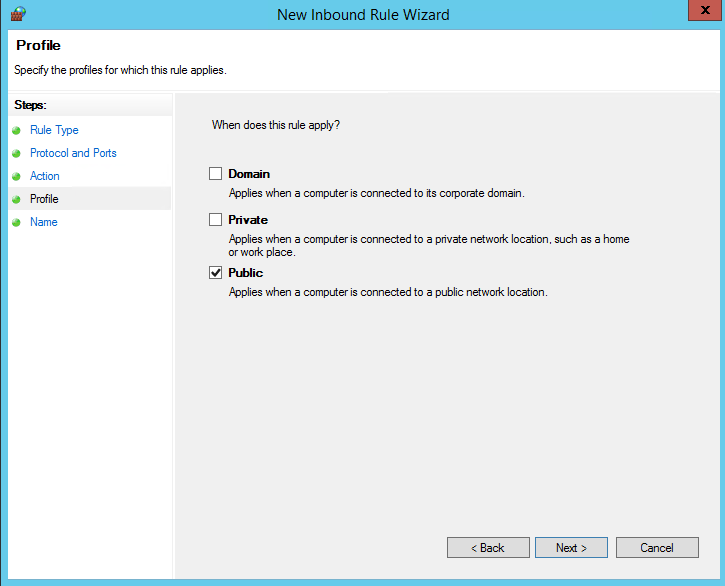
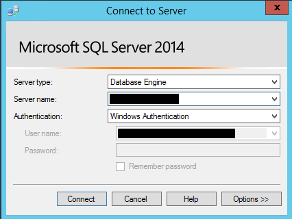
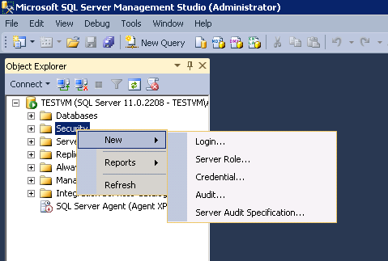
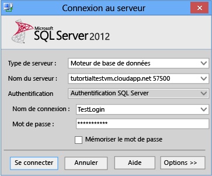

<properties linkid="manage-windows-commontask-install-sql-server" urlDisplayName="Install SQL Server" pageTitle="Provision a SQL Server virtual machine in Azure " metaKeywords="Azure tutorial creating SQL Server, SQL Server vm, configuring SQL Server" description="A tutorial that teaches you how to create and configure a SQL Server virtual machine on Azure." metaCanonical="" services="virtual-machines" documentationCenter="" title="Provisioning a SQL Server Virtual Machine on Azure" authors="selcint" solutions="" manager="clairt" editor="tyson" />

Configuration d'une machine virtuelle SQL Server sur Azure
==========================================================

La galerie de machines virtuelles Azure inclut différentes images contenant Microsoft SQL Server. Vous pouvez sélectionner l'une des images de machine virtuelle de cette galerie et la configurer en quelques clics pour votre environnement Azure.

Ce didacticiel présente les procédures suivantes :

-   [Connexion du portail de gestion Azure et configuration d'une machine virtuelle depuis la galerie](#Provision)
-   [Ouverture de la machine virtuelle à l'aide du Bureau à distance et achèvement de l'installation](#RemoteDesktop)
-   [Procédure de configuration complète pour la connexion à la machine virtuelle en utilisant SSMS (SQL Server Management Studio) sur un autre ordinateur](#SSMS)
-   [Étapes suivantes](#Optional)

Connexion du portail de gestion Azure et configuration d'une machine virtuelle depuis la galerie
------------------------------------------------------------------------------------------------

1. Connectez-vous au [portail de gestion Azure](http://manage.windowsazure.com) avec votre compte. Si vous n'avez pas de compte Azure, visitez la page [Version d'évaluation gratuite d'Azure](http://www.windowsazure.com/fr-fr/pricing/free-trial/).

2. Dans le portail de gestion Azure, en bas à gauche de la page Web, cliquez sur **+NEW**, sur **COMPUTE**, sur **VIRTUAL MACHINE**, puis sur **FROM GALLERY**.

3. Sur la page **Create a Virtual Machine**, sélectionnez une image de machine virtuelle contenant SQL Server, puis cliquez sur la flèche Suivant en bas à droite de la page. Pour obtenir les informations les plus récentes sur les images SQL Server prises en charge sur Azure, consultez la page [Mise en route de SQL Server sur les machines virtuelles Windows Azure](http://go.microsoft.com/fwlink/p/?LinkId=294720) dans l'ensemble de documentation [SQL Server dans les machines virtuelles Azure](http://go.microsoft.com/fwlink/p/?LinkId=294719).

    > [WACOM.NOTE] Si vous avez créé une machine virtuelle en utilisant l'image de plateforme de la version d'évaluation de SQL Server 2012 disponible pendant la période d'évaluation, vous ne pouvez pas la mettre à niveau vers une image de la version payante à l'heure dans la galerie. Vous pouvez choisir l'une des deux options suivantes : 
    > - Vous pouvez créer une machine virtuelle en utilisant la version de SQL Server payante à l'heure à partir de la galerie et faire migrer vos fichiers de base de données vers cette nouvelle machine virtuelle en suivant la procédure de la page [Migration des fichiers de base de données SQL Server et schéma entre les machines virtuelles dans Azure en utilisant des disques de données](http://go.microsoft.com/fwlink/p/?LinkId=294738). **Ou**

    > -   Vous pouvez mettre à niveau une instance de la version d'évaluation de SQL Server 2012 vers une autre version de SQL Server 2012 selon le contrat de [mobilité de licence via l'assurance logicielle sur Azure](http://www.windowsazure.com/fr-fr/pricing/license-mobility/) en suivant la procédure de la page [Mise à niveau vers une autre version de SQL Server 2012](http://msdn.microsoft.com/library/cc707783.aspx). Pour plus d'informations sur l'achat d'une copie sous licence de SQL Server, consultez la page [Comment acheter SQL Server](http://www.microsoft.com/en-us/sqlserver/get-sql-server/how-to-buy.aspx).

4. Sur la page **Virtual Machine Configuration**, entrez les informations suivantes :
    - Entrez un **NOM DE MACHINE VIRTUELLE**.
    - Dans la zone **NEW USER NAME**, entrez un nom d'utilisateur unique pour le compte d'administrateur local de machine virtuelle.
    - Dans la zone **NEW PASSWORD**, entrez un mot de passe fort. Pour plus d'informations, consultez la page [Mots de passe forts](http://msdn.microsoft.com/library/ms161962.aspx).
    - Dans la zone **CONFIRM PASSWORD** entrez de nouveau le mot de passe.
    - Sélectionnez la **TAILLE** adéquate dans le menu déroulant.

    > [WACOM.NOTE] La taille de la machine virtuelle est indiquée durant la configuration : 
    >- Moyenne est la plus petite taille recommandée pour les charges de travail de production. 
    >- La taille minimale recommandée pour une machine virtuelle utilisant SQL Server Édition Entreprise est Grande. 
    >- Sélectionnez Grande ou plus lorsque vous utilisez SQL Server Enterprise Edition. 
    >- Sélectionnez A6 lorsque vous utilisez l'image de SQL Server 2012 Enterprise pour l'entreposage de données. 
    >- Sélectionnez A7 lorsque vous utilisez l'image de la version d'évaluation de SQL Server 2014 pour l'entreposage de données. 
    >- La taille sélectionnée limite le nombre de disques de données que vous pouvez configurer. Pour obtenir les informations les plus récentes sur les tailles de machines virtuelles disponibles et le nombre de disques de données que vous pouvez attribuer à une machine virtuelle, consultez la page [Tailles de machines virtuelles pour Azure](http://go.microsoft.com/fwlink/p/?LinkId=294819).

	Cliquez sur la flèche Suivant située en bas à droite pour continuer.
	
	

5.	Sur la page **Virtual machine mode**, entrez les informations suivantes :
    -   Sélectionnez **Standalone Virtual Machine**.
    -   Dans la zone **DNS NAME**, entrez la première partie d'un nom DNS de votre choix, pour qu'il complète un nom au format **TESTNAME.cloudapp.net**
    -   Dans la zone **REGION/AFFINITY GROUP/VIRTUAL NETWORK**, sélectionnez une région d'hébergement pour cette image virtuelle.

    Cliquez sur la flèche Suivant pour continuer.

    

6. Sur la page **Virtual machine options** :
    -   Dans la zone **AVAILABILITY SET**, sélectionnez **(none)**.
    -   Lisez et acceptez les conditions juridiques.

    

7. Pour continuer, cliquez sur la coche dans le coin en inférieur droit.

8. Patientez pendant qu'Azure prépare votre machine virtuelle. L'état de la machine virtuelle doit normalement passer par les phases suivantes :

    -   Démarrage (configuration)
    -   Arrêté
    -   Démarrage (configuration)
    -   Exécution (configuration)
    -   Exécution

Ouverture de la machine virtuelle à l'aide du Bureau à distance et achèvement de l'installation
-----------------------------------------------------------------------------------------------

1.  Une fois la configuration terminée, cliquez sur le nom de votre machine virtuelle pour accéder à la page DASHBOARD. En bas de la page, cliquez sur **Connect**.

    

2.  Sélectionnez le fichier .rpd à ouvrir en utilisant le programme Bureau à distance Windows (`%windir%\system32\mstsc.exe`).

3.  Dans la boîte de dialogue **Sécurité de Windows**, entrez le mot de passe du compte d'administrateur local indiqué à l'étape précédente. (Il se peut que vous soyez invité à vérifier les informations d’identification de la machine virtuelle.)

4.  Lors de la première connexion à cette machine virtuelle, il est possible que plusieurs processus doivent s'effectuer, par exemple, la configuration de votre bureau, les mises à jour de Windows et l'achèvement des tâches de configuration initiales de Windows (sysprep). Une fois Windows sysprep terminé, les tâches de configuration de SQL Server sont terminées. Ces tâches peuvent provoquer une brève latence lorsqu'elles se terminent. Il est possible que `SELECT @@SERVERNAME` ne renvoie pas un nom correct tant que la configuration de SQL Server n'est pas terminée.

Une fois que vous êtes connecté à la machine virtuelle avec le Bureau à distance Windows, celle-ci fonctionne comme un autre ordinateur. Connectez-vous normalement à l'instance par défaut de SQL Server avec SQL Server Management Studio (exécuté sur la machine virtuelle).

Procédure de configuration complète pour la connexion à la machine virtuelle en utilisant SSMS (SQL Server Management Studio) sur un autre ordinateur
-----------------------------------------------------------------------------------------------------------------------------------------------------

Avant de pouvoir vous connecter à l'instance de SQL Server à partir d'Internet, vous devez mener à bien les tâches suivantes, comme indiqué dans les sections suivantes :

-   [Création d'un point de terminaison TCP pour la machine virtuelle](#Endpoint)
-   [Ouverture de ports TCP dans le pare-feu Windows](#FW)
-   [Configuration de SQL Server pour écouter le protocole TCP](#TCP)
-   [Configuration de SQL Server pour l'authentification en mode mixte](#Mixed)
-   [Création de connexions d'authentification SQL Server](#Logins)
-   [Détermination du nom DNS de la machine virtuelle](#DNS)
-   [Connexion au moteur de base de données à partir d'un autre ordinateur](#cde)
-   [Connexion au moteur de base de données à partir de votre application] (\#cdea)

Le chemin de connexion est résumé dans le schéma suivant :

### Création d'un point de terminaison TCP pour la machine virtuelle

La machine virtuelle doit avoir un point de terminaison pour écouter les communications TCP entrantes. Dans cette étape de configuration Azure, le trafic du port TCP entrant est dirigé vers un port TCP accessible à la machine virtuelle.

1.  Dans le portail de gestion Azure, cliquez sur **VIRTUAL MACHINES**.

2.  Cliquez sur la machine virtuelle que vous venez de créer. Les informations relatives à la machine virtuelle sont affichées.

3.  En haut de la page, sélectionnez la page **ENDPOINTS**, puis en bas de la page, cliquez sur **ADD ENDPOINT**.

    

4.  Sur la page **Add Endpoint to Virtual Machine**, cliquez sur **Add Endpoint**, puis sur la flèche Suivant.

    

5.  Sur la page **Specify the details of the endpoint**, entrez les informations suivantes.
    -   Dans la zone **NAME**, entrez un nom pour le point de terminaison.
    -   Dans la zone **PROTOCOL**, sélectionnez **TCP**. Vous pouvez entrer **1433**, le port d'écoute par défaut de SQL Serveur, dans la zone **Private Port**. De même, vous pouvez entrer **57500** dans la zone **PUBLIC PORT**. Notez que plusieurs organisations sélectionnent différents numéros de ports pour éviter les attaques de sécurité.

    

6.  Cliquez sur la coche pour continuer. Le point de terminaison est créé.

    

### Ouverture de ports TCP dans le pare-feu Windows pour l'instance par défaut du moteur de base de données

1.  Connectez-vous à la machine virtuelle via le Bureau à distance Windows. Une fois connecté, dans le menu Démarrer, cliquez sur **Exécuter**, entrez **WF.msc**, puis cliquez sur **OK**.

    

2.  Dans le **Pare-feu Windows avec fonctions avancées de sécurité**, dans le volet gauche, cliquez avec le bouton droit sur **Règles de trafic entrant**, puis sur **Nouvelle règle** dans le volet d'action.

    

3.  Dans la boîte de dialogue **Type de règle**, sélectionnez **Port**, puis cliquez sur **Suivant**.

4.  Dans la boîte de dialogue **Protocole et ports**, sélectionnez **TCP**. Sélectionnez **Ports locaux spécifiques**, puis entrez le numéro de port de l'instance du moteur de base de données (**1433** pour l'instance par défaut ou le nombre de votre choix pour le port privé de l'étape du point de terminaison).

    

5.  Cliquez sur **Suivant**.

6.  Dans la boîte de dialogue **Action**, sélectionnez **Autoriser la connexion**, puis cliquez sur **Suivant**.

    **Remarque relative à la sécurité :** la sélection de **Autoriser la connexion si elle est sécurisée** peut renforcer la sécurité. Sélectionnez cette option si vous voulez configurer des options de sécurité supplémentaires dans votre environnement.

    

7.  Dans la boîte de dialogue **Profil**, sélectionnez **Public**, puis cliquez sur **Suivant**.

    **Remarque relative à la sécurité :** la sélection de **Public** autorise l'accès via Internet. Lorsque cela est possible, sélectionnez un profil plus restrictif.

    

8.  Dans la boîte de dialogue **Nom**, entrez un nom et une description pour cette règle, puis cliquez sur **Terminer**.

    

Le cas échéant, ouvrez des ports supplémentaires pour les autres composants. Pour plus d'informations, consultez la page [Configurer le Pare-feu Windows pour autoriser l'accès à SQL Server](http://msdn.microsoft.com/fr-fr/library/cc646023.aspx).

### Configuration de SQL Server pour écouter le protocole TCP

1.  Lorsque vous êtes connecté à votre machine virtuelle en utilisant le Bureau à distance, dans le menu Démarrer, cliquez sur **Tous les programmes**, **Microsoft SQL Server** *version*, sur **Outils de configuration**, puis sur **Gestionnaire de configuration SQL Server**.

    

2.  Dans le Gestionnaire de configuration SQL Server, dans le volet de la console, développez **Configuration du réseau SQL Server**.

3.  Dans le volet de la console, cliquez sur **Protocoles pour *nom de l'instance*** (l'instance par défaut est **Protocoles pour MSSQLSERVER**).

4.  Dans le volet d'informations, cliquez avec le bouton droit sur TCP qui doit être activé pour les images de la galerie par défaut. Pour vos images personnalisées, cliquez sur **Activer** (si l'état est Désactivé).

    

5.  Dans le volet de la console, cliquez sur **Services SQL Server** (le redémarrage du moteur de base de données peut être reporté jusqu'à la fin de l'étape suivante).

6.  Dans le volet d'informations, cliquez avec le bouton droit sur **SQL Server (*nom de l'instance*)** (l'instance par défaut est **SQL Server (MSSQLSERVER)**), puis cliquez sur **Redémarrer**, pour arrêter et redémarrer l'instance de SQL Server.

    

7.  Fermez le Gestionnaire de configuration de SQL Server.

Pour plus d'informations sur l'activation des protocoles pour le moteur de base de données SQL Server, consultez la page [Activer ou désactiver un protocole réseau de serveur](http://msdn.microsoft.com/fr-fr/library/ms191294.aspx).

### Configuration de SQL Server pour l'authentification en mode mixte

Le moteur de base de données de SQL Server ne peut pas utiliser l'authentification Windows sans un environnement de domaine. Pour vous connecter au moteur de base de données à partir d'un autre ordinateur, configurez SQL Server pour l'authentification en mode mixte qui permet l'authentification SQL Server et l'authentification Windows (il n'est pas nécessaire de configurer l'authentification en mode mixte si vous avez configuré un réseau virtuel Azure). Pour plus d'informations, consultez la rubrique [Considérations relatives à la connectivité de SQL Server sur les machines virtuelles Windows Azure](http://go.microsoft.com/fwlink/?LinkId=294723) dans l'ensemble de documentation [SQL Server dans des machines virtuelles Windows Azure](http://go.microsoft.com/fwlink/?LinkId=294719).

1.  Lorsque vous êtes connecté à votre machine virtuelle en utilisant le Bureau à distance, dans le menu Démarrer, cliquez sur **Tous les programmes**, **Microsoft SQL Server *version***, puis sur **SQL Server Management Studio**.

    

    Lorsque vous ouvrez Management Studio pour la première fois, il doit créer l'environnement Management Studio pour les utilisateurs. Cette opération peut prendre du temps.

2.  Lorsque vous l'ouvrez, Management Studio affiche la boîte de dialogue **Se connecter au serveur**. Dans la zone **Nom du serveur**, entrez le nom de la machine virtuelle à connecter au moteur de base de données avec Object Explorer (au lieu d'entrer le nom de la machine virtuelle, vous pouvez également utiliser **(local)** ou un simple point pour le **nom du serveur**). Sélectionnez **Authentification Windows** et laissez ***your\_VM\_name*\\your\_local\_administrator** dans la zone **Nom d'utilisateur**. Cliquez sur **Connecter**.

    

3.  Dans SQL Server Management Studio Object Explorer, cliquez avec le bouton droit sur le nom de l'instance de SQL Server (le nom de la machine virtuelle), puis cliquez sur **Propriétés**.

    

4.  Sur la page **Sécurité**, sous **Authentification du serveur**, sélectionnez **Mode d'authentification SQL Server et Windows**, puis cliquez sur **OK**.

    

5.  Dans la boîte de dialogue SQL Server Management Studio, cliquez sur **OK** pour confirmer l'obligation de redémarrer SQL Server.

6.  Dans Object Explorer, cliquez avec le bouton droit sur votre serveur, puis cliquez sur **Redémarrer** (si SQL Server Agent est exécuté, il doit également être redémarré).

    

7.  Dans la boîte de dialogue SQL Server Management Studio, cliquez sur **Oui** pour confirmer que vous voulez redémarrer SQL Server.

### Création de connexions d'authentification SQL Server

Pour vous connecter au moteur de base de données à partir d'un autre ordinateur, vous devez créer au moins une connexion d'authentification SQL Server.

1.  Dans SQL Server Management Studio Object Explorer, développez le dossier de l'instance de serveur dans laquelle vous voulez créer la connexion.

2.  Cliquez avec le bouton droit sur le dossier **Sécurité**, pointez sur **Nouveau**, puis sélectionnez **Connexion...**.

    

3.  Dans la boîte de dialogue **Nouvelle connexion**, sur la page **Général**, entrez le nom du nouvel utilisateur dans la zone **Nom de connexion**.

4.  Sélectionnez **Authentification SQL Server**.

5.  Dans la zone **Mot de passe**, entrez un mot de passe pour le nouvel utilisateur. Entrez de nouveau ce mot de passe dans la zone **Confirmer le mot de passe**.

6.  Pour renforcer la complexité et la sécurité des options de stratégie de mot de passe, sélectionnez **Conserver la stratégie de mot de passe** (recommandé). Il s'agit d'une option par défaut lorsque l'authentification SQL Server est sélectionnée.

7.  Pour conserver les options de stratégie de mot de passe après expiration, sélectionnez **Conserver l'expiration du mot de passe** (recommandé). La stratégie de conservation de mot de passe doit être sélectionnée pour activer cette case à cocher. Il s'agit d'une option par défaut lorsque l'authentification SQL Server est sélectionnée.

8.  Pour forcer l'utilisateur à créer un mot de passe après sa première connexion, sélectionnez **L'utilisateur doit changer de mot de passe à la prochaine connexion** (recommandé si cette connexion est destinée à une autre personne. Si la connexion est destinée à votre propre usage, ne sélectionnez pas cette option). L'option Conserver l'expiration du mot de passe doit être sélectionnée pour activer cette case à cocher. Il s'agit d'une option par défaut lorsque l'authentification SQL Server est sélectionnée.

9.  Dans la liste **Base de données par défaut**, sélectionnez une base de données par défaut pour la connexion. Par défaut, cette option est réglée sur **principale**. Si vous n'avez pas encore créé de base de données d'utilisateur, gardez la valeur par défaut **master**.

10. Dans la liste **Langue par défaut**, conservez la valeur **par défaut**.

    

11. S'il s'agit de votre première connexion, vous pouvez désigner cette connexion en tant qu'administrateur SQL Server. Si cela est le cas, sur la page **Rôles du serveur**, activez la case à cocher **administrateur système**.

    **Remarque relative à la sécurité :** les membres du rôle serveur administrateur système fixe contrôlent complètement le moteur de base de données. Vous devez limiter soigneusement l'appartenance à ce rôle.

    

12. Cliquez sur OK.

Pour plus d'informations sur les connexions SQL Server, consultez la page [Créer un compte de connexion](http://msdn.microsoft.com/fr-fr/library/aa337562.aspx).

### Détermination du nom DNS de la machine virtuelle

Pour vous connecter au moteur de base de données SQL Server à partir d'un autre ordinateur, vous devez connaître le nom DNS de la machine virtuelle. Il s'agit du nom utilisé par Internet pour identifier une machine virtuelle. Vous pouvez utiliser l'adresse IP, mais celle-ci peut être modifiée lorsqu'Azure déplace des ressources pour des raisons de redondance ou de maintenance. Le nom DNS reste stable, car il peut être redirigé vers une nouvelle adresse IP.

1.  Dans le portail de gestion Azure (ou à partir de l'étape précédente), sélectionnez **VIRTUAL MACHINES**.

2.  Sur la page **VIRTUAL MACHINE INSTANCES**, dans la colonne **DNS NAME**, recherchez et copiez le nom DNS de la machine virtuelle qui apparaît, précédé par **http://** (si l'interface utilisateur n'affiche pas l'intégralité du nom, cliquez dessus avec le bouton droit, puis sélectionnez Copier).

    

### Connexion au moteur de base de données à partir d'un autre ordinateur

1.  Sur un ordinateur connecté à Internet, ouvrez SQL Server Management Studio.

2.  Dans la boîte de dialogue **Se connecter au serveur** ou **Se connecter au moteur de base de données**, dans la zone **Nom du serveur**, entrez le nom DNS de la machine virtuelle (déterminé durant la tâche précédente), ainsi qu'un numéro de port de point de terminaison public au format *NomDNS,numéro\_port* tel que **tutorialtestVM.cloudapp.net,57500**.

3.  Dans la zone **Authentification**, sélectionnez **Authentification SQL Server**.

4.  Dans la zone **Connexion**, entrez le nom d'une connexion créée lors d'une tâche précédente.

5.  Dans la zone **Mot de passe**, entrez le mot de passe de connexion que vous avez créé lors d'une tâche précédente.

6.  Cliquez sur **Connecter**.

    

### Connexion au moteur de base de données à partir de votre application

Si vous pouvez vous connecter à une instance de SQL Server exécutée sur une machine virtuelle Azure en utilisant Management Studio, vous devriez pouvoir vous connecter en utilisant une chaîne de connexion semblable à la suivante :

    connectionString="Server=<DNS data-morhtml="true"_Name>;Integrated Security=false;User ID=<login data-morhtml="true"_name>;Password=<your data-morhtml="true"_password>;"providerName="System.Data.SqlClient"

Pour plus d'informations, consultez la page [Résolution des problèmes de connexion au moteur de base de données SQL Server](http://social.technet.microsoft.com/wiki/contents/articles/how-to-troubleshoot-connecting-to-the-sql-server-database-engine.aspx).

Étapes suivantes
----------------

Vous avez vu comment créer et configurer une instance de SQL Server sur une machine virtuelle Azure en utilisant une image de plateforme. Lorsque vous utilisez SQL Server dans des machines virtuelles Azure, nous vous recommandons de suivre les informations d'utilisation fournies dans la documentation [SQL Server dans des machines virtuelles Windows Azure](http://go.microsoft.com/fwlink/p/?LinkId=294719) de la bibliothèque Azure. Cet ensemble de documentation inclut une série d'articles et de didacticiels fournissant des informations d'utilisation détaillées. Cette série inclut les sections suivantes :

[SQL Server dans des machines virtuelles Azure](http://go.microsoft.com/fwlink/p/?LinkId=294719)

[Mise en route de SQL Server sur les machines virtuelles Azure](http://go.microsoft.com/fwlink/p/?LinkId=294720)

[Se préparer à migrer vers SQL Server dans les machines virtuelles Azure](http://go.microsoft.com/fwlink/p/?LinkId=294721)

-   Procédure de migration des fichiers et du schéma de base de données SQL Server entre des machines virtuelles dans Azure en utilisant les disques de données

[Déploiement de SQL Server dans les machines virtuelles Azure](http://go.microsoft.com/fwlink/p/?LinkId=294722)

-   Procédure de copie des fichiers de données et d'installation de SQL Server dans un disque de données local vers Azure en utilisant CSUpload
-   Procédure de création d'une machine virtuelle de base locale en utilisant Hyper-V
-   Procédure de création d'une machine virtuelle SQL Server dans Azure à l'aide du disque SQL Server local existant
-   Procédure de création d'une machine virtuelle SQL Server dans Azure à l'aide d'une machine virtuelle SQL Server locale existante
-   Procédure : utiliser PowerShell pour configurer une machine virtuelle SQL Server dans Azure
-   Utilisation d'un disque de données attaché pour stocker des fichiers de base de données

[Considérations relatives à la connectivité de SQL Server sur les machines virtuelles Azure](http://go.microsoft.com/fwlink/p/?LinkId=294723)

-   Didacticiel : se connecter à SQL Server dans le même service de cloud computing
-   Didacticiel : se connecter à SQL Server dans un service de cloud computing différent
-   Didacticiel : connecter une application ASP.NET à SQL Server dans Windows Azure via Virtual Network

[Guide des performances pour SQL Server dans des machines virtuelles Azure](http://msdn.microsoft.com/library/windowsazure/dn248436.aspx)

[Considérations relatives aux performances de SQL Server sur les machines virtuelles Azure](http://go.microsoft.com/fwlink/?LinkId=294724)

[Considérations relatives à la sécurité de SQL Server sur les machines virtuelles Azure](http://go.microsoft.com/fwlink/p/?LinkId=294725)

[Dépannage et surveillance de SQL Server dans les machines virtuelles Azure](http://go.microsoft.com/fwlink/p/?LinkId=294726)

[Haute disponibilité et récupération d'urgence pour SQL Server sur des machines virtuelles Azure](http://go.microsoft.com/fwlink/p/?LinkId=294727)

-   Didacticiel : groupes de disponibilité AlwaysOn dans Azure (GUI)
-   Didacticiel : groupes de disponibilité AlwaysOn dans Azure (PowerShell)
-   Didacticiel : groupes de disponibilité AlwaysOn dans Hybrid IT (PowerShell)
-   Didacticiel : mise en miroir de bases de données pour la haute disponibilité dans Azure
-   Didacticiel : mise en miroir de bases de données pour la récupération d'urgence dans Azure
-   Didacticiel : mise en miroir de bases de données pour la récupération d'urgence dans Hybrid IT
-   Didacticiel : copie des journaux de transaction pour la récupération d'urgence dans Hybrid IT

[Sauvegarde et restauration de SQL Server dans les machines virtuelles Azure](http://go.microsoft.com/fwlink/p/?LinkId=294728)

[Business Intelligence de SQL Server dans les machines virtuelles Azure](http://go.microsoft.com/fwlink/p/?LinkId=294729)

-   Utiliser PowerShell pour créer une machine virtuelle Azure avec SQL Server Business Intelligence et SharePoint 2010
-   Utiliser PowerShell pour créer une machine virtuelle Azure avec SQL Server Business Intelligence et SharePoint 2013
-   Utiliser PowerShell pour créer une machine virtuelle Azure avec un serveur de rapports en mode natif
-   [Déployer Business Intelligence de SQL Server dans les machines virtuelles Azure](http://msdn.microsoft.com/library/windowsazure/dn321998.aspx)

[SQL Server Data Warehousing dans des machines virtuelles Azure](http://msdn.microsoft.com/library/windowsazure/dn387396.aspx)

