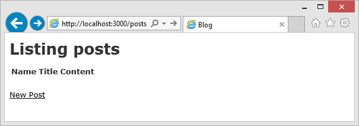
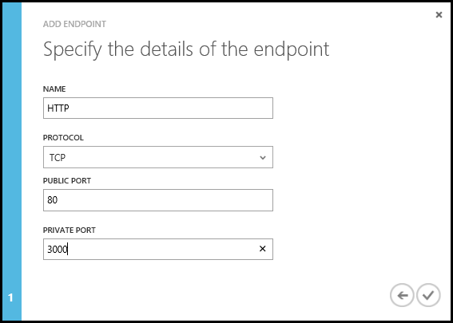

<properties linkid="dev-ruby-web-app-with-linux-vm" urlDisplayName="Ruby on Rails Web App on Azure using Linux VM" pageTitle="Ruby on Rails Web App on Azure using Linux VM" metaKeywords="Azure Ruby web application, Azure Ruby application, Ruby app Azure, Ruby azure vm, ruby virthal machine, ruby linux vm" description="Host a Ruby on Rails-based web site on Azure using a Linux virtual machine. " metaCanonical="" services="virtual-machines" documentationCenter="Ruby" title="Ruby on Rails Web application on an Azure VM" authors="larryfr" solutions="" manager="" editor="" />

Application Web Ruby on Rails sur une machine virtuelle Azure
=============================================================

Ce didacticiel décrit comment héberger un site Web basé sur Ruby on Rails sur Azure à l'aide d'une machine virtuelle Linux. Ce didacticiel part du principe que vous n'avez pas d'expérience en tant qu'utilisateur d'Azure. Une fois ce didacticiel terminé, vous aurez une application basée sur Ruby on Rails installée et fonctionnelle dans le cloud.

Vous apprendrez à :

-   Configurer votre environnement de développement

-   Configurer une machine virtuelle Azure pour héberger Ruby on Rails

-   Créer une application Rails

-   Copier des fichiers vers la machine virtuelle à l'aide de scp

La capture d'écran suivante présente l'application terminée :


Dans cet article
----------------

-   [Configuration de l'environnement de développement](#setup)

-   [Création d'une application Rails](#create)

-   [Test de l'application](#test)

-   [Création d'une machine virtuelle Azure](#createvm)

-   [Copie de l'application vers la machine virtuelle](#copy)

-   [Installation de maillons et démarrage de l'application](#start)

-   [Étapes suivantes](#next)

Configuration de l'environnement de développement
-------------------------------------------------

1.  Installez Ruby dans votre environnement de développement. En fonction de votre système d'exploitation, les étapes peuvent varier.
    -   **Apple OS X** - Il existe plusieurs distributions pour OS X. Ce didacticiel a été validé sur OS X en utilisant [Homebrew](http://brew.sh/) pour installer **rbenv** et **ruby-build**. Vous trouverez des informations d'installation à la page <https://github.com/sstephenson/rbenv/>.
    -   **Linux** - Utilisez le système de gestion des packages de distributions. Ce didacticiel a été validé sur Ubuntu 12.10 à l'aide des packages ruby1.9.1 et ruby1.9.1-dev.
    -   **Windows** - Il existe plusieurs distributions Ruby pour Windows. Ce didacticiel a été validé en utilisant [RailsInstaller](http://railsinstaller.org/) 1.9.3-p392.


2.  Ouvrez une nouvelle ligne de commande ou session terminal et saisissez la commande suivante pour installer Ruby on Rails :

         gem install rails --no-rdoc --no-ri

    **Remarque**

    Cette commande peut nécessiter des privilèges administrateur ou racine sur certains systèmes d'exploitation. Si vous recevez une erreur lors de l'exécution de cette commande, essayez d'utiliser « sudo » comme suit :

    ``` {.prettyprint}
    sudo gem install rails
    ```

    **Remarque**

    La version 3.2.12 du maillon Rails a été utilisée pour ce didacticiel.

3.  Vous devez également installer un interpréteur JavaScript, qui sera utilisé par Rails pour compiler des ressources CoffeeScript utilisées par votre application Rails. Une liste des interpréteurs pris en charge est disponible à la page <https://github.com/sstephenson/execjs#readme>.

    [Node.js](http://nodejs.org/) a été utilisé au cours de la validation de ce didacticiel, car il est disponible pour les systèmes d'exploitation OS X, Linux et Windows.

Création d'une application Rails
--------------------------------

1.  Depuis la ligne de commande ou la session terminal, créez une application Rails nommée « blog\_app » à l'aide la commande suivante :

         rails new blog_app

    Cette commande permet de créer un répertoire nommé **blog\_app** et le remplit avec les fichiers et sous-répertoires requis par une application Rails.

    **Remarque**

    Cette commande peut prendre une minute ou plus. Elle effectue une installation sans assistance des maillons pour une application par défaut et, durant cette installation, elle peut apparaître en suspens.

2.  Passez les répertoires vers le répertoire **blog\_app**, puis utilisez la commande suivante pour créer une structuration de blog de base :

         rails generate scaffold Post name:string title:string content:text

    Cette commande créera les migrations de contrôleurs, de vues, de modèles et de bases de données utilisées pour contenir les publications sur le blog. Chaque publication comporte un nom d'auteur, un titre et un contenu textuel.

3.  Pour créer la base de données qui stockera les publications de blog, utilisez la commande suivante :

         rake db:migrate

    Elle utilise le fournisseur de base de données par défaut pour Rails, qui est la [base de données SQLite3](http://www.sqlite.org/). Bien qu'il soit également possible d'utiliser une autre base de données pour une application de production, SQLite est suffisant pour les objectifs de ce didacticiel.

Test de l'application
---------------------

Pour démarrer le serveur Rails dans votre environnement de développement, procédez comme suit :

1.  Depuis la ligne de commande ou la session terminal, lancez le serveur Rails à l'aide de la commande suivante :

         rails s

    Vous devez voir des informations similaires à ce qui suit. Notez le port que le serveur Web écoute. Dans l'exemple ci-dessous, il s'agit du port 3000.

         => Booting WEBrick
         => Rails 3.2.12 application starting in development on http://0.0.0.0:3000
         => Call with -d to detach
         => Ctrl-C to shutdown server
         [2013-03-12 19:11:31] INFO  WEBrick 1.3.1
         [2013-03-12 19:11:31] INFO  ruby 1.9.3 (2012-04-20) [x86_64-linux]
         [2013-03-12 19:11:31] INFO  WEBrick::HTTPServer#start: pid=9789 port=3000

2.  Ouvrez votre navigateur et accédez à la page http://localhost:3000/. Une page similaire à celle ci-dessous doit s'afficher :

    

    Cette page est une page de bienvenue statique. Pour afficher les formes générées par la commande de structuration, accédez à http://localhost:3000/posts. Une page similaire à celle ci-dessous doit s'afficher :

    

    Pour arrêter le processus de serveur, entrez CTRL+C dans la ligne de commande

Création d'une machine virtuelle Azure
--------------------------------------

Suivez les instructions fournies [ici](http://windowsazure.com/fr-fr/documentation/articles/virtual-machines-linux-tutorial) afin de créer une machine virtuelle Azure qui héberge Linux.

**Remarque**

Les étapes de ce didacticiel ont été réalisées sur une machine virtuelle Azure hébergeant Ubuntu 12.10. Si vous utilisez une distribution Linux différente, des étapes différentes peuvent être requises pour accomplir les mêmes tâches.

**Remarque**

Il **suffit** de créer la machine virtuelle. Arrêtez-vous après avoir appris comment connecter la machine virtuelle à l'aide du protocole SSH.

Après avoir créé la machine virtuelle Azure, procédez comme suit pour y installer Ruby et Rails :

1.  Depuis la ligne de commande ou la session terminal, utilisez la commande suivante pour connecter la machine virtuelle à l'aide du protocole SSH :

         ssh username@vmdns -p port

    Remplacez le nom d'utilisateur indiqué au cours de la création de la machine virtuelle, l'adresse DNS de la machine virtuelle et le port du point de terminaison SSH. Par exemple :

         ssh railsdev@railsvm.cloudapp.net -p 61830

    **Remarque**

    Si vous utilisez Windows comme environnement de développement, vous pouvez utiliser un utilitaire tel que **PuTTY** pour la fonctionnalité SSH. Vous pouvez télécharger PuTTY sur la [page de téléchargement de PuTTY](http://www.chiark.greenend.org.uk/~sgtatham/putty/download.html).

2.  Depuis la session SSH, utilisez les commandes suivantes pour installer Ruby sur la machine virtuelle :

         sudo apt-get update -y
         sudo apt-get upgrade -y
         sudo apt-get install ruby1.9.1 ruby1.9.l-dev build-essential libsqlite3-dev nodejs -y

    Une fois l'installation terminée, utilisez la commande suivante pour vérifier que Ruby a bien été installé :

         ruby -v

    Cette commande doit renvoyer la version de Ruby qui est installée sur la machine virtuelle, qui peut être différente de la version 1.9.1. Par exemple, **ruby 1.9.3p194 (2012-04-20 révision 35410) [x86\_64-linux]**.

3.  Utilisez la commande suivante pour installer Bundler :

         sudo gem install bundler --no-rdoc --no-ri

    Bundler permet d'installer les maillons requis par votre application Rails une fois qu'elle a été copiée sur le serveur.

Copie de l'application vers la machine virtuelle
------------------------------------------------

Depuis votre environnement de développement, ouvrez une nouvelle ligne de commande ou une session terminal et utilisez la commande **scp** pour copier le répertoire **blog\_app** sur la machine virtuelle. Le format de cette commande est le suivant :

    scp -r -P 54822 -C directory-to-copy user@vmdns:

Par exemple :

    scp -r -P 54822 -C ~/blog_app railsdev@railsvm.cloudapp.net:

**Remarque**

Si vous utilisez Windows comme environnement de développement, vous pouvez utiliser un utilitaire tel que **pscp** pour la fonctionnalité pscp. Vous pouvez télécharger pscp sur la [page de téléchargement de PuTTY](http://www.chiark.greenend.org.uk/~sgtatham/putty/download.html).

Les paramètres utilisés pour cette commande présentent l'effet suivant :

-   **-r** : copie de manière récursive le contenu du répertoire et de tous les sous-répertoires indiqués.

-   **-P** : utilise le port spécifié pour la communication SSH

-   **-C** : permet la compression

-   **directory-to-copy** : répertoire local à copier

-   **user@vmdns** : adresse de la machine vers laquelle copier les fichiers ainsi que le compte d'utilisateur avec lequel se connecter

Après l'opération de copie, le répertoire **blog\_app** sera situé dans le répertoire de base des utilisateurs. Utilisez les commandes suivantes dans la session SSH avec la machine virtuelle pour afficher les fichiers copiés :

    cd ~/blog_app
    ls

La liste des fichiers renvoyés doit correspondre aux fichiers contenus dans le répertoire **blog\_app** de votre environnement de développement.

Installation des maillons et démarrage de Rails
-----------------------------------------------

1.  Sur la machine virtuelle, remplacez les répertoires par le répertoire **blog\_app** et utilisez la commande suivante pour installer les maillons indiqués dans le fichier **Gemfile** :

         sudo bundle install

2.  Pour créer la base de données, utilisez la commande suivante :

         rake db:migrate

3.  Pour démarrer le serveur, utilisez la commande suivante :

         rails s

    Le résultat ressemble à ce qui suit. Notez le port que le serveur Web écoute. Dans l'exemple ci-dessous, il s'agit du port 3000.

         => Booting WEBrick
         => Rails 3.2.12 application starting in development on http://0.0.0.0:3000
         => Call with -d to detach
         => Ctrl-C to shutdown server
         [2013-03-12 19:11:31] INFO  WEBrick 1.3.1
         [2013-03-12 19:11:31] INFO  ruby 1.9.3 (2012-04-20) [x86_64-linux]
         [2013-03-12 19:11:31] INFO  WEBrick::HTTPServer#start: pid=9789 port=3000

4.  Dans votre navigateur, accédez au [portail de gestion Azure](https://manage.windowsazure.com/) et sélectionnez votre machine virtuelle.

    

5.  Sélectionnez **ENDPOINTS** dans la partie supérieure de la page, puis cliquez sur **+ ADD ENDPOINT** dans la partie inférieure de la page.

    

6.  Dans la boîte de dialogue **ADD ENDPOINT**, cliquez sur la flèche dans la partie inférieure gauche afin d'accéder à la deuxième page, puis saisissez les informations suivantes :

    -   **NAME** : HTTP

    -   **PROTOCOL** : TCP

    -   **PUBLIC PORT** : 80

    -   **PRIVATE PORT** : &lt;informations sur le port issues de l'étape 3 ci-dessus\>

    Ainsi, un port public 80 sera créé pour acheminer le trafic vers le port privé 300, où le serveur Rails écoute.

    

7.  Cliquez sur la coche pour enregistrer le point de terminaison.

8.  Un message indiquant **UPDATE IN PROGRESS** doit s'afficher. Une fois que ce message disparaît, le point de terminaison est actif. Vous pouvez désormais tester votre application en accédant au nom DNS de votre machine virtuelle. Le site Web qui apparaît doit ressembler à ce qui suit :

    

    L'ajout de **/posts** à l'URL doit afficher les pages générées par la commande de structuration.

    

Étapes suivantes
----------------

Dans cet article, vous avez appris à créer et à publier une application Rails de base sur une machine virtuelle Azure. La plupart des actions que vous avez réalisées étaient manuelles et, dans un environnement de production, il serait souhaitable de les automatiser. En outre, la plupart des environnements de production hébergent l'application Rails en association avec un autre processus serveur tel que Apache ou NginX, qui traite l'acheminement des requêtes vers plusieurs instances de l'application Rails et l'envoi des ressources statiques.

Pour plus d'informations sur l'automatisation du déploiement de votre application Rails ainsi que sur l'utilisation du serveur Web Unicorn et NginX, consultez la page [Unicorn+NginX+Capistrano avec une machine virtuelle Azure](http://windowsazure.com/fr-fr/documentation/articles/virtual-machines-ruby-deploy-capistrano-host-nginx-unicorn/).

Si vous souhaitez en savoir plus sur Ruby on Rails, consultez les [guides Ruby on Rails](http://guides.rubyonrails.org/).

Pour apprendre à utiliser le Kit de développement logiciel (SDK) Azure pour Ruby afin d'accéder aux services Azure depuis votre application Ruby, consultez les pages suivantes :

-   [Stockage de données non structurées à l'aide d'objets blob](http://windowsazure.com/fr-fr/documentation/articles/storage-ruby-how-to-use-blob-storage)

-   [Stockage de paires clé/valeur à l'aide de tables](http://www.windowsazure.com/fr-fr/develop/ruby/how-to-guides/table-service/)

-   [Prise en charge d'une large bande passante avec le réseau de distribution de contenu](http://www.windowsazure.com/fr-fr/develop/ruby/app-services/)


