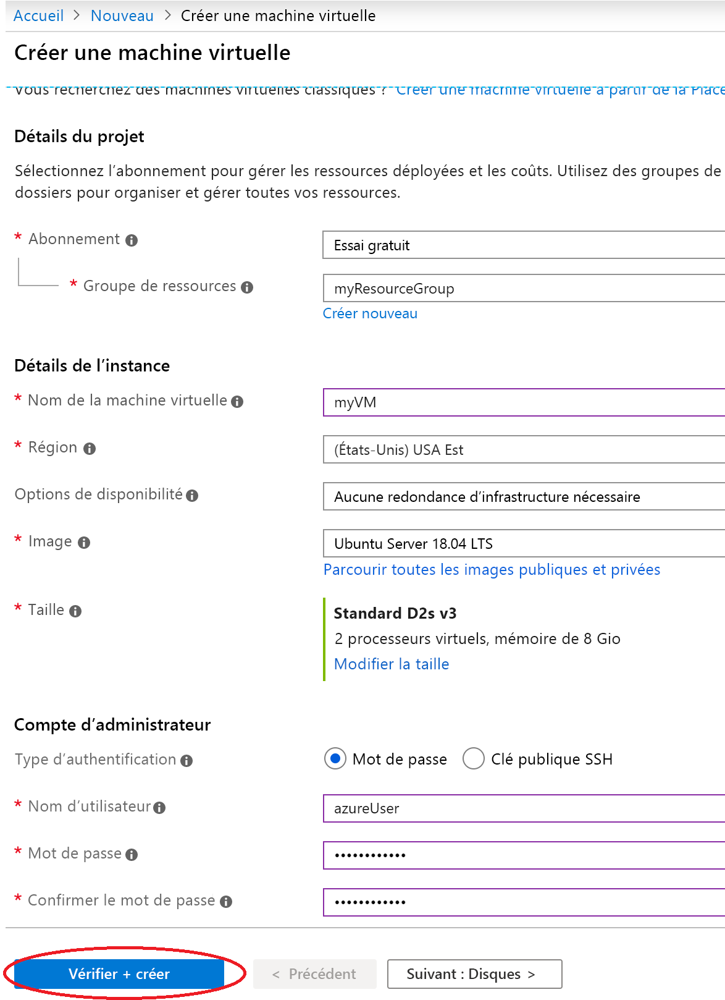

# Démarrage rapide : Créer et chiffrer une machine virtuelle Linux à l’aide du portail Azure

Le Portail Azure peut être utilisé pour créer des machines virtuelles Azure. Le Portail Azure est une interface utilisateur basée sur un navigateur permettant de créer des machines virtuelles et leurs ressources associées. Dans ce guide de démarrage rapide, vous utilisez le portail Azure pour déployer une machine virtuelle Linux exécutant Ubuntu 18.04 LTS, créer un coffre de clés pour le stockage des clés de chiffrement et chiffrer la machine virtuelle.

Si vous n’avez pas d’abonnement Azure, créez un [compte gratuit](https://azure.microsoft.com/free/?WT.mc_id=A261C142F) avant de commencer.

## Connexion à Azure

Connectez-vous au [Portail Azure](https://portal.azure.com).

## Création d’un coffre de clés

1. Sélectionnez l’option **Créer une ressource** dans le coin supérieur gauche du portail Azure.
1. Dans la zone de recherche, entrez **Key Vault**.
1. Dans la liste des résultats, sélectionnez **Key Vault**.
1. Dans la section Key Vault, sélectionnez **Créer**.
1. Dans l’écran **Créer un coffre de clés** , choisissez un nom unique pour votre nouveau coffre de clés.

    > [!Important]
    > Chaque coffre de clés doit avoir un nom unique. L’exemple suivant crée un coffre de clés nommé *myADEKV*, mais vous devez nommer le vôtre différemment.

1. Sélectionnez un **Abonnement**.
1.  Sous **Groupe de ressources**, sélectionnez **Créer**. Dans la fenêtre contextuelle, tapez *myResourceGroup* comme nom du groupe de ressources, puis choisissez **OK**. 

    

1. Dans le menu déroulant **Emplacement**, choisissez **East US** (USA Est).
1. Conservez les valeurs par défaut des autres options.
1. Sélectionnez « Stratégies d’accès » pour accéder à un nouvel écran.
1. Cochez la case à côté de l’option « Activer l’accès à Azure Disk Encryption pour chiffrer des volumes ».

    

1. En bas de l’écran Stratégies d’accès, cliquez sur « Vérifier + créer ».
1. À la fin de la vérification, cliquez sur « Créer ».

## Création d'une machine virtuelle

1. Choisissez **Créer une ressource** en haut à gauche du Portail Azure.

1. Dans la page Nouveau, sous Populaire, sélectionnez **Ubuntu Server 18.04 LTS**.
1. Sous l’onglet **De base**, sous **Détails du projet**, vérifiez que l’abonnement approprié est sélectionné.
1. Dans **Groupe de ressources**, sélectionnez le groupe de ressources que vous avez créé précédemment en même temps que votre coffre de clés (par exemple, **myResourceGroup**).
1. Dans **Nom de la machine virtuelle**, entrez *MyVM*. 
1. Dans **Région**, sélectionnez la même région que celle utilisée pour créer votre coffre de clés (par exemple, **East US**).
1. Assurez-vous que la **Taille** est *Standard D2s v3*.
1. Sous **Compte Administrateur**, sélectionnez **Mot de passe**. Entrez un nom d'utilisateur et un mot de passe.
    
1. Sélectionnez l’onglet « Gestion » et vérifiez que vous avez bien un compte de stockage des diagnostics. Si vous n’en avez pas, sélectionnez « Créer », donnez un nom à votre nouveau compte, puis sélectionnez « OK ». 
1. Cliquez sur « Vérifier + créer ».
1. Sur la page **Create a virtual machine** (Créer une machine virtuelle), vous pouvez voir les détails de la machine virtuelle que vous allez créer. Lorsque vous êtes prêt, sélectionnez **Créer**.

Quelques minutes sont nécessaires pour le déploiement de votre machine virtuelle. Lorsque le déploiement est terminé, passez à la section suivante.

## Chiffrer la machine virtuelle

1. Une fois le déploiement de la machine virtuelle terminé, sélectionnez **Accéder à la ressource**.
1. Dans la barre latérale de gauche, sélectionnez **Disques**.
1. Dans l’écran Disques, sélectionnez **Chiffrement**. 

    

1. Dans l’écran Chiffrement, sous **Disques à chiffrer**, choisissez **Disques OS et de données**.
1. Sous **Paramètres de chiffrement**, cliquez sur « Sélectionner un coffre de clés et une clé pour le chiffrement ».
1. Dans la barre latérale de droite, sélectionnez le nom du coffre de clés que vous avez créé précédemment comme valeur pour *Coffre de clés**, puis cliquez sur **Sélectionner**.

    
1. En haut de l’écran Chiffrement, cliquez sur « Enregistrer ». Un message s’affiche pour vous avertir que la machine virtuelle va redémarrer. Cliquez sur **Oui**.

## Supprimer des ressources

Dès que vous n’en avez plus besoin, vous pouvez supprimer le groupe de ressources, la machine virtuelle et toutes les ressources associées. Pour cela, sélectionnez le groupe de ressources de la machine virtuelle, sélectionnez Supprimer, puis confirmez le nom du groupe de ressources à supprimer.

## Étapes suivantes

Dans ce guide de démarrage rapide, vous avez créé un coffre de clés qui a été activé pour les clés de chiffrement, vous avez créé une machine virtuelle, puis vous avez activé le chiffrement pour la machine virtuelle.  

> [!div class="nextstepaction"]
> [Vue d’ensemble d’Azure Disk Encryption](disk-encryption-overview.md)