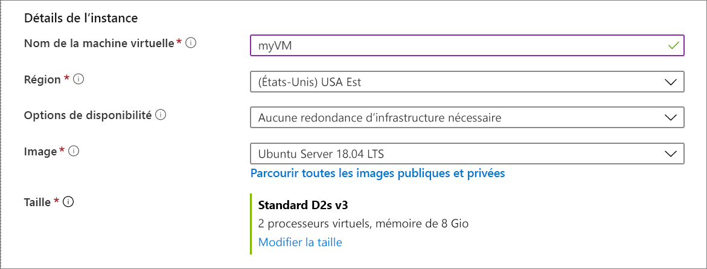
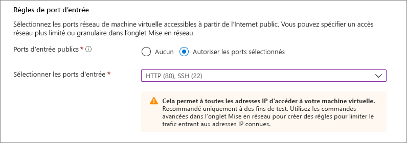

# <a name="quickstart-create-a-linux-virtual-machine-in-the-azure-portal"></a>Démarrage rapide : Créer une machine virtuelle Linux sur le Portail Azure

Le Portail Azure peut être utilisé pour créer des machines virtuelles Azure. Le Portail Azure est une interface utilisateur basée sur un navigateur permettant de créer des machines virtuelles et leurs ressources associées. Ce démarrage rapide explique comment utiliser le Portail Azure pour déployer une machine virtuelle Linux exécutant Ubuntu 16.04 LTS. Pour voir votre machine virtuelle en action, vous établissez également une connexion SSH à la machine virtuelle et installez le serveur web NGINX.

Si vous n’avez pas d’abonnement Azure, créez un [compte gratuit](https://azure.microsoft.com/free/?WT.mc_id=A261C142F) avant de commencer.

## <a name="create-ssh-key-pair"></a>Créer la paire de clés SSH

Vous aurez besoin d’une paire de clés SSH pour suivre ce guide de démarrage rapide. Si vous disposez déjà d’une paire de clés SSH, vous pouvez ignorer cette étape.

Ouvrez un interpréteur de commandes bash et utilisez [ssh-keygen](https://www.ssh.com/ssh/keygen/) pour créer une paire de clés SSH. Si vous n’avez pas d’interpréteur de commandes bash sur votre ordinateur local, vous pouvez utiliser [Azure Cloud Shell](https://shell.azure.com/bash).  

```bash
ssh-keygen -t rsa -b 2048
```

La commande ci-dessus génère des clés publiques et privées portant le nom par défaut `id_rsa` dans `~/.ssh directory`. La commande renvoie le chemin d’accès complet à la clé publique. Utilisez le chemin d’accès à la clé publique pour afficher son contenu avec `cat`.

```bash 
cat ~/.ssh/id_rsa.pub
```

Enregistrez la sortie de cette commande. Elle vous sera utile au moment de configurer votre compte administrateur pour vous connecter à votre machine virtuelle.

Pour plus d’informations sur la création de paires de clés SSH, notamment l’utilisation de PuTTy, voir [Guide pratique pour utiliser des clés SSH avec Windows](ssh-from-windows.md).

Si vous créez votre paire de clés SSH à l’aide de Cloud Shell, elle est stockée dans un partage de fichiers Azure qui est [automatiquement monté par Cloud Shell](https://docs.microsoft.com/azure/cloud-shell/persisting-shell-storage). Ne supprimez pas ce compte de stockage ou partage de fichiers tant que vous n’avez pas récupéré vos clés, faute de quoi vous perdrez votre accès à la machine virtuelle. 

## <a name="sign-in-to-azure"></a>Connexion à Azure

Connectez-vous au [Portail Azure](https://portal.azure.com).

## <a name="create-virtual-machine"></a>Créer une machine virtuelle

1. Choisissez **Créer une ressource** en haut à gauche du Portail Azure.

1. Dans la zone de recherche au-dessus de la liste des ressources de la Place de marché Azure, recherchez et sélectionnez **Ubuntu Server 16.04 LTS** de Canonical, puis choisissez **Créer**.

1. Sous l’onglet **De base**, sous **Détails du projet**, vérifiez que l’abonnement approprié est sélectionné, puis choisissez **Créer** sous **Groupe de ressources** . Dans la fenêtre contextuelle, tapez *myResourceGroup* comme nom du groupe de ressources, puis choisissez **OK**. 

    

1. Sous **Détails de l’instance**, tapez *myVM* comme **Nom de la machine virtuelle**, puis choisissez *USA Est* comme **Région**. Conservez les autres valeurs par défaut.

    

1. Sous **Compte d’administrateur**, sélectionnez **Clé publique SSH**, tapez votre nom d’utilisateur, puis collez votre clé publique dans la zone de texte. Supprimez les espaces blancs au début ou à la fin de votre clé publique.

    

1. Sous **Règles des ports d’entrée** > **Ports d’entrée publics**, choisissez **Autoriser les ports sélectionnés**, puis sélectionnez **SSH (22)** et **HTTP (80)** dans la liste déroulante. 

    

1. Conservez les valeurs par défaut restantes, puis sélectionnez le bouton **Vérifier + créer** en bas de la page.

1. Sur la page **Create a virtual machine** (Créer une machine virtuelle), vous pouvez voir les détails de la machine virtuelle que vous allez créer. Lorsque vous êtes prêt, sélectionnez **Créer**.

Quelques minutes sont nécessaires pour le déploiement de votre machine virtuelle. Lorsque le déploiement est terminé, passez à la section suivante.

    
## <a name="connect-to-virtual-machine"></a>Connexion à la machine virtuelle

Créez une connexion SSH avec la machine virtuelle.

1. Sélectionnez le bouton **Se connecter** sur la page de présentation de la machine virtuelle. 

    

2. Sur la page **Se connecter à la machine virtuelle**, conservez les options par défaut pour vous connecter par adresse IP sur le port 22. Dans **Se connecter à l’aide d’un compte local de machine virtuelle**, une commande de connexion s’affiche. Cliquez sur le bouton pour copier la commande. L’exemple suivant montre la commande de connexion SSH :

    ```bash
    ssh azureuser@10.111.12.123
    ```

3. Avec le même interpréteur de commandes bash que celui utilisé pour créer votre paire de clés (comme [Azure Cloud Shell](https://shell.azure.com/bash) ou votre interpréteur de commandes bash local), collez la commande de connexion SSH dans l’interpréteur de commandes pour créer une session SSH. 

## <a name="install-web-server"></a>Installer le serveur web

Pour voir votre machine virtuelle en action, installez le serveur web NGINX. Dans votre session SSH, mettez à jour vos sources de package, puis installez le dernier package NGINX.

```bash
sudo apt-get -y update
sudo apt-get -y install nginx
```

Lorsque vous avez terminé, tapez `exit` pour quitter la session SSH.


## <a name="view-the-web-server-in-action"></a>Voir le serveur web en action

Utilisez le navigateur web de votre choix pour visualiser la page d’accueil NGINX par défaut. Entrez l’adresse IP publique de la machine virtuelle comme adresse web. Vous trouverez l’adresse IP publique sur la page de vue d’ensemble de la machine virtuelle ou en tant que partie de la chaîne de connexion SSH que vous avez utilisée précédemment.


## <a name="clean-up-resources"></a>Supprimer des ressources

Dès que vous n’en avez plus besoin, vous pouvez supprimer le groupe de ressources, la machine virtuelle et toutes les ressources associées. Pour cela, sélectionnez le groupe de ressources de la machine virtuelle, sélectionnez **Supprimer**, puis confirmez le nom du groupe de ressources à supprimer.

## <a name="next-steps"></a>Étapes suivantes

Avec ce guide de démarrage rapide, vous avez déployé une machine virtuelle simple, créé un Groupe de sécurité réseau et une règle, et installé un serveur web de base. Pour en savoir plus sur les machines virtuelles Azure, suivez le didacticiel pour les machines virtuelles Linux.

> [!div class="nextstepaction"]
> [Didacticiels sur les machines virtuelles Azure Linux](./tutorial-manage-vm.md)
