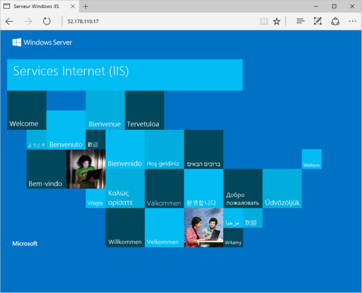

# <a name="create-a-windows-virtual-machine-with-the-azure-cli"></a>Créer une machine virtuelle Windows avec l’interface Azure CLI

L’interface de ligne de commande (CLI) Azure permet de créer et gérer des ressources Azure à partir de la ligne de commande ou dans les scripts. Ce démarrage rapide décrit en détail comment utiliser Azure CLI pour déployer une machine virtuelle exécutant Windows Server 2016. Une fois le déploiement terminé, connectez-vous au serveur et installez IIS.

Si vous n’avez pas d’abonnement Azure, créez un [compte gratuit](https://azure.microsoft.com/free/?WT.mc_id=A261C142F) avant de commencer.


[!INCLUDE [cloud-shell-try-it.md](../../../includes/cloud-shell-try-it.md)]

Si vous choisissez d’installer et d’utiliser l’interface de ligne de commande localement, vous devez exécuter Azure CLI version 2.0.4 ou une version ultérieure pour poursuivre la procédure décrite dans ce guide de démarrage rapide. Exécutez `az --version` pour trouver la version. Si vous devez installer ou mettre à niveau, consultez [Installation d’Azure CLI 2.0]( /cli/azure/install-azure-cli). 


## <a name="create-a-resource-group"></a>Créer un groupe de ressources

Créez un groupe de ressources avec la commande [az group create](/cli/azure/group#az_group_create). Un groupe de ressources Azure est un conteneur logique dans lequel les ressources Azure sont déployées et gérées. 

L’exemple suivant crée un groupe de ressources nommé *myResourceGroup* à l’emplacement *eastus*.

```azurecli-interactive 
az group create --name myResourceGroup --location eastus
```

## <a name="create-virtual-machine"></a>Create virtual machine

Créez une machine virtuelle avec la commande [az vm create](/cli/azure/vm#az_vm_create). 

L’exemple suivant permet de créer une machine virtuelle nommée *myVM*. Cet exemple utilise le nom d’utilisateur administratif *azureuser* et le mot de passe *myPassword12*. Mettez à jour ces valeurs avec quelque chose d’approprié pour votre environnement. Ces valeurs sont nécessaires lors de la création d’une connexion avec la machine virtuelle.

```azurecli-interactive 
az vm create --resource-group myResourceGroup --name myVM --image win2016datacenter --admin-username azureuser --admin-password myPassword12
```

Lorsque la machine virtuelle a été créée, l’interface de ligne de commande Azure affiche des informations similaires à l’exemple suivant. Notez la valeur de `publicIpAaddress`. Cette adresse est utilisée pour accéder à la machine virtuelle.

```azurecli-interactive 
{
  "fqdns": "",
  "id": "/subscriptions/d5b9d4b7-6fc1-0000-0000-000000000000/resourceGroups/myResourceGroup/providers/Microsoft.Compute/virtualMachines/myVM",
  "location": "eastus",
  "macAddress": "00-0D-3A-23-9A-49",
  "powerState": "VM running",
  "privateIpAddress": "10.0.0.4",
  "publicIpAddress": "52.174.34.95",
  "resourceGroup": "myResourceGroup"
}
```

## <a name="open-port-80-for-web-traffic"></a>Ouvrez le port 80 pour le trafic web 

Par défaut, seules les connexions RDP sont autorisées pour les machines virtuelles Windows déployées dans Azure. Si cet ordinateur virtuel doit être un serveur web, vous devez ouvrir le port 80 à partir d’Internet. Utilisez la commande [az vm open-port](/cli/azure/vm#az_vm_open_port) pour ouvrir le port souhaité.  
 
 ```azurecli-interactive  
az vm open-port --port 80 --resource-group myResourceGroup --name myVM
```


## <a name="connect-to-virtual-machine"></a>Connexion à la machine virtuelle

Utilisez la commande suivante pour créer une session Bureau à distance avec la machine virtuelle. Remplacez l’adresse IP par l’adresse IP publique de votre machine virtuelle. À l'invite, saisissez les informations d’identification que vous avez utilisées lors de la création de la machine virtuelle.

```bash 
mstsc /v:Public IP Address
```

## <a name="install-iis-using-powershell"></a>Installation de IIS à l’aide de PowerShell

Maintenant que vous êtes connecté à la machine virtuelle Azure, vous pouvez utiliser une seule ligne de PowerShell pour installer IIS et activer la règle de pare-feu local pour autoriser le trafic web. Ouvrez une invite PowerShell et exécutez la commande suivante :

```powershell
Install-WindowsFeature -name Web-Server -IncludeManagementTools
```

## <a name="view-the-iis-welcome-page"></a>Afficher la page d’accueil IIS

Une fois IIS installé et le port 80, ouvert sur votre machine virtuelle à partir d’Internet, vous pouvez utiliser un navigateur web pour afficher la page d’accueil IIS par défaut. Veillez à utiliser l’adresse IP publique indiquée ci-dessus pour vous rendre sur la page par défaut. 

 

## <a name="clean-up-resources"></a>Supprimer des ressources

Lorsque vous n’en avez plus besoin, vous pouvez utiliser la commande [az group delete](/cli/azure/group#az_group_delete) pour supprimer le groupe de ressources, la machine virtuelle et toutes les ressources associées.

```azurecli-interactive 
az group delete --name myResourceGroup
```

## <a name="next-steps"></a>étapes suivantes

Dans ce guide de démarrage rapide, vous avez déployé une machine virtuelle simple ainsi qu’une règle de groupe de sécurité réseau, et installé un serveur web. Pour en savoir plus sur les machines virtuelles Azure, suivez le didacticiel pour les machines virtuelles Windows.

> [!div class="nextstepaction"]
> [Didacticiels sur les machines virtuelles Azure Windows](./tutorial-manage-vm.md)
