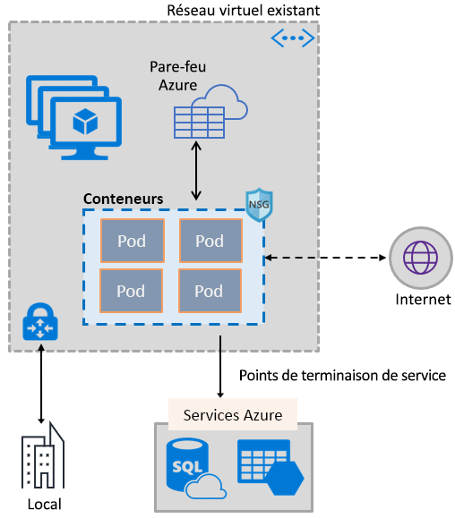
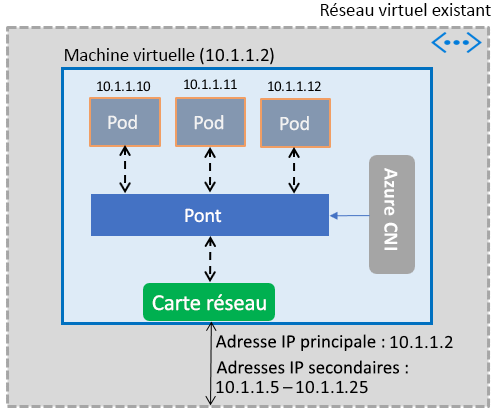

# Permettre aux conteneurs d’utiliser les fonctionnalités du réseau virtuel Azure

Apportez aux conteneurs l’ensemble complet des fonctionnalités du réseau Azure en utilisant la même pile de mise en réseau à définition logicielle que celle qui alimente les machines virtuelles. Le plug-in CNI (Container Network Interface) du réseau virtuel Azure s’installe sur une machine virtuelle Azure. À partir d’un réseau virtuel, il attribue des adresses IP aux conteneurs affichés dans la machine virtuelle, en les attachant au réseau virtuel et en les connectant directement à d’autres conteneurs et à des ressources du réseau virtuel. En ce qui concerne la connectivité, ce plug-in ne s’appuie pas sur des réseaux superposés, ou des itinéraires, et les performances qu’il fournit sont les mêmes que les machines virtuelles. Globalement, le plug-in offre les fonctionnalités suivantes :

- Une adresse IP de réseau virtuel est affectée à chaque pod pouvant se composer d’un ou de plusieurs conteneurs.
- Les pods peuvent se connecter à des réseaux virtuels appairés, et localement via ExpressRoute ou un VPN de site à site. Les pods sont également accessibles à partir de réseaux appairés et locaux.
- Les pods peuvent accéder à des services, tels que le stockage Azure et Azure SQL Database, qui sont protégés par des points de terminaison de service de réseau virtuel.
- Les itinéraires et les groupes de sécurité réseau peuvent être appliqués directement aux pods.
- Les pods peuvent être placés immédiatement derrière un équilibreur de charge interne ou public Azure, tout comme les machines virtuelles.
- Une adresse IP publique peut être affectée aux pods, ce qui les rend accessibles directement depuis internet. Les pods peuvent également accéder eux-mêmes à internet.
- Fonctionne de façon transparente avec les ressources Kubernetes, telles que Services, les contrôleurs d’entrée et Kube DNS. Un service Kubernetes peut également être exposé en interne ou en externe via Azure Load Balancer.

L’image suivante illustre l’approvisionnement par le plug-in des fonctionnalités de réseau virtuel Azure aux pods :

Le plug-in prend en charge les plateformes Linux et Windows.

## Connexion de pods à un réseau virtuel

Les pods sont affichés sur une machine virtuelle qui fait partie d’un réseau virtuel. Un pool d’adresses IP est configuré pour les pods en tant qu’adresses secondaires sur l’interface réseau d’une machine virtuelle. Azure CNI configure la connectivité réseau de base des pods et gère l’utilisation des adresses IP dans le pool. Quand un pod s’affiche dans la machine virtuelle, Azure CNI attribue une adresse IP disponible à partir du pool et connecte le pod à un pont logiciel dans la machine virtuelle. À l’extinction du pod, l’adresse IP est restituée au pool. L’image suivante illustre la connexion des pods à un réseau virtuel :

## Accès à Internet

Pour permettre aux pods d’accéder à internet, le plug-in configure des règles *iptables* pour traduire en adresse réseau (NAT) le trafic lié à internet provenant des pods. L’adresse IP source du paquet est translatée vers l’adresse IP principale sur l’interface réseau de la machine virtuelle. Les machines virtuelles Windows traduisent automatiquement en adresses réseau sources (SNAT) le trafic destiné aux adresse IP situées en dehors du sous-réseau dans lequel se trouve la machine virtuelle. En règle générale, tout le trafic destiné à une adresse IP située en dehors de la plage IP du réseau virtuel est traduit.

## limites

Le plug-in prend en charge jusqu’à 250 pods par machine virtuelle, et jusqu’à 16 000 pods au sein d’un réseau virtuel. Ces limites sont différentes pour l’environnement [Azure Kubernetes Service](../azure-subscription-service-limits.md?toc=%2fazure%2fvirtual-network%2ftoc.json#azure-kubernetes-service-limits).

## Utilisation du plug-in

Le plug-in peut être utilisé de différentes manières, afin de fournir une attache de réseau virtuel de base aux pods ou aux conteneurs Docker :

- **Azure Kubernetes Service** : Le plug-in est intégré à Azure Kubernetes Service (AKS) et peut être utilisé en choisissant l’option *Advanced Networking* (Mise en réseau avancée). Une mise en réseau avancée vous permet de déployer un cluster Kubernetes dans un réseau virtuel existant ou nouveau. Pour en savoir plus sur la mise en réseau avancée et les étapes de sa configuration, consultez [Configuration avancée du réseau dans AKS](../aks/networking-overview.md?toc=%2fazure%2fvirtual-network%2ftoc.json).
- **AKS-Engine** : AKS-Engine est un outil qui génère un modèle Azure Resource Manager pour déployer un cluster Kubernetes dans Azure. Pour obtenir des instructions détaillées, consultez [Déployer le plug-in pour les clusters Kubernetes AKS-Engine](deploy-container-networking.md#deploy-the-azure-virtual-network-container-network-interface-plug-in).
- **Création de votre propre cluster Kubernetes dans Azure** : Le plug-in peut être utilisé pour fournir la mise en réseau de base des pods dans les clusters Kubernetes que vous déployez vous-même, sans appui nécessaire sur AKS, ou sur des outils tels que AKS-Engine. Dans ce cas, le plug-in est installé et activé sur chaque machine virtuelle d’un cluster. Pour obtenir des instructions détaillées, consultez [Déployer le plug-in pour un cluster Kubernetes que vous déployez vous-même](deploy-container-networking.md#deploy-plug-in-for-a-kubernetes-cluster).
- **Attache de réseau virtuel pour les conteneurs Docker dans Azure** : Le plug-in peut être utilisé dans les cas où vous ne souhaitez pas créer de cluster Kubernetes, mais aimeriez créer des conteneurs Docker avec des attaches de réseau virtuel, sur les machines virtuelles. Pour obtenir des instructions détaillées, consultez [Déployer le plug-in pour Docker](deploy-container-networking.md#deploy-plug-in-for-docker-containers).

## Étapes suivantes

[Déployer le plug-in](deploy-container-networking.md) pour des clusters Kubernetes ou des conteneurs Docker
