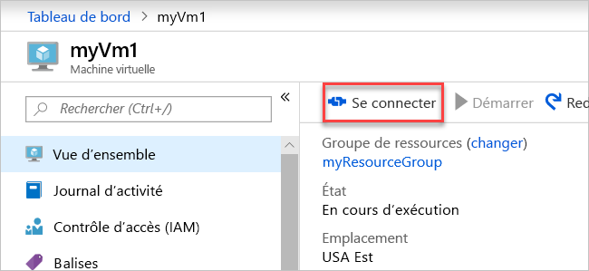

# <a name="create-a-virtual-network-using-the-azure-portal"></a>Créer un réseau virtuel au moyen du portail Azure

Un réseau virtuel permet à des ressources Azure, par exemple des machines virtuelles, de communiquer en privé entre elles et avec Internet. Dans cet article, vous allez apprendre à créer un réseau virtuel. Après avoir créé un réseau virtuel, déployez deux machines virtuelles dans le réseau virtuel. Vous vous connectez alors à une machine virtuelle à partir d’internet et vous communiquez en privé entre les deux machines virtuelles.

Si vous n’avez pas d’abonnement Azure, créez un [compte gratuit](https://azure.microsoft.com/free/?WT.mc_id=A261C142F) avant de commencer.

## <a name="log-in-to-azure"></a>Connexion à Azure 

Connectez-vous au portail Azure à l’adresse https://portal.azure.com.

## <a name="create-a-virtual-network"></a>Créez un réseau virtuel

1. Sélectionnez **+ Créer une ressource** en haut à gauche du portail Azure.
2. Sélectionnez **Mise en réseau**, puis **Réseau virtuel**.
3. Entrez ou sélectionnez les informations suivantes, acceptez les valeurs par défaut pour les autres paramètres, puis choisissez **Créer** :

    |Paramètre|Valeur|
    |---|---|
    |NOM|myVirtualNetwork|
    |Abonnement| Sélectionnez votre abonnement.|
    |Groupe de ressources| Sélectionnez **Créer** et entrez *myResourceGroup*.|
    |Lieu| Sélectionnez **Est des États-Unis**.|

    

## <a name="create-virtual-machines"></a>Créer des machines virtuelles

Créez deux machines virtuelles dans le réseau virtuel :

### <a name="create-the-first-vm"></a>Créer la première machine virtuelle

1. Sélectionnez **+ Créer une ressource** en haut à gauche du portail Azure.
2. Sélectionnez **Compute**, puis **Windows Server 2016 Datacenter**.
3. Entrez ou sélectionnez les informations suivantes, acceptez les valeurs par défaut pour les autres paramètres, puis cliquez sur **OK** :

    |Paramètre|Valeur|
    |---|---|
    |NOM|myVm1|
    |Nom d'utilisateur| Entrez un nom d’utilisateur de votre choix.|
    |Mot de passe| Entrez un mot de passe de votre choix. Le mot de passe doit contenir au moins 12 caractères et satisfaire aux [exigences de complexité définies](../virtual-machines/windows/faq.md?toc=%2fazure%2fvirtual-network%2ftoc.json#what-are-the-password-requirements-when-creating-a-vm).|
    |Abonnement| Sélectionnez votre abonnement.|
    |Groupe de ressources| Sélectionnez **Utiliser l’existant**, puis **myResourceGroup**.|
    |Lieu| Sélectionnez **Est des États-Unis**.|

    

4. Choisissez une taille de machine virtuelle, puis cliquez sur **Sélectionner**.
5. Sous **Paramètres**, acceptez toutes les valeurs par défaut, puis cliquez sur **OK**.

    

6. Sous **Créer** dans le **résumé**, sélectionnez **Créer** pour démarrer le déploiement de la machine virtuelle. Le déploiement de la machine virtuelle ne nécessite que quelques minutes. 

### <a name="create-the-second-vm"></a>Créer la seconde machine virtuelle

Répétez les étapes 1 à 6, mais à l’étape 3, nommez la machine virtuelle *myVm2*.

## <a name="connect-to-a-vm-from-the-internet"></a>Se connecter à une machine virtuelle à partir d’Internet

1. Après avoir créé *myVm1*, connectez-vous à cette machine virtuelle. En haut du portail Azure, entrez *myVm1*. Quand **myVm1** apparaît dans les résultats de la recherche, sélectionnez-la. Sélectionnez le bouton **Connexion**.

    

2. Après avoir sélectionné le bouton **Connexion**, le fichier .rdp (Remote Desktop Protocol) est créé et téléchargé sur votre ordinateur.  
3. Ouvrez le fichier .rdp téléchargé. Si vous y êtes invité, sélectionnez **Connexion**. Entrez le nom d’utilisateur et le mot de passe spécifiés lors de la création de la machine virtuelle. Vous devrez peut-être sélectionner **Plus de choix**, puis **Utiliser un autre compte**, pour spécifier les informations d’identification que vous avez entrées lorsque vous avez créé la machine virtuelle. 
4. Sélectionnez **OK**.
5. Un avertissement de certificat peut s’afficher pendant le processus de connexion. Si vous recevez l’avertissement, sélectionnez **Oui** ou **Continuer** pour poursuivre le processus de connexion.

## <a name="communicate-privately-between-vms"></a>Communiquer en privé entre les machines virtuelles

1. Dans PowerShell, entrez `ping myvm2`. Le test Ping échoue, étant donné qu’il utilise le protocole ICMP (Internet Control Message Protocol) et ICMP n’est pas autorisé via le pare-feu Windows, par défaut.
2. Pour autoriser *myVm2* à effectuer un test ping *myVm1* par la suite, entrez la commande suivante à partir de PowerShell, qui permet ICMP entrant via le pare-feu Windows :

    ```powershell
    New-NetFirewallRule –DisplayName “Allow ICMPv4-In” –Protocol ICMPv4
    ```

3. Fermez la connexion Bureau à distance sur *myVm1*. 

4. Effectuez à nouveau les étapes dans [Se connecter à une machine virtuelle à partir d’internet](#connect-to-a-vm-from-the-internet), mais connectez-vous à *myVm2*. À partir d’une invite de commandes, entrez `ping myvm1`.

    Vous recevez des réponses de *myVm1*, car vous avez autorisé ICMP via le pare-feu Windows sur la machine virtuelle *myVm1* lors d’une étape précédente.

5. Fermez la connexion Bureau à distance sur *myVm2*.

## <a name="clean-up-resources"></a>Supprimer des ressources

Quand vous n’avez plus besoin du groupe de ressources, supprimez-le, ainsi que toutes les ressources qu’il contient :

1. Entrez *myResourceGroup* dans le champ **Recherche** en haut du portail. Quand **myResourceGroup** apparaît dans les résultats de la recherche, sélectionnez-le.
2. Sélectionnez **Supprimer le groupe de ressources**.
3. Entrez *myResourceGroup* dans **TAPER NOM DU GROUPE DE RESSOURCES :** puis sélectionnez **Supprimer**.

## <a name="next-steps"></a>Étapes suivantes

Dans cet article, vous avez créé un réseau virtuel par défaut et deux machines virtuelles. Vous vous êtes connecté à une machine virtuelle à partir d’Internet et communiqué en privé entre la machine virtuelle et une autre. Pour plus d’informations sur les paramètres des réseaux virtuels, consultez [Gérer un réseau virtuel](manage-virtual-network.md).

Par défaut, Azure autorise une communication privée illimitée entre des machines virtuelles, mais permet uniquement les connexions Bureau à distance entrantes pour les machines virtuelles Windows à partir d’Internet. Pour découvrir comment autoriser ou limiter les différents types de communication réseau vers et depuis les machines virtuelles, passez au didacticiel suivant.

> [!div class="nextstepaction"]
> [Filtrer le trafic réseau](virtual-networks-create-nsg-arm-pportal.md)