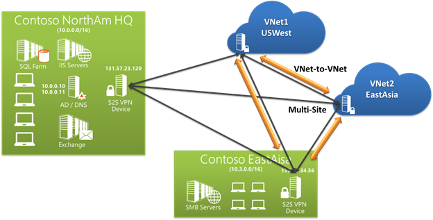
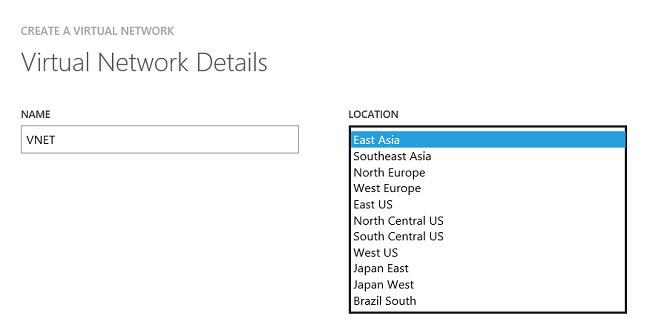
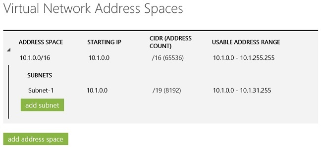
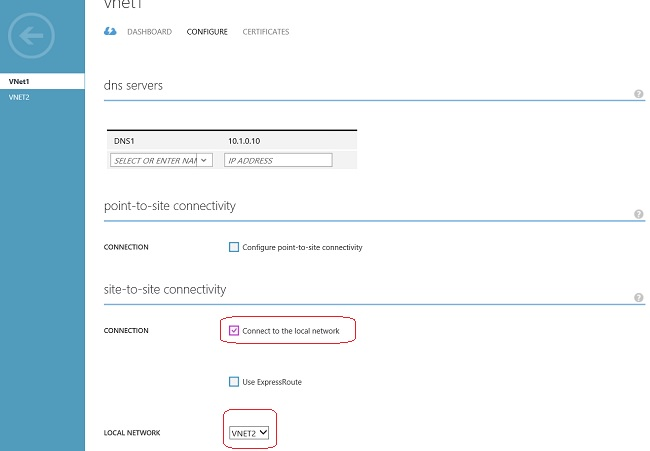

<properties
   pageTitle="Configuration d’une connexion de réseau virtuel à réseau virtuel"
   description="La connexion de réseau virtuel à réseau virtuel prend en charge la connexion de réseaux virtuels Azure. Elle ne prend pas en charge la connexion de machines virtuelles ou de services cloud qui ne sont PAS situés dans un réseau virtuel."
   services="virtual-network"
   documentationCenter="na"
   authors="cherylmc"
   manager="adinah"
   editor="tysonn"/>

<tags
   ms.service="virtual-network"
   ms.devlang="na"
   ms.topic="article"
   ms.tgt_pltfrm="na"
   ms.workload="infrastructure-services"
   ms.date="04/28/2015"
   ms.author="cherylmc"/>


# Configuration d’une connexion de réseau virtuel à réseau virtuel

La connexion entre deux réseaux virtuels Azure est semblable à la connexion d’un réseau virtuel à un emplacement de site local. Les deux types de connectivité font appel à une passerelle de réseau virtuel pour offrir un tunnel sécurisé utilisant Ipsec/IKE. Les réseaux virtuels que vous connectez peuvent être situés dans différents abonnements et différentes régions. Vous pouvez même combiner une communication de réseau virtuel à réseau virtuel avec des configurations multisites. Vous établissez ainsi des topologies réseau qui combinent une connectivité entre différents locaux et une connectivité entre différents réseaux virtuels, comme indiqué dans le schéma ci-dessous :



## Quelles sont les possibilités offertes par la connectivité de réseau virtuel à réseau virtuel ?

### Géo-redondance et présence géographique dans plusieurs régions
  - Vous pouvez configurer la géo-réplication ou la synchronisation avec une connectivité sécurisée sans passer par les points de terminaison accessibles sur Internet.
  - Avec l’équilibrage de charge Azure et les technologies de clustering Microsoft ou tierces, vous pouvez configurer une charge de travail hautement disponible avec la géo-redondance dans plusieurs régions Azure. Vous pouvez par exemple configurer SQL Always On avec des groupes de disponibilité répartis dans différentes régions Azure.

### Applications multiniveaux régionales avec une forte limite d’isolement
  - Dans la même région, vous pouvez configurer des applications multiniveaux avec plusieurs réseaux virtuels interconnectés avec une isolation renforcée et une communication sécurisée entre les niveaux.

### Communication interorganisationnelle entre plusieurs abonnements dans Azure
  - Si vous avez plusieurs abonnements Azure, vous pouvez désormais interconnecter des charges de travail à partir de différents abonnements en toute sécurité entre les réseaux virtuels.
  - Pour les entreprises ou fournisseurs de services, il est désormais possible d’activer la communication interorganisationnelle avec une technologie VPN sécurisée au sein d’Azure.

### Conditions requises et éléments à prendre en compte
  - La connexion de réseau virtuel à réseau virtuel prend en charge la connexion de réseaux virtuels Azure. Elle ne prend pas en charge la connexion de machines virtuelles ou de services cloud qui ne sont PAS situés dans un réseau virtuel.
  - La connexion de réseau virtuel à réseau virtuel nécessite des passerelles VPN Azure avec des VPN à routage dynamique. Les VPN à routage statique Azure ne sont pas pris en charge. L’interconnexion de plusieurs réseaux virtuels Azure ne requiert PAS de passerelle VPN locale, sauf si la connectivité entre différents locaux est requise.
  - La connectivité de réseau virtuel peut être utilisée simultanément avec des VPN multisite, avec un maximum de 10 tunnels VPN pour une passerelle VPN de réseau virtuel se connectant à d’autres réseaux virtuels ou à des sites locaux.
  - Les espaces d’adressage des réseaux virtuels et sur les sites de réseau locaux ne DOIVENT PAS se chevaucher. Le chevauchement des espaces d’adressage entraîne l’échec de la création de réseaux virtuels ou du téléchargement de fichiers de configuration netcfg.
  - Les réseaux virtuels peuvent être situés dans des abonnements identiques ou différents.
  - Les réseaux virtuels peuvent être situés dans des régions (emplacements) identiques ou différentes.
  - Les tunnels redondants entre deux réseaux virtuels ne sont pas pris en charge.
  - Un service cloud ou un point de terminaison d’équilibrage de charge NE PEUT PAS s’étendre sur différents réseaux virtuels, même si ces derniers sont interconnectés.
  - Tous les tunnels VPN du réseau virtuel, y compris les VPN de point à site, partagent la bande passante disponible sur la passerelle VPN Azure, ainsi que le même contrat SLA concernant le temps d’activité des passerelles VPN dans Azure.

## Configuration d’une connexion de réseau virtuel à réseau virtuel

Dans cette procédure, nous allons vous guider lors de la connexion de deux réseaux virtuels : VNet1 et VNet2. Vous devez disposer d’une bonne connaissance de la mise en réseau pour remplacer les plages d’adresses IP qui sont compatibles avec les exigences liées à la conception de votre réseau. À partir d’un réseau virtuel Azure, la connexion à un autre réseau virtuel Azure est identique à la connexion à un réseau local via un VPN de site à site.

Cette procédure utilise principalement le portail de gestion. Toutefois, vous devez utiliser les applets de commande PowerShell pour Microsoft Azure afin de connecter les passerelles VPN.


Il existe 5 sections à planifier et à configurer. Configurez chaque section dans l’ordre indiqué ci-dessous : 
1. [Planification de vos plages d’adresses IP](#plan-your-ip-address-ranges) 
2. [Création de vos réseaux virtuels](#create-your-virtual-networks)
3. [Ajout de réseaux locaux](#add-local-networks) 
4. [Création des passerelles de routage dynamique de chaque réseau virtuel](#create-the-dynamic-routing-gateways-for-each-vnet) 
5. [Connexion des passerelles VPN](#connect-the-vpn-gateways)

## Planification de vos plages d’adresses IP

Il est important de choisir les plages que vous utiliserez pour configurer votre fichier de configuration réseau (netcfg). Du point de vue de VNet1, VNet2 est simplement une autre connexion VPN définie dans la plateforme Azure. Et pour VNet2, VNet1 est simplement une autre connexion VPN. Ils s’identifient mutuellement comme un site de réseau local. N’oubliez pas que vous devez vous assurer qu’aucune plage de réseaux virtuels ou de réseaux locaux ne se chevauche.

Le tableau 1 montre un exemple de la définition de vos réseaux virtuels. Utilisez les plages ci-dessous comme indication uniquement. Écrivez les plages que vous utiliserez pour vos réseaux virtuels. Vous aurez besoin de ces informations pour les étapes ultérieures.

**Tableau 1**

|Réseau virtuel |Définition d’un site de réseau virtuel |Définition d’un site de réseau local|
|:----------------|:-------------------------------|:----------------------------|
|VNet1 |VNet1 (10.1.0.0/16) |VNet2 (10.2.0.0/16) |
|VNet2 |VNet2 (10.2.0.0/16) |VNet1 (10.1.0.0/16) |

## Création de vos réseaux virtuels

Dans le cadre de ce didacticiel, nous allons créer deux réseaux virtuels : VNet1 et VNet2. Utilisez vos propres valeurs lors de la création de vos réseaux virtuels. Dans le cadre de ce didacticiel, nous allons utiliser les valeurs suivantes pour les réseaux virtuels :

VNet1 : espace d’adressage = 10.1.0.0/16 ; Région = Ouest des États-Unis

VNet2 : espace d’adressage = 10.2.0.0/16 ; Région = Est du Japon

1. Connectez-vous au **portail de gestion**.

2. Dans le coin inférieur gauche de l'écran, cliquez sur **Nouveau**. Dans le volet de navigation, cliquez sur **Services réseau**, puis sur **Réseau virtuel**. Cliquez sur **Custom Create** pour démarrer l'Assistant Configuration.

3. Dans la page **Détails du réseau virtuel**, entrez les informations suivantes. Pour plus d’informations sur les paramètres de la page de détails, consultez la page [Détails du réseau virtuel](https://msdn.microsoft.com/library/azure/09926218-92ab-4f43-aa99-83ab4d355555#BKMK_VNetDetails).

  

  - **Nom** : nommez votre réseau virtuel. Par exemple : VNet1
  - **Emplacement** : lorsque vous créez un réseau virtuel, vous l’associez à un emplacement Azure (région). Par exemple, si vous souhaitez que vos machines virtuelles déployées sur votre réseau virtuel soient physiquement situées dans la région Ouest des États-Unis, sélectionnez cet emplacement. Vous ne pouvez pas modifier l’emplacement associé à votre réseau virtuel après sa création.

4. Sur la page **Serveurs DNS et connectivité VPN**, entrez les informations suivantes, puis cliquez sur la flèche Suivant située dans le coin inférieur droit. Pour plus d’informations sur les paramètres de cette page, consultez la [page Serveurs DNS et connectivité VPN](https://msdn.microsoft.com/library/azure/09926218-92ab-4f43-aa99-83ab4d355555#BKMK_VNETDNS).

  

 - **Serveurs DNS** : entrez le nom et l’adresse IP du serveur DNS ou sélectionnez un serveur DNS précédemment inscrit dans la liste déroulante. Ce paramètre ne crée pas de serveur DNS. Il vous permet de spécifier les serveurs DNS que vous souhaitez utiliser pour la résolution de noms pour ce réseau virtuel. Si vous souhaitez disposer de la résolution de noms entre vos réseaux virtuels, vous devez configurer votre propre serveur DNS plutôt que d’utiliser la résolution de noms fournie par Azure.

  - N’activez aucune des cases à cocher. Cliquez sur la flèche située en bas à droite pour passer à l’écran suivant.

5. Dans la page **Espaces d’adresses du réseau virtuel**, indiquez la plage d’adresses que vous voulez utiliser pour votre réseau virtuel. Il s’agit des adresses IP dynamiques qui seront affectées aux machines virtuelles et aux autres instances de rôle que vous déployez dans ce réseau virtuel. Il existe quelques règles concernant l’espace d’adressage de réseau virtuel. Pour plus d’informations, consultez la page [Espaces d’adressage du réseau virtuel](https://msdn.microsoft.com/library/azure/09926218-92ab-4f43-aa99-83ab4d355555#BKMK_VNET_ADDRESS). Il est particulièrement important de sélectionner une plage qui ne chevauche pas une des plages qui sont utilisées pour votre réseau local. Vous devez contacter votre administrateur réseau, qui peut extraire une plage d’adresses IP de votre espace d’adressage de réseau local pour l’utiliser pour votre réseau virtuel.

  Entrez les informations suivantes, puis cliquez sur la coche située dans le coin inférieur droit pour configurer votre réseau.

  

  - **Espace d’adressage** : inclut l’adresse IP de départ et le nombre d’adresses. Vérifiez que les espaces d’adressage que vous spécifiez ne chevauchent pas les espaces d’adressage de votre réseau local. Pour cet exemple, nous allons utiliser 10.1.0.0/16 pour VNet1.
  - **Ajouter un sous-réseau** : inclut l’adresse IP de départ et le nombre d’adresses. Des sous-réseaux supplémentaires ne sont pas requis, mais vous pouvez créer un sous-réseau distinct pour les machines virtuelles qui ont des adresses IP dédiées statiques. Vous pouvez également placer vos machines virtuelles dans un sous-réseau séparé de vos autres instances de rôle.

6. Cliquez sur la coche en bas à droite de la page pour créer votre réseau virtuel. Après la création de votre réseau virtuel, le statut Créé apparaît sous **État** dans la page **Réseaux** du portail de gestion.

7. Créez un autre réseau virtuel. Dans le cadre de ce didacticiel, utilisez les valeurs suivantes : **VNet2** : espace d’adressage = 10.2.0.0/16 ; Région = Est du Japon

## Ajout de réseaux locaux

Quand vous créez une configuration de réseau virtuel à réseau virtuel, vous devez configurer chaque réseau virtuel pour identifier l’autre comme un site de réseau local. Dans cette procédure, vous allez configurer chaque réseau virtuel comme réseau local. Si vous avez déjà configuré des réseaux virtuels, c’est ici que vous pouvez les ajouter comme réseaux locaux dans le portail de gestion.

1. Dans le coin inférieur gauche de l'écran, cliquez sur **Nouveau**. Dans le volet de navigation, cliquez sur **Services réseau**, puis sur **Réseau virtuel**. Cliquez sur **Ajouter un réseau local**

2. Dans la page **Spécifier les détails de votre réseau local**, pour **Nom**, entrez le nom d’un réseau virtuel que vous souhaitez utiliser dans votre configuration de réseau virtuel à réseau virtuel. Pour cet exemple, nous allons utiliser VNet1, car nous allons faire pointer VNet2 vers ce réseau virtuel pour notre configuration.

  Pour le périphérique VPN, utilisez n’importe quelle adresse IP. En général, vous utilisez la véritable adresse IP externe d’un périphérique VPN. Pour les configurations de réseau virtuel à réseau virtuel, vous allez utiliser l’adresse IP de la passerelle. Toutefois, étant donné que vous n’avez pas encore créé la passerelle, nous utilisons l’adresse IP que vous spécifiez ici comme espace réservé. Vous revenez ensuite dans ces paramètres et vous les configurez avec les adresses IP de passerelle correspondantes une fois celles-ci générées par Azure.

3. Dans la page **Spécifier l’espace d’adresses**, indiquez la plage d’adresses IP et le nombre d’adresses réels pour VNet1. Ces valeurs doivent correspondre exactement à la plage spécifiée précédemment pour VNet1.

4. Après avoir configuré VNet1 comme réseau local, revenez en arrière et configurez VNet2 à l’aide des valeurs correspondantes.

5. Faites maintenant pointer chaque réseau virtuel l’un avec l’autre en tant que réseau local. Dans le portail de gestion, accédez à la page **Configurer** pour VNet1. Sous **Connectivité de site à site**, sélectionnez **Se connecter au réseau local**, puis **VNET2** comme réseau local.

  

6. Dans la section **Espace d’adresses du réseau virtuel** de la même page, cliquez sur **Ajouter un sous-réseau de passerelle**, puis sur l’icône **Enregistrer** située en bas de la page pour enregistrer votre configuration.

7. Répétez l’étape pour VNet2 de manière à spécifier VNet1 comme réseau local.

## Création des passerelles de routage dynamique de chaque réseau virtuel

Maintenant que vous avez configuré chaque réseau virtuel, vous allez configurer vos passerelles de réseau virtuel.

1. Dans la page **Réseaux**, vérifiez que la colonne d’état de votre réseau virtuel est définie sur **Créé**.

2. Dans la colonne **Nom**, cliquez sur le nom de votre réseau virtuel.

3. Dans la page **Tableau de bord** , notez que pour ce réseau virtuel, aucune passerelle n’est encore configurée. Vous verrez cet état évoluer tout au long des étapes de configuration de votre passerelle.

4. Cliquez sur **Créer une passerelle** en bas de la page.

  Vous devez sélectionner **Routage dynamique**. Lorsque le système vous demande de confirmer la création de la passerelle, cliquez sur Oui.

  

5. Lorsque la passerelle est en cours de création, notez que le graphique de la passerelle sur la page devient jaune et indique Création d’une passerelle. La création d’une passerelle dure généralement environ 15 minutes.

6. Répétez les mêmes étapes pour l’autre réseau virtuel, en veillant à sélectionner **Passerelle dynamique**. Vous n’avez pas besoin de terminer la première passerelle de réseau virtuel avant de commencer à créer la passerelle de l’autre réseau virtuel.

7. Quand l’état de la passerelle devient Connexion en cours, l’adresse IP de chaque passerelle s’affiche dans le tableau de bord. Notez l’adresse IP qui correspond à chaque réseau virtuel, en prenant soin de ne pas les mélanger. Vous utiliserez ces adresses IP pour remplacer les adresses IP d’espace réservé du périphérique VPN dans **Réseaux locaux**.

## Modification du réseau local

1. Dans la page **Réseaux locaux**, cliquez sur le nom du réseau local à modifier, puis cliquez sur **Modifier** en bas de la page. Pour **Adresse IP du périphérique VPN**, entrez l’adresse IP de la passerelle qui correspond au réseau virtuel. Par exemple, pour VNet1, indiquez l’adresse IP de passerelle attribuée à VNet1. Cliquez ensuite sur la flèche en bas de la page.

2. Dans la page **Spécifier l’espace d’adresses**, cliquez sur la coche en bas à droite sans apporter de modifications.

## Connexion des passerelles VPN

Lorsque vous avez terminé les étapes précédentes, définissez les clés prépartagées IPsec/IKE sur des valeurs identiques. Pour ce faire, utilisez une API REST ou une applet de commande PowerShell. Si vous utilisez PowerShell, vérifiez que vous disposez de la dernière version des applets de commande PowerShell de Microsoft Azure. Les exemples ci-dessous utilisent les applets de commande PowerShell pour définir la valeur de clé sur A1b2C3D4. Notez qu’ils utilisent tous les deux la même valeur de clé. Modifiez les exemples ci-dessous en spécifiant vos propres valeurs.

Pour VNet1

````PS C:> Set-AzureVNetGatewayKey -VNetName VNet1 -LocalNetworkSiteName VNet2 -SharedKey A1b2C3D4````

For VNet2

````PS C:> Set-AzureVNetGatewayKey -VNetName VNet2 -LocalNetworkSiteName VNet1 -SharedKey A1b2C3D4````

Attendez l’initialisation des connexions. Une fois la passerelle initialisée, elle ressemble au graphique ci-dessous. Vos réseaux virtuels sont alors connectés.


##Voir aussi

**Concepts**

[Présentation du réseau virtuel](https://msdn.microsoft.com/library/azure/jj156007.aspx)

[Schéma de configuration du réseau virtuel Azure](https://msdn.microsoft.com/library/azure/jj157100.aspx)

[Opérations sur les réseaux virtuels](https://msdn.microsoft.com/library/azure/jj157182.aspx)

[Opérations sur les passerelles de réseau virtuel](https://msdn.microsoft.com/library/azure/jj154113.aspx)

**Autres ressources**

[Billet de blog : connexions entre deux réseaux virtuels au sein de différentes régions](http://azure.microsoft.com/blog/2014/06/17/vnet-to-vnet-connecting-virtual-networks-in-azure-across-different-regions/)

<!--HONumber=52-->
