# Migration vers Azure Virtual WAN
Azure Virtual WAN permet aux entreprises de simplifier leur connectivité globale et de tirer parti de l’étendue du réseau global de Microsoft. Ce livre blanc fournit des détails techniques pour les entreprises souhaitant passer d’une topologie hub-and-spoke existante managée par le client à une conception tirant parti des hubs Virtual WAN managés par Microsoft.

L’article [Architecture du réseau de transit global Virtual WAN](virtual-wan-global-transit-network-architecture.md) souligne les avantages d’Azure Virtual WAN pour les entreprises adoptant un réseau international d’entreprise moderne centré sur le cloud.

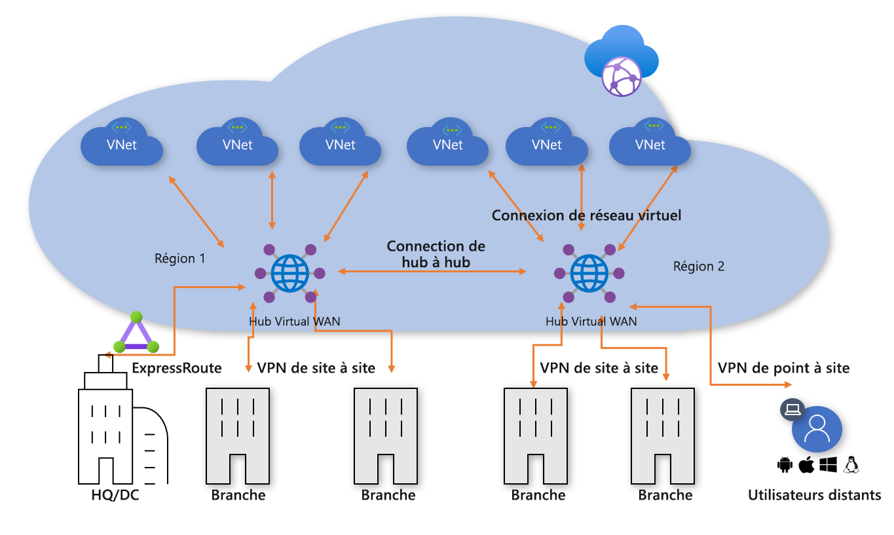
**Figure 1 : Azure Virtual WAN**

Le modèle de connectivité hub-and-spoke d’Azure Virtual Datacenter (VDC) a été adopté par des milliers de clients pour tirer parti du comportement de routage transitif par défaut de la mise en réseau Azure pour créer des réseaux cloud simples et évolutifs. Azure Virtual WAN est basé sur ces concepts et introduit de nouvelles fonctionnalités qui permettent des topologies de connectivité globale (pas uniquement entre des emplacements locaux et Azure) et qui permettent aussi aux clients de tirer parti de toute l’étendue du réseau Microsoft pour augmenter leurs réseaux mondiaux existants.

Cet article explique comment migrer un environnement hybride existant vers Virtual WAN.

## Scénario

Contoso est une organisation financière internationale avec des bureaux en Europe et en Asie. Cette organisation envisage de déplacer ses applications existantes depuis un centre de données local vers Azure et a développé une conception de base qui s’appuie sur l’architecture VDC, y compris des réseaux virtuels de type hub managés par les clients régionaux pour la connectivité hybride. Dans le cadre du passage aux technologies basées sur le cloud, l’équipe réseau a été chargée de s’assurer que la connectivité est optimisée pour les activités à venir de l’organisation.

La Figure 2 illustre une vue générale du réseau global existant, y compris la connectivité à plusieurs régions Azure.

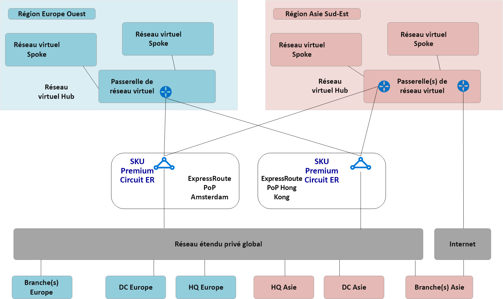
**Figure 2 : La topologie du réseau existant chez Contoso**

Dans la topologie de réseau existante, on peut noter les points suivants :
 
- Une topologie de réseau en étoile (hub-and-spoke) est utilisée dans plusieurs régions, notamment dans les circuits ExpressRoute Premium pour la connectivité à un réseau étendu privé commun.
- Certains de ces sites disposent également de tunnels VPN vers Azure pour atteindre les applications hébergées dans le cloud Microsoft.

## Configuration requise
L’équipe qui s’occupe du réseau a été chargée de mettre en œuvre un modèle de réseau global capable de prendre en charge la migration de Contoso vers le cloud et d’optimiser les coûts, la mise à l’échelle et les performances. Voici un résumé des exigences à satisfaire :
- Fournir au siège social (HQ) et aux filiales un chemin optimisé vers les applications hébergées dans le cloud 
- Supprimer la dépendance aux centres de données locaux existants afin d’arrêter le VPN tout en conservant les chemins de connectivité suivants :
    - **Branche vers réseau virtuel** : Les bureaux connectés à un VPN doivent être en mesure d’accéder aux applications migrées vers le cloud dans la région Azure locale.
    - **Branche vers hub à hub vers réseau virtuel** : Les bureaux connectés à un VPN doivent être en mesure d’accéder aux applications migrées vers le cloud dans la région Azure distante. 
    - **Branche vers branche** : Les bureaux régionaux connectés à un VPN doivent être en mesure de communiquer entre eux et avec les sites HQ/DC ExpressRoute connectés. 
    - **Branche vers hub à hub vers branche** : Les bureaux distants connectés à un VPN doivent être en mesure de communiquer entre eux et avec tous les sites HQ/DC ExpressRoute connectés.
    - **Branche vers Internet** : Les sites connectés doivent être en mesure de communiquer avec Internet et ce trafic doit être filtré et enregistré.
    - **Réseau virtuel vers réseau virtuel** : Les réseaux virtuels de type spoke d’une même région doivent être en mesure de communiquer entre eux.
    - **Réseau virtuel vers hub à hub vers réseau virtuel** : Les réseaux virtuels de type spoke de régions différentes doivent être en mesure de communiquer entre eux.
- Offrir aux utilisateurs itinérants de Contoso (ordinateur portable et téléphone) la possibilité d’accéder aux ressources de l’entreprise, même sans connexion au réseau de l’entreprise

## Architecture d’Azure Virtual WAN

La Figure 3 illustre une vue d’ensemble de la topologie cible mise à jour à l’aide d’Azure Virtual WAN pour répondre aux exigences décrites dans la section précédente.

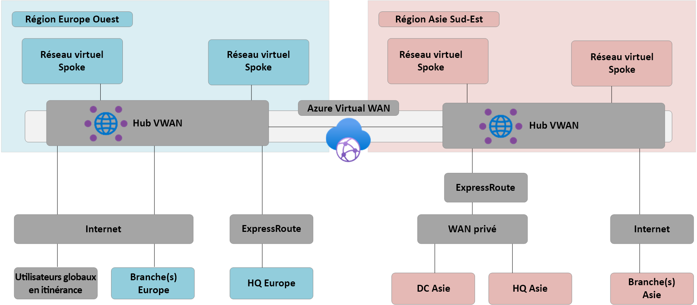
**Figure 3 : Architecture d’Azure Virtual WAN**

En résumé : 
- Le siège social en Europe reste connecté à ExpressRoute, tandis que les contrôleurs de domaine locaux en Europe ont été entièrement migrés vers Azure, puis désactivés.
- Le contrôleur de domaine et le siège social d’Asie restent connectés à un WAN privé. Azure Virtual WAN est désormais utilisé pour augmenter le réseau de l’opérateur local et fournir une connectivité globale. 
- Des hubs Azure Virtual WAN ont été déployés dans les régions Azure Europe Ouest et Asie Sud-Est pour fournir un hub de connectivité aux appareils connectés à ExpressRoute et au VPN. 
- Les hubs fournissent également un arrêt VPN pour les utilisateurs itinérants sur plusieurs types de clients à l’aide de la connectivité OpenVPN au réseau de maillage global. Ainsi, ils peuvent accéder non seulement aux applications migrées vers Azure, mais également à toutes les ressources locales. 
- Connectivité Internet pour les ressources au sein d’un réseau virtuel fournie par Azure Virtual WAN. Connectivité Internet pour les sites distants également fournie par Azure Virtual WAN. Local Internet Breakout pris en charge via l’intégration des partenaires pour un accès optimisé aux services SaaS tels qu’Office 365.

## Migration vers Azure Virtual WAN

Cette section décrit les différentes étapes de la migration vers Azure Virtual WAN.
 
### VDC hub-and-spoke à une seule région

La figure suivante illustre une topologie à une seule région pour Contoso avant le lancement d’Azure Virtual WAN.

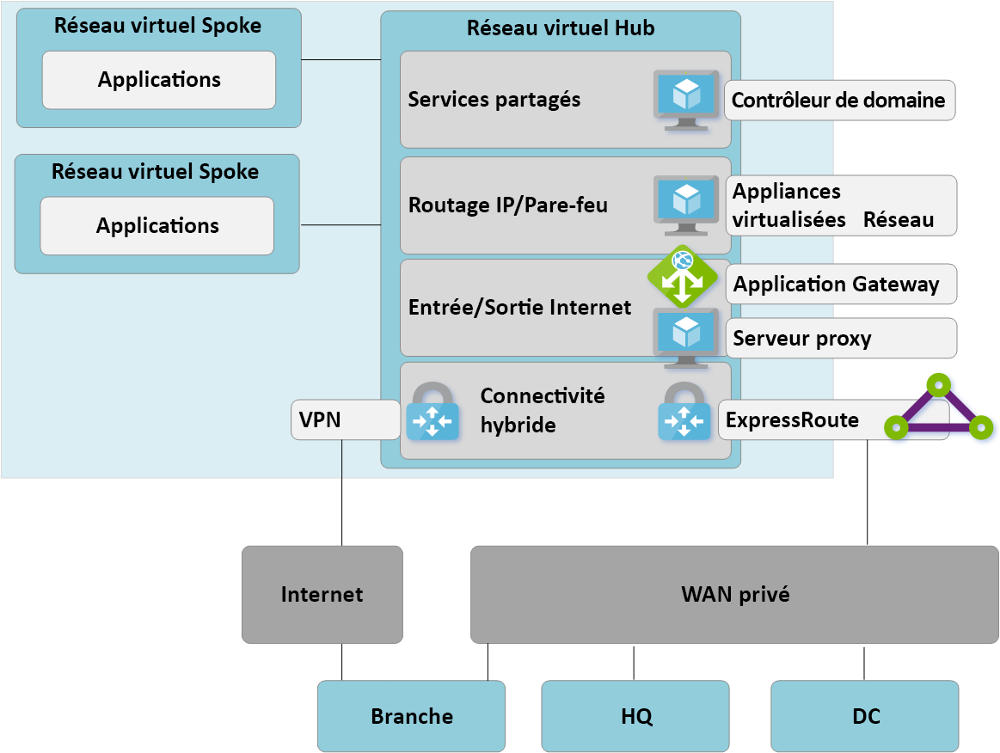

 **Figure 4 : VDC hub-and-spoke à une seule région - Étape 1**

Conformément à l’approche VDC, le réseau virtuel hub managé par le client contient plusieurs blocs de fonctions :
- Services partagés (toute fonction commune requise par plusieurs spokes) : Contoso utilise par exemple des contrôleurs de domaine Windows Server sur des machines virtuelles IaaS.
- Les services de pare-feu d’adresse IP/de routage sont fournis par une appliance virtuelle de réseau tierce, ce qui permet un routage d’adresse IP de couche 3 de type « spoke à spoke ». 
- Services d’entrée/sortie Internet incluant la passerelle Azure Application pour les requêtes HTTPS entrantes et les services proxy tiers exécutés sur des machines virtuelles pour un accès sortant filtré aux ressources Internet.
- ExpressRoute et passerelle de réseau virtuel VPN pour la connectivité aux réseaux locaux.

### Déploiement des hubs Virtual WAN

La première étape consiste à déployer un hub Virtual WAN dans chaque région. Configurez le hub Virtual WAN avec la passerelle VPN et la passerelle ExpressRoute, comme décrit dans les articles suivants :  
- [Tutoriel : Créer une connexion de site à site à l’aide d’Azure Virtual WAN](virtual-wan-site-to-site-portal.md)
- [Tutoriel : Créer une association ExpressRoute avec Azure Virtual WAN](virtual-wan-expressroute-portal.md) 

> [!NOTE]
> Azure Virtual WAN doit utiliser la référence SKU standard pour activer certains des chemins de trafic décrits dans cet article.

**Figure 5 : Migration du VDC hub-and-spoke vers Virtual WAN - Étape 2**

### Connexion des sites distants (ExpressRoute et VPN) à Virtual WAN

À présent, nous allons connecter le hub Virtual WAN aux circuits ExpressRoute existants et configurer des VPN de site à site via Internet vers toutes les branches distantes.

> [!NOTE]
> Les circuits ExpressRoute doivent être mis à niveau vers le type de référence SKU Premium pour se connecter au hub Virtual WAN.

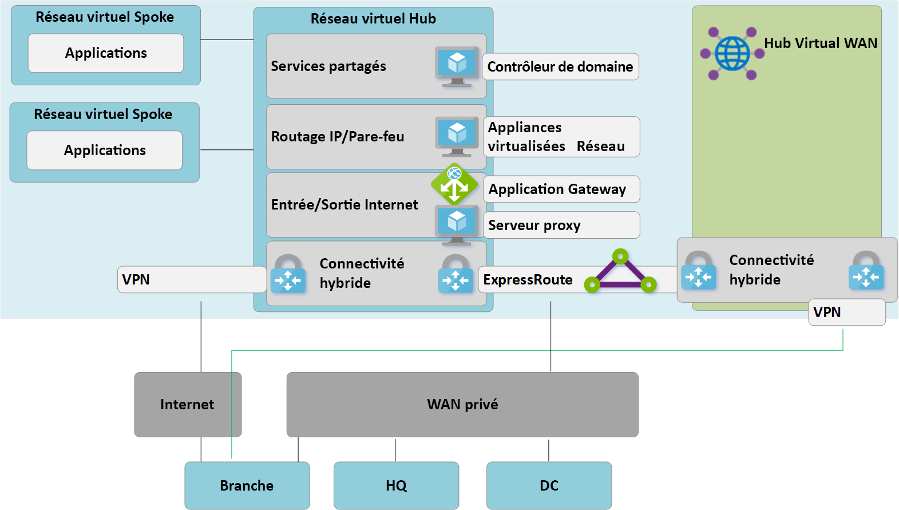
**Figure 6 : Migration du VDC hub-and-spoke vers Virtual WAN - Étape 3**

À ce stade, l’équipement réseau local commencera à recevoir des routes reflétant l’espace d’adressage IP affecté au réseau virtuel hub managé par Virtual WAN. À ce stade, les branches distantes connectées via un VPN voient deux chemins d’accès à toutes les applications existantes sur les réseaux virtuels spoke. Ces appareils doivent être configurés pour continuer à utiliser le tunnel vers le hub VDC pour garantir un routage symétrique pendant la phase de transition.

### Test de la connectivité hybride par le biais de Virtual WAN

Avant d’utiliser le hub Virtual WAN managé pour la connectivité en production, il est recommandé de configurer un réseau virtuel spoke de test et une connexion de réseau virtuel Virtual WAN. Vérifiez que les connexions à cet environnement de test fonctionnent via ExpressRoute et le VPN de site à site avant de passer aux étapes suivantes.

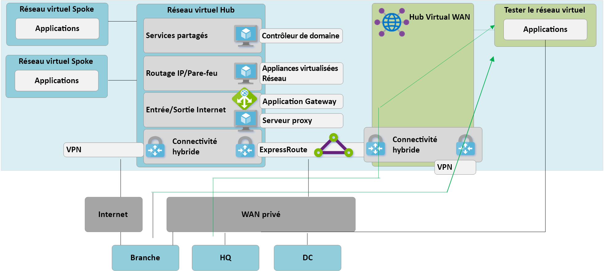
**Figure 7 : Migration du VDC hub-and-spoke vers Virtual WAN - Étape 4**

### Transition de connectivité vers le hub Virtual WAN

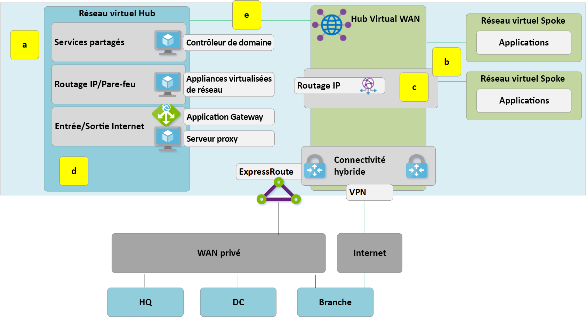
**Figure 8 : Migration du VDC hub-and-spoke vers Virtual WAN - Étape 5**

**a**. Supprimez les connexions de peering existantes des réseaux virtuels spoke vers l’ancien hub VDC. L’accès aux applications sur les réseaux virtuels spoke n’est pas possible tant que les étapes a à c ne sont pas terminées.

**b**. Connectez les réseaux virtuels spoke au hub Virtual WAN par le biais de connexions de réseau virtuel.

**c**. Supprimez tous les itinéraires définis par l’utilisateur précédemment utilisés sur les réseaux virtuels spoke pour les communications de type spoke à spoke. Ce chemin est désormais accessible par le routage dynamique disponible dans le hub Virtual WAN.

**d**. Les passerelles VPN et ExpressRoute existantes dans le hub VDC sont maintenant désactivées pour autoriser le passage à l’étape suivante (e).

**e**. Connectez l’ancien hub VDC (réseau virtuel hub) au hub Virtual WAN par le biais d’une nouvelle connexion de réseau virtuel.

### L’ancien hub devient un spoke de services partagés

Nous avons maintenant repensé notre réseau Azure pour que le hub Virtual WAN soit le point central de notre nouvelle topologie.

**Figure 9 : Migration du VDC hub-and-spoke vers Virtual WAN - Étape 6**

Étant donné que le hub Virtual WAN est une entité managée et qu’il n’autorise pas le déploiement de ressources personnalisées telles que des machines virtuelles, le bloc de services partagés existe désormais en tant que réseau virtuel spoke et héberge des fonctions telles que l’entrée Internet par le biais de la passerelle Azure Application ou l’appliance virtuelle de réseau. Le trafic entre l’environnement de services partagés et les machines virtuelles back-end transite désormais par le hub managé par Virtual WAN.

### Optimisation de la connectivité locale pour exploiter pleinement Virtual WAN

À ce niveau, Contoso a migré la plupart de ses applications métier dans le cloud Microsoft. Il ne reste plus que quelques applications héritées dans le contrôleur de domaine local.

**Figure 10 : Migration du VDC hub-and-spoke vers Virtual WAN - Étape 7**

 Pour tirer parti de toutes les fonctionnalités d’Azure Virtual WAN, Contoso a décidé de désactiver ses connexions VPN locales héritées. Toutes les branches qui continuent d’accéder aux réseaux du siège social ou du contrôleur de domaine sont en mesure de transiter par le réseau global de Microsoft à l’aide du routage de transit intégré à Azure Virtual WAN. 

> [!NOTE]
> Les clients qui souhaitent tirer parti de l’infrastructure principale de Microsoft pour compléter leurs WAN privés existants peuvent aussi utiliser ExpressRoute Global Reach.

## Architecture finalisée et chemins du trafic

**Figure 11 : Virtual WAN à deux régions**

Cette section fournit un résumé de la façon dont cette topologie répond aux exigences d’origine en examinant des exemples de flux de trafic.

### Chemin 1

Le chemin 1 décrit le flux du trafic entre une branche connectée VPN S2S en Asie et un réseau virtuel Azure dans la région Asie Sud-Est.

Le trafic est routé comme suit :
- La branche Asie est connectée par le biais de tunnels BGP S2S résilients dans le hub Virtual WAN de la région Asie Sud-Est.
- Le hub Virtual WAN en Asie achemine le trafic localement vers le réseau virtuel connecté.

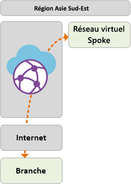

### Chemin 2
Le chemin 2 décrit le flux du trafic entre le siège en Europe connecté via ExpressRoute et le réseau virtuel Azure de la région Asie Sud-Est.

Le trafic est routé comme suit :
- Le siège européen est connecté via le circuit ExpressRoute Premium au hub Virtual WAN de la région Europe Ouest.
- La connectivité globale de hub à hub Virtual WAN permet un transit du trafic vers le réseau virtuel connecté dans une région distante.

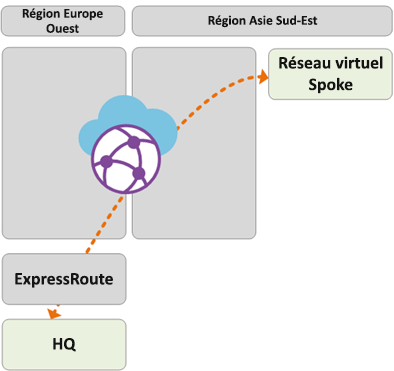

### Chemin 3
Le chemin 3 décrit le flux du trafic entre le contrôleur de domaine local en Asie connecté au WAN privé et une branche européenne connectée de site à site.

Le trafic est routé comme suit :
- Le contrôleur de domaine en Asie est connecté à l’opérateur du WAN privé local.
- Le circuit ExpressRoute se termine localement là où le WAN privé se connecte au hub Virtual WAN de la région Asie Sud-Est.
- La connectivité globale de hub à hub Virtual WAN permet le transit du trafic.

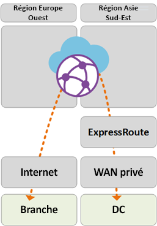

### Chemin 4
Le chemin 4 décrit le flux du trafic entre un réseau virtuel Azure de la région Asie Sud-Est et le réseau virtuel Azure de la région Europe Ouest.

Le trafic est routé comme suit :
- La connectivité globale de hub à hub Virtual WAN permet le transit natif de tous les réseaux virtuels Azure connectés sans configuration utilisateur supplémentaire.

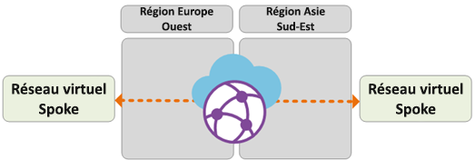

### Chemin 5
Le chemin 5 décrit le flux du trafic entre les utilisateurs itinérants de VPN (P2S) et le réseau virtuel Azure de la région Europe Ouest.

Le trafic est routé comme suit :
- Les utilisateurs d’ordinateurs portables et d’appareils mobiles utilisent le client OpenVPN pour une connectivité transparente vers la passerelle VPN P2S de la région Europe Ouest.
- Le hub Virtual WAN de la région Europe Ouest achemine le trafic localement vers le réseau virtuel connecté.

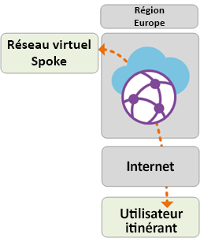

## Sécurité et contrôle de stratégie via le pare-feu Azure

Contoso dispose maintenant d’une connectivité validée entre toutes les branches et les réseaux virtuels, qui est conforme aux exigences abordées précédemment dans ce document. Pour répondre à ses besoins en contrôle de sécurité et isolement réseau, l’entreprise doit continuer à séparer et à enregistrer le trafic via le réseau hub. Avant cette fonction était exécutée par une appliance virtuelle réseau. Contoso souhaite également désactiver ses services proxy existants et utiliser les services Azure natifs pour le filtrage Internet sortant. 

**Figure 12 : Pare-feu Azure dans Virtual WAN (hub virtuel sécurisé)**

Les étapes générales suivantes sont requises pour introduire le pare-feu Azure dans les hubs Virtual WAN afin d’obtenir un point de contrôle de stratégie unifié. Ce processus et le concept de hubs virtuels sécurisés sont expliqués en détail [ici](https://go.microsoft.com/fwlink/?linkid=2107683).
- Créez une stratégie de pare-feu Azure.
- Liez la stratégie de pare-feu au hub Azure Virtual WAN.
- L’étape ci-dessus permet au hub Virtual WAN existant de fonctionner en tant que hub virtuel sécurisé et permet de déployer les ressources de pare-feu Azure nécessaires.

> [!NOTE]
> Si le pare-feu Azure est déployé dans un hub Virtual WAN standard (SKU : Standard) : Les stratégies de pare-feu V2V, B2V, V2I et B2I sont uniquement appliquées sur le trafic provenant des réseaux virtuels et des branches connectés au hub spécifique sur lequel le pare-feu Azure est déployé (hub sécurisé). Le trafic provenant de réseaux virtuels et de branches distants joints à d’autres hubs Virtual WAN sur le même Virtual WAN ne passera pas par le pare-feu, même si ces branches et réseaux virtuels distants sont interconnectés via des liens de hub à hub Virtual WAN. La prise en charge du pare-feu entre les hubs est inscrite sur la feuille de route Azure Virtual WAN et Firewall Manager.

Les chemins d’accès suivants décrivent les chemins de connectivité activés grâce aux hubs virtuels sécurisés Azure.

### Chemin 6
Le chemin 6 décrit le flux du trafic sécurisé entre les réseaux virtuels de la même région.

Le trafic est routé comme suit :
- Les réseaux virtuels connectés au même hub virtuel sécurisé acheminent désormais le trafic via le pare-feu Azure.
- Le pare-feu Azure peut appliquer une stratégie à ces flux.

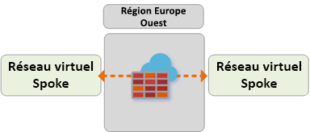

### Chemin 7
Le chemin 7 décrit le flux du trafic entre un réseau virtuel Azure et Internet ou un service de sécurité tiers.

Le trafic est routé comme suit :
- Les réseaux virtuels connectés au hub virtuel sécurisé peuvent envoyer du trafic au public (des destinations sur Internet) en utilisant le hub sécurisé comme point central d’accès à Internet.
- Ce trafic peut être filtré localement à l’aide des règles FQDN du pare-feu Azure ou envoyé à un service de sécurité tiers à des fins d’inspection.

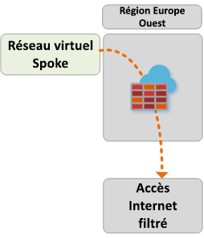

### Chemin 8
Le chemin 8 décrit le flux du trafic à partir d’une branche vers Internet ou un service de sécurité tiers.

Le trafic est routé comme suit :
- Les branches connectées au hub virtuel sécurisé peuvent envoyer du trafic au public (des destinations sur Internet) en utilisant le hub sécurisé comme point central d’accès à Internet.
- Ce trafic peut être filtré localement à l’aide des règles FQDN du pare-feu Azure ou envoyé à un service de sécurité tiers à des fins d’inspection.

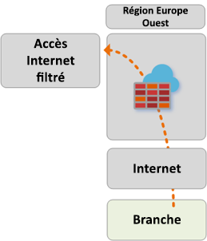 

## Étapes suivantes
En savoir plus sur [Azure Virtual WAN](virtual-wan-about.md)
