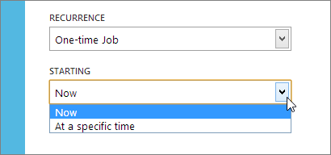
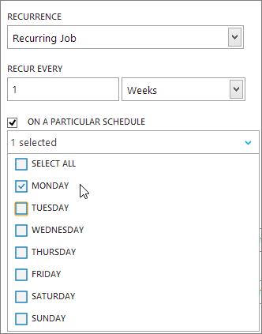
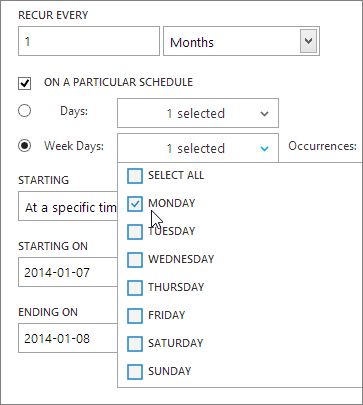
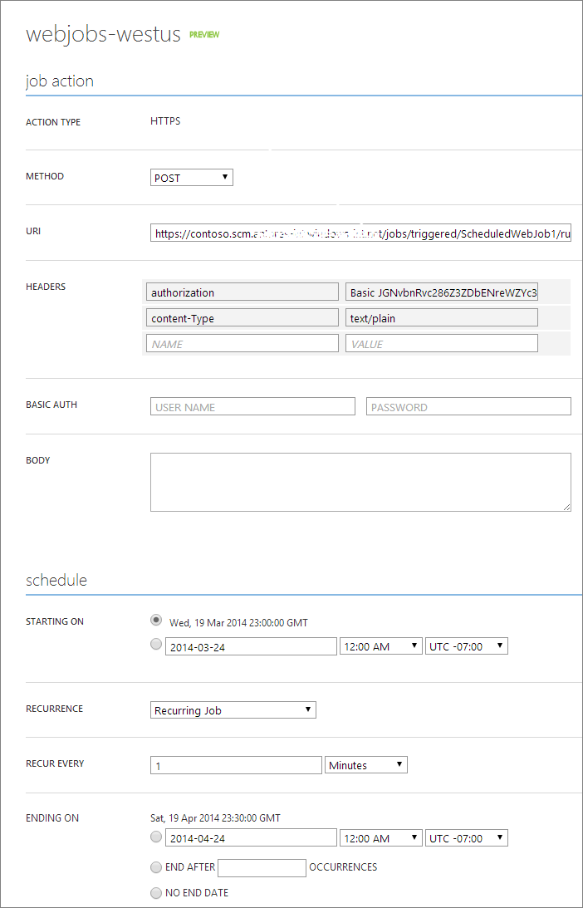
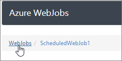

<properties linkid="web-sites-create-web-jobs" urlDisplayName="How to create web jobs in Microsoft Azure" pageTitle="How to Create Web Jobs in Microsoft Azure Web Sites" metaKeywords="Microsoft Azure Web Sites, Web Jobs" description="Learn how to create web jobs in Microsoft Azure Web Sites." metaCanonical="" services="web-sites" documentationCenter="" title="How to Create Web Jobs in Microsoft Azure Web Sites" authors="timamm" solutions="" writer="timamm" manager="paulettm" editor="mollybos" />

Utilisation de la fonctionnalité WebJobs dans Microsoft Azure Web Sites
=======================================================================

Microsoft Azure Web Sites propose trois méthodes pour exécuter des programmes ou des scripts dans votre site Web Azure : à la demande, en continu ou par planification. L'utilisation de Microsoft Azure WebJobs n'entraine pas de frais supplémentaires, sauf si vous souhaitez activer la fonctionnalité Always On décrite plus bas dans cet article.

Sommaire
--------

-   [Types de fichier acceptables pour les scripts](#acceptablefiles)
-   [Création d'une tâche à la demande](#CreateOnDemand)
-   [Création d'une tâche exécutée en continu](#CreateContinuous)
-   [Création d'une tâche planifiée](#CreateScheduled)
    -   [Tâches planifiées et Azure Scheduler](#Scheduler)
-   [Affichage de l'historique des tâches](#ViewJobHistory)
-   [Remarques](#WHPNotes)
-   [Étapes suivantes](#NextSteps)
    -   [Amélioration des résultats avec le Kit de développement logiciel (SDK) Azure WebJobs](#WebJobsSDK)
    -   [Autres méthodes de déploiement](#AlternateDeployments)
    -   [Ressources supplémentaires](#AdditionalResources)

## Types de fichier acceptables pour les scripts
Les types de fichier suivants sont acceptés en tant que scripts exécutables :

.cmd, .bat, .exe (en utilisant une commande Windows)

.ps1 (en utilisant Powershell)

.sh (en utilisant un interpréteur de commandes)

.php (en utilisant PHP)

.py (en utilisant Python)

.js (en utilisant Node)

## Création d'une tâche à la demande

1.  Dans la barre de commandes de la page **WebJobs**, cliquez sur **Ajouter**. La boîte de dialogue **New Job** s'affiche.

    

2.  Sous **Nom**, entrez un nom pour la tâche. Le nom doit commencer par une lettre ou un chiffre et ne peut pas contenir de caractères spéciaux, à part les tirets et les traits de soulignement (« - » et « \_ »).

3.  Dans la zone **Content (Zip Files - 100MB Max)**, accédez au fichier .zip contenant votre script. Ce fichier .zip doit contenir votre exécutable (.exe .cmd .bat .sh .php .py .js) ainsi que les fichiers de prise en charge requis pour exécuter le programme ou le script.

4.  Dans la zone **How to Run**, sélectionnez **Run on Demand**.

5.  Pour télécharger le script vers votre site Web, activez la case à cocher située dans le coin inférieur droit de la boîte de dialogue. Le nom que vous avez indiqué pour cette tâche apparaît dans la liste :

    

6.  Pour exécuter le script, sélectionnez son nom dans la liste, puis cliquez sur **Exécuter une fois** dans la barre de commandes située en bas de la page du portail.

    

## Création d'une tâche exécutée en continu

1.  Pour créer une tâche exécutée en continu, procédez comme pour la création d'une tâche à exécution unique, mais dans la zone **How to Run**, sélectionnez **Run continuously**.

    

2.  Pour démarrer ou arrêter une tâche exécutée en continu, sélectionnez-la dans la liste, puis cliquez sur **Démarrer** ou **Arrêter** dans la barre de commandes.

> [WACOM.NOTE] Si votre site Web est exécuté sur plusieurs instances, une tâche exécutée en continu le sera sur toutes vos instances. Les tâches à la demande et planifiées sont exécutées sur une seule instance sélectionnée pour l'équilibrage de charge par Microsoft Azure.

> [WACOM.NOTE] Pour les tâches en continu, nous vous recommandons d'activer **Always On** sur la page Configurer pour votre site Web. La fonctionnalité Always On, disponible en mode Basique et Standard, empêche le déchargement des sites Web, même s'ils sont inactifs depuis longtemps. Si votre site Web est toujours chargé, votre tâche exécutée en continu sera plus fiable.

## Création d'une tâche planifiée
1. Pour créer une tâche planifiée, procédez comme pour les tâches précédentes, mais dans la zone **How to Run**, sélectionnez **Run on a schedule**.

	![New Scheduled Job][NewScheduledJob]

1.  Sélectionnez la **région Scheduler** pour votre tâche, puis cliquez sur la flèche située dans le coin inférieur droit de la boîte de dialogue pour passer à l'écran suivant.

2.  Dans la boîte de dialogue **Create Job**, sélectionnez un type de **périodicité** : **One-time job** ou **Recurring job**.

    

3.  Sélectionnez également une date/heure de **début** : **Now** ou **At a specific time**.

    

4.  Si vous voulez démarrer votre tâche à un moment précis, sélectionnez la date/heure de début sous **Starting On**.

    

5.  Si vous sélectionnez une tâche récurrente, l'option **Recur Every** vous permet d'indiquer la fréquence d'occurrence, tandis que l'option **Ending On** vous permet d'indiquer une date/heure de fin.

    

6.  Si vous sélectionnez **Semaines**, vous pouvez sélectionner la zone **On a Particular Schedule** et indiquer les jours de la semaine où vous voulez exécuter la tâche.

    

7.  Si vous sélectionnez **Mois** et la zone **On a Particular Schedule**, vous pouvez configurer la tâche pour qu'elle démarre certains **jours** du mois.

    

8.  Si vous sélectionnez **Jours de la semaine**, vous pouvez choisir les jours de la semaine durant lesquels exécuter la tâche.

    

9.  Enfin, vous pouvez également utiliser l'option **Occurrences** pour choisir la semaine du mois (première, deuxième, troisième, etc.) durant laquelle exécuter la tâche, les jours de votre choix.

    

10. Lorsque vous avez créé une ou plusieurs tâches, leurs noms sont affichés sous l'onglet WebJobs avec leur statut, leur type de planification et d'autres informations. L'historique répertorie les 30 dernières tâches.

    

### Tâches planifiées et Azure Scheduler
Les tâches planifiées peuvent être configurées davantage dans le portail d'Azure Scheduler.

1.  Sur la page WebJobs, cliquez sur le lien **schedule** de la tâche pour accéder à la page du portail d'Azure Scheduler.

    

2.  Sur la page Scheduler, cliquez sur la tâche.

    

3.  La page **Job Action** s'ouvre : vous pouvez y configurer les tâches plus en détail.

    

## Affichage de l'historique des tâches
1. Pour afficher l'historique d'exécution d'une tâche, notamment celui des tâches créées avec le Kit de développement logiciel (SDK) WebJobs, cliquez sur le lien correspondant sous la colonne **Logs**. Vous pouvez utiliser l'icône de Presse-papiers pour copier l'URL de la page du fichier journal dans le Presse-papiers.

    ![Logs Link][WebJobLogs]

1.  En cliquant sur le lien, vous ouvrez la page de détail WebJobs pour la tâche. Cette page permet de savoir le nom de la commande exécutée, la date/heure de sa dernière exécution et si elle a réussi ou échoué. Sous **Recent job runs**, cliquez une fois pour afficher les détails supplémentaires.

    

2.  La page **WebJob Run Details** apparaît. Cliquez sur **Toggle Output** pour afficher le texte du contenu du journal. Le journal de sortie est au format texte.

    

3.  Pour afficher le texte de sortie dans une nouvelle fenêtre de navigateur, cliquez sur le lien **télécharger**. Pour télécharger le texte, cliquez avec le bouton droit sur le lien et utilisez les options de votre navigateur pour enregistrer le contenu du fichier.

    

4.  Le lien **WebJobs** situé en haut de la page permet d'obtenir une liste des tâches Web sur le tableau de bord d'historique.

    

    

    En cliquant sur l'un de ces liens, vous pouvez accéder à la page Détails de WebJob pour la tâche sélectionnée.

## Remarques

-   Depuis mars 2014, les sites Web en mode Gratuit peuvent expirer si, pendant 20 minutes, aucune requête à destination du site (de déploiement) SCM n'est ouverte dans Azure. Cette situation ne sera pas annulée par les requêtes à destination du site actif.

-   Le code d'une tâche en continu doit être écrit pour s'exécuter dans une boucle infinie.

-   Les tâches en continu sont uniquement exécutées comme tel lorsque le site est opérationnel.

-   Les modes Basique et Standard proposent la fonctionnalité Always On qui, lorsqu'elle est activée, empêche les sites de devenir inactifs.

## Étapes suivantes##

### Amélioration des résultats avec le Kit de développement logiciel (SDK)
Le Kit de développement logiciel (SDK) simplifie la tâche d'ajout de traitement en arrière-plan à vos sites Web Microsoft Azure. Le Kit de développement logiciel (SDK) intègre le stockage Microsoft Azure, qui déclenche une fonction dans votre programme en cas d'ajout d'éléments aux files d'attente, aux objets blob ou aux tables. Le tableau de bord, qui est maintenant intégré au portail Azure, permet d'améliorer la surveillance et les diagnostics des programmes que vous écrivez en utilisant le Kit de développement logiciel (SDK). Les fonctionnalités de surveillance et de diagnostics sont basées sur le Kit de développement logiciel (SDK) et ne nécessitent pas l'ajout de code spécifique à votre programme.

Pour plus d'informations, consultez le didacticiel [Mise en route du Kit de développement logiciel (SDK) WebJobs Azure](http://asp.net/aspnet/overview/developing-apps-with-windows-azure/getting-started-with-windows-azure-webjobs). Ce didacticiel présente les fonctionnalités du Kit de développement logiciel (SDK) WebJobs et vous guide lors de la création et de l'exécution d'un simple processus en arrière-plan, « Hello World ».

Pour consulter une procédure de création d'exemple d'application de ligne de commande avec le Kit de développement logiciel (SDK) WebJobs Azure, consultez la page [Présentation d'Azure WebJobs](http://www.hanselman.com/blog/IntroducingWindowsAzureWebJobs.aspx).

### Autres méthodes de déploiement
Si vous ne voulez pas utiliser la page du portail WebJobs pour télécharger vos scripts, vous pouvez utiliser FTP, Git ou Web Deploy. Pour plus d'informations, consultez les pages [Déploiement d'Azure WebJobs](http://blog.amitapple.com/post/74215124623/deploy-azure-webjobs) et [Déploiement Git d'une application de console .NET vers Azure en utilisant WebJobs](http://blog.amitapple.com/post/73574681678/git-deploy-console-app).

### Ressources supplémentaires##
- Pour obtenir une liste annotée des liens vers la fonctionnalité WebJobs, consultez la page [Utilisation de la fonctionnalité WebJobs de Sites Web Azure](http://go.microsoft.com/fwlink/?LinkId=390226).

-   Vidéos sur WebJobs :

    [Azure WebJobs 101 : notions de base sur WebJobs avec Jamie Espinosa](http://www.windowsazure.com/fr-fr/documentation/videos/azure-webjobs-basics/)

    [Azure WebJobs 102 : tâches WebJobs planifiées et tableau de bord WebJobs avec Jamie Espinosa](http://www.windowsazure.com/fr-fr/documentation/videos/azure-webjobs-schedule-and-dashboard/)

    [Azure Scheduler 101 : Kevin Lam vous explique comment planifier vos tâches](http://www.windowsazure.com/fr-fr/documentation/videos/azure-scheduler-how-to/)

<!-- LINKS -->
[PSonWebJobs]:http://blogs.msdn.com/b/nicktrog/archive/2014/01/22/running-powershell-web-jobs-on-azure-websites.aspx

[HanselIntro]:http://www.hanselman.com/blog/IntroducingWindowsAzureWebJobs.aspx

[AmitDeploy]:http://blog.amitapple.com/post/74215124623/deploy-azure-webjobs

[AmitConsole]:http://blog.amitapple.com/post/73574681678/git-deploy-console-app

[RickWebJobsCurah]:http://go.microsoft.com/fwlink/?LinkId=390226

<!-- IMAGES -->
[OnDemandWebJob]: ./media/web-sites-create-web-jobs/01aOnDemandWebJob.png
[WebJobsList]: ./media/web-sites-create-web-jobs/02aWebJobsList.png
[NewContinuousJob]: ./media/web-sites-create-web-jobs/03aNewContinuousJob.png
[NewScheduledJob]: ./media/web-sites-create-web-jobs/04aNewScheduledJob.png
[SchdRecurrence]: ./media/web-sites-create-web-jobs/05SchdRecurrence.png
[SchdStart]: ./media/web-sites-create-web-jobs/06SchdStart.png
[SchdStartOn]: ./media/web-sites-create-web-jobs/07SchdStartOn.png
[SchdRecurEvery]: ./media/web-sites-create-web-jobs/08SchdRecurEvery.png
[SchdWeeksOnParticular]: ./media/web-sites-create-web-jobs/09SchdWeeksOnParticular.png
[SchdMonthsOnPartDays]: ./media/web-sites-create-web-jobs/10SchdMonthsOnPartDays.png
[SchdMonthsOnPartWeekDays]: ./media/web-sites-create-web-jobs/11SchdMonthsOnPartWeekDays.png
[SchdMonthsOnPartWeekDaysOccurences]: ./media/web-sites-create-web-jobs/12SchdMonthsOnPartWeekDaysOccurences.png
[RunOnce]: ./media/web-sites-create-web-jobs/13RunOnce.png
[WebJobsListWithSeveralJobs]: ./media/web-sites-create-web-jobs/13WebJobsListWithSeveralJobs.png
[WebJobLogs]: ./media/web-sites-create-web-jobs/14WebJobLogs.png
[WebJobDetails]: ./media/web-sites-create-web-jobs/15WebJobDetails.png
[WebJobRunDetails]: ./media/web-sites-create-web-jobs/16WebJobRunDetails.png
[DownloadLogOutput]: ./media/web-sites-create-web-jobs/17DownloadLogOutput.png
[WebJobsLinkToDashboardList]: ./media/web-sites-create-web-jobs/18WebJobsLinkToDashboardList.png
[WebJobsListInJobsDashboard]: ./media/web-sites-create-web-jobs/19WebJobsListInJobsDashboard.png
[LinkToScheduler]: ./media/web-sites-create-web-jobs/31LinkToScheduler.png
[SchedulerPortal]: ./media/web-sites-create-web-jobs/32SchedulerPortal.png
[JobActionPageInScheduler]: ./media/web-sites-create-web-jobs/33JobActionPageInScheduler.png
