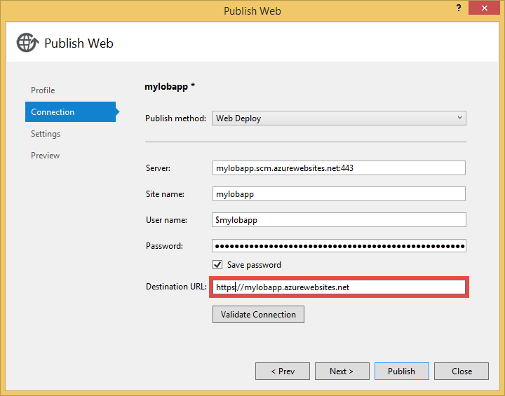
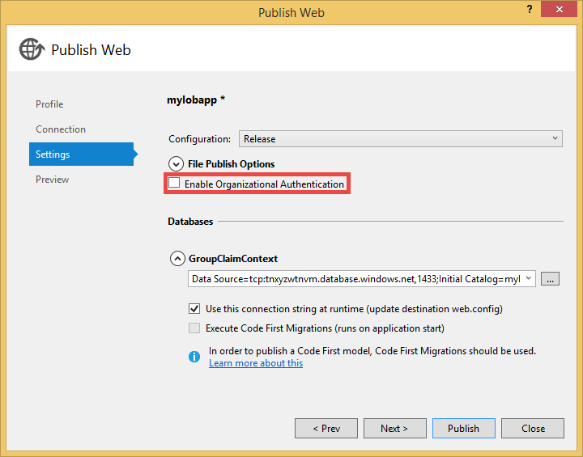
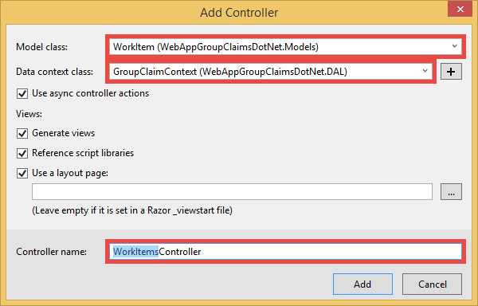

<properties 
	pageTitle="Créer une application web .NET MVC dans Azure App Service avec authentification AD FS" 
	description="Apprenez à créer une application métier ASP.NET MVC dans Azure App Service qui s'authentifie avec Azure Active Directory." 
	services="app-service\web, active-directory" 
	documentationCenter=".net" 
	authors="cephalin" 
	manager="wpickett" 
	editor=""/>

<tags 
	ms.service="app-service-web" 
	ms.devlang="dotnet" 
	ms.topic="article" 
	ms.tgt_pltfrm="na" 
	ms.workload="web" 
	ms.date="04/09/2015" 
	ms.author="cephalin"/>

# Créer une application web .NET MVC dans Azure App Service avec authentification Azure Active Directory #

Dans cet article, vous allez apprendre à créer une application métier ASP.NET MVC dans [Azure App Service Web Apps](http://go.microsoft.com/fwlink/?LinkId=529714) à l'aide d'[Azure Active Directory](/services/active-directory/) en tant que fournisseur d'identité. Vous apprendrez aussi à utiliser la [bibliothèque cliente Azure Active Directory Graph](http://blogs.msdn.com/b/aadgraphteam/archive/2014/06/02/azure-active-directory-graph-client-library-1-0-publish.aspx) pour interroger les données d'annuaire dans l'application.

Le locataire Azure Active Directory que vous utilisez peut disposer d'un annuaire Azure uniquement, ou il peut être synchronisé avec votre annuaire Active Directory (AD) local pour créer une expérience d'authentification unique pour les employés locaux ou distants.

>[AZURE.NOTE] La fonctionnalité d'authentification simple d'Azure App Service Web Apps vous permet de configurer une authentification simple par rapport à un locataire Azure Active Directory en un simple clic. Pour plus d'informations, consultez [Utiliser Active Directory pour l'authentification dans Azure App Service](web-sites-authentication-authorization.md).

## Ce que vous allez créer ##

Vous allez créer une application CRUD (Create-Read-Update-Delete) métier simple dans App Service Web Apps qui assure le suivi des éléments de travail et qui présente les caractéristiques suivantes :

- Authentification des utilisateurs à l'aide d'Azure Active Directory
- Fonctionnalités de connexion et de déconnexion
- Utilisation de `[Authorize]` pour autoriser différentes actions pour les utilisateurs
- Requêtes de données Azure Active Directory à l'aide de l'[API Azure Active Directory Graph](http://msdn.microsoft.com/library/azure/hh974476.aspx)
- Utilisation de [Microsoft.Owin](http://www.asp.net/aspnet/overview/owin-and-katana/an-overview-of-project-katana) (au lieu de Windows Identity Foundation, ou WIF), qui représente le futur d'ASP.NET et qui est beaucoup plus simple à configurer que WIF pour l'authentification et l'autorisation

## Éléments requis ##

[AZURE.INCLUDE [free-trial-note](../includes/free-trial-note.md)]

>[AZURE.NOTE] Si vous voulez vous familiariser avec Azure App Service avant d'ouvrir un compte Azure, accédez à la page [Essayer App Service](http://go.microsoft.com/fwlink/?LinkId=523751). Vous pourrez créer immédiatement et gratuitement une application de départ temporaire dans App Service. Aucune carte de crédit n'est requise ; vous ne prenez aucun engagement.

Vous devez disposer des éléments suivants pour suivre ce didacticiel :

- Un locataire Azure Active Directory avec les utilisateurs de différents groupes
- Les autorisations permettant de créer des applications sur le locataire AAD
- Visual Studio 2013
- [Azure SDK 2.5.1](http://go.microsoft.com/fwlink/p/?linkid=323510&clcid=0x409) ou version ultérieure

## Utiliser l'exemple d'application pour le modèle métier ##

L'exemple d'application présenté dans ce didacticiel, [WebApp-GroupClaims-DotNet](https://github.com/AzureADSamples/WebApp-GroupClaims-DotNet), a été créé par l'équipe Azure Active Directory et peut être utilisé comme modèle pour créer facilement des applications métier. Il intègre les fonctionnalités suivantes :

- Utilisation de [OpenID Connect](http://openid.net/connect/) pour s'authentifier auprès d'Azure Active Directory
- Contrôleur `"Rôles"` qui contient un filtre de recherche Azure Active Directory et vous permet de mapper facilement des utilisateurs Azure Active Directory ou des groupes aux rôles d'application.
- Exemple de contrôleur  `TaskTracker` qui vous montre comment autoriser différents rôles pour des actions spécifiques dans l'application, notamment l'utilisation standard de `[Authorize]`. 

<a name="bkmk_run" />
## Exécuter l'exemple d'application ##

1.	Clonez ou téléchargez l'exemple de solution depuis  [WebApp-GroupClaims-DotNet](https://github.com/AzureADSamples/WebApp-GroupClaims-DotNet) dans votre répertoire local.
2.	Suivez les instructions dans  [README.md](https://github.com/AzureADSamples/WebApp-GroupClaims-DotNet/blob/master/README.md) pour configurer l'application et le projet Azure Active Directory.

	> [AZURE.NOTE] Les autorisations configurées dans l'application Azure Active Directory nécessitent uniquement le rôle <strong>Utilisateur</strong>, et non **Administrateur global**.
	
3.	Une fois que vous avez achevé la configuration de l'application, tapez `F5` pour exécuter l'application.
4.	Dès que l'application est chargée, cliquez sur  **Connexion**. .
5.	Si vous avez correctement configuré l'application Azure Active Directory et défini les paramètres correspondants dans le fichier Web.config, vous êtes redirigé vers la page de connexion. Il vous suffit de vous connecter avec le compte que vous avez utilisé pour créer l'application Azure Active Directory dans le portail Azure, puisqu'il s'agit du propriétaire par défaut de cette application. 
	
	> [AZURE.NOTE] Dans Startup.Auth.cs de l'exemple de projet, notez que l'application possède une méthode appelée <code>AddOwnerAdminClaim</code>, qu'il utilise pour ajouter le propriétaire de l'application au rôle d'administrateur. Cela vous permet de démarrer immédiatement la gestion des rôles d'application dans le <code>contrôleur</code> de rôles.
	
4.	Une fois connecté, cliquez sur **Rôles** pour gérer les rôles d'application.
5.	Dans **Rechercher des utilisateurs/groupes**, commencez à taper le nom d'utilisateur ou de groupe souhaité. Une liste déroulante affiche alors une liste filtrée des utilisateurs et/ou groupes de votre locataire Azure Active Directory.

	 

	> [AZURE.NOTE] Dans Views\Roles\Index.cshtml, vous verrez que la vue utilise un objet JavaScript appelé <code>AadPicker</code> (défini dans Scripts\AadPickerLibrary.js) pour accéder à l' action <code>Search</code> du contrôleur de <code>rôles</code>.
		<pre class="prettyprint">var searchUrl = window.location.protocol + "//" + window.location.host + "<mark>/Roles/Search</mark>";
	...
    var picker = new <mark>AadPicker(searchUrl, maxResultsPerPage, input, token, tenant)</mark>;</pre>
		Dans Controllers\RolesController.cs, vous verrez l'action <code>Search</code>, qui envoie la demande réelle à l'API Azure Active Directory Graph et renvoie la réponse à la page.
		Vous utiliserez par la suite cette même méthode pour créer une fonctionnalité simple dans votre application.

6.	Sélectionnez un utilisateur ou un groupe dans la liste déroulante, sélectionnez un rôle, puis cliquez sur **Attribuer un rôle**.

## Déployer l'exemple d'application vers App Service Web Apps

Ici, vous allez publier l'application sur une application web dans Azure App Service. Le fichier [README.md](https://github.com/AzureADSamples/WebApp-GroupClaims-DotNet/blob/GroupClaims/README.md) contient déjà des instructions de déploiement vers App Service Web Apps. Or, ces étapes ont aussi pour effet d'annuler la configuration de votre environnement de débogage local. Je vais vous montrer comment déployer tout en conservant la configuration de débogage.

1. Cliquez avec le bouton droit sur votre projet et sélectionnez **Publier**.

	

2. Sélectionnez **Microsoft Azure Web Apps**.
3. Si vous n'êtes pas connecté à Azure, cliquez sur **Se connecter** et utilisez le compte Microsoft de votre abonnement Azure pour vous connecter.
4. Une fois connecté, cliquez sur **Nouveau** pour créer une application web dans Azure.
5. Renseignez tous les champs obligatoires. Vous aurez besoin d'une connexion de base de données pour permettre à cette application de stocker les mappages de rôles, les jetons mis en cache et les données d'application éventuelles.

	

6. Cliquez sur **Créer**. Une fois l'application web créée, la boîte de dialogue Publier le site web s'ouvre.
7. Dans **URL de destination**, remplacez **http** par **https**. Copiez l'URL entière dans un éditeur de texte. Vous allez l'utiliser ultérieurement. Cliquez ensuite sur **Suivant**.

	

8. Désactivez la case à cocher **Autoriser l'authentification d'une organisation**.

	

9. Au lieu de cliquer sur **Publier** pour procéder à la publication du site web, cliquez sur **Fermer**. Cliquez sur **Oui** pour enregistrer les modifications dans le profil de publication.
2. Dans le [portail de gestion Azure](https://manage.windowsazure.com), accédez à votre locataire Azure Active Directory et cliquez sur l'onglet **Applications**.
2. Cliquez sur **Ajouter** en bas de la page.
3. Sélectionnez **Web Application et/ou Web API**.
4. Nommez l'application et cliquez sur **Suivant**.
5. Dans les propriétés de l'application, définissez l'**URL de connexion** sur l'URL de l'application web enregistrée précédemment (par exemple,  `https://<site-name>.azurewebsites.net`) et l'**URI ID d'application** sur  `https://<aad-tenanet-name>/<app-name>`. Cliquez ensuite sur **Terminé**.

	

6. Une fois que l'application est créée, cliquez sur **Configurer**.
7. Sous **Clés**, créez une clé en sélectionnant **1 an** dans la liste déroulante.
8. Sous **Autorisations pour d'autres applications**, pour l'entrée **Azure Active Directory**, sélectionnez **Accéder à l'annuaire de votre organisation** dans la liste déroulante **Autorisations déléguées**.

	> [AZURE.NOTE] Les autorisations exactes dont vous avez besoin ici dépendent de la fonctionnalité voulue pour votre application. Si certaines autorisations nécessitent de définir le rôle **Administrateur global**, ce didacticiel n'a besoin que du rôle **Utilisateur**.

9.  Cliquez sur **Enregistrer**.  
10.  Avant de quitter la page de la configuration enregistrée, copiez les informations suivantes dans un éditeur de texte.

	-	ID client
	-	Clé (si vous quittez la page, vous ne pourrez pas revoir la clé)

11. Dans Visual Studio, ouvrez **Web.Release.config** dans votre projet. Insérez le code XML suivant dans la balise <configuration>, puis remplacez la valeur de chaque clé par les informations que vous avez enregistrées pour votre nouvelle application Azure Active Directory.  
	<pre class="prettyprint">
&lt;appSettings&gt;
   &lt;add key="ida:ClientId" value="<mark>[e.g. 82692da5-a86f-44c9-9d53-2f88d52b478b]</mark>" xdt:Transform="SetAttributes" xdt:Locator="Match(key)" /&gt;
   &lt;add key="ida:AppKey" value="<mark>[e.g. rZJJ9bHSi/cYnYwmQFxLYDn/6EfnrnIfKoNzv9NKgbo=]</mark>" xdt:Transform="SetAttributes" xdt:Locator="Match(key)" /&gt;
   &lt;add key="ida:PostLogoutRedirectUri" value="<mark>[e.g. https://mylobapp.azurewebsites.net/]</mark>" xdt:Transform="SetAttributes" xdt:Locator="Match(key)" /&gt;
&lt;/appSettings&gt;</pre>

	Assurez-vous que la valeur ida:PostLogoutRedirectUri se termine par une barre oblique " / ".

1. Cliquez à nouveau avec le bouton droit sur votre projet et sélectionnez **Publier**.
2. Cliquez sur **Publier** pour publier sur Azure App Service Web Apps.

À l'issue de cette opération, vous avez deux applications Azure Active Directory configurées dans le portail de gestion Azure : une pour votre environnement de débogage dans Visual Studio et une autre pour l'application web publiée dans Azure. Pendant le débogage, les paramètres d'application du fichier Web.config sont utilisés pour rendre votre configuration **Debug** compatible avec Azure Active Directory. Ensuite, dès qu'elle est publiée (par défaut, il s'agit de la configuration **Release**), un fichier Web.config transformé qui incorpore les modifications apportées aux paramètres d'application dans le fichier Web.Release.config est téléchargé.

Si vous voulez attacher l'application web publiée au débogueur (dans ce cas, vous devez télécharger les symboles de débogage de votre code dans l'application web publiée), vous pouvez créer un clone de la configuration Debug pour le débogage Azure, mais avec sa propre transformation Web.config personnalisée (par exemple, Web.AzureDebug.config) qui utilise les paramètres Azure Active Directory du fichier Web.Release.config. Cela vous permet de maintenir une configuration statique entre les différents environnements.

## Ajouter des fonctionnalités métier à l'exemple d'application

Dans cette partie du didacticiel, vous allez apprendre à créer la fonctionnalité métier souhaitée à partir de l'exemple d'application. Vous allez créer un dispositif de suivi d'éléments de travail CRUD simple, semblable au contrôleur TaskTracker, mais en utilisant la génération de modèles automatique et le modèle de conception CRUD standard. Vous allez aussi utiliser le fichier Scripts\AadPickerLibrary.js inclus pour enrichir votre application avec les données de l'API Azure Active Directory Graph.  

5.	Dans le dossier Models, créez un modèle intitulé WorkItem.cs et remplacez le code par le code suivant :

		using System.ComponentModel.DataAnnotations;
		
		namespace WebAppGroupClaimsDotNet.Models
		{
		    public class WorkItem
		    {
		        [Key]
		        public int ItemID { get; set; }
		        public string AssignedToID { get; set; }
		        public string AssignedToName { get; set; }
		        public string Description { get; set; }
		        public WorkItemStatus Status { get; set; }
		    }
		
		    public enum WorkItemStatus
		    {
		        Open, 
		        Investigating, 
		        Resolved, 
		        Closed
		    }
		}

6.	Ouvrez DAL\GroupClaimContext.cs et ajoutez le code en surbrillance :  
	<pre class="prettyprint">
    public class GroupClaimContext : DbContext
    {
        public GroupClaimContext() : base("GroupClaimContext") { }

        public DbSet&lt;RoleMapping&gt; RoleMappings { get; set; }
        public DbSet&lt;Task&gt; Tasks { get; set; }
        <mark>public DbSet&lt;WorkItem&gt; WorkItems { get; set; }</mark>
        public DbSet&lt;TokenCacheEntry&gt; TokenCacheEntries { get; set; }
    }</pre>

7.	Générez le projet pour rendre votre nouveau modèle accessible à la logique de génération de modèles automatique dans Visual Studio.
8.	Ajoutez le nouvel élément généré automatiquement  `WorkItemsController` dans le dossier Controllers. Pour ce faire, cliquez avec le bouton droit sur **Contrôleurs**, pointez sur **Ajouter**, puis sélectionnez **Nouvel élément généré automatiquement**. 
9.	Sélectionnez **Contrôleur MVC 5 avec vues, en utilisant Entity Framework**, puis cliquez sur **Ajouter**.
10.	Sélectionnez le modèle que vous venez de créer, puis cliquez sur **Ajouter**.

	

9.	Ouvrez Controllers\WorkItemsController.cs

11. Ajoutez les décorations [Authorize] en surbrillance aux actions correspondantes ci-dessous.
	<pre class="prettyprint">
	...

    <mark>[Authorize(Roles = "Admin, Observer, Writer, Approver")]</mark>
    public class WorkItemsController : Controller
    {
		...

        <mark>[Authorize(Roles = "Admin, Writer")]</mark>
        public ActionResult Create()
        ...

        <mark>[Authorize(Roles = "Admin, Writer")]</mark>
        public async Task&lt;ActionResult&gt; Create([Bind(Include = "ItemID,AssignedToID,AssignedToName,Description,Status")] WorkItem workItem)
        ...

        <mark>[Authorize(Roles = "Admin, Writer")]</mark>
        public async Task&lt;ActionResult&gt; Edit(int? id)
        ...

        <mark>[Authorize(Roles = "Admin, Writer")]</mark>
        public async Task&lt;ActionResult&gt; Edit([Bind(Include = "ItemID,AssignedToID,AssignedToName,Description,Status")] WorkItem workItem)
        ...

        <mark>[Authorize(Roles = "Admin, Writer, Approver")]</mark>
        public async Task&lt;ActionResult&gt; Delete(int? id)
        ...

        <mark>[Authorize(Roles = "Admin, Writer, Approver")]</mark>
        public async Task&lt;ActionResult&gt; DeleteConfirmed(int id)
        ...
	}</pre>

	Sachant que vous vous occupez des mappages de rôles dans le contrôleur Roles, il vous suffit simplement de vérifier que chaque action autorise les rôles appropriés.

	> [AZURE.NOTE] Vous avez peut-être noté la présence de la décoration <code>[ValidateAntiForgeryToken]</code> au niveau de certaines actions. En raison du comportement décrit par [Brock Allen](https://twitter.com/BrockLAllen) dans son article intitulé [MVC 4, AntiForgeryToken and Claims](http://brockallen.com/2012/07/08/mvc-4-antiforgerytoken-and-claims/), votre HTTP POST risque d'échouer lors de la validation du jeton d'anti-contrefaçon pour les motifs suivants :
	> + Azure Active Directory n'envoie pas la revendication http://schemas.microsoft.com/accesscontrolservice/2010/07/claims/identityprovider qui, par défaut, est nécessaire au jeton d'anti-contrefaçon.
	S'il y a synchronisation d'annuaire entre Azure Active Directory et AD FS, l'approbation AD FS par défaut n'envoie pas la revendication http://schemas.microsoft.com/accesscontrolservice/2010/07/claims/identityprovider, même si vous pouvez configurer manuellement l'envoi de cette revendication par les services AD FS.
	> Vous vous chargerez de cela à l'étape suivante.

12.  Dans App_Start\Startup.Auth.cs, ajoutez la ligne de code suivante dans la méthode  `ConfigureAuth` :

		AntiForgeryConfig.UniqueClaimTypeIdentifier = ClaimTypes.NameIdentifier;
	
	`"ClaimTypes.NameIdentifies"` spécifie la revendication  `http://schemas.xmlsoap.org/ws/2005/05/identity/claims/nameidentifier`, qu'Azure Active Directory ne fournit pas. Maintenant que vous en avez fini avec la partie autorisation (sérieusement, cela n'a pas pris beaucoup de temps), vous pouvez vous consacrer à la fonctionnalité effective des actions. 

13.	Dans Create() et Edit(), ajoutez le code suivant pour permettre à votre code JavaScript d'accéder par la suite à certains variables :
            ViewData["token"] = GraphHelper.AcquireToken(ClaimsPrincipal.Current.FindFirst(Globals.ObjectIdClaimType).Value);
            ViewData["tenant"] = ConfigHelper.Tenant;
14.	Dans Views\WorkItems\Create.cshtml (élément généré automatiquement), recherchez la méthode d'assistance  `Html.BeginForm` et modifiez-la comme suit :  
	<pre class="prettyprint">@using (Html.BeginForm(<mark>"Create", "WorkItems", FormMethod.Post, new { id = "main-form" }</mark>))
	{
	    @Html.AntiForgeryToken()
	    
	    &lt;div class="form-horizontal"&gt;
	        &lt;h4&gt;WorkItem&lt;/h4&gt;
	        &lt;hr /&gt;
	        @Html.ValidationSummary(true, "", new { @class = "text-danger" })
	
	        &lt;div class="form-group"&gt;
	            &lt;div class="col-md-10"&gt;
	                @Html.EditorFor(model =&gt; model.AssignedToID, new { htmlAttributes = new { @class = "form-control"<mark>, @type=&quot;hidden&quot;</mark> } })
	                @Html.ValidationMessageFor(model =&gt; model.AssignedToID, "", new { @class = "text-danger" })
	            &lt;/div&gt;
	        &lt;/div&gt;
	
	        &lt;div class="form-group"&gt;
	            @Html.LabelFor(model =&gt; model.AssignedToName, htmlAttributes: new { @class = "control-label col-md-2" })
	            &lt;div class="col-md-10"&gt;
	                @Html.EditorFor(model =&gt; model.AssignedToName, new { htmlAttributes = new { @class = "form-control" } })
	                @Html.ValidationMessageFor(model =&gt; model.AssignedToName, "", new { @class = "text-danger" })
	            &lt;/div&gt;
	        &lt;/div&gt;
	
	        &lt;div class="form-group"&gt;
	            @Html.LabelFor(model =&gt; model.Description, htmlAttributes: new { @class = "control-label col-md-2" })
	            &lt;div class="col-md-10"&gt;
	                @Html.EditorFor(model =&gt; model.Description, new { htmlAttributes = new { @class = "form-control" } })
	                @Html.ValidationMessageFor(model =&gt; model.Description, "", new { @class = "text-danger" })
	            &lt;/div&gt;
	        &lt;/div&gt;
	
	        &lt;div class="form-group"&gt;
	            @Html.LabelFor(model =&gt; model.Status, htmlAttributes: new { @class = "control-label col-md-2" })
	            &lt;div class="col-md-10"&gt;
	                @Html.EnumDropDownListFor(model =&gt; model.Status, htmlAttributes: new { @class = "form-control" })
	                @Html.ValidationMessageFor(model =&gt; model.Status, "", new { @class = "text-danger" })
	            &lt;/div&gt;
	        &lt;/div&gt;
	
	        &lt;div class="form-group"&gt;
	            &lt;div class="col-md-offset-2 col-md-10"&gt;
	                &lt;input type="submit" value="Create" class="btn btn-default" <mark>id="submit-button"</mark> /&gt;
	            &lt;/div&gt;
	        &lt;/div&gt;
	    &lt;/div&gt;
	
	    <mark>&lt;script&gt;
	            // People/Group Picker Code
	            var maxResultsPerPage = 14;
	            var searchUrl = window.location.protocol + "//" + window.location.host + "/Roles/Search";
	            var input = document.getElementById("AssignedToName");
	            var token = "@ViewData["token"]";
	            var tenant = "@ViewData["tenant"]";
	
	            var picker = new AadPicker(searchUrl, maxResultsPerPage, input, token, tenant);
	
	            // Submit the selected user/group to be asssigned.
	            $("#submit-button").click({ picker: picker }, function () {
	                if (!picker.Selected())
	                    return;
	                $("#main-form").get()[0].elements["AssignedToID"].value = picker.Selected().objectId;
	            });
	    &lt;/script&gt;</mark>
	
	}</pre>

	Dans le script, l'objet AadPicker recherche l'action `" ~/Roles/Search "` des utilisateurs Azure Active Directory et des groupes qui correspondent à l'entrée. Ensuite, quand l'utilisateur clique sur le bouton d'envoi, l'objet AadPicker enregistre l'ID d'utilisateur dans le champ masqué  `AssignedToID`.  

15. Maintenant, exécutez l'application dans le débogueur Visual Studio ou publiez-la sur Azure App Service Web Apps. Connectez-vous en tant que propriétaire de l'application et accédez à `" ~/WorkItems/Create "`. Pour l'application métier que j'ai publiée, j'accède à  `https://mylobapp.azurewebsites.net/WorkItems/Create`. Vous voyez maintenant que vous pouvez utiliser le même filtre de recherche AadPicker pour sélectionner un utilisateur Azure Active Directory.

	

16. Complétez le reste du formulaire, puis cliquez sur **Créer**. La page ~/WorkItems/Index affiche maintenant l'élément de travail nouvellement créé. Vous remarquerez également dans la capture d'écran ci-dessous que j'ai supprimé la colonne  `AssignedToID` dans Views\WorkItems\Index.cshtml. 

	

11.	À présent, apportez les mêmes modifications dans la vue **Edit**. Dans Views\WorkItems\Edit.cshtml, apportez les mêmes modifications à la méthode d'assistance  `Html.BeginForm` que celles que nous avons effectuées pour Views\WorkItems\Create.cshtml à l'étape précédente (remplacez " Create " par " Edit " dans le code en surbrillance ci-dessus).

Et voilà !

Maintenant que vous avez configuré les autorisations et la fonctionnalité métier pour les différentes actions du contrôleur WorkItems, vous pouvez essayer de vous connecter en tant qu'utilisateurs ayant des rôles d'application différents.

## Ressources supplémentaires

- [Protection de l'application à l'aide du protocole SSL et de l'attribut Authorize](web-sites-dotnet-deploy-aspnet-mvc-app-membership-oauth-sql-database.md#protect-the-application-with-ssl-and-the-authorize-attribute)
- [Utiliser Active Directory pour l'authentification dans Azure App Service](web-sites-authentication-authorization.md)
- [Créer une application web .NET MVC dans Azure App Service avec authentification AD FS](web-sites-dotnet-lob-application-adfs.md)
- [Documentation et exemples Microsoft Azure Active Directory](https://github.com/AzureADSamples)
- [Blog de Vittorio Bertocci](http://blogs.msdn.com/b/vbertocci/)
- [Migration d'un projet web VS2013 de WIF vers Katana](http://www.cloudidentity.com/blog/2014/09/15/MIGRATE-A-VS2013-WEB-PROJECT-FROM-WIF-TO-KATANA/)
- [Les nouvelles connexions hybrides Azure et ce qui les distingue du #Cloudhybride d'ancienne génération](/documentation/videos/new-hybrid-connections-not-your-fathers-hybridcloud/)
- [Points communs entre Active Directory et Azure Active Directory](http://technet.microsoft.com/library/dn518177.aspx)
- [Synchronisation d'annuaires avec le scénario d'authentification unique](http://technet.microsoft.com/library/dn441213.aspx)
- [Types de jeton et de revendication pris en charge par Azure Active Directory](http://msdn.microsoft.com/library/azure/dn195587.aspx)

## Changements apportés
* Pour obtenir des informations détaillées sur le passage de Sites Web à App Service, consultez : [Azure App Service et son impact sur les services Azure existants](http://go.microsoft.com/fwlink/?LinkId=529714)
* Pour obtenir des informations détaillées sur le passage de l'ancien portail au nouveau portail, consultez : [Référence pour la navigation dans le portail en version préliminaire](http://go.microsoft.com/fwlink/?LinkId=529715)

<!--HONumber=52-->