<properties linkid="develop-dotnet-rest-service-using-web-api" urlDisplayName="REST service using Web API" pageTitle=".NET REST service using Web API - Azure tutorial" metaKeywords="Azure tutorial web site, ASP.NET API web site, Azure VS" description="A tutorial that teaches you how to deploy an app that uses the ASP.NET Web API to an Azure web site by using Visual Studio." metaCanonical="" services="web-sites" documentationCenter=".NET" title="REST service using ASP.NET Web API and SQL Database" authors="riande" solutions="" manager="" editor="" />

Service REST à l'aide de l'API Web ASP.NET et de la base de données SQL
=======================================================================

***Par [Rick Anderson](https://twitter.com/RickAndMSFT) et Tom Dykstra. Mis à jour en mars 2014.***

Ce didacticiel vous montre comment déployer une application Web ASP.NET dans un site Web Azure en utilisant l'Assistant Publier le site Web dans Visual Studio 2013 ou Visual Studio Express 2013 pour le Web (si vous préférez utiliser Visual Studio 2012, consultez [la version précédente de ce didacticiel](/en-us/develop/net/tutorials/get-started-vs2012/)).

Vous pouvez ouvrir gratuitement un compte Azure. Si vous n'avez pas déjà Visual Studio 2013, le Kit de développement logiciel (SDK) installe automatiquement Visual Studio Express 2013 pour le Web. Vous pouvez donc commencer vos développements Azure gratuitement.

Ce didacticiel part du principe que vous n'avez pas d'expérience en tant qu'utilisateur d'Azure. À la fin de ce didacticiel, vous disposerez d'une application Web simple et fonctionnelle dans le cloud.

Vous apprendrez à effectuer les opérations suivantes :

-   configurer votre ordinateur pour le développement Azure en installant le Kit de développement logiciel (SDK) Azure ;
-   créer et publier un projet Visual Studio ASP.NET MVC 5 dans un site Web Azure ;
-   utiliser l'API Web ASP.NET pour activer les appels d'API Restful ;
-   utiliser une base de données SQL pour stocker des données dans Azure ;
-   publier des mises à jour d'application dans Azure.

Vous développerez une application Web de liste de contacts simple basée sur ASP.NET MVC 5 et utilisant Entity Framework ADO.NET pour accéder à la base de données. L'illustration suivante présente l'application terminée :

 

Dans ce didacticiel :

-   [Configuration de l'environnement de développement](#bkmk_setupdevenv)
-   [Configuration de l'environnement Azure](#bkmk_setupwindowsazure)
-   [Création d'une application ASP.NET MVC 5](#bkmk_createmvc4app)
-   [Déploiement de l'application dans Azure](#bkmk_deploytowindowsazure1)
-   [Ajout d'une base de données à l'application](#bkmk_addadatabase)
-   [Ajout d'un contrôleur et affichage des données](#bkmk_addcontroller)
-   [Ajout d'une interface d'API Web Restful](#bkmk_addwebapi)
-   [Ajout d'une protection XSRF](#xsrf)
-   [Publication de la mise à jour de l'application vers Azure et la base de données SQL](#bkmk_deploydatabaseupdate)

[WACOM.INCLUDE [create-account-and-websites-note](../includes/create-account-and-websites-note.md)]

Configuration de l'environnement Azure
--------------------------------------

Configurez ensuite l'environnement Azure en créant un site Web Azure et une base de données SQL.

### Création d'un site Web et d'une base de données SQL dans Azure

La prochaine étape consiste à créer le site Web Azure et la base de données SQL que votre application va utiliser.

Votre site Web Azure est exécuté dans un environnement d'hébergement partagé, ce qui veut dire qu'il s'exécute sur des machines virtuelles partagées avec d'autres clients Azure. Un environnement d'hébergement partagé permet de commencer à utiliser le cloud à moindre frais. Plus tard, si votre trafic Web augmente, vous pourrez mettre votre application à l'échelle pour répondre à vos besoins, en exécutant des machines virtuelles dédiées. Si vous avez besoin d'une architecture plus complexe, vous pouvez migrer vers un service cloud Azure. Les services cloud sont exécutés sur des machines virtuelles dédiées pour vous permettre de les configurer selon vos besoins.

La base de données SQL est un service de bases de données relationnelles sur le cloud, basé sur les technologies SQL Server. Les outils et applications fonctionnant avec SQL Server fonctionnent également avec la base de données SQL.

1.  Dans le [portail de gestion Azure](https://manage.windowsazure.com), dans l'onglet gauche, cliquez sur **Web Sites**, puis sur **New**.

2.  Cliquez sur **CUSTOM CREATE**.

    

    L'Assistant **New Web Site - Custom Create** s'ouvre.

3.  Lors de l'étape **New Web Site** de l'Assistant, entrez une chaîne dans la zone **URL** pour l'utiliser en tant qu'URL unique pour votre application. L'URL complète se composera du texte entré ici, ainsi que du suffixe affiché sous la zone de texte. L'illustration indique « contactmgr11 », mais cette URL est probablement prise (il faut donc en choisir une autre).

4.  Dans le menu déroulant **Region**, sélectionnez la région la plus proche de vous.

5.  Dans la liste déroulante **Base de données**, sélectionnez **Create a free 20 MB SQL database**.

    

6.  Cliquez sur les flèches pointant vers la droite en bas de la zone.

    L'Assistant passe à l'étape **Paramètres de la base de données**.

7.  Dans la zone **Name**, entrez *ContactDB*

8.  Dans la zone **Server**, sélectionnez **New SQL Database server**. Par ailleurs, si vous avez déjà créé une base de données SQL Server, vous pouvez la sélectionner dans la liste déroulante.

9.  Cliquez sur les flèches pointant vers la droite en bas de la zone.

10. Entrez un **NOM DE CONNEXION** et un **MOT DE PASSE** d'administrateur. Si vous avez sélectionné **New SQL Database server**, vous ne devez pas entrer un nom et un mot de passe existant ici, mais une nouvelle paire nom/mot de passe que vous allez choisir maintenant et utiliser ultérieurement lorsque vous accèderez à la base de données. Si vous avez sélectionné une base de données SQL Server créée auparavant, vous devez entrer le mot de passe et le nom du compte SQL Server que vous aviez créé. Pour ce didacticiel, ne cochez pas la case \*\*Advanced \*\*. Cette case vous permet de définir la taille de la base de données (la valeur par défaut est 1 Go, mais vous pouvez l'augmenter jusqu'à 150 Go) et son classement.

11. Cliquez sur la coche située en bas de la zone pour indiquer que vous avez terminé.

    

    L'image suivante montre l'utilisation d'un nom et d'un mot de passe de connexion à une base de données SQL existante.

    

    Le portail de gestion renvoie vers la page Sites Web, tandis que la colonne **Status** indique que le site est en cours de création. Après un temps d'attente (généralement inférieur à une minute), la colonne **Status** indique que la création du site est réussie. Dans la barre de navigation de gauche, le nombre de sites de votre compte apparaît en regard de l'icône **Web Sites**, tandis que le nombre de bases de données apparaît en regard de l'icône **SQL Databases**.

Création d'une application ASP.NET MVC 5
----------------------------------------

Vous avez créé un site Web Azure, mais il est encore vide. La prochaine étape consiste à créer l'application Web Visual Studio que vous allez publier sur Azure.

### Création du projet

1.  Démarrez Visual Studio 2013.
2.  Dans le menu **File**, cliquez sur **New Project**.
3.  Dans la boîte de dialogue **New Project**, développez **Visual C\#** et sélectionnez **Web**, puis **ASP.NET MVC 5 Web Application**. Conservez la valeur par défaut **.NET Framework 4.5**. Nommez l'application **GestionnaireContacts**, puis cliquez sur **OK**. ]
4.  Dans la boîte de dialogue **New ASP.NET Project**, sélectionnez le modèle **MVC**, activez la case à cocher **Web API**, puis cliquez sur **Change Authentication**.

    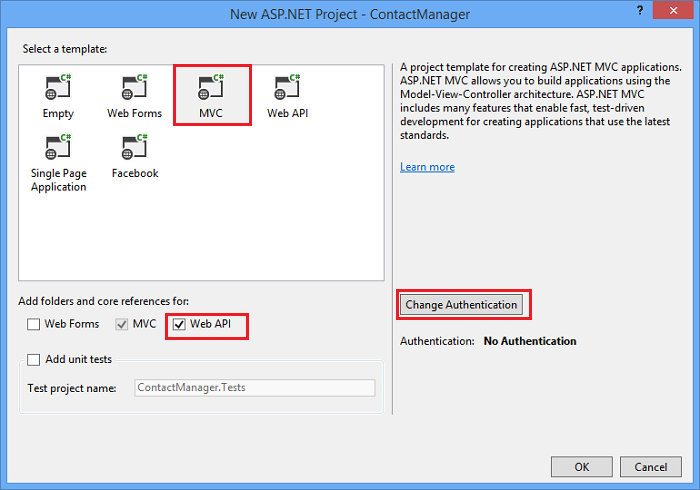

5.  Dans la boîte de dialogue **Modifier l'authentification**, cliquez sur **Aucune authentification**, puis sur **OK**.

    

    L'exemple d'application que vous créez ne sera pas doté de fonctionnalités nécessitant la connexion de l'utilisateur. Pour plus d'informations sur l'implémentation de fonctionnalités d'authentification et d'autorisation, consultez la section [Étapes suivantes](#nextsteps) à la fin de ce didacticiel.

6.  Dans la boîte de dialogue **New ASP.NET Project**, cliquez sur **OK**.

    

### Définition de l'en-tête et du pied de page de la page

1.  Dans l'**Explorateur de solutions**, développez le dossier *Views\\Shared* et ouvrez le fichier *\_Layout.cshtml*.

    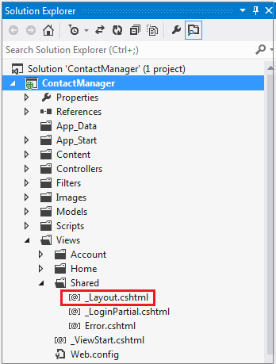

2.  Remplacez le contenu du fichier *\_Layout.cshtml* par le code suivant :

         <!DOCTYPE html>
         <html lang="en">
         <head>
             <meta charset="utf-8" />
             <title>@ViewBag.Title - Contact Manager</title>
             <link href="~/favicon.ico" rel="shortcut icon" type="image/x-icon" />
             <meta name="viewport" content="width=device-width" />
             @Styles.Render("~/Content/css")
             @Scripts.Render("~/bundles/modernizr")
         </head>
         <body>
             <header>
                 

                     

                         
@Html.ActionLink("Contact Manager", "Index", "Home")

                     

                 

             </header>
             

                 @RenderSection("featured", required: false)
                 <section class="content-wrapper main-content clear-fix">
                     @RenderBody()
                 </section>
             

             <footer>
                 

                     

                         
© @DateTime.Now.Year - Contact Manager

                     

                 

             </footer>
             @Scripts.Render("~/bundles/jquery")
             @RenderSection("scripts", required: false)
         </body>
         </html>

Le balisage ci-dessus remplace le nom de l'application « My ASP.NET App » par « Gestionnaire de contacts » et supprime les liens vers les pages **Accueil**, **À propos de** et **Contact**.

### Exécution locale de l'application

1.  Appuyez sur Ctrl+F5 pour exécuter l'application. La page d’accueil de l’application apparaît dans le navigateur par défaut. 

Voilà, vous avez fait tout ce qu'il fallait pour créer l'application que vous allez déployer dans Azure. Après cela, vous allez ajouter les fonctionnalités de base de données.

Déploiement de l'application dans Azure
---------------------------------------

1.  Dans l'**Explorateur de solutions** de Visual Studio, cliquez avec le bouton droit sur le projet, puis dans le menu contextuel, sélectionnez **Publier**.

    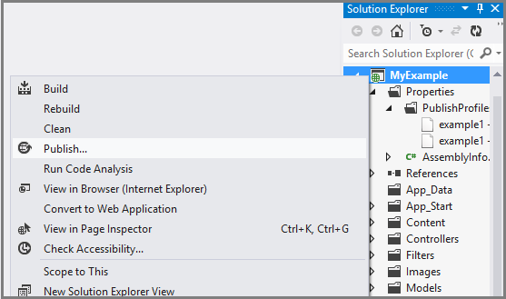

    L'Assistant **Publier le site Web** s'ouvre.

2.  Sous l'onglet **Profil** de l'Assistant **Publier le site Web**, cliquez sur **Importer**.

    

    La boîte de dialogue **Importer le profil de publication** apparaît.

	3.  Sélectionnez Import from an Azure Web Site. Si vous ne l'avez pas déjà fait, vous devez vous connecter. Cliquez sur **Se connecter**. Entrez l'utilisateur associé à votre abonnement, puis suivez la procédure de connexion.

		

    	Dans le menu déroulant, sélectionnez votre site Web, puis cliquez sur **OK**.

    	

4.  Sous l'onglet **Connection**, cliquez sur **Validate Connection** pour vous assurer que les paramètres sont corrects.

    

5.  Une fois la connexion validée, une coche verte est affichée en regard du bouton **Validate Connection**.

    

6.  Cliquez sur **Suivant**.

    

    Vous pouvez accepter les paramètres par défaut sous cet onglet. Vous déployez une configuration de build Release et il n'est pas nécessaire de supprimer les fichiers du serveur de destination, de précompiler l'application ni d'exclure les fichiers du dossier App\_Data. Si vous voulez procéder à un débogage sur le site Azure, vous devez déployer une configuration de version de débogage (pas de production). Consultez la section [Étapes suivantes](#nextsteps) à la fin de ce didacticiel.

7.  Sous l'onglet **Aperçu**, cliquez sur **Démarrer l'aperçu**.

    L'onglet affiche la liste des fichiers qui seront copiés sur le serveur. L'affichage de l'aperçu n'est pas requis pour publier l'application. Cependant, il s'agit d'une fonction utile à ne pas négliger. Dans ce cas, vous n'avez rien à faire avec la liste des fichiers affichée. À la prochaine publication, seuls les fichiers modifiés seront affichés dans la liste d'aperçu.

    

8.  Cliquez sur **Publier**.

    Visual Studio démarre le processus de copie des fichiers vers le serveur Azure. La fenêtre **Output** indique les actions de déploiement entreprises et signale la réussite du déploiement.

9.  Le navigateur par défaut ouvre automatiquement l'URL du site déployé.

    L'application créée est maintenant exécutée dans le cloud.

    

Ajout d'une base de données à l'application
-------------------------------------------

À présent, vous allez mettre à jour l'application MVC pour y ajouter la capacité d'afficher et de mettre à jour les contacts, puis stocker les données dans une base de données. L'application va utiliser Entity Framework pour créer la base de données, ainsi que lire et mettre à jour les données associées.

### Ajout de classes de modèle de données pour les contacts

Commencez par créer un modèle de données simple dans le code.

1.  Dans l'**Explorateur de solutions**, cliquez avec le bouton droit sur le dossier Modèles, cliquez sur **Ajouter**, puis sur **Classe**.

    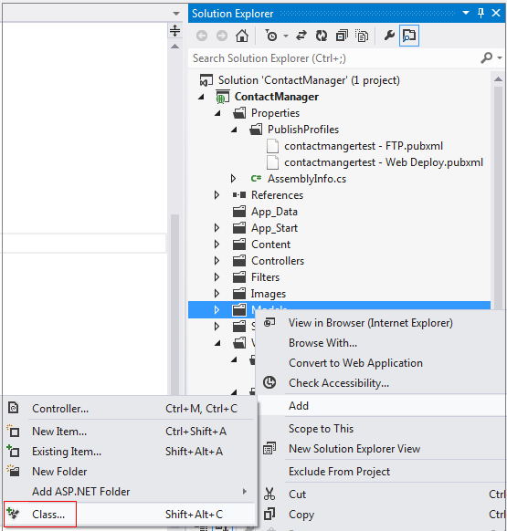

2.  Dans la boîte de dialogue **Ajouter un nouvel élément**, nommez le nouveau fichier de classe *Contact.cs*, puis cliquez sur **Ajouter**.

    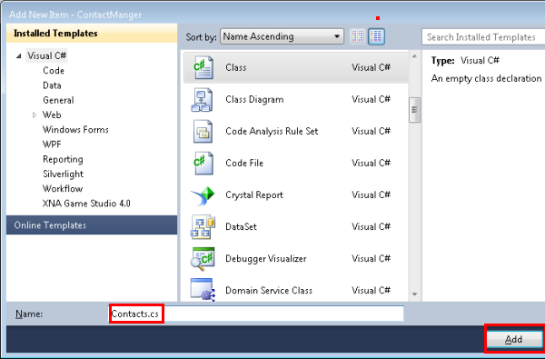

3.  Remplacez le contenu du fichier Contacts.cs par le code suivant.

         using System.Globalization;
         namespace ContactManager.Models
         {

    public class Contact

             {
                public int ContactId { get; set; }
                 public string Name { get; set; }
                 public string Address { get; set; }
                public string City { get; set; }
                 public string State { get; set; }
                 public string Zip { get; set; }
                 public string Email { get; set; }
                 public string Twitter { get; set; }
                 public string Self
                {
                    get { return string.Format(CultureInfo.CurrentCulture,
                          "api/contacts/{0}", this.ContactId); }
                    set { }
                }

    }

         }

La classe **Contacts** définit les données que vous allez stocker pour chaque contact, ainsi que la clé primaire ContactID requise par la base de données. Pour plus d'informations sur les modèles de données, consultez la section [Étapes suivantes](#nextsteps) à la fin de ce didacticiel.

### Création de pages Web permettant aux utilisateurs de l'application d'utiliser des contacts

La fonctionnalité de génération de modèle automatique ASP.NET MVC peut générer automatiquement un code qui effectue les actions CRUD (Create, Read, Update et Delete, ou Créer, Lire, Mettre à jour et Supprimer).

Ajout d'un contrôleur et affichage des données
----------------------------------------------

1.  Dans l'**Explorateur de solutions**, développez le dossier Contrôleurs.

2.  Développez le projet **(Ctrl+Maj+B)** (vous devez développer le projet avant d'utiliser le mécanisme de génération de modèle automatique).

3.  Cliquez avec le bouton droit sur le dossier Contrôleurs, cliquez sur **Ajouter**, puis sur **Contrôleur**.

    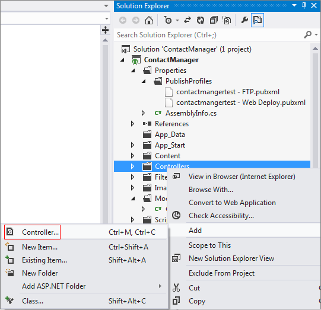

4.  Dans la boîte de dialogue **Add Scaffold**, sélectionnez **MVC Controller with views, using Entity Framework** et cliquez sur **Ajouter**.

	

5.  Définissez le nom du contrôleur sur **HomeController**. Sélectionnez **Contact** comme classe de modèle. Cliquez sur le bouton **New data context** et acceptez la valeur par défaut « ContactManager.Models.ContactManagerContext » pour le **Type du nouveau contexte de données**. Cliquez sur **Ajouter**.

    

    Une boîte de dialogue affiche : « Un fichier ayant le nom HomeController existe déjà. Voulez-vous le remplacer ? » Cliquez sur **Oui**. Nous allons remplacer le contrôleur d'accueil créé avec le nouveau projet. Nous allons utiliser le nouveau contrôleur d'accueil pour notre liste de contacts.

    Visual Studio crée des méthodes de contrôleur et des vues pour les opérations de base de données CRUD des objets **Contact**.

Activation des migrations, création de la base de données, ajout d'exemples de données et d'un initialiseur de données
----------------------------------------------------------------------------------------------------------------------

L'étape suivante consiste à activer la fonctionnalité [Migrations Code First](http://curah.microsoft.com/55220) pour créer la base de données en fonction du modèle de données que vous avez créé.

1.  Dans le menu **Outils**, sélectionnez **Gestionnaire de package de bibliothèques**, puis **Console du Gestionnaire de package**.

    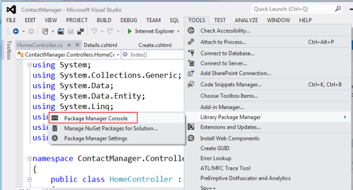

2.  Dans la fenêtre **Console du Gestionnaire de package**, entrez la commande suivante :

         enable-migrations

    La commande **enable-migrations** crée un dossier *Migrations* dans lequel elle place un fichier *Configuration.cs* que vous pouvez modifier pour configurer les migrations.

3.  Dans la fenêtre **Console du Gestionnaire de package**, entrez la commande suivante :

         add-migration Initial

    La commande **add-migration Initial** génère une classe nommée **<date\_stamp\>Initial** qui crée la base de données. Le premier paramètre (*Initial*) est arbitraire et permet de créer le nom du fichier. Les nouveaux fichiers de classe sont affichés dans l'**Explorateur de solutions**.

    Dans la classe **Initial**, la méthode **Up** crée la table des contacts et la méthode **Down** (utilisée lorsque vous voulez revenir à l'état précédent) annule cette table.

4.  Ouvrez le fichier *Migrations\\Configuration.cs*.

5.  Ajoutez les espaces de noms suivants.

    	using ContactManager.Models;

6.  Remplacez la méthode *Seed* par le code suivant :

         protected override void Seed(ContactManager.Models.ContactManagerContext context)
         {
             context.Contacts.AddOrUpdate(p => p.Name,
                new Contact
                {
                    Name = "Debra Garcia",
                    Address = "1234 Main St",
                    City = "Redmond",
                    State = "WA",
                    Zip = "10999",
                    Email = "debra@example.com",
                    Twitter = "debra_example"
                },
                 new Contact
                 {
                     Name = "Thorsten Weinrich",
                     Address = "5678 1st Ave W",
                     City = "Redmond",
                     State = "WA",
                     Zip = "10999",
                     Email = "thorsten@example.com",
                     Twitter = "thorsten_example"
                 },
                 new Contact
                 {
                     Name = "Yuhong Li",
                     Address = "9012 State st",
                     City = "Redmond",
                     State = "WA",
                     Zip = "10999",
                     Email = "yuhong@example.com",
                     Twitter = "yuhong_example"
                 },
                 new Contact
                 {
                     Name = "Jon Orton",
                     Address = "3456 Maple St",
                     City = "Redmond",
                     State = "WA",
                     Zip = "10999",
                     Email = "jon@example.com",
                     Twitter = "jon_example"
                 },
                 new Contact
                 {
                     Name = "Diliana Alexieva-Bosseva",
                     Address = "7890 2nd Ave E",
                     City = "Redmond",
                     State = "WA",
                     Zip = "10999",
                     Email = "diliana@example.com",
                     Twitter = "diliana_example"
                 }
                 );
         }

    Le code ci-dessus initialise la base de données avec les informations de contact. Pour plus d'informations sur l'amorçage de la base de données, consultez la page [Débogage des bases de données Entity Framework (EF)](http://blogs.msdn.com/b/rickandy/archive/2013/02/12/seeding-and-debugging-entity-framework-ef-dbs.aspx).

7.  Dans la **Console du Gestionnaire de package**, entrez la commande suivante :

         update-database

    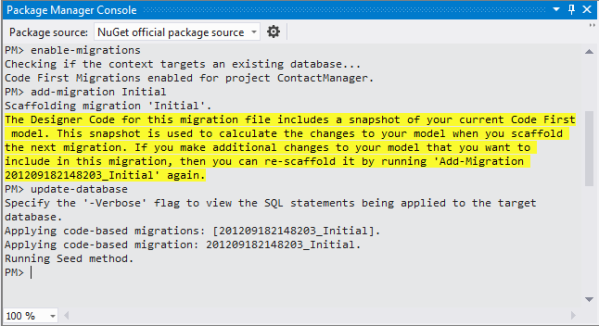

    La commande **update-database** exécute la première migration qui entraîne la création de la base de données. Par défaut, la base de données est créée en tant que base de données SQL Server Express LocalDB.

8.  Appuyez sur Ctrl+F5 pour exécuter l'application.

L'application affiche les données amorcées, ainsi que des liens pour les modifier, les supprimer ou obtenir des informations supplémentaires.

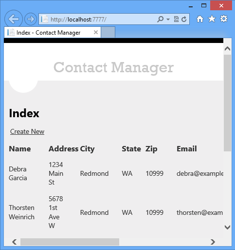

Modification de l'affichage
---------------------------

1.  Ouvrez le fichier *Views\\Home\\Index.cshtml*. Dans l'étape suivante, nous allons remplacer le balisage généré par un code utilisant [jQuery](http://jquery.com/) et [Knockout.js](http://knockoutjs.com/). Ce nouveau code récupère la liste des contacts en utilisant l'API Web et JSON, puis relie les données de contact à l'interface utilisateur en utilisant knockout.js. Pour plus d'informations, consultez la section [Étapes suivantes](#nextsteps) à la fin de ce didacticiel.

2.  Remplacez le contenu du fichier par le code suivant.

         @model IEnumerable<ContactManager data-morhtml="true".Models.Contact>
         @{
             ViewBag.Title = "Accueil";
         }
         @section Scripts {
             @Scripts.Render("~/bundles/knockout")
             
         }
         <ul id="contacts" data-bind="foreach: contacts">
             <li class="ui-widget-content ui-corner-all">
                 <h1 data-bind="text: Name" class="ui-widget-header"></h1>
                 

                 

                     ,
                     
                     
                 

                 

                 
Email
         

                 

                 
Twitter
         

                 
<a data-bind="attr: { href: Self }, click: $root.removeContact" class="removeContact ui-state-default ui-corner-all">Supprimer</a>

             </li>
         </ul>
         <form id="addContact" data-bind="submit: addContact">
             <fieldset>
                 <legend>Ajouter un nouveau contact</legend>
                 <ol>
                     <li>
                         <label for="Name">Nom</label>
                         <input type="text" name="Name" />
                     </li>
                     <li>
                         <label for="Address">Adresse</label>
                         <input type="text" name="Address" >
                     </li>
                     <li>
                         <label for="City">Ville</label>
                         <input type="text" name="City" />
                     </li>
                     <li>
                         <label for="State">Région</label>
                         <input type="text" name="State" />
                     </li>
                     <li>
                         <label for="Zip">Code postal</label>
                         <input type="text" name="Zip" />
                     </li>
                     <li>
                         <label for="Email">Adresse électronique</label>
                         <input type="text" name="Email" />
                     </li>
                     <li>
                         <label for="Twitter">Twitter</label>
                         <input type="text" name="Twitter" />
                     </li>
                 </ol>
                 <input type="submit" value="Add" />
             </fieldset>
         </form>

3.  Cliquez avec le bouton droit sur le dossier Contenu, puis cliquez sur **Ajouter** et sur **Nouvel élément...**.

    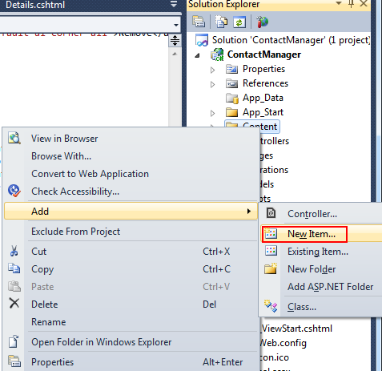

4.  Dans la boîte de dialogue **Ajouter un nouvel élément**, entrez **Style** dans la zone de recherche située en haut à droite, puis sélectionnez **Feuille de style**. 
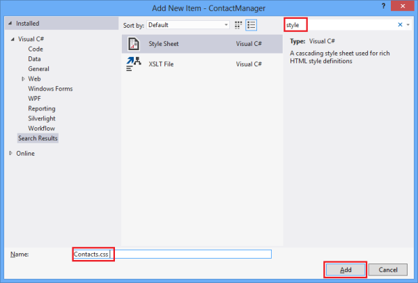

5.  Nommez le fichier *Contacts.css*, puis cliquez sur **Ajouter**. Remplacez le contenu du fichier par le code suivant.

         .column {
             float: left;
             width: 50%;
             padding: 0;
             margin: 5px 0;
         }
         form ol {
             list-style-type: none;
             padding: 0;
             margin: 0;
         }
         form li {
             padding: 1px;
             margin: 3px;
         }
         form input[type="text"] {
             width: 100%;
         }
         #addContact {
             width: 300px;
             float: left;
             width:30%;
         }
         #contacts {
             list-style-type: none;
             margin: 0;
             padding: 0;
             float:left;
             width: 70%;
         }
         #contacts li {
             margin: 3px 3px 3px 0;
             padding: 1px;
             float: left;
             width: 300px;
             text-align: center;
             background-image: none;
             background-color: #F5F5F5;
         }
         #contacts li h1
         {
             padding: 0;
             margin: 0;
             background-image: none;
             background-color: Orange;
             color: White;
             font-family: Trebuchet MS, Tahoma, Verdana, Arial, sans-serif;
         }
         .removeContact, .viewImage
         {
             padding: 3px;
             text-decoration: none;
         }

    Nous allons utiliser cette feuille de style pour la disposition, les couleurs et les styles de l'application Gestionnaire de contacts.

6.  Ouvrez le fichier *App\_Start\\BundleConfig.cs*.

7.  Ajoutez le code suivant pour inscrire le plug-in [Knockout](http://knockoutjs.com/index.html "KO").

         bundles.Add(new ScriptBundle("~/bundles/knockout").Include(
                     "~/Scripts/knockout-{version}.js"));

    Cet exemple utilise Knockout pour simplifier le code JavaScript dynamique gérant les modèles d'écran.

8.  Modifiez l'entrée contents/css pour inscrire la feuille de style *contacts.css*. Remplacez la ligne suivante :

                  bundles.Add(new StyleBundle("~/Content/css").Include(
                    "~/Content/bootstrap.css",
                    "~/Content/site.css"));

    Par :

                  bundles.Add(new StyleBundle("~/Content/css").Include(
                    "~/Content/bootstrap.css",
                    "~/Content/contacts.css",
                    "~/Content/site.css"));

9.  Dans la console du Gestionnaire de package, exécutez la commande suivante pour installer Knockout.

    Install-Package knockoutjs

Ajout d'un contrôleur pour l'interface d'API Web Restful
--------------------------------------------------------

1.  Dans l'**Explorateur de solutions**, cliquez avec le bouton droit sur Contrôleurs, cliquez sur **Ajouter**, puis sur **Contrôleur...**

2.  Dans la boîte de dialogue **Add Scaffold**, entrez **Web API 2 Controller with actions, using Entity Framework**, puis cliquez sur **Ajouter**.

    

3.  Dans la boîte de dialogue **Ajouter un contrôleur**, nommez votre contrôleur « ContactsController ». Sélectionnez « Contact (ContactManager.Models) » en tant que **Classe de modèle**. Conservez la valeur par défaut pour la **classe du contexte des données**.

4.  Cliquez sur **Ajouter**.

### Exécution locale de l'application

1.  Appuyez sur Ctrl+F5 pour exécuter l'application.

    

2.  Entrez un contact, puis cliquez sur **Ajouter**. L'application revient à la page d'accueil et affiche le contact que vous venez d'entrer.

    

3.  Dans le navigateur, ajoutez **/api/contacts** à l'URL.

    L'URL ressemblera alors à http://localhost:1234/api/contacts. L'API Web RESTful ajoutée revient aux contacts stockés. Firefox et Chrome affichent les données au format XML.

    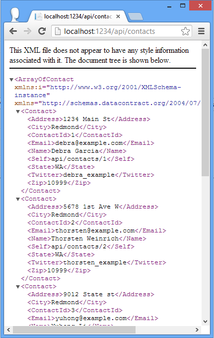

    IE vous invite à ouvrir ou enregistrer les contacts.

    

    Vous pouvez ouvrir les contacts renvoyés dans le Bloc-notes ou un navigateur.

    Ce résultat peut être utilisé par une autre application, comme une page Web ou une application mobile.

    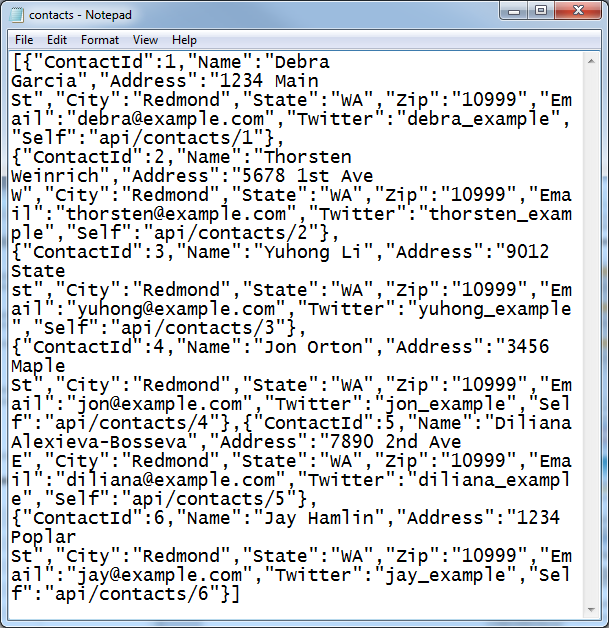

    **Avertissement de sécurité** : pour l'instant, votre application n'est pas sécurisée et est vulnérable aux falsifications de requête intersites (CSRF, Cross Site Request Forgery). Nous résoudrons ce problème plus tard dans ce didacticiel. Pour plus d'informations, consultez la page [Prévention des falsifications de requête intersites](http://www.asp.net/web-api/overview/security/preventing-cross-site-request-forgery-(csrf)-attacks).

XSRFAjout d'une protection XSRF
-------------------------------

Une falsification de requête intersites (également connue sous le nom de XSRF ou CSRF) est une attaque contre des applications hébergées sur le Web durant lesquelles un site Web malveillant peut influencer l'interaction entre un navigateur client et un site Web approuvé par ce navigateur. Ces attaques sont rendues possibles par le fait que les navigateurs Web envoient automatiquement des jetons d'authentification avec chaque requête vers un site Web. L'exemple classique est le cookie d'authentification, comme le ticket d'authentification d'ASP.NET. Cependant, les sites Web utilisant un mécanisme d'authentification persistant (comme l'authentification Windows, Basic, etc.) peuvent être visés par ces attaques.

Une attaque XSRF est différente d'une attaque par hameçonnage (ou « phishing »). Les attaques par hameçonnage requièrent une interaction avec la victime. Dans ce genre d'attaque, un site Web malveillant va imiter un site Web cible et la victime est dupée pour fournir des informations sensibles à l'attaquant. Dans une attaque XSRF, il n'y a généralement pas d'interaction avec la victime. L'attaquant se repose plutôt sur le fait que le navigateur envoie automatiquement tous les cookies utiles au site Web de destination.

Pour plus d'informations, consultez la page [Projet de sécurité d'application Web ouvert](https://www.owasp.org/index.php/Main_Page) (ou OWASP pour « Open Web Application Security Project ») [XSRF](https://www.owasp.org/index.php/Cross-Site_Request_Forgery_(CSRF)).

1.  Dans l'**Explorateur de solutions**, cliquez avec le bouton droit sur le projet **ContactManager**, cliquez sur **Ajouter**, puis sur **Classe**.

2.  Nommez le fichier *ValidateHttpAntiForgeryTokenAttribute.cs* et ajoutez le code suivant :

         using System;
         using System.Collections.Generic;
         using System.Linq;
         using System.Net;
         using System.Net.Http;
         using System.Web.Helpers;
         using System.Web.Http.Controllers;
         using System.Web.Http.Filters;
         using System.Web.Mvc;
         namespace ContactManager.Filters
         {
             public class ValidateHttpAntiForgeryTokenAttribute : AuthorizationFilterAttribute
             {
                 public override void OnAuthorization(HttpActionContext actionContext)
                 {
                     HttpRequestMessage request = actionContext.ControllerContext.Request;
                     try
                     {
                         if (IsAjaxRequest(request))
                         {
                             ValidateRequestHeader(request);
                         }
                         else
                         {
                             AntiForgery.Validate();
                         }
                     }
                     catch (HttpAntiForgeryException e)
                     {
                         actionContext.Response = request.CreateErrorResponse(HttpStatusCode.Forbidden, e);
                     }
                 }
                 private bool IsAjaxRequest(HttpRequestMessage request)
                 {
                     IEnumerable<string> xRequestedWithHeaders;
                     if (request.Headers.TryGetValues("X-Requested-With", out xRequestedWithHeaders))
                     {
                         string headerValue = xRequestedWithHeaders.FirstOrDefault();
                         if (!String.IsNullOrEmpty(headerValue))
                         {
                             return String.Equals(headerValue, "XMLHttpRequest", StringComparison.OrdinalIgnoreCase);
                         }
                     }
                     return false;
                 }
                 private void ValidateRequestHeader(HttpRequestMessage request)
                 {
                     string cookieToken = String.Empty;
                     string formToken = String.Empty;
                     IEnumerable<string> tokenHeaders;
                     if (request.Headers.TryGetValues("RequestVerificationToken", out tokenHeaders))
                     {
                         string tokenValue = tokenHeaders.FirstOrDefault();
                         if (!String.IsNullOrEmpty(tokenValue))
                         {
                             string[] tokens = tokenValue.Split(':');
                             if (tokens.Length == 2)
                             {
                                 cookieToken = tokens[0].Trim();
                                 formToken = tokens[1].Trim();
                             }
                         }
                     }
                     AntiForgery.Validate(cookieToken, formToken);
                 }
             }
         }

3.  Ajoutez l'instruction *using* suivante au contrôleur de contacts pour accéder à l'attribut **[ValidateHttpAntiForgeryToken]**.

    	using ContactManager.Filters;

4.  Ajoutez l'attribut **[ValidateHttpAntiForgeryToken]** aux méthodes Post du **ContactsController** pour le protéger des menaces XSRF. Vous l'ajouterez aux méthodes d'action « PutContact », « PostContact » et **DeleteContact**.

    [ValidateHttpAntiForgeryToken] public IHttpActionResult PutContact(int id, Contact contact) {

5.  Mettez à jour la section *Scripts* du fichier *Views\\Home\\Index.cshtml* pour inclure le code d'obtention des jetons XSRF.

          @section Scripts {
             @Scripts.Render("~/bundles/knockout")
             

Publication de la mise à jour de l'application vers Azure et la base de données SQL
-----------------------------------------------------------------------------------

Pour publier l'application, répétez la procédure suivie précédemment.

1.  Dans l'**Explorateur de solutions**, cliquez avec le bouton droit sur le projet, puis sélectionnez **Publier**.

    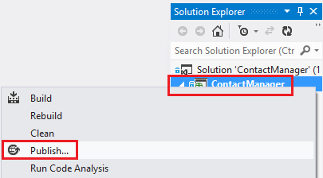

2.  Cliquez sur l'onglet **Paramètres**.

3.  Sous **ContactsManagerContext(ContactsManagerContext)**, cliquez sur l'icône **v** pour remplacer *Remote connection string* par la chaîne de connexion pour la base de données de contacts. Cliquez sur **ContactDB**.

    

4.  Activez la case à cocher pour **Execute Code First Migrations (runs on application start)**.

5.  Cliquez sur **Suivant**, puis sur **Aperçu**. Visual Studio affiche une liste des fichiers ajoutés ou mis à jour.

6.  Cliquez sur **Publier**. Une fois le déploiement terminé, le navigateur ouvre la page d'accueil de l'application.

    

    Le processus de publication Visual Studio a configuré automatiquement la chaîne de connexion du fichier *Web.config* déployé pour qu'elle pointe vers la base de données SQL. Il a également configuré les migrations Code First pour mettre automatiquement à niveau la base de données vers la dernière version, dès le premier accès de l'application à la base de données après le déploiement.

    Ainsi, Code First a créé la base de données en exécutant le code de la classe **Initial** que vous avez créée précédemment. Cela s'est produit lors du premier accès de l'application à la base de données après le déploiement.

7.  Entrez un contact comme vous l'avez fait lorsque vous avez exécuté l'application en local, pour vérifier que le déploiement de la base de données est correct.

Lorsque vous constatez que l'élément que vous entrez est enregistré et s'affiche sur la page du Gestionnaire de contacts, vous savez qu'il a été stocké dans la base de données.

L'application est à présent exécutée dans le cloud et utilise la base de données SQL Database pour stocker ses données. Lorsque vous avez fini de tester l'application dans Azure, supprimez-la. L'application est publique et ne dispose pas de mécanismes permettant d'en limiter l'accès.

Étapes suivantes
----------------

Une véritable application requiert une authentification et une autorisation. Vous devez utiliser la base de données d'appartenance pour cela. Le didacticiel [Déploiement d'une application ASP.NET MVC sécurisée avec une fonctionnalité d'appartenance, OAuth et une base de données SQL vers un site Web Windows Azure](http://www.windowsazure.com/fr-fr/develop/net/tutorials/web-site-with-sql-database/) est basé sur ce didacticiel et vous montre comment déployer une application Web avec la base de données d'appartenance.

Une autre méthode pour stocker des données dans une application Azure consiste à utiliser le stockage Azure, qui permet de stocker des données non relationnelles sous la forme d'objets blob et de tables. Pour plus d'informations sur les API Web, ASP.NET MVC et Windows Azure, consultez les liens suivants.

-   [Mise en route d'Entity Framework avec MVC](http://www.asp.net/mvc/tutorials/getting-started-with-ef-using-mvc/creating-an-entity-framework-data-model-for-an-asp-net-mvc-application)
-   [Introduction à ASP.NET MVC 5](http://www.asp.net/mvc/tutorials/mvc-5/introduction/getting-started)
-   [Votre première API Web ASP.NET](http://www.asp.net/web-api/overview/getting-started-with-aspnet-web-api/tutorial-your-first-web-api)
-   [Débogage de WAWS](http://www.windowsazure.com/fr-fr/documentation/articles/web-sites-dotnet-troubleshoot-visual-studio/)

Ce didacticiel et son exemple d'application ont été écrits par [Rick Anderson](http://blogs.msdn.com/b/rickandy/) (Twitter [@RickAndMSFT](https://twitter.com/RickAndMSFT)) avec l'aide de Tom Dykstra et Barry Dorrans (Twitter [@blowdart](https://twitter.com/blowdart)).

N'hésitez pas à nous transmettre vos commentaires sur ce qui vous a plu et ce qui pourrait être amélioré... pas seulement à propos de ce didacticiel, mais aussi en ce qui concerne les produits présentés ici. Vos commentaires nous aideront à orienter nos améliorations. Nous aimerions particulièrement savoir si l'automatisation du processus de configuration et de déploiement de la base de données d'appartenance vous intéresse.

