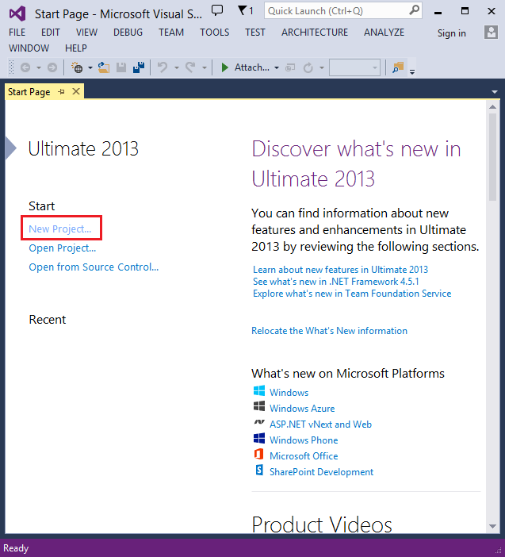
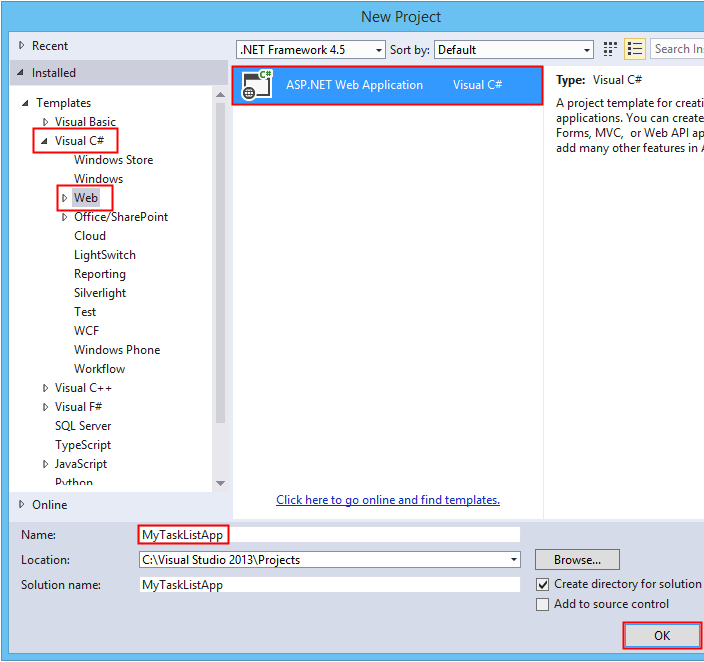
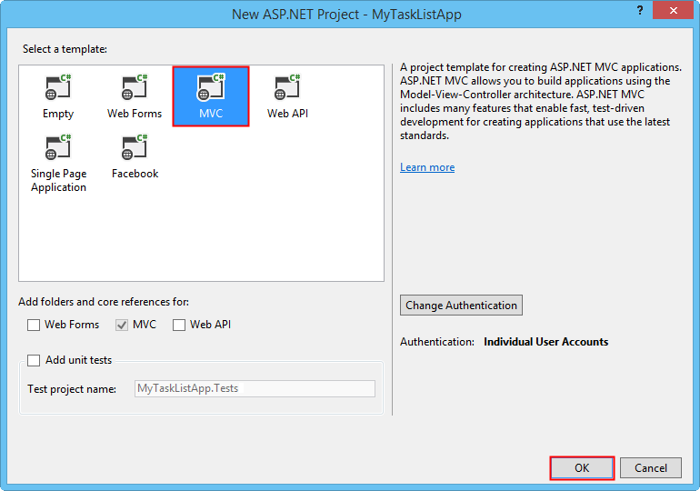
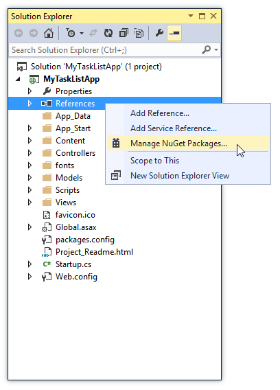
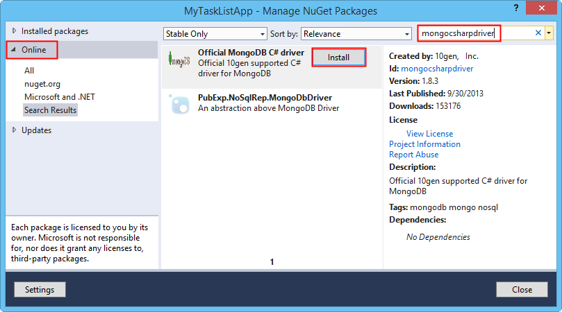
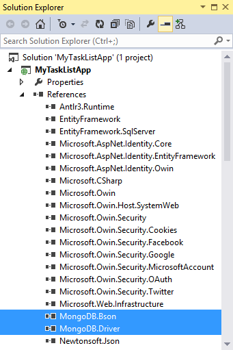
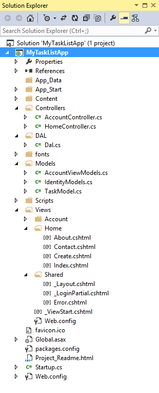
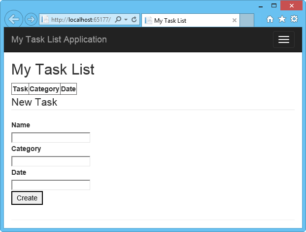

<properties linkid="develop-dotnet-website-with-mongodb-vm" urlDisplayName="Website with MongoDB VM" pageTitle=".NET web site with MongoDB on a virtual machine - Azure" metaKeywords="Azure Git ASP.NET MongoDB, Git .NET, Git MongoDB, ASP.NET MongoDB, Azure MongoDB, Azure ASP.NET, Azure tutorial" description="A tutorial that teaches you how to use Git to deploy an ASP.NET app to an Azure web site connected to MongoDB on a virtual machine." metaCanonical="" services="web-sites,virtual-machines" documentationCenter=".NET" title="Create an Azure web site that connects to MongoDB running on a virtual machine in Azure" authors="" solutions="" manager="" editor="" />

Création d'un site Web Azure se connectant à MongoDB exécuté sur une machine virtuelle dans Azure
=================================================================================================

Git vous permet de déployer une application ASP.NET sur un site Web Azure. Ce didacticiel vous apprendra à créer une simple application frontale de liste de tâches ASP.NET MVC se connectant à une base de données MongoDB exécutée sur une machine virtuelle dans Azure. [MongoDB](http://www.mongodb.org) est une base de données NoSQL open source qui offre des performances élevées. Après avoir exécuté et testé l'application ASP.NET sur votre ordinateur de développement, vous téléchargerez l'application vers un site Web Azure à l'aide de Git.

[WACOM.INCLUDE [create-account-and-websites-and-vms-note](../includes/create-account-and-websites-and-vms-note.md)]

Vue d'ensemble
--------------

Ce didacticiel vous apprendra à effectuer les opérations suivantes :

-   [Création d’une machine virtuelle et installation de MongoDB](#virtualmachine)
-   [Création et exécution de l'application My Task List ASP.NET sur votre ordinateur de développement](#createapp)
-   [Création d'un site Web Azure](#createwebsite)
-   [Déploiement de l'application ASP.NET sur le site Web à l'aide de Git](#deployapp)

Connaissances générales
-----------------------

Dans le cadre de ce didacticiel, la connaissance des éléments suivants est utile, mais pas obligatoire :

-   Pilote C\# pour MongoDB Pour plus d'informations sur le développement d'applications C\# sur MongoDB, reportez-vous au [CSharp Language Center](http://docs.mongodb.org/ecosystem/drivers/csharp/) de MongoDB.
-   Infrastructure de développement d'applications Web ASP .NET Pour plus d'informations, consultez le [site Web ASP.net](http://www.asp.net/).
-   Infrastructure de développement d'applications Web ASP .NET MVC Pour plus d'informations, consultez le [site Web ASP.NET MVC](http://www.asp.net/mvc).
-   Azure. Pour commencer, lisez les informations relatives à [Azure](http://www.windowsazure.com).

Préparation
-----------

Dans cette section, vous allez apprendre à créer une machine virtuelle dans Azure, à installer MongoDB et à configurer votre environnement de développement

### Création d'une machine virtuelle et installation de MongoDB##\#

Ce didacticiel part du principe que vous avez créé une machine virtuelle dans Azure. Une fois la machine virtuelle créée, vous devez y installer MongoDB :

-   Pour créer une machine virtuelle Windows et installer MongoDB, consultez la rubrique [Installation de MongoDB sur une machine virtuelle exécutant Windows Server dans Azure](/en-us/manage/windows/common-tasks/install-mongodb/).
-   Pour créer une machine virtuelle Linux et installer MongoDB, consultez la rubrique [Installation de MongoDB sur une machine virtuelle exécutant CentOS Linux dans Azure](/en-us/manage/linux/common-tasks/mongodb-on-a-linux-vm/).

Après avoir créé la machine virtuelle dans Azure et installé MongoDB, mémorisez le nom DNS de la machine virtuelle (« testlinuxvm.cloudapp.net », par exemple) ainsi que le port externe de MongoDB spécifié dans le point de terminaison. Ces informations vous seront nécessaires plus loin dans ce didacticiel.

### Installation de Visual Studio

Commencez par installer et exécuter [Visual Studio Express 2013 pour Web](http://www.microsoft.com/visualstudio/eng/2013-downloads#d-2013-express) ou [Visual Studio 2013](http://www.microsoft.com/visualstudio/eng/2013-downloads).

Visual Studio est un environnement de développement intégré (IDE). De la même manière que vous utilisez Microsoft Word pour créer des documents, vous utilisez un environnement de développement intégré pour créer des applications. Ce didacticiel utilise Microsoft Visual Studio 2013, mais vous pouvez également utiliser Microsoft Visual Studio Express 2013, une version gratuite de Microsoft Visual Studio.

## Création et exécution de l'application My Task List ASP.NET sur votre ordinateur de développement##

Dans cette section, vous allez créer une application ASP.NET appelée « My Task List » à l'aide de Visual Studio. Vous exécuterez cette application localement, mais elle se connectera à votre machine virtuelle sur Azure et utilisera l'instance MongoDB que vous y avez créée.

### Création de l'application

Dans Visual Studio, cliquez sur **Nouveau projet**.

Dans le volet gauche de la fenêtre **Nouveau projet**, sélectionnez **Visual C\#**, puis **Web**. Dans le volet central, sélectionnez **Application Web ASP.NET**. En bas, nommez votre projet « MyTaskListApp », puis cliquez sur **OK**.

Dans la boîte de dialogue **Nouveau projet ASP.NET**, sélectionnez **MVC**, puis cliquez sur **OK**.

Une fois le projet terminé, la page par défaut créée par le modèle s'affiche.

### Installation du pilote MongoDB C\# 

MongoDB offre une prise en charge côté client des applications C\# via un pilote à installer sur votre ordinateur de développement local. Le pilote C\# est disponible via NuGet.

Pour installer le pilote MongoDB C\# :

1.  Dans l'**Explorateur de solutions**, sous le projet **MyTaskListApp**, cliquez avec le bouton droit sur **Références** et sélectionnez **Gérer les packages NuGet**.

    

2.  Dans le volet gauche de la fenêtre **Gérer les packages NuGet**, cliquez sur **En ligne**. Dans la zone **Rechercher en ligne** de droite, tapez « mongocsharpdriver ». Cliquez sur **Installer** pour installer le pilote.

    

3.  Cliquez sur **J'accepte** pour accepter les termes du contrat de licence 10gen, Inc.

4.  Cliquez sur **Fermer** une fois le pilote installé. 
    

Le pilote MongoDB C\# est maintenant installé. Des références vers les bibliothèques **MongoDB.Driver.dll** et **MongoDB.Bson.dll** ont été ajoutées au projet.

### Ajout d'un modèle

Dans l'**Explorateur de solutions**, cliquez avec le bouton droit sur le dossier *Modèles* et **ajoutez** une nouvelle **classe** que vous nommerez *TaskModel.cs*. Dans *TaskModel.cs*, remplacez le code existant par le code suivant :

    using System;
    using System.Collections.Generic;
    using System.Linq;
    using System.Web;
    using MongoDB.Bson.Serialization.Attributes;
    using MongoDB.Bson.Serialization.IdGenerators;
    using MongoDB.Bson;

    namespace MyTaskListApp.Models
    {
        public class MyTask
        {
            [BsonId(IdGenerator = typeof(CombGuidGenerator))]
            public Guid Id { get; set; }

            [BsonElement("Name")]
            public string Name { get; set; }

            [BsonElement("Category")]
            public string Category { get; set; }

            [BsonElement("Date")]
            public DateTime Date { get; set; }

            [BsonElement("CreatedDate")]
            public DateTime CreatedDate { get; set; }

        }
    }

### Ajout de la couche d'accès aux données

Dans l'**Explorateur de solutions**, cliquez avec le bouton droit sur le projet *MyTaskListApp* et **ajoutez** un **nouveau dossier** appelé *DAL*. Cliquez avec le bouton droit sur le dossier *DAL* et **ajoutez** une nouvelle **classe**. Nommez le fichier de classe *Dal.cs*. Dans *Dal.cs*, remplacez le code existant par le code suivant :

    using System;
            using System.Collections.Generic;
            using System.Linq;
            using System.Web;
            using MyTaskListApp.Models;
            using MongoDB.Driver;
            using System.Configuration;
            
            namespace MyTaskListApp
            {
                public class Dal : IDisposable
                {
                    private MongoServer mongoServer = null;
                    private bool disposed = false;
            
                    // À faire : mettez à jour la chaîne de connexion avec le nom DNS
                    // ou l'adresse IP de votre serveur. 
            //Par exemple, "mongodb://testlinux.cloudapp.net"
                    private string connectionString = "mongodb://<vm-dns-name>";
            
                    // Cet exemple utilise une base de données appelée « Tasks » et une 
                    //collection appelée « TasksList ».  La base de données et la collection 
                    //seront automatiquement créées si elles n'existent pas déjà.
            private string dbName = "Tasks";
                    private string collectionName = "TasksList";
            
                    // Default constructor.        
            public Dal()
                    {
                    }        
            
                    // Obtient tous les éléments de tâche depuis le serveur MongoDB.        
            public List<MyTask> GetAllTasks()
                    {
                        try
                        {
                            MongoCollection<MyTask> collection = GetTasksCollection();
                            return collection.FindAll().ToList<MyTask>();
                        }
                        catch (MongoConnectionException)
                        {
                            return new List<MyTask >();
                        }
                    }
            
                    // Crée une tâche et l'insère dans la collection dans MongoDB.
            public void CreateTask(MyTask task)
                    {
                        MongoCollection<MyTask> collection = GetTasksCollectionForEdit();
                        try
                        {
                            collection.Insert(task, SafeMode.True);
                        }
                        catch (MongoCommandException ex)
                        {
                            string msg = ex.Message;
                        }
                    }
            
                    private MongoCollection<MyTask> GetTasksCollection()
                    {
                        MongoServer server = MongoServer.Create(connectionString);
                        MongoDatabase database = server[dbName];
                        MongoCollection<MyTask> todoTaskCollection = database.GetCollection<MyTask>(collectionName);
                        return todoTaskCollection;
                    }
            
                    private MongoCollection<MyTask> GetTasksCollectionForEdit()
                    {
                        MongoServer server = MongoServer.Create(connectionString);
                        MongoDatabase database = server[dbName];
                        MongoCollection<MyTask> todoTaskCollection = database.GetCollection<MyTask>(collectionName);
                        return todoTaskCollection;
                    }
            
                    # region IDisposable
            
                    public void Dispose()
                    {
                        this.Dispose(true);
                        GC.SuppressFinalize(this);
                    }
            
                    protected virtual void Dispose(bool disposing)
                    {
                        if (!this.disposed)
                        {
                            if (disposing)
                            {
                                if (mongoServer != null)
                                {
                                    this.mongoServer.Disconnect();
                                }
                            }
                        }
            
                        this.disposed = true;
                    }
            
                    # endregion
                }
            }

### Ajout d'un contrôleur

Ouvrez le fichier *Controllers\\HomeController.cs* dans l'**Explorateur de solutions** et remplacez le code existant par ce qui suit :

    using System;
    using System.Collections.Generic;
    using System.Linq;
    using System.Web;
    using System.Web.Mvc;
    using MyTaskListApp.Models;
    using System.Configuration;

    namespace MyTaskListApp.Controllers
    {
        public class HomeController : Controller, IDisposable
        {
            private Dal dal = new Dal();
            private bool disposed = false;
            //
            // GET: /MyTask/

            public ActionResult Index()
            {
                return View(dal.GetAllTasks());
            }

            //
            // GET: /MyTask/Create

            public ActionResult Create()
            {
                return View();
            }

            //
            // POST: /MyTask/Create

            [HttpPost]
            public ActionResult Create(MyTask task)
            {
                try
                {
                    dal.CreateTask(task);
                    return RedirectToAction("Index");
                }
                catch
                {
                    return View();
                }
            }

            public ActionResult About()
            {
                return View();
            }

            # region IDisposable

            new protected void Dispose()
            {
                this.Dispose(true);
                GC.SuppressFinalize(this);
            }

            new protected virtual void Dispose(bool disposing)
            {
                if (!this.disposed)
                {
                    if (disposing)
                    {
                        this.dal.Dispose();
                    }
                }

                this.disposed = true;
            }

            # endregion

        }
    }

### Configuration du style du site

Pour modifier le titre du haut de la page, ouvrez le fichier *Views\\Shared\\\_Layout.cshtml* dans l'**Explorateur de solutions** et remplacez « Application name » dans le titre de la barre de navigation par « My Task List Application » de manière à afficher ce qui suit :

	@Html.ActionLink("My Task List Application", "Index", "Home", null, new { @class = "navbar-brand" })

Pour configurer le menu Liste des tâches, ouvrez le fichier *\\Views\\Home\\Index.cshtml* et remplacez le code existant par le code suivant :

    @model IEnumerable<MyTaskListApp.Models.MyTask>

    @{
        ViewBag.Title = "My Task List";
    }

    <h2>My Task List</h2>

    <table border="1">
        <tr>
            <th>Task</th>
            <th>Category</th>
            <th>Date</th>
            
        </tr>

    @foreach (var item in Model) {
        <tr>
            <td>
                @Html.DisplayFor(modelItem => item.Name)
            </td>
            <td>
                @Html.DisplayFor(modelItem => item.Category)
            </td>
            <td>
                @Html.DisplayFor(modelItem => item.Date)
            </td>
            
        </tr>
    }

    </table>
    
  @Html.Partial("Create", new MyTaskListApp.Models.MyTask())

Pour permettre la création d'une tâche, cliquez avec le bouton droit sur le dossier *Views\\Home\\* et **ajoutez** une **vue** que vous nommez *Créer*. Remplacez le code par ce qui suit :

    @model MyTaskListApp.Models.MyTask

    
    
    

    @using (Html.BeginForm("Create", "Home")) {
        @Html.ValidationSummary(true)
        <fieldset>
            <legend>New Task</legend>

            

                @Html.LabelFor(model => model.Name)
            

            

                @Html.EditorFor(model => model.Name)
                @Html.ValidationMessageFor(model => model.Name)
            

            

                @Html.LabelFor(model => model.Category)
            

            

                @Html.EditorFor(model => model.Category)
                @Html.ValidationMessageFor(model => model.Category)
            

            

                @Html.LabelFor(model => model.Date)
            

            

                @Html.EditorFor(model => model.Date)
                @Html.ValidationMessageFor(model => model.Date)
            

            

                <input type="submit" value="Create" />
            

        </fieldset>
    }

L'**Explorateur de solutions** doit se présenter comme suit :

### Configuration de la chaîne de connexion MongoDB

Dans l'**Explorateur de solutions**, ouvrez le fichier *DAL/Dal.cs*. Recherchez la ligne de code suivante :

    private string connectionString = "mongodb://<vm-dns-name>";

Remplacez `<vm-dns-name>` par le nom DNS de la machine virtuelle exécutant MongoDB que vous avez créée à l'étape [Création d'une machine virtuelle et installation de MongoDB](#virtualmachine) de ce didacticiel. Pour rechercher le nom DNS de votre machine virtuelle, accédez au portail de gestion Azure, sélectionnez **Machines virtuelles** et recherchez **Nom DNS**.

Si le nom DNS de la machine virtuelle correspond à « testlinuxvm.cloudapp.net » et que MongoDB écoute sur le port par défaut 27017, la ligne de code de la chaîne de connexion se présente comme suit :

    private string connectionString = "mongodb://testlinuxvm.cloudapp.net";

Si le point de terminaison de la machine virtuelle spécifie un port externe différent pour MongoDB, vous pouvez indiquer ce port dans la chaîne de connexion :

	private string connectionString = "mongodb://testlinuxvm.cloudapp.net:12345";

Pour plus d'informations sur les chaînes de connexion MongoDB, consultez la rubrique [Connexions](http://www.mongodb.org/display/DOCS/Connections).

### Test du déploiement local

Pour exécuter l'application sur votre ordinateur de développement, sélectionnez **Démarrer le débogage** dans le menu **Déboguer** ou appuyez sur **F5**. IIS Express démarre et un navigateur s'ouvre et lance la page d'accueil de l'application. Vous pouvez ajouter une nouvelle tâche qui sera ajoutée à la base de données MongoDB exécutée sur votre machine virtuelle dans Azure.

Déploiement de l'application sur un site Web AzureDéploiement de l'application ASP.NET sur un site Web Azure
------------------------------------------------------------------------------------------------------------

Dans cette section, vous allez créer un site Web et déployer l'application ASP.NET My Task List à l'aide de Git.

### Création d'un site Web Azure
Dans cette section, vous allez créer un site Web Azure.

1.  Ouvrez un navigateur Web et accédez au [portail de gestion Azure](http://manage.windowsazure.com). Connectez-vous à votre compte Azure.
2.  En bas de la page, cliquez sur **+Nouveau**, puis sur **Site Web** et enfin sur **Création rapide**.
3.  Entrez un préfixe unique pour l'URL de l'application.
4.  Sélectionnez une région.
5.  Cliquez sur **Créer un site Web**.

1.  Votre site Web sera rapidement créé et répertorié dans **Sites Web**.

### Déploiement de l'application ASP.NET sur le site Web à l'aide de Git 
Dans cette section, vous allez déployer l'application My Task List à l'aide de Git.

1.  Cliquez sur le nom du site Web dans **Sites Web**, puis sur **Tableau de bord**. À droite, sous Aperçu rapide, cliquez sur **Configurer le déploiement à partir du contrôle de code source**.
2.  Sur la page **Où est votre code source ?**, choisissez **Référentiel Git local**, puis cliquez sur la flèche **Suivant**.
3.  Le référentiel Git doit être rapidement créé. Notez les instructions sur la page qui s'affiche, car celles-ci vous seront utiles à la section suivante.

    

4.  Sous **Envoyer mes fichiers locaux dans Azure** se trouvent des instructions relatives au transfert de votre code vers Azure. Ces instructions se présentent comme suit :

    

5.  Si vous n'avez pas installé Git, installez-le à l'aide du lien **Get it here** de l'étape 1.
6.  En suivant les instructions de l'étape 2, validez vos fichiers locaux.
7.  Ajoutez le référentiel distant Azure et transférez vos fichiers vers le site Web Azure en suivant les instructions de l'étape 3.
8.  Une fois le déploiement terminé, la confirmation suivante s'affiche :

    

9.  Votre site Web Azure est maintenant disponible. Consultez la page **Tableau de bord** de votre site et le champ **URL du site** pour trouver l'URL de votre site. En suivant les procédures de ce didacticiel, votre site Web doit être disponible à cette URL : http://mytasklistapp.azurewebsites.net.

Résumé
------

Vous avez déployé votre application ASP.NET sur un site Web Azure. Pour afficher ce site, cliquez sur le lien situé dans le champ **URL du site** de la page **Tableau de bord**. Pour plus d'informations sur le développement d'applications C\# sur MongoDB, reportez-vous à [CSharp Language Center](http://docs.mongodb.org/ecosystem/drivers/csharp/).

