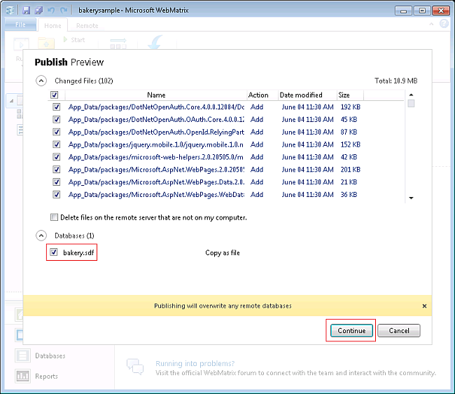
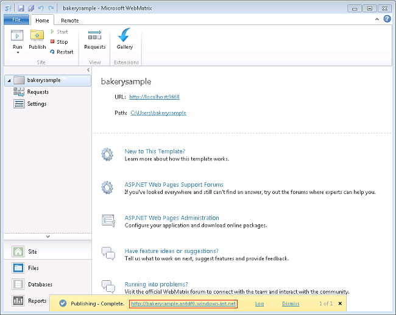
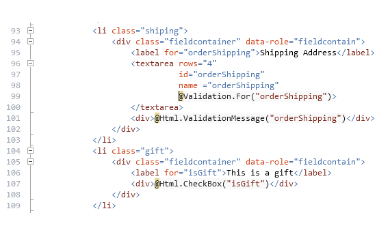

<properties linkid="develop-dotnet-website-with-webmatrix" urlDisplayName="Website with WebMatrix" pageTitle=".NET web site with WebMatrix - Azure tutorials" metaKeywords="WebMatrix Azure, WebMatrix Azure, Azure web site WebMatrix, Azure website WebMatrix, Web Matrix Azure, WebMatrix Azure" description="Learn how to develop and deploy an Azure web site with WebMatrix." metaCanonical="" services="web-sites" documentationCenter=".NET" title="Develop and deploy a web site with Microsoft WebMatrix" authors="" solutions="" manager="" editor="" />

Développement et déploiement d'un site Web avec Microsoft WebMatrix
===================================================================

Ce guide explique comment utiliser Microsoft WebMatrix pour créer et déployer un site Web sur Azure. Vous allez utiliser un exemple d'application à partir d'un modèle de site WebMatrix.

Vous apprendrez à effectuer les opérations suivantes :

-   vous connecter à Azure à partir de WebMatrix ;
-   créer un site à l'aide d'un modèle intégré avec WebMatrix ;
-   déployer le site Web personnalisé directement à partir de WebMatrix sur Azure.

[WACOM.INCLUDE [create-account-and-websites-note](../includes/create-account-and-websites-note.md)]

Connexion à Azure
-----------------

1.  Lancez WebMatrix.
2.  Si vous utilisez WebMatrix 3 pour la première fois, vous êtes invité à vous connecter à Azure. Sinon, vous pouvez cliquer sur le bouton **Se connecter**, puis choisir **Ajouter un compte**. Choisissez **Se connecter** à l'aide de votre compte Microsoft.

    

3.  Si vous disposez d'un compte Azure, vous pouvez vous connecter avec votre compte Microsoft :

    

Création d'un site à l'aide d'un modèle intégré pour Azure
----------------------------------------------------------

1.  Sur l'écran d'accueil, cliquez sur le bouton **Nouveau**, puis choisissez **Galerie de modèles** pour créer un site à partir de la galerie de modèles :

    

2.  La galerie de modèles affiche une liste des modèles disponibles pouvant s'exécuter en local ou sur Azure. Sélectionnez **Bakery** dans la liste de modèles, entrez **bakerysample** pour le **Nom du site**, puis cliquez sur **Suivant**.

    

3.  Si vous êtes connecté à Azure, vous avez maintenant la possibilité de créer un site Web Azure pour votre site local. Choisissez un nom unique, puis sélectionnez le centre de données sur lequel vous voulez que votre site soit créé :

    

    Une fois que WebMatrix a fini de créer le site Web, l'environnement de développement intégré (IDE) WebMatrix s'affiche :

    

Test du site Web
----------------

L'exemple « bakery » inclut un formulaire de commande simulée qui envoie un message électronique avec l'article commandé à un compte Windows Live Hotmail que vous avez fourni.

1.  Dans le volet de navigation gauche de WebMatrix, développez le dossier **bakerysample**.

    

2.  Ouvrez la page *Order.cshtml* en double-cliquant sur le nom du fichier.

    

3.  Recherchez le commentaire //Configuration SMTP pour Hotmail.

    

4.  Modifiez les valeurs des lignes suivantes pour qu'elles correspondent à votre propre fournisseur de messagerie :

         WebMail.SmtpServer = "smtp.live.com";
         WebMail.SmtpPort  = 25;
         WebMail.EnableSsl = true; 

         //Entrez vos informations d'identification Hotmail pour UserName/Password et une adresse « From » pour l'adresse électronique
         WebMail.UserName = "";
         WebMail.Password = "";
         WebMail.From = "";

    Remplacez la valeur de WebMail.SmtpServer par le nom du serveur de messagerie que vous utilisez normalement pour envoyer des courriers électroniques. Entrez ensuite les valeurs de nom d'utilisateur et de mot de passe. Définissez la propriété From sur votre adresse de messagerie.

5.  Sur le ruban WebMatrix, cliquez sur **Exécuter** pour tester le site.

    

6.  Cliquez sur **Order Now** sur l'un des produits et envoyez-vous une commande.

7.  Vérifiez vos courriers électroniques et assurez-vous de recevoir la confirmation de la commande. Si vous rencontrez des difficultés avec l'envoi du courrier électronique, consultez la section [Problèmes avec l'envoi de courrier électronique](http://go.microsoft.com/fwlink/?LinkId=253001#email) du guide de résolution des problèmes ASP.NET Web Pages (Razor).

Déploiement du site Web personnalisé à partir de WebMatrix sur Azure
--------------------------------------------------------------------

1.  Dans WebMatrix, cliquez sur **Publier** dans le ruban **Accueil** pour afficher la boîte de dialogue **Publier l'aperçu** pour le site Web.

    

2.  Cliquez pour activer la case à cocher en regard de bakery.sdf, puis cliquez sur **Continuer**. Une fois la publication terminée, l'URL du site Web mis à jour sur Azure s'affiche en bas de l'IDE WebMatrix.

    

3.  Cliquez sur le lien pour ouvrir le site Web dans votre navigateur :

    

    Vous pouvez également trouver l'URL du site Web dans le portail Azure en cliquant sur **Sites Web** pour afficher tous les sites Web de votre abonnement. L'URL de chaque site Web s'affiche dans la colonne URL de la page des sites Web.

Modification du site Web et republication sur le site Web Azure
---------------------------------------------------------------

Vous pouvez utiliser WebMatrix pour modifier le site et le republier sur votre site Web Azure. Dans la procédure suivante, vous allez ajouter une case à cocher pour indiquer si la commande est un cadeau.

1.  Ouvrez la page *Order.cshtml*.

2.  Recherchez la définition de formulaire de la classe « shiping ». Insérez le code suivant juste après le bloc.

         <li class="gift">
             

                 <label for="isGift">This is a gift</label>           
                 
@Html.CheckBox("isGift")

             

         </li>

    

3.  Recherchez la ligne « var shipping = Request["orderShipping"]; » dans le fichier et insérez la ligne de code suivante juste après.

         var gift = Request["isGift"];

4.  Juste après le bloc de code qui valide que l'adresse d'expédition n'est pas vide dans l'extrait de code suivant.

         if(gift != null) {
             body += "This is a gift." + " ";
         }

    Votre fichier *order.cshtml* doit ressembler à l'image suivante.

    

5.  Enregistrez le fichier, puis exécutez le site en local et envoyez-vous une commande test. Pensez à tester la nouvelle case à cocher.

    

6.  Republiez le site en cliquant sur **Publier** sur le ruban **Accueil**.

7.  Dans la boîte de dialogue **Publier l'aperçu**, vérifiez que les deux fichiers Order.cshtml sont activés, puis cliquez sur Continuer.

8.  Cliquez sur le lien pour ouvrir le site Web dans votre navigateur et tester la mise à jour sur votre site Web Azure.

Étapes suivantes
================

Vous savez désormais comment créer et déployer un site Web avec WebMatrix dans Azure. Pour en savoir plus sur WebMatrix, consultez les ressources suivantes :

-   [WebMatrix pour Azure](http://go.microsoft.com/fwlink/?LinkID=253622&clcid=0x409)

-   [Site Web WebMatrix](http://www.microsoft.com/click/services/Redirect2.ashx?CR_CC=200106398)

