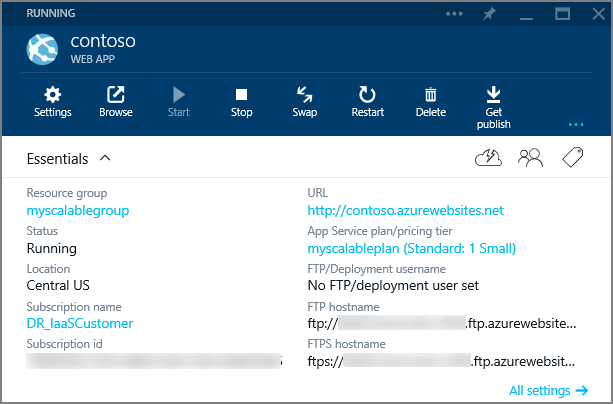

<properties 
	pageTitle="Gérer les applications web à l’aide de Microsoft Azure Portal" 
	description="Vue d’ensemble des tâches de gestion d’application web dans Microsoft Azure à l’aide du portail Azure." 
	services="app-service\web" 
	documentationCenter="" 
	authors="MikeWasson" 
	writer="mwasson" 
	manager="wpickett" 
	editor=""/>

<tags 
	ms.service="app-service-web" 
	ms.workload="web" 
	ms.tgt_pltfrm="na" 
	ms.devlang="na" 
	ms.topic="article" 
	ms.date="03/24/2015" 
	ms.author="mwasson"/>

# Gérer les applications web à l’aide de Microsoft Azure Portal

Dans le [portail Azure](https://portal.azure.com), vous gérez vos applications web grâce à des *panneaux* qui contiennent les différents composants. (Pour une vue d’ensemble du portail Azure, consultez le guide des modifications du [portail](http://go.microsoft.com/fwlink/?LinkId=529715).)

Pour visualiser le panneau de votre application web, cliquez sur **Accueil** puis sur le nom de l’application, ou cliquez sur **Parcourir** pour afficher toutes vos ressources Azure.

La partie supérieure du panneau comporte des contrôles pour certaines actions courantes :

- **Paramètres** vous permet de visualiser la liste de tous les paramètres de gestion.

- **Parcourir** vous permet d’ouvrir l’application web dans la fenêtre du navigateur.

- D’autres boutons vous permettent de démarrer ou d’arrêter l’application, de basculer les emplacements de déploiement, de supprimer l’application, etc.

**Informations de base** répertorie les informations de base concernant l’application, notamment l’URL, l’emplacement, le plan [App Service](http://go.microsoft.com/fwlink/?LinkId=529714) et l’état actuel (en cours d’exécution, arrêtée, etc.).

Les différentes parties situées sous **Informations de base** vous permettent de surveiller, gérer et déployer votre application. Pour personnaliser la disposition du panneau, cliquez avec le bouton droit, puis sélectionnez **Personnaliser** ou **Ajouter des parties**. Le reste de cette rubrique décrit les parties de la disposition par défaut.

## Analyse

Sous **Surveillance** se trouve un graphique affichant les métriques de votre application web. Pour configurer ce graphique, cliquez sur **Modifier**. Vous pouvez sélectionner l’intervalle de temps et les métriques à afficher. Les métriques disponibles comprennent le nombre de demandes, le temps de réponse moyen, les erreurs de serveur et le temps processeur.

Pour ajouter une règle d’alerte, cliquez sur le graphique puis sur **Ajouter une alerte**. Une règle d’alerte vous informe lorsqu’une métrique spécifique atteint un seuil. Par exemple, vous pouvez être averti lorsque le nombre d’erreurs de serveur dépasse une valeur donnée sur une période de 5 minutes.

**Surveillance** comporte également des parties permettant de configurer l’analyse ainsi que la surveillance de l’application, et de créer des tests de disponibilité. Pour plus d’informations, consultez la page [Surveiller les applications web dans Azure App Service](web-sites-monitor.md).

## Utilisation

- **Stockage de système de fichiers** indique l’espace de stockage utilisé par votre application.
- **Quotas** indique la façon dont votre application utilise son quota d’utilisation des ressources. Cliquez sur cette partie pour visualiser les détails associés.
- **Mettre à l’échelle** vous permet de faire évoluer le nombre d’instances et de configurer la fonction de mise à l’échelle automatique. Consultez la page [Faire évoluer une application web dans Azure App Service](how-to-scale-websites.md).  
- **Coût estimé** indique une estimation du coût de l’application.
- **Niveau de tarification** vous permet de modifier le niveau de tarification.

## Opérations

- **Événements** : vous permet de visualiser les journaux des événements.  
- **Règles d’alerte** : vous permet de visualiser les règles d’alerte et d’ajouter d’autres alertes.
- **Diffusion de journaux** (A) : vous permet de visualiser les journaux des applications. Pour activer les journaux, accédez à **Paramètres** et ouvrez le panneau **Journaux de diagnostic**. 
- **Console** : vous permet d’ouvrir une ligne de commande qui s’exécute dans le portail. Vous pouvez utiliser cette dernière pour exécuter des commandes telles que `mkdir` et `dir`.  
- **Explorateur de processus** (B) : vous permet de visualiser les processus en cours d’exécution dans l’application, notamment la plage de travail et le nombre de threads.

## Déploiement
 

- Configurer un déploiement continu Consultez la page [Utilisation de Git pour déployer des applications web dans Azure App Service](web-sites-publish-source-control.md).
- Emplacements de déploiement Consultez la page [Configurer des environnements intermédiaires pour les applications web dans Azure App Service](web-sites-staged-publishing.md).
- Définir les informations d’identification de déploiement pour Git ou FTP 

## Mise en réseau

- Connecter l’application à un réseau virtuel
- Ajouter des connexions hybrides

>[AZURE.NOTE]Si vous voulez vous familiariser avec Azure App Service avant d’ouvrir un compte Azure, accédez à la page [Essayer App Service](http://go.microsoft.com/fwlink/?LinkId=523751). Vous pourrez créer immédiatement une application de départ temporaire dans App Service. Aucune carte de crédit n’est requise ; vous ne prenez aucun engagement.

## Étapes suivantes

- [Faire évoluer une application web dans Azure App Service](how-to-scale-websites.md)
- [Exécuter des tâches en arrière-plan avec les tâches web](web-sites-create-web-jobs.md)
- [Sauvegardes des applications web Azure](web-sites-backup.md) et [restauration](web-sites-restore.md)
- [Surveiller les applications web dans Azure App Service](web-sites-monitor.md)

## Changements apportés
* Pour obtenir un guide présentant les modifications apportées dans le cadre de la transition entre Sites Web et App Service, consultez la page [Azure App Service et les services Azure existants](http://go.microsoft.com/fwlink/?LinkId=529714).
* Pour obtenir un guide présentant les modifications apportées dans le cadre de la transition entre l’ancien et le nouveau portail, consultez la page [Références sur la navigation dans le portail Azure](http://go.microsoft.com/fwlink/?LinkId=529715).

<!--HONumber=54-->