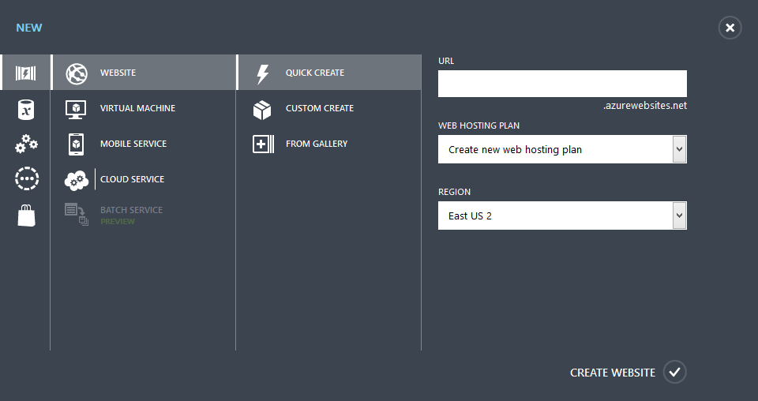
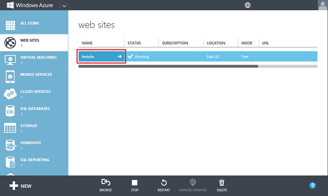
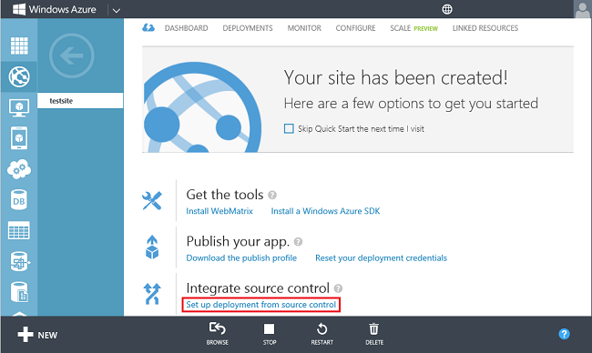

<properties linkid="develop-node-create-a-website-mac" urlDisplayName="Web site" pageTitle="Create a Node.js web site on Mac - Azure tutorials" metaKeywords="Azure create website Node, Azure deploy website Node, website Node.js, Node website" description="Learn how to build and deploy a Node.js web site in Azure. Sample code is written in Java." metaCanonical="" services="web-sites" documentationCenter="Node.js" title="Build and deploy a Node.js web site to Azure" authors="" solutions="" manager="" editor="" />

Génération et déploiement d'un site Web Node.js dans Azure
==========================================================

Ce didacticiel détaille la création d'une application [Node] et son déploiement vers un site Web Azure en utilisant [Git]. Les instructions de ce didacticiel s'appliquent à tous les systèmes d'exploitation pouvant exécuter Node.

Si vous préférez regarder une vidéo, sachez que celle de droite suit la même procédure que ce didacticiel.

Voici une capture d'écran de l'application terminée :

Création d'un site Web Azure et activation de la publication Git
----------------------------------------------------------------

Suivez cette procédure pour créer un site Web Azure et activer la publication Git pour celui-ci.

**Remarque**

Pour effectuer ce didacticiel, vous avez besoin d’un compte Azure. Si vous ne possédez pas de compte, vous pouvez créer un compte d'évaluation gratuit en quelques minutes. Pour plus d'informations, consultez la page [Version d'évaluation gratuite d'Azure](http://www.windowsazure.com/en-us/pricing/free-trial/?WT.mc_id=A7171371E).

1.  Connectez-vous au [portail de gestion Azure](http://manage.windowsazure.com).

2.  Cliquez sur l'icône **+NEW** dans le coin inférieur gauche du portail.

    

3.  Cliquez sur **SITE WEB**, puis sur **QUICK CREATE**. Entrez une valeur pour **URL**, puis sélectionnez un centre de données pour votre site Web dans la liste déroulante **REGION**. Cliquez sur la coche située en bas de la boîte de dialogue.

    

4.  Lorsque le statut du site Web est défini sur **Running**, cliquez sur le nom du site Web pour accéder au **tableau de bord**.

    

5.  Dans le coin inférieur droit de la page de démarrage rapide, sélectionnez **Set up a deployment from source control**.

    

6.  À la question « Où est votre code source ? », sélectionnez **Local Git repository**, puis cliquez sur la flèche.

    

7.  Pour activer la publication Git, vous devez fournir un nom d'utilisateur et un mot de passe. Si vous avez déjà activé la publication pour un site Web Azure, vous n'êtes pas invité à entrer un nom d'utilisateur ou un mot de passe. Au lieu de cela, un référentiel Git est créé en utilisant le nom d'utilisateur et le mot de passe que vous avez déjà indiqués. Notez le nom d'utilisateur et le mot de passe, car ils serviront pour la publication Git de tous les sites Web Azure que vous allez créer.

    

8.  Lorsque le référentiel Git est prêt, vous pouvez consulter les instructions des commandes Git pour la configuration d'un référentiel local et la publication des fichiers dans Azure.

    

Génération et test de votre application localement
--------------------------------------------------

Cette section décrit la création d'un fichier **server.js** contenant l'exemple « hello world » de [nodejs.org]. Cet exemple a été modifié à partir de l'exemple d'origine en ajoutant process.env.PORT en tant que port d'écoute lors de l'exécution dans un site Web Azure.

1.  Dans un éditeur de texte, créez un fichier nommé **server.js** dans le répertoire **helloworld**. Si celui-ci n'existe pas, créez-le.
2.  Ajoutez le contenu suivant au fichier **server.js**, puis enregistrez-le :

         var http = require('http')
         var port = process.env.PORT || 1337;
         http.createServer(function(req, res) {
           res.writeHead(200, { 'Content-Type': 'text/plain' });
           res.end('Hello World\n');
         }).listen(port);

3.  Ouvrez la ligne de commande, puis utilisez la commande suivante pour démarrer la page Web localement :

         node server.js

    [WACOM.INCLUDE [install-dev-tools](../includes/install-dev-tools.md)]

4.  Ouvrez votre navigateur Web et accédez à l'adresse http://localhost:1337. Une page Web affichant « Hello World » apparaît, comme indiqué sur la capture d'écran suivante :

    

Publication de votre application
--------------------------------

1.  À partir de la ligne de commande, remplacez les répertoires par le répertoire **helloworld**, puis entrez les commandes suivantes pour initialiser un référentiel Git local.

         git init

    **Si la commande Git n'est pas disponible**

    [Git](http://git-scm.com/) est un système de contrôle de version distribué permettant de déployer votre site Web Azure. Pour obtenir des instructions d'installation pour votre plateforme, consultez [la page de téléchargement de Git](http://git-scm.com/download).

2.  Utilisez les commandes suivantes pour ajouter des fichiers au référentiel :

         git add .
         git commit -m "initial commit"

3.  Ajoutez un Git distant pour transférer des mises à jour vers le site Web créé précédemment, en utilisant la commande suivante :

         git remote add azure [URL du référentiel distant]

    

4.  Transférez vos modifications dans Azure en utilisant la commande suivante :

        git push azure master

    Vous devez entrer le mot de passe que vous avez créé plus tôt pour obtenir le résultat suivant :

         Password for 'testsite.scm.azurewebsites.net':
         Counting objects: 3, done.
         Delta compression using up to 8 threads.
         Compressing objects: 100% (2/2), done.
         Writing objects: 100% (3/3), 374 bytes, done.
         Total 3 (delta 0), reused 0 (delta 0)
         remote: New deployment received.
         remote: Updating branch 'master'.
         remote: Preparing deployment for commit id '5ebbe250c9'.
         remote: Preparing files for deployment.
         remote: Deploying Web.config to enable Node.js activation.
         remote: Deployment successful.
         To https://user@testsite.scm.azurewebsites.net/testsite.git
          * [new branch]      master -> master

    Lorsque vous accédez à l'onglet de déploiement de votre site Web Azure dans le portail de gestion, votre premier déploiement est affiché dans l'historique de déploiement :

    

5.  Accédez à votre site en utilisant le bouton **Browse** sur la page de votre site Web Azure dans le portail de gestion.

Publication des modifications apportées à votre application
-----------------------------------------------------------

1.  Ouvrez le fichier **server.js** dans un éditeur de texte, puis remplacez « Hello World\\n » par « Hello Azure\\n ». Enregistrez le fichier.
2.  Dans la ligne de commande, remplacez les répertoires par le répertoire **helloworld** et exécutez les commandes suivantes :

         git add .
         git commit -m "changing to hello azure"
         git push azure master

    Vous êtes invité à entrer le mot de passe que vous avez créé précédemment. Lorsque vous accédez à l'onglet de déploiements de votre site Web Azure dans le portail de gestion, l'historique de déploiement est mis à jour :

    

3.  Accédez à votre site en utilisant le bouton **Browse**. Notez que les mises à jour ont été appliquées.

    

4.  Vous pouvez revenir au déploiement précédent en le sélectionnant dans l'onglet « Déploiements » de votre site Web Azure dans le portail de gestion et en utilisant le bouton **Redeploy**.

Étapes suivantes
----------------

Si la procédure de cet article utilise le portail Azure pour créer un site Web, vous pouvez également utiliser les [outils en ligne de commande Azure pour Mac et Linux](/en-us/develop/nodejs/how-to-guides/command-line-tools/) pour effectuer les mêmes opérations.

Node.js fournit un écosystème de modules enrichi que vos applications peuvent utiliser. Pour en savoir plus sur le fonctionnement des sites Web Azure avec les modules, consultez la page [Utilisation des modules Node.js avec les applications Azure](http://www.windowsazure.com/en-us/develop/nodejs/common-tasks/working-with-node-modules/).

Pour en savoir plus sur les versions de Node.js fournies avec Azure et apprendre comment indiquer la version à utiliser avec votre application, consultez la page [Spécification d'une version de Node.js dans une application Azure](http://www.windowsazure.com/en-us/develop/nodejs/common-tasks/specifying-a-node-version/).

Si vous rencontrez des problèmes avec votre application après son déploiement dans Azure, consultez la page [Débogage d'une application Node.js dans les sites Web Azure](http://www.windowsazure.com/en-us/develop/nodejs/how-to-guides/Debug-Website/) pour obtenir des informations permettant de diagnostiquer vos problèmes.

Ressources supplémentaires
--------------------------

-   [Azure PowerShell](/en-us/develop/nodejs/how-to-guides/powershell-cmdlets/)
-   [Outils en ligne de commande Azure pour Mac et Linux](/en-us/develop/nodejs/how-to-guides/command-line-tools/)

