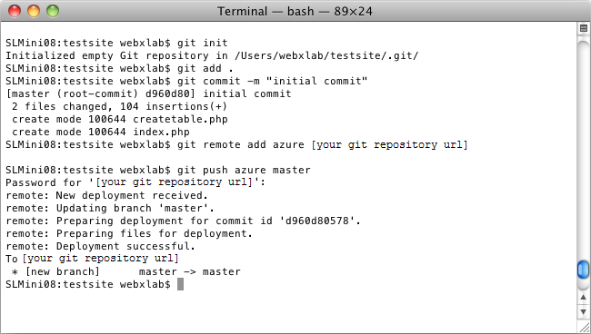
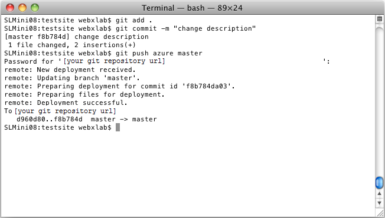

<properties linkid="develop-php-website-with-mysql-and-git" urlDisplayName="Web w/ MySQL + Git" pageTitle="PHP web site with MySQL and Git - Azure tutorial" metaKeywords="" description="A tutorial that demonstrates how to create a PHP web site that stores data in MySQL and use Git deployment to Azure." metaCanonical="" services="web-sites" documentationCenter="PHP" title="Create a PHP-MySQL Azure web site and deploy using Git" authors="waltpo" solutions="" manager="" editor="mollybos" />

Création et déploiement d'un site Web Azure PHP-MySQL avec Git
==============================================================

Ce didacticiel vous montre comment créer un site Web Azure PHP-MySQL et comment le déployer en utilisant Git. Vous allez utiliser [PHP](http://www.php.net/manual/en/install.php), l'outil en ligne de commande MySQL (avec [MySQL][install-mysql]), un serveur Web, ainsi que [Git](http://git-scm.com/) installé sur votre ordinateur. Les instructions de ce didacticiel s'appliquent à n'importe quel système d'exploitation, notamment Windows, Mac et Linux. ?À la fin de ce guide, vous disposerez d'un site Web PHP/MySQL exécuté dans Azure.

Vous apprendrez à effectuer les opérations suivantes :

-   Créez un site Web Azure et une base de données MySQL à l'aide du portail de gestion Azure. Comme PHP est activé par défaut dans Sites Web Azure, aucune action particulière n'est requise pour exécuter votre code PHP.
-   Publiez et republiez votre application dans Azure en utilisant Git.

En suivant ce didacticiel, vous allez générer une application Web d'inscription simple dans PHP. L'application est hébergée dans un site Web Azure. Voici une capture d'écran de l'application terminée :

**Remarque**

Pour suivre ce didacticiel, vous devez disposer d'un compte Azure pour lequel la fonctionnalité Sites Web Azure est activée. Si vous ne possédez pas de compte, vous pouvez créer un compte d'évaluation gratuit en quelques minutes. Pour plus d'informations, consultez la page [Version d'évaluation gratuite d'Azure](http://www.windowsazure.com/en-us/pricing/free-trial/?WT.mc_id=A74E0F923).

Configuration de l’environnement de développement
-------------------------------------------------

Ce didacticiel part du principe que [PHP](http://www.php.net/manual/en/install.php), l'outil en ligne de commande MySQL (qui fait partie de [MySQL][install-mysql]), un serveur Web et [Git](http://git-scm.com/) sont installés sur votre ordinateur.

> [WACOM.NOTE] Si vous suivez ce didacticiel sur Windows, vous pouvez configurer votre machine pour PHP et configurer automatiquement IIS (serveur Web intégré dans Windows) en installant le [Kit de développement logiciel (SDK) Azure pour PHP](http://www.microsoft.com/web/handlers/webpi.ashx/getinstaller/azurephpsdk.appids).

Création d'un site Web Azure et configuration de la publication Git
-------------------------------------------------------------------

Suivez cette procédure pour créer un site Web Azure et une base de données MySQL :

1.  Connectez-vous au [portail de gestion Azure](https://manage.windowsazure.com).
2.  Cliquez sur l'icône **New** dans le coin inférieur gauche du portail.

    

3.  Cliquez sur **Site Web**, puis sur **Custom Create**.

    

    Entrez une valeur pour **URL**, dans la liste déroulante **Base de données**, sélectionnez **Create a New MySQL Database**, puis sélectionnez un centre de données pour votre site Web dans la liste déroulante **Région**. Cliquez sur la flèche située en bas de la boîte de dialogue.

    

4.  Entrez un **nom** pour votre base de données, sélectionnez un centre de données pour votre base de données dans la liste déroulante **Région**, puis activez la case à cocher qui indique que vous acceptez les conditions juridiques. Cliquez sur la coche située en bas de la boîte de dialogue.

    

    Lorsque le site Web est créé, le texte **Creation of Web Site "[SITENAME]" completed successfully** apparaît. Vous pouvez maintenant activer la publication Git.

5.  Cliquez sur le nom du site Web affiché dans la liste de sites Web pour ouvrir le tableau de bord **Démarrage rapide** du site Web.

    

6.  En bas de la page **Démarrage rapide**, cliquez sur **Configurer la publication Git**.

    

7.  Pour activer la publication Git, vous devez fournir un nom d'utilisateur et un mot de passe. Notez le nom d'utilisateur et le mot de passe que vous créez (si vous avez déjà configuré un référentiel Git, ignorez cette étape).

    

    La configuration du référentiel prend quelques secondes.

8.  Lorsque votre référentiel est prêt, les instructions de publication de vos fichiers d'application s'affichent dans le référentiel. Notez ces instructions : elles vous seront utiles plus tard.

    

Obtention des informations de connexion MySQL distantes
-------------------------------------------------------

Pour vous connecter à la base de données MySQL exécutée sur Sites Web Azure, vous avez besoin de vos informations de connexion. Pour obtenir vos informations de connexion MySQL, procédez comme suit :

1.  Depuis le tableau de bord de votre site Web, cliquez sur le lien **View connection strings** à droite de la page.

    

2.  Notez les valeurs pour `Base de données`, `Source de données`, `ID utilisateur` et `Mot de passe`.

Génération et test de votre application en local
------------------------------------------------

Après la création d'un site Web Azure, vous pouvez développer votre application en local, la tester, puis la déployer.

L'application d'inscription est une simple application PHP qui vous permet de vous inscrire à un événement en entrant votre nom et votre adresse électronique. Les informations relatives aux précédents inscrits sont affichées dans un tableau. Les informations d'inscription sont stockées dans une base de données MySQL. L'application se compose d'un seul fichier (dont le code est disponible ci-dessous pour un copier/coller) :

-   **index.php** : affiche un formulaire d'inscription et un tableau contenant les informations des inscrits.

Pour générer et exécuter l'application en local, procédez comme suit : notez que ces étapes partent du principe que PHP, l'outil en ligne de commande MySQL (inclus dans MySQL) et un serveur Web sont configurés sur votre machine locale, et que vous avez activé l'[extension PDO pour MySQL](http://www.php.net/manual/en/ref.pdo-mysql.php).

1.  Connectez-vous au serveur MySQL distant en utilisant les valeurs pour `Source de données`, `ID utilisateur`, `Mot de passe`, et `Base de données` récupérées précédemment :

         mysql -h{Source de données] -u[ID Utilisateur] -p[Mot de passe] -D[Base de données]

2.  L'invite de commandes MySQL s'affiche :

         mysql>

3.  Copiez la commande `CREATE TABLE` suivante pour créer la table `registration_tbl` dans votre base de données :

         mysql> CREATE TABLE registration_tbl(id INT NOT NULL AUTO_INCREMENT, PRIMARY KEY(id), name VARCHAR(30), email VARCHAR(30), date DATE);

4.  Dans le répertoire racine de votre serveur Web, créez un dossier nommé `inscription`, ainsi qu'un fichier nommé `index.php`.

5.  Ouvrez le fichier **index.php** dans un éditeur de texte ou un environnement de développement intégré (IDE), puis ajoutez le code suivant en y apportant les modifications nécessaires, indiquées par le commentaire `//ACTION :` .

         <html>
         <head>
         <Title>Formulaire d'inscription</Title>
         
         </head>
         <body>
         <h1>Inscrivez-vous ici</h1>
         
Entrez votre nom et votre adresse électronique, puis cliquez sur <strong>Envoyer</strong> pour vous inscrire.

         <form method="post" action="index.php" enctype="multipart/form-data" >
               Nom  <input type="text" name="nom" id="nom"/> 
               Adresse électronique <input type="text" name="adresse électronique" id="adresse électronique"/> 
               <input type="submit" name="envoyer" value="Envoyer" />
         </form>
         <
         php
             // Informations de connexion de base de données
             //ACTION : mettez à jour les valeurs pour $host, $user, $pwd et $db
             //en utilisant les valeurs récupérées précédemment à partir du portail.
             $host = "valeur de Source de données";
             $user = "valeur de ID utilisateur";
             $pwd = "valeur de Mot de passe";
             $db = "valeur de Base de données";
             // Connectez-vous à la base de données.
             try {
                 $conn = new PDO( "mysql:host=$host;dbname=$db", $user, $pwd);
                 $conn->setAttribute( PDO::ATTR_ERRMODE, PDO::ERRMODE_EXCEPTION );
             }
             catch(Exception $e){
                 die(var_dump($e));
             }
             // Insertion des informations d'inscription
             if(!empty($_POST)) {
             try {
                 $name = $_POST['nom'];
                 $email = $_POST['adresse électronique'];
                 $date = date("Y-m-d");
                 // Insertion des données
                 $sql_insert = "INSERT INTO registration_tbl (nom, adresse électronique, date) 
                            VALUES (
         ,
         ,
         )";
                 $stmt = $conn->prepare($sql_insert);
                 $stmt->bindValue(1, $name);
                 $stmt->bindValue(2, $email);
                 $stmt->bindValue(3, $date);
                 $stmt->execute();
             }
             catch(Exception $e){
                 die(var_dump($e));
             }
             echo "<h3>Vous êtes inscrit !</h3>";
             }
             // Récupération des données
             $sql_select = "SELECT * FROM registration_tbl";
             $stmt = $conn->query($sql_select);
             $registrants = $stmt->fetchAll(); 
             if(count($registrants) > 0) {
                 echo "<h2>Personnes inscrites :</h2>";
                 echo "<table>";
                 echo "<tr><th>Nom</th>";
                 echo "<th>Adresse électronique</th>";
                 echo "<th>Date</th></tr>";
                 foreach($registrants as $registrant) {
                     echo "<tr><td>".$registrant['nom']."</td>";
                     echo "<td>".$registrant['adresse électronique']."</td>";
                     echo "<td>".$registrant['date']."</td></tr>";
                }
                echo "</table>";
             } else {
                 echo "<h3>Personne n'est inscrit pour le moment.</h3>";
             }
         
         >
         </body>
         </html>

Vous pouvez maintenant accéder à **http://localhost/inscription/index.php** pour tester l'application.

Publication de votre application
--------------------------------

Une fois votre application testée en local, vous pouvez la publier vers votre site Web Azure en utilisant Git. Vous allez initialiser votre référentiel Git, puis publier l'application.

> [WACOM.NOTE] Cette procédure est identique à celle affichée dans le portail à la fin de la section « Création d'un site Web Azure et configuration de la publication Git » précédente.

1.  (Facultatif) Si vous avez oublié ou mal rédigé l'URL de votre référentiel distant Git, sur le portail, accédez à l'onglet Déploiement.

    

2.  Ouvrez GitBash (ou un terminal, si Git est dans votre `PATH`), remplacez les répertoires du répertoire racine de votre application, puis exécutez les commandes suivantes :

         git init
         git add .
         git commit -m "initial commit"
         git remote add azure [URL de votre référentiel distant]
         git push azure master

    Vous êtes invité à entrer le mot de passe que vous avez créé précédemment.

    

3.  Accédez à **http://[nom du site].azurewebsites.net/index.php** pour commencer à utiliser l'application (ces informations seront stockées dans le tableau de bord de votre compte) :

    

Après la publication de votre application, vous pouvez y apporter des modifications, puis utiliser Git pour les publier.

Publication des modifications apportées à votre application
-----------------------------------------------------------

Pour publier des modifications apportées à votre application, procédez comme suit :

1.  Modifiez votre application en local.
2.  Ouvrez GitBash (ou un terminal, si Git est dans votre `PATH`), remplacez les répertoires du répertoire racine de votre application, puis exécutez les commandes suivantes :

         git add .
         git commit -m "commentaire décrivant les modifications"
         git push azure master

    Vous êtes invité à entrer le mot de passe que vous avez créé précédemment.

    

3.  Accédez à **http://[nom du site].azurewebsites.net/index.php** pour afficher votre application, ainsi que les modifications apportées :

    

4.  Vous pouvez également afficher le nouveau déploiement sous l'onglet « Déploiements » du portail de gestion Azure :

    

