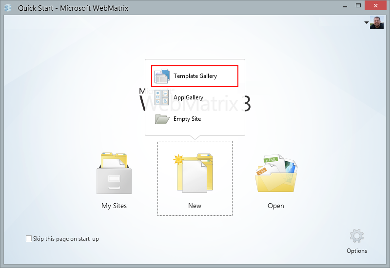
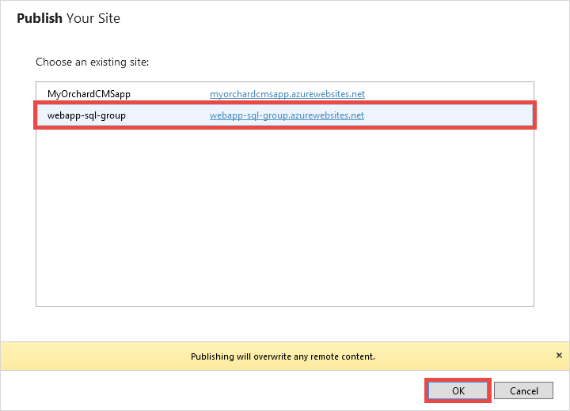

<properties 
	pageTitle="Créer et déployer une application web PHP-SQL dans Azure App Service à l’aide de WebMatrix" 
	description="Didacticiel expliquant comment utiliser l’IDE WebMatrix gratuit pour créer et déployer une application web PHP dans Azure App Service, qui stocke les données dans la base de données SQL." 
	tags="azure-portal"
	services="app-service\web" 
	documentationCenter="" 
	authors="tfitzmac" 
	manager="wpickett" 
	editor="mollybos"/>

<tags 
	ms.service="app-service-web" 
	ms.workload="web" 
	ms.tgt_pltfrm="na" 
	ms.devlang="PHP" 
	ms.topic="article" 
	ms.date="04/29/2015" 
	ms.author="tomfitz"/>

# Créer et déployer une application web PHP-SQL dans Azure App Service à l’aide de WebMatrix

Ce didacticiel explique comment utiliser WebMatrix pour développer une application PHP utilisant une base de données SQL Azure et la déployer dans  [Azure App Service](http://go.microsoft.com/fwlink/?LinkId=529714) Web Apps. WebMatrix est un outil de développement Web gratuit de Microsoft, qui fournit tout ce dont vous avez besoin pour développer des applications web. WebMatrix prend en charge le PHP et inclut Intellisence pour le développement PHP.

Ce didacticiel part du principe que vous avez installé [SQL Server Express][install-SQLExpress] sur votre ordinateur pour pouvoir tester une application en local. Cependant, cette installation n'est pas obligatoire pour suivre ce didacticiel. En revanche, vous pouvez déployer votre application directement dans Azure App Service Web Apps.

À la fin de ce guide, vous disposerez d’une application web PHP-SQL Database qui s’exécute dans Azure.
 
Vous apprendrez à effectuer les opérations suivantes :

* création d’une application web dans App Service Web Apps et d’une base de données SQL à l’aide du [portail Azure en version préliminaire](http://go.microsoft.com/fwlink/?LinkId=529715). (PHP étant activé par défaut dans Web Apps, l’exécution de votre code PHP ne requiert aucune action particulière) ;
* développement d'une application PHP avec WebMatrix ;
* publication et republication de votre application dans Azure avec WebMatrix.
 
En suivant ce didacticiel, vous allez créer une application Web Tasklist simple dans PHP. Cette application sera hébergée dans App Service Web Apps. Voici une capture d'écran de l'application en cours d'exécution :

![Site Web PHP Azure][running-app]

[AZURE.INCLUDE [create-account-and-websites-note](../includes/create-account-and-websites-note.md)]

>[AZURE.NOTE]Si vous voulez vous familiariser avec Azure App Service avant d’ouvrir un compte Azure, accédez à la page [Essayer App Service](http://go.microsoft.com/fwlink/?LinkId=523751). Vous pourrez créer immédiatement une application web temporaire dans App Service. Aucune carte de crédit n’est requise ; vous ne prenez aucun engagement.

##Configuration requise

1. [Téléchargez][tasklist-sqlazure-download] les fichiers de l'application Tasklist. Il s'agit d'une application PHP simple qui vous permet d'ajouter, de marquer comme terminés et de supprimer des éléments d'une liste de tâches. Ces derniers sont stockés dans une base de données SQL (SQL Server Express pour le test local). L'application se compose des fichiers suivants :

	* **index.php** : affiche les tâches et fournit un formulaire permettant d’ajouter un élément à la liste.
	* **additem.php** : ajoute un élément à la liste.
	* **getitems.php** : obtient tous les éléments de la base de données.
	* **markitemcomplete.php** : définit l’état d’un élément sur Terminé.
	* **deleteitem.php** : supprime un élément.
	* **taskmodel.php** :  contient les fonctions permettant d’ajouter, d’obtenir, de mettre à jour et de supprimer des éléments dans la base de données.
	* **createtable.php** : crée la table de base de données SQL pour l’application. Ce fichier sera appelé une seule fois.

2. Créez une base de données SQL Server nommée `tasklist`. Pour cela, utilisez l’invite de commandes `sqlcmd` avec ces commandes :

		>sqlcmd -S <server name>\sqlexpress -U <user name> -P <password>
		1> create database tasklist
		2> GO

	Suivez cette procédure seulement si vous voulez tester votre application en local.

## Créer une application web et une base de données SQL

Suivez cette procédure pour créer une application web Azure et une base de données SQL :

1. Connectez-vous au [Portail Azure en version préliminaire](https://portal.azure.com).

2. Pour ouvrir Azure Marketplace, cliquez sur l’icône **Marketplace** ou sur l’icône **Nouveau** en bas à gauche du tableau de bord, sélectionnez **Web et mobilité**, puis **Azure Marketplace** en bas.
	
3. Dans Marketplace, sélectionnez **Web Apps**.

4. Cliquez sur l’icône **Application web et SQL**.

5. Après avoir lu la description de l’application web et de l’application SQL, sélectionnez **Créer**.

6. Cliquez sur chaque partie (**Groupe de ressources**, **Application web**, **Base de données** et **Abonnement**), puis saisissez ou sélectionnez des valeurs pour les champs obligatoires :
	
	- Entrez le nom d’URL de votre choix.	
	- Configuration des informations d’identification du serveur de bases de données
	- Sélectionnez la région la plus proche de vous.

	

7. Une fois l’application web définie, cliquez sur **Créer**.

	Une fois l’application web créée, le bouton **Notifications** affiche la mention **RÉUSSITE** en vert clignotant, et le panneau du groupe de ressources affiche l’application web et la base de données SQL dans le groupe.

4. Cliquez sur l’icône de l’application web dans le panneau du groupe de ressources pour ouvrir le panneau de l’application web.

	

##Obtention des informations de connexion à la base de données SQL

Pour établir la connexion à l’instance de base de données SQL liée à votre application web, vous avez besoin des informations de connexion que vous avez spécifiées lors de la création de la base de données. Procédez comme suit pour les obtenir :

1. Revenez au panneau du groupe de ressources, puis cliquez sur l’icône de base de données SQL.

2. Dans le panneau de la base de données SQL, cliquez sur **Propriétés** puis sur **Afficher les chaînes de connexion à la base de données**.

	
	
3. Dans la section **PHP** de la boîte de dialogue qui s’affiche, notez les valeurs de `Server`, `SQL Database` et `User Name`. Vous utiliserez ces valeurs ultérieurement lors de la publication de votre application web PHP sur Azure App Service.

## Créer votre application dans WebMatrix

Durant les prochaines étapes, vous allez développer l'application Tasklist en ajoutant les fichiers téléchargés auparavant et en apportant quelques modifications. Cependant, vous pouvez ajouter vos propres fichiers ou en créer.

1. Lancez [Microsoft WebMatrix](http://www.microsoft.com/web/webmatrix/). Si ce n’est déjà fait, installez-le maintenant.
2. Si vous utilisez WebMatrix 3 pour la première fois, vous êtes invité à vous connecter à Azure. Sinon, vous pouvez cliquer sur le bouton **Se connecter**, puis choisir **Ajouter un compte**. Choisissez **Se connecter** à l'aide de votre compte Microsoft.

	

3. Si vous disposez d'un compte Azure, vous pouvez vous connecter avec votre compte Microsoft :

	

1. Sur l'écran d'accueil, cliquez sur le bouton **Nouveau**, puis choisissez **Galerie de modèles** pour créer un site à partir de la galerie de modèles :

	

4. Parmi les modèles disponibles, sélectionnez **PHP**.

	![Site à partir d'un modèle][site-from-template]

5. Sélectionnez le modèle **Site vide**. Nommez le site, puis cliquez sur **SUIVANT**.

	![Nommer le site][site-from-template-2]

3. Si vous êtes connecté à Azure, vous avez maintenant la possibilité de créer une instance Azure App Service Web Apps pour votre site local. Choisissez **Ignorer** pour l’instant.

	

1. Une fois que WebMatrix a fini de créer le site local, l’environnement de développement intégré (IDE) WebMatrix s’affiche. Ajoutez vos fichiers d'application en cliquant sur **Ajouter des fichiers existants** :

	![Ajouter des fichiers existants dans WebMatrix][edit_addexisting]

	Dans la boîte de dialogue qui s'affiche, accédez aux fichiers téléchargés auparavant, sélectionnez-les tous, puis cliquez sur Ouvrir. Lorsque vous y êtes invité, remplacez le fichier `index.php`.

2. Ensuite, vous devez ajouter les informations de connexion à votre base de données SQL Server locale au fichier `taskmodel.php`. Ouvrez le fichier `taskmodel.php` en double-cliquant dessus et mettez à jour les informations de connexion à la base de données dans la fonction `connect`. (** Remarque** : passez à la section [Publication de votre application](#Publish) si vous ne souhaitez pas la tester localement et si vous préférez la publier directement dans Azure App Service Web Apps.)

		// DB connection info
		$host = "localhost\sqlexpress";
		$user = "your user name";
		$pwd = "your password";
		$db = "tasklist";

	Enregistrez le fichier `taskmodel.php`.

3. Pour exécuter l’application, vous devez créer la table `items`. Cliquez avec le bouton droit sur le fichier `createtable.php`, puis sélectionnez **Lancer dans le navigateur**. Ceci lance `createtable.php` dans votre navigateur et exécute le code qui crée la table `items` dans la base de données `tasklist`.

	![Lancer createtable.php dans le navigateur WebMatrix][edit_run]

4. À présent, vous pouvez tester l'application en local. Cliquez avec le bouton droit sur le fichier `index.php`, puis sélectionnez **Lancer dans le navigateur**. Testez l'application en ajoutant des éléments, en les marquant comme terminés et en les supprimant.

## Publication de votre application

Avant de publier votre application dans App Service Web Apps, vous devez mettre à jour les informations de connexion à la base de données dans `taskmodel.php` en utilisant les informations de connexion que vous avez obtenues précédemment (dans la section [Création d’une application web et d’une base de données SQL](#CreateWebsite)).

1. Ouvrez le fichier `taskmodel.php` en double-cliquant dessus, puis mettez à jour les informations de connexion à la base de données dans la fonction `connect`.

		// DB connection info
		$host = "value of $serverName";
		$user = "value of UID";
		$pwd = "the SQL password you created when creating the web app";
		$db = "value of Database";
	
	Enregistrez le fichier `taskmodel.php`.

2. Cliquez sur **Publier** dans WebMatrix.

	![Publier dans WebMatrix][edit_publish]

3. Cliquez sur **Choisir un site existant dans Microsoft Azure**.

	

3. Sélectionnez l’application web App Service créée précédemment.

	

3. Continuez à cliquer sur **Continuer** jusqu’à ce que WebMatrix publie le site dans Azure App Service Web Apps.

3. Accédez à http://[yournom du site web].azurewebsites.net/createtable.php pour créer la table `items`.

4. Enfin, accédez à http://[yournom de votre site web].azurewebsites.net/index.php pour lancer l’application.
	
##Modification et republication de votre application

Vous pouvez facilement modifier votre application en modifiant la copie locale du site puis en la republiant, ou en apportant directement vos modifications en mode **Distant**. Ici, nous allons simplement modifier le titre dans le fichier `index.php`, puis l’enregistrer directement dans l’application web App Service en ligne.

1. Dans WebMatrix, cliquez sur l’onglet **Distant** de votre site, puis sélectionnez **Ouvrir l’affichage distant**. Vos fichiers distants (hébergés sur Web Apps) s’ouvrent et sont modifiables directement. ![Ouvrir l'affichage distant dans WebMatrix][OpenRemoteView]
 
2. Ouvrez le fichier `index.php` en double-cliquant dessus. ![Ouvrir le fichier index dans WebMatrix][Remote_editIndex]

3. Remplacez **My ToDo List** par **My Task List** dans les balises **title** et **h1**, puis enregistrez le fichier.

4. Une fois l’enregistrement terminé, cliquez sur le bouton Exécuter pour afficher les modifications sur l’application web App Service en ligne. ![Démarrer le site en mode Distant dans WebMatrix][Remote_run]

## Étapes suivantes

Vous savez désormais créer et déployer une application web WebMatrix dans Azure App Service Apps. Pour en savoir plus sur WebMatrix, consultez le [site web WebMatrix](http://www.microsoft.com/click/services/Redirect2.ashx?CR_CC=200106398).

## Changements apportés
* Pour obtenir un guide présentant les modifications apportées dans le cadre de la transition entre Sites Web et App Service, consultez la page [Azure App Service et les services Azure existants](http://go.microsoft.com/fwlink/?LinkId=529714).
* Pour obtenir un guide présentant les modifications apportées dans le cadre de la transition entre l’ancien et le nouveau portail, consultez la page [Références sur la navigation dans le portail Azure](http://go.microsoft.com/fwlink/?LinkId=529715).

[install-SQLExpress]: http://www.microsoft.com/download/details.aspx?id=29062
[running-app]: ./media/web-sites-php-sql-database-use-webmatrix/tasklist_app_windows.png
[tasklist-sqlazure-download]: http://go.microsoft.com/fwlink/?LinkId=252504
[NewWebSite1]: ./media/web-sites-php-sql-database-use-webmatrix/NewWebSite1.jpg
[NewWebSite2]: ./media/web-sites-php-sql-database-use-webmatrix/NewWebSite2.png
[NewWebSite3_SQL]: ./media/web-sites-php-sql-database-use-webmatrix/NewWebSite3_SQL.png
[NewWebSite4_SQL]: ./media/web-sites-php-sql-database-use-webmatrix/NewWebSite4_SQL.png

[NewWebSite6_SQL]: ./media/web-sites-php-sql-database-use-webmatrix/NewWebSite6_SQL.png
[NewWebSite7]: ./media/web-sites-php-sql-database-use-webmatrix/NewWebSite7.png

[InstallWebMatrix]: ./media/web-sites-php-sql-database-use-webmatrix/InstallWebMatrix.png
[download-site]: ./media/web-sites-php-sql-database-use-webmatrix/download-site-1.png
[site-from-template]: ./media/web-sites-php-sql-database-use-webmatrix/site-from-template.png
[site-from-template-2]: ./media/web-sites-php-sql-database-use-webmatrix/site-from-template-2.png
[edit_addexisting]: ./media/web-sites-php-sql-database-use-webmatrix/edit_addexisting.png
[edit_run]: ./media/web-sites-php-sql-database-use-webmatrix/edit_run.png
[edit_publish]: ./media/web-sites-php-sql-database-use-webmatrix/edit_publish.png
[OpenRemoteView]: ./media/web-sites-php-sql-database-use-webmatrix/OpenRemoteView.png
[Remote_editIndex]: ./media/web-sites-php-sql-database-use-webmatrix/Remote_editIndex.png
[Remote_run]: ./media/web-sites-php-sql-database-use-webmatrix/Remote_run.png

[preview-portal]: https://manage.windowsazure.com

<!--HONumber=54-->