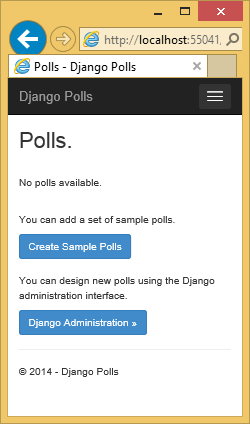
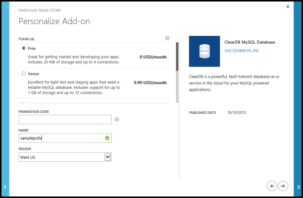

<properties 
	pageTitle="Django et MySQL sur Azure avec Python Tools 2.1 pour Visual Studio" 
	description="Découvrez comment utiliser les outils Python pour Visual Studio pour créer une application Django qui stocke les données dans une instance de base de données MySQL et peut être déployée vers un site web." 
	services="app-service\web" 
	tags="python"
	documentationCenter="python" 
	authors="huguesv" 
	manager="wpickett" 
	editor=""/>

<tags 
	ms.service="app-service-web" 
	ms.workload="web" 
	ms.tgt_pltfrm="na" 
	ms.devlang="python" 
	ms.topic="article" 
	ms.date="02/09/2015" 
	ms.author="huguesv"/>

# Django et MySQL sur Azure avec Python Tools 2.1 pour Visual Studio 

Dans ce didacticiel, nous allons utiliser [Python Tools pour Visual Studio][] afin de créer une application de sondage simple à l'aide de l'un des exemples de modèles PTVS. Ce didacticiel est également disponible sous forme de [vidéo](https://www.youtube.com/watch?v=oKCApIrS0Lo).

Nous allons découvrir comment utiliser un service MySQL hébergé sur Azure, comment configurer l'application pour utiliser mySQL et comment publier l'application sur un site web Azure.

Visitez le [Centre de développement Python][] pour consulter d'autres articles sur le développement de site web Azure avec PTVS à l'aide des infrastructures web Bottle, Flask et Django, ainsi que de MongoDB, du stockage de tables Azure, de MySQL et des services de base de données SQL.  Quand bien même cet article se concentre Sites Web Azure, les étapes sont similaires pour développer [Azure Cloud Services][].

## Conditions préalables

 - Visual Studio 2012 ou 2013
 - [Python Tools 2.1 pour Visual Studio (en anglais)][]
 - [Exemples VSIX de Python Tools 2.1 pour Visual Studio][]
 - [Outils du Kit de développement logiciel (SDK) Azure pour Visual Studio 2013][] ou [Outils du Kit de développement logiciel (SDK) Azure pour Visual Studio 2012][]
 - [Python 2.7 32 bits][]

> [AZURE.NOTE]
> Pour suivre ce didacticiel, vous avez besoin d'un compte Azure. Vous pouvez <a href="http://azure.microsoft.com/pricing/member-offers/msdn-benefits-details/">activer les avantages de votre abonnement MSDN</a> ou <a href="http://azure.microsoft.com/pricing/free-trial/">obtenir une version d'évaluation gratuite</a>.
> 
> Si vous souhaitez commencer à utiliser Sites Web Azure avant d'ouvrir un compte Azure, accédez au site <a href="https://trywebsites.azurewebsites.net/?language=python">https://trywebsites.azurewebsites.net</a>, où vous pourrez créer immédiatement un site de départ ASP.NET de courte durée gratuit dans Sites Web Azure. Aucune carte de crédit n'est requise, vous ne prenez aucun engagement.

## Création du projet

Dans cette section, nous allons créer un projet Visual Studio à l'aide d'un exemple de modèle. Nous allons créer un environnement virtuel et installer les packages requis.  Nous allons créer une base de données locale à l'aide de sqlite.  Ensuite, nous allons exécuter l'application localement.

1.  Dans Visual Studio, sélectionnez **Fichier**, **Nouveau projet**.

1.  Les modèles de projet issus des exemples VSIX de PTVS sont disponibles sous **Python**, **Exemples**.  Sélectionnez **Projet web de sondage Django** et cliquez sur OK pour créer le projet.

  	

1.  Vous allez être invité à installer des packages externes.  Sélectionnez **Installer dans un environnement virtuel**.

  	

1.  Sélectionnez **Python 2.7** comme interpréteur de base.

  	

1.  Cliquez avec le bouton droit de la souris sur le nœud du projet et sélectionnez **Python**, **Django Sync DB**.

  	

1.  Une console de gestion Django s'ouvre.  Suivez les invites pour créer un utilisateur.

    Une base de données sqlite est créée dans le dossier du projet.

  	

1.  Vérifiez que l'application fonctionne en appuyant sur <kbd>F5</kbd>.

1.  Cliquez sur **Connexion** dans la barre de navigation en haut.

  	

1.  Saisissez les informations d'identification de l'utilisateur que vous avez créé quand vous avez synchronisé la base de données.

  	

1.  Cliquez sur **Créer un exemple de sondage**.

  	

1.  Cliquez sur un sondage et vote.

  	

## Création d'une base de données MySQL

Pour la base de données, nous allons créer une base de données hébergée ClearDB MySQL sur Azure.

Vous pouvez également créer votre propre machine virtuelle exécutée sur Azure, puis installer et administrer MySQL vous-même.

Pour créer une base de données avec un plan gratuit, procédez comme suit :

1.  Connectez-vous au [portail de gestion Azure][].

1.  En bas du volet de navigation, cliquez sur **NOUVEAU**.

  	

1.  Cliquez sur **STORE**, puis sur **Base de données ClearDB MySQL**.

  	

1.  Dans Nom, saisissez le nom à utiliser pour le service de base de données.

1.  Choisissez la région ou le groupe d'affinités où localiser le service de base de données. Si vous utilisez la base de données de votre application Azure, sélectionnez la même région que celle du déploiement de votre application.

  	

1.  Cliquez sur **ACHETER**.

## Configurer le projet

Dans cette section, nous allons configurer notre application pour utiliser la base de données MySQL que nous venons de créer.  Nous allons découvrir comment obtenir des paramètres de connexion à partir du portail Azure.  Nous allons également installer les packages Python supplémentaires requis pour utiliser des bases de données MySQL avec Django.  Ensuite, nous allons exécuter l'application localement.

1.  Sur le [portail de gestion Azure][], cliquez sur **MODULES COMPLÉMENTAIRES**, puis cliquez sur le service Base de données MySQL ClearDB que vous avez créé précédemment.

1.  Cliquez sur **INFORMATIONS DE CONNEXION**.  Vous pouvez utiliser le bouton de copie pour placer la valeur de **CONNECTIONSTRING** dans le Presse-papiers.

  	

1.  Dans Visual Studio, ouvrez **settings.py**, à partir du dossier  *ProjectName*.  Collez temporairement la chaîne de connexion dans l'éditeur.  Celle-ci se présente au format suivant :

        Database=<NAME>;Data Source=<HOST>;User Id=<USER>;Password=<PASSWORD>

    Modifiez le **MOTEUR** de base de données par défaut pour utiliser MySQL, puis définissez les valeurs **NOM**, **UTILISATEUR**, **MOT DE PASSE** et **HÔTE** à partir de **CONNECTIONSTRING**.

        DATABASES = {
            'default': {
                'ENGINE': 'django.db.backends.mysql',
                'NAME': '<Database>',
                'USER': '<User Id>',
                'PASSWORD': '<Password>',
                'HOST': '<Data Source>',
                'PORT': '',
            }
        }

1.  Dans l'Explorateur de solutions, sous **Environnements Python**, cliquez avec le bouton droit sur l'environnement virtuel et sélectionnez **Installer le package Python**.

1. Installez le package  `mysql-python` en utilisant **easy_install**.

  	

1.  Cliquez avec le bouton droit de la souris sur le nœud du projet et sélectionnez **Python**, **Django Sync DB**.  

    Les tables de la base de données MySQL que nous avons créée dans la section précédente sont alors elles-aussi créées.  Suivez les invites pour créer un utilisateur, qui ne doit pas forcément correspondre à l'utilisateur inclus dans la base de données sqlite que nous avons créée dans la première section.

  	

1.  Exécutez l'application avec <kbd>F5</kbd>.  Les sondages créés à l'aide de la fonction **Créer un exemple de sondage** et les données soumises par vote sont sérialisés dans la base de données MySQL.

## Publier sur un site web Azure

PTVS propose un moyen simple de déployer votre application web sur un site web Azure.

1.  Dans l'**Explorateur de solutions**, cliquez avec le bouton droit sur le nœud du projet et sélectionnez **Publier**.

  	

1.  Cliquez sur **Sites Web Microsoft Azure**.

1.  Cliquez sur **Nouveau** pour créer un site.

1.  Sélectionnez un **nom de site** et une **région**, puis cliquez sur **Créer**.

  	

1.  Acceptez toutes les valeurs par défaut et cliquez sur **Publier**.

1.  Votre navigateur web ouvre automatiquement le site publié.  L'application doit fonctionner comme prévu et utiliser la base de données **MySQL** hébergée sur Azure.

    Félicitations !

  	

## Étapes suivantes

Suivez ces liens pour en savoir plus sur Python Tools pour Visual Studio, Django et MySQL.

- [Documentation de Python Tools pour Visual Studio (en anglais)][]
  - [Projets web][]
  - [Projets de Service cloud][]
  - [Débogage distant sur Microsoft Azure][]
- [Documentation de Django (en anglais)][]
- [MySQL][]

<!--Link references-->
[Centre de développement Python]: /develop/python/
[Azure Cloud Services]: cloud-services-python-ptvs.md

<!--External Link references-->
[Portail de gestion Azure]: https://manage.windowsazure.com
[Python Tools pour Visual Studio]: http://aka.ms/ptvs
[Python Tools 2.1 pour Visual Studio (en anglais)]: http://go.microsoft.com/fwlink/?LinkId=517189
[Exemples VSIX de Python Tools 2.1 pour Visual Studio]: http://go.microsoft.com/fwlink/?LinkId=517189
[Outils du Kit de développement logiciel (SDK) Azure pour Visual Studio 2013]: http://go.microsoft.com/fwlink/?LinkId=323510
[Outils du Kit de développement logiciel (SDK) Azure pour Visual Studio 2012]: http://go.microsoft.com/fwlink/?LinkId=323511
[Python 2.7 32 bits]: http://go.microsoft.com/fwlink/?LinkId=517190 
[Documentation de Python Tools pour Visual Studio (en anglais)]: http://pytools.codeplex.com/documentation
[Débogage distant sur Microsoft Azure]: http://pytools.codeplex.com/wikipage?title=Features%20Azure%20Remote%20Debugging
[Projets web]: http://pytools.codeplex.com/wikipage?title=Features%20Web%20Project
[Projets de Service cloud]: http://pytools.codeplex.com/wikipage?title=Features%20Cloud%20Project
[Documentation de Django (en anglais)]: https://www.djangoproject.com/
[MySQL]: http://www.mysql.com/

<!--HONumber=52-->