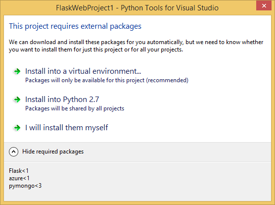
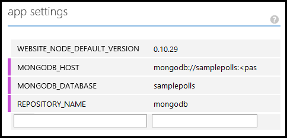

<properties 
	pageTitle="Flask et MongoDB sur Azure avec Python Tools 2.1 for Visual Studio" 
	description="Découvrez comment utiliser Python Tools pour Visual Studio afin de créer une application Flask qui stocke les données dans une instance de base de données MongoDB et peut être déployée vers un site web." 
	services="app-service\web" 
	tags="python"
	documentationCenter="python" 
	authors="huguesv" 
	manager="wpickett" 
	editor=""/>

<tags 
	ms.service="app-service-web" 
	ms.workload="web" 
	ms.tgt_pltfrm="na" 
	ms.devlang="python" 
	ms.topic="article" 
	ms.date="02/09/2015" 
	ms.author="huguesv"/>

# Flask et MongoDB sur Azure avec Python Tools 2.1 for Visual Studio

Dans ce didacticiel, nous allons utiliser [Python Tools pour Visual Studio][] afin de créer une application de sondage simple à l'aide de l'un des exemples de modèles PTVS. Ce didacticiel est également disponible sous forme de [vidéo](https://www.youtube.com/watch?v=eql-crFgrAE).

L'application de sondage définit une abstraction pour son référentiel, ce qui vous permet de basculer facilement d'un type de référentiel à un autre (In-Memory, stockage de tables Azure, MongoDB).

Nous allons découvrir comment utiliser l'un des services MongoDB hébergés sur Azure, comment configurer l'application pour utiliser MongoDB et comment publier l'application sur un site web Azure.

Visitez le [Centre de développement Python][] pour consulter d'autres articles sur le développement de site web Azure avec PTVS à l'aide des infrastructures web Bottle, Flask et Django, ainsi que de MongoDB, du stockage de tables Azure, de MySQL et des services de base de données SQL.  Quand bien même cet article se concentre Sites Web Azure, les étapes sont similaires pour développer [Azure Cloud Services][].

## Conditions préalables

 - Visual Studio 2012 ou 2013
 - [Python Tools 2.1 pour Visual Studio (en anglais)][]
 - [Exemples VSIX de Python Tools 2.1 pour Visual Studio][]
 - [Outils du Kit de développement logiciel (SDK) Azure pour Visual Studio 2013][] ou [Outils du Kit de développement logiciel (SDK) Azure pour Visual Studio 2012][]
 - [Python 2.7 32 bits][] ou [Python 3.4 32 bits][]
 - [RoboMongo][] (facultatif)

[AZURE.INCLUDE [create-account-and-websites-note](../includes/create-account-and-websites-note.md)]

## Création du projet

Dans cette section, nous allons créer un projet Visual Studio à l'aide d'un exemple de modèle.  Nous allons créer un environnement virtuel et installer les packages requis.  Ensuite, nous allons exécuter l'application localement à l'aide du référentiel In-Memory par défaut.

1.  Dans Visual Studio, sélectionnez **Fichier**, **Nouveau projet**. 

1.  Les modèles de projet issus des exemples VSIX de PTVS sont disponibles sous **Python**, **Exemples**.  Sélectionnez **Projet web de sondage Flask** et cliquez sur OK pour créer le projet.

  	

1.  Vous allez être invité à installer des packages externes.  Sélectionnez **Installer dans un environnement virtuel**.

  	

1.  Sélectionnez **Python 2.7** ou **Python 3.4** en tant qu'interpréteur de base.

  	

1.  Vérifiez que l'application fonctionne en appuyant sur <kbd>F5</kbd>.  Par défaut, l'application utilise un référentiel In-Memory qui ne requiert aucune configuration.  Toutes les données sont perdues à l'arrêt du serveur web.

1.  Cliquez sur **Créer un exemple de sondage**, puis sur un sondage et vote.

  	

## Création d'une base de données MongoDB

Pour la base de données, nous allons créer une base de données MongoLab hébergée sur Azure.

Vous pouvez également créer votre propre machine virtuelle exécutée sur Azure, puis installer et administrer MongoDB vous-même.

Pour créer une évaluation gratuite avec MongoLab, procédez comme suit :

1.  Connectez-vous au [portail de gestion Azure][].

1.  En bas du volet de navigation, cliquez sur **NOUVEAU**.

  	

1.  Cliquez sur **STORE**, puis sur **MongoLab**.

  	

1.  Dans Nom, saisissez le nom à utiliser pour le service de base de données.

1.  Choisissez la région ou le groupe d'affinités où localiser le service de base de données. Si vous utilisez la base de données de votre application Azure, sélectionnez la même région que celle du déploiement de votre application.

  	

1.  Cliquez sur **ACHETER**.

## Configurer le projet

Dans cette section, nous allons configurer notre application pour utiliser la base de données MongoDB que nous venons de créer.  Nous allons découvrir comment obtenir des paramètres de connexion à partir du portail Azure.  Ensuite, nous allons exécuter l'application localement.

1.  Sur le [portail de gestion Azure][], cliquez sur **MODULES COMPLÉMENTAIRES**, puis cliquez sur le service MongoLab que vous avez créé précédemment.

1.  Cliquez sur **INFORMATIONS DE CONNEXION**.  Vous pouvez utiliser le bouton de copie pour placer la valeur de **MONGOLAB\_URI** dans le Presse-papiers.

  	

1.  Dans Visual Studio, cliquez avec le bouton droit sur le nœud de votre projet dans l'Explorateur de solutions, puis sélectionnez **Propriétés**.  Cliquez sur l'onglet **Déboguer**.

  	

1.  Définissez les valeurs des variables d'environnement requises par l'application dans **Déboguer la commande de serveur**, **Environnement**.

        REPOSITORY_NAME=mongodb
        MONGODB_HOST=<value of MONGOLAB_URI>
        MONGODB_DATABASE=<database name>

    Ainsi, les variables d'environnement seront définies quand vous **démarrerez le débogage**.  Si vous voulez que les variables soient définies quand vous **démarrez sans débogage**, définissez aussi les mêmes valeurs sous **Exécuter la commande de serveur**.

    Vous pouvez aussi définir des variables d'environnement à l'aide du Panneau de configuration Windows.  Cette option est la plus appropriée pour éviter de stocker des informations d'identification dans le code source/fichier de projet.  Notez que vous devrez redémarrer Visual Studio pour que les nouvelles variables d'environnement soient disponibles pour l'application.

1.  Le code qui implémente le référentiel MongoDB se trouve dans **models/mongodb.py**.

1.  Exécutez l'application avec <kbd>F5</kbd>.  Les sondages créés avec **Créer un exemple de sondage** et les données soumises par vote sont sérialisés dans MongoDB.

1.  Accédez à la page **À propos de** pour vérifier que l'application utilise le référentiel **MongoDB**.

  	

## Exploration de la base de données MongoDB

Vous pouvez utiliser une application telle que [RoboMongo][] pour interroger et modifier une base de données MongoDB.  Dans cette section, nous allons utiliser RoboMongo pour afficher le contenu de la base de données de l'application de sondage.

1.  Créez une connexion.  Vous aurez besoin de la valeur **MONGOLAB\_URI** que nous avons récupérée dans la section précédente.

    Notez le format de l'URI : `mongodb://<name>:<password>@<address>:<port>/<name>`

    Le nom correspond à celui que vous avez saisi quand vous avez créé le service avec Azure.  Il sert à la fois de nom de base de données et de nom d'utilisateur.

1.  Sur la page de connexion, définissez le **Nom** à votre gré.  Affectez également aux champs **Adresse** et**Port** les valeurs  *address* et  *port* provenant de **MONGOLAB\_URI**.

  	

1.  Sur la page d'authentification, affectez aux champs **Base de données** et **Nom d'utilisateur** la valeur  *name* provenant de **MONGOLAB\_URI**.  Affectez également au champ **Mot de passe** la valeur  *password* provenant de **MONGOLAB\_URI**.

  	

1.  Enregistrez et connectez-vous à la base de données.  Vous pouvez maintenant interroger la collection de sondages.

  	

## Publication sur un site web Azure

PTVS propose un moyen simple de déployer votre application web sur un site web Azure.

1.  Dans l'**Explorateur de solutions**, cliquez avec le bouton droit sur le nœud du projet et sélectionnez **Publier**.

  	

1.  Cliquez sur **Sites Web Microsoft Azure**.

1.  Cliquez sur **Nouveau** pour créer un site.

1.  Sélectionnez un **nom de site** et une **région**, puis cliquez sur **Créer**.

  	

1.  Acceptez toutes les valeurs par défaut et cliquez sur **Publier**.

1.  Votre navigateur web ouvre automatiquement le site publié.  Si vous accédez à la page À propos, vous verrez qu'elle utilise le référentiel **en mémoire** et non le référentiel **MongoDB**.

    La raison en est que les variables d'environnement ne sont pas définies sur le site web Azure, donc les valeurs par défaut spécifiées dans **settings.py** sont utilisées.

## Configuration du site web Azure

Dans cette section, vous allez configurer des variables d'environnement pour le site.

1.  Sur le [portail de gestion Azure][], cliquez sur le site créé dans la section précédente.

1.  Dans le menu supérieur, cliquez sur **CONFIGURER**.

  	

1.  Accédez à la section **Paramètres de l'application** et définissez les valeurs **REPOSITORY\_NAME**, **MONGODB\_HOST** et **MONGODB\_DATABASE** comme décrit dans la section ci-dessus.

  	

1.  Dans le menu inférieur, cliquez sur **ENREGISTRER**, puis **REDÉMARRER** et enfin **PARCOURIR**.

  	

1.  L'application doit fonctionner comme prévu et utiliser le référentiel **MongoDB**.

    Félicitations !

  	

## Étapes suivantes

Suivez ces liens pour en savoir plus sur Python Tools pour Visual Studio, Flask et MongoDB.

- [Documentation de Python Tools pour Visual Studio (en anglais)][]
  - [Projets web][]
  - [Projets de Service cloud][]
  - [Débogage distant sur Microsoft Azure][]
- [Documentation relative à Flask][]
- [MongoDB][]
- [Documentation relative à PyMongo][]
- [PyMongo][]

<!--Link references-->
[Centre de développement Python]: /develop/python/
[Azure Cloud Services]: cloud-services-python-ptvs.md

<!--External Link references-->
[Portail de gestion Azure]: https://manage.windowsazure.com
[RoboMongo]: http://robomongo.org/
[Python Tools pour Visual Studio]: http://aka.ms/ptvs
[Python Tools 2.1 pour Visual Studio (en anglais)]: http://go.microsoft.com/fwlink/?LinkId=517189
[Exemples VSIX de Python Tools 2.1 pour Visual Studio]: http://go.microsoft.com/fwlink/?LinkId=517189
[Outils du Kit de développement logiciel (SDK) Azure pour Visual Studio 2013]: http://go.microsoft.com/fwlink/?LinkId=323510
[Outils du Kit de développement logiciel (SDK) Azure pour Visual Studio 2012]: http://go.microsoft.com/fwlink/?LinkId=323511
[Python 2.7 32 bits]: http://go.microsoft.com/fwlink/?LinkId=517190 
[Python 3.4 32 bits]: http://go.microsoft.com/fwlink/?LinkId=517191
[Documentation de Python Tools pour Visual Studio (en anglais)]: http://pytools.codeplex.com/documentation
[Documentation relative à Flask]: http://flask.pocoo.org/
[MongoDB]: http://www.mongodb.org/
[Documentation relative à PyMongo]: http://api.mongodb.org/python/current/
[PyMongo]: https://github.com/mongodb/mongo-python-driver
[Débogage distant sur Microsoft Azure]: http://pytools.codeplex.com/wikipage?title=Features%20Azure%20Remote%20Debugging
[Projets web]: http://pytools.codeplex.com/wikipage?title=Features%20Web%20Project
[Projets de Service cloud]: http://pytools.codeplex.com/wikipage?title=Features%20Cloud%20Project

<!--HONumber=52-->