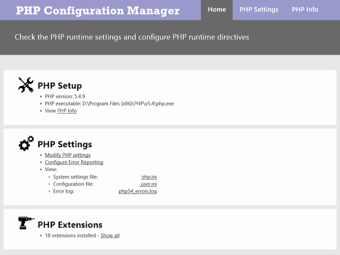
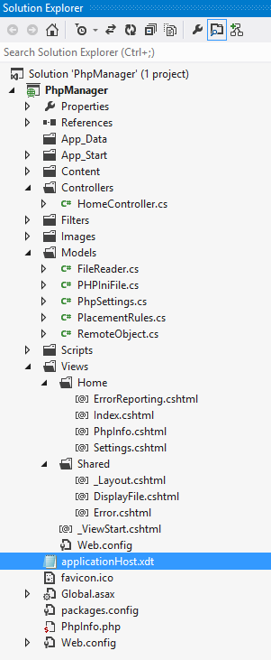

<properties linkid="dev-net-transform-extend-site" urlDisplayName="Service Bus Topics" pageTitle="Transform and extend your site" metaKeywords="none" description="TBD" metaCanonical="" disqusComments="1" umbracoNaviHide="0" authors="timamm" writer="timamm" editor="mollybos" manager="paulettm" title="Transform and extend your site" />

Transformation et extension de votre site
=========================================

En utilisant des déclarations [XDT (XML Document Transformation)](http://msdn.microsoft.com/en-us/library/dd465326.aspx), vous pouvez transformer le fichier [ApplicationHost.config](http://www.iis.net/learn/get-started/planning-your-iis-architecture/introduction-to-applicationhostconfig) sur vos sites Web Azure. Vous pouvez également utiliser des déclarations XDT pour ajouter des extensions de site privé autorisant des actions d'administration de site personnalisées. Le présent article inclut un exemple d'extension de site PHP Manager qui permet de gérer les paramètres PHP par le biais d'une interface Web.

-   [Transformation de la configuration de site dans ApplicationHost.config](#transform)
-   [Extension de votre site](#extend)
    -   [Présentation des extensions de site privé](#overview)
    -   [Exemple d'extension de site : PHP Manager](#SiteSample)
        -   [Application Web PHP Manager](#PHPwebapp)
        -   [Fichier applicationHost.xdt](#XDT)
    -   [Déploiement de l'extension de site](#deploy)

Transformation de la configuration de site dans ApplicationHost.config
----------------------------------------------------------------------

La plateforme Sites Web Azure permet de configurer des sites de façon souple et contrôlée. Bien que le fichier de configuration ApplicationHost.config IIS standard ne puisse pas être modifié directement dans les Sites Web Azure, la plateforme prend en charge un modèle de transformation ApplicationHost.config déclaratif basé sur XDT (XML Document Transformation).

Pour tirer parti de cette fonctionnalité de transformation, vous créez un fichier ApplicationHost.xdt avec du contenu XDT et le placez à la racine du site. Ensuite, dans la page **Configurer** du portail Azure, vous définissez le paramètre d'application `WEBSITE_PRIVATE_EXTENSIONS` sur 1 (il vous faudra peut-être redémarrer le site).

L'exemple applicationHost.xdt suivant illustre l'ajout d'une nouvelle variable d'environnement personnalisée sur un site utilisant PHP 5.4.

    <xml version="1.0"> 
    <configuration xmlns:xdt="http://schemas.microsoft.com/XML-Document-Transform"> 
	<system.webServer>
             <fastCgi>
                    <application>
                        <environmentVariables>
                                <environmentVariable name="CONFIGTEST" value="TEST" xdt:Transform="Insert" xdt:Locator="XPath(/configuration/system.webServer/fastCgi/application[contains(@fullPath,'5.4')]/environmentVariables)" />  
                        </environmentVariables>
                    </application>
                </fastCgi> 
	</system.webServer>
    </configuration> 

Un fichier journal avec le statut et les détails de transformation est disponible à la racine FTP sous LogFiles\\Transform.

Pour d'autres exemples, consultez la page <https://github.com/projectkudu/kudu/wiki/Azure-Site-Extensions>.

**Remarque**
 Les éléments de la liste de modules sous `system.webServer` ne peuvent pas être supprimés ou réorganisés, mais des ajouts à la liste sont possibles.

Extension de votre site
-----------------------

### Présentation des extensions de site privé

La plateforme Sites Web Azure prend en charge les extensions de site en tant que point d'extensibilité pour les actions d'administration de site. En fait, certaines fonctionnalités de la plateforme Sites Web Azure sont mises en œuvre en tant qu'extensions de site préinstallées. Bien qu'il ne soit pas possible de modifier ces dernières, vous pouvez créer et configurer des extensions privées pour vos propres sites. Cette fonctionnalité repose également sur les déclarations XDT. Les principales étapes de la création d'une extension de site privé sont les suivantes :

1.  **Contenu** de l'extension de site : créez une application Web prise en charge par Sites Web Azure
2.  **Déclaration** de l'extension de site : créez un fichier ApplicationHost.xdt
3.  **Déploiement** de l'extension de site : placez le contenu dans le dossier SiteExtensions sous `root`
4.  **Activation** de l'extension de site : définissez le paramètre d'application `WEBSITE_PRIVATE_EXTENSIONS` sur 1

Les liens internes pour l'application Web doivent pointer vers un chemin d'accès relatif au chemin d'accès de l'application spécifié dans le fichier ApplicationHost.xdt. Toute modification apportée au fichier ApplicationHost.xdt requiert un recyclage du site.

**Remarque** : des informations supplémentaires sur ces éléments clés sont disponibles sur <https://github.com/projectkudu/kudu/wiki/Azure-Site-Extensions>. Un exemple détaillé est inclus pour illustrer les étapes de création et d'activation d'une extension de site privé. Le code source de l'exemple PHP Manager suivant peut être téléchargé sur <https://github.com/projectkudu/PHPManager>.

### Exemple d'extension de site : PHP Manager

PHP Manager est une extension de site permettant aux administrateurs de site d'afficher et de configurer facilement leurs paramètres PHP au moyen d'une interface Web plutôt que d'avoir à modifier les fichiers .ini PHP directement. Les fichiers de configuration communs pour PHP incluent le fichier php.ini situé sous Program Files et le fichier .user.ini situé dans le dossier racine de votre site. Étant donné que le fichier php.ini ne peut pas être modifié directement sur la plateforme Sites Web Azure, l'extension PHP Manager utilise le fichier .user.ini pour appliquer les changements de paramètres.

#### Application Web PHP Manager

Ceci est la page d'accueil du site Web PHP Manager :

Comme vous pouvez le voir, une extension de site est similaire à une application Web standard, à la différence près qu'un fichier ApplicationHost.xdt supplémentaire se trouve dans le dossier racine du site (des informations supplémentaires sur le fichier ApplicationHost.xdt sont disponibles dans la section suivante de cet article).

L'extension PHP Manager a été créée au moyen du modèle d'application Web ASP.NET MVC 4 Visual Studio. L'affichage suivant de l'Explorateur de solutions illustre la structure de l'extension de site PHP Manager.

La seule logique spéciale requise pour l'E/S de fichier consiste à indiquer où se trouve le répertoire wwwroot du site. Comme illustré dans l'exemple de code suivant, la variable d'environnement « HOME » indique le chemin d'accès de la racine du site, et le chemin d'accès wwwroot peut être construit en ajoutant « site\\wwwroot » :

    /// 

    /// Donne l'emplacement du fichier .user.ini, même s'il n'en existe aucun
    /// 

    private static string GetUserSettingsFilePath()
    {
            var rootPath = Environment.GetEnvironmentVariable("HOME"); // Pour une utilisation sur les sites Web Azure
            if (rootPath == null)
            {
                rootPath = System.IO.Path.GetTempPath(); // À des fins de test
            };
            var userSettingsFile = Path.Combine(rootPath, @"site\wwwroot\.user.ini");
            return userSettingsFile;
    } 

Une fois que vous disposez du chemin d'accès au répertoire, vous pouvez utiliser des opérations d'E/S de fichier pour accéder en lecture et écriture aux fichiers.

Il convient d'exprimer un avertissement par rapport aux extensions de site et à la gestion des liens internes. Si vos fichiers HTML contiennent des liens fournissant des chemins absolus vers des liens internes sur votre site, vous devez vous assurer que ces liens soient précédés de votre nom d'extension en tant que racine de votre site. Ceci est nécessaire parce que la racine du site de votre extension est à présent « /`[nom-votre-extension]`/ » plutôt que simplement « / », de sorte que tous les liens internes doivent être mis à jour en conséquence. Par exemple, supposons que votre code inclut un lien vers ceci :

`"<a href="/Home/Settings">Paramètres PHP</a>"`

Lorsque le lien fait partie d'une extension de site, il doit se présenter sous la forme suivante :

`"<a href="/[nom-votre-site]/Home/Settings">Paramètres</a>"`

Vous pouvez contourner cette obligation en utilisant uniquement des chemins d'accès relatifs au sein de votre site Web ou, dans le cas de sites Web ASP.NET, en utilisant la méthode `@Html.ActionLink` qui crée les liens appropriés pour vous.

#### Fichier applicationHost.xdt

Le code de votre extension de site figure sous %HOME%\\SiteExtensions[nom-votre-extension]. Nous appellerons cela la racine d'extension.

Pour inscrire votre extension de site dans le fichier applicationHost.config, vous devez placer un fichier intitulé ApplicationHost.xdt dans la racine d'extension. Le contenu du fichier ApplicationHost.xdt doit se présenter comme suit :

    <xml version="1.0">
    <configuration xmlns:xdt="http://schemas.microsoft.com/XML-Document-Transform">
	<system.applicationHost>
             <sites>
                    <site name="%XDT_SCMSITENAME%" xdt:Locator="Match(name)">
                        <!-- REMARQUE : Ajoutez votre nom d'extension dans les chemins d'application ci-dessous -->
                        <application path="/[nom-votre-extension]" xdt:Locator="Match(path)" xdt:Transform="Remove" />
                        <application path="/[nom-extension]" applicationPool="%XDT_APPPOOLNAME%" xdt:Transform="Insert">
                            <virtualDirectory path="/" physicalPath="%XDT_EXTENSIONPATH%" />
                        </application>
                    </site>
                </sites>
	</system.applicationHost>
    </configuration>

Le nom que vous sélectionnez comme nom de votre extension doit être identique au dossier racine de votre extension.

Cela a pour effet d'ajouter un nouveau chemin d'application vers la liste de sites `system.applicationHost` sous le site SCM. Ce dernier représente un point de terminaison d'administration de site avec des informations d'identification d'accès spécifiques. Son URL est la suivante : `https://[nom-votre-site].scm.azurewebsites.net`.

    	<system.applicationHost>
			...
			<site name="~1[your-website]" id="1716402716">
                <bindings>
                    <binding protocol="http" bindingInformation="*:80: [votre-site-Web].scm.azurewebsites.net" />
                    <binding protocol="https" bindingInformation="*:443: [votre-site-Web].scm.azurewebsites.net" />
                </bindings>
                <traceFailedRequestsLogging enabled="false" directory="C:\DWASFiles\Sites\[votre-site-Web]\VirtualDirectory0\LogFiles" />
                <detailedErrorLogging enabled="false" directory="C:\DWASFiles\Sites\[votre-site-Web]\VirtualDirectory0\LogFiles\DetailedErrors" />
                <logFile logSiteId="false" />
                <application path="/" applicationPool="[votre-site-Web]">
                    <virtualDirectory path="/" physicalPath="D:\Program Files (x86)\SiteExtensions\Kudu.24.20926.5" />
                </application>
                <!-- Remarquez les modifications personnalisées insérées ici -->
                <application path="/[nom-votre-extension]" applicationPool="[votre-site-Web]">
                    <virtualDirectory path="/" physicalPath="C:\DWASFiles\Sites\[votre-site-Web]\VirtualDirectory0\SiteExtensions\[nom-votre-extension]" />
                </application>
            </site>

	</sites>

      ...
    </system.applicationHost>

### Déploiement de l'extension de site

Pour installer l'extension de votre site, vous pouvez utiliser FTP pour copier tous les fichiers de votre application Web dans le dossier `\SiteExtensions\[nom-votre-extension]` du site sur lequel vous voulez installer l'extension. Veillez à copier le fichier ApplicationHost.xdt à cet emplacement également.

Ensuite, sur le portail Sites Web Azure, accédez à l'onglet **Configurer** du site Web présentant votre extension. Dans la section **app settings**, ajoutez la clé `WEBSITE_PRIVATE_EXTENSIONS` et donnez-lui la valeur `1`.

Enfin, dans le portail Azure, redémarrez votre site Web pour activer votre extension.

Votre extension de site doit à présent apparaître sur :

`https://[nom-votre-site].scm.azurewebsites.net/[nom-votre-extension]`

Notez que l'URL ressemble en tous points à l'URL de votre site, sauf qu'elle utilise HTTPS et contient « .scm ».

