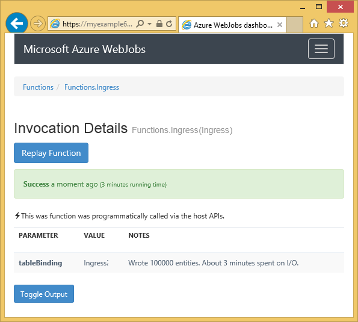

<properties 
	pageTitle="Comment utiliser le stockage de table Windows Azure avec SDK WebJobs" 
	description="Apprenez à utiliser le stockage de table Windows Azure avec SDK WebJobs Créer des tables, ajouter des entités à des tables et lire les tables existantes." 
	services="web-sites, storage" 
	documentationCenter=".net" 
	authors="tdykstra" 
	manager="wpickett" 
	editor="jimbe"/>

<tags 
	ms.service="web-sites" 
	ms.workload="web" 
	ms.tgt_pltfrm="na" 
	ms.devlang="dotnet" 
	ms.topic="article" 
	ms.date="12/15/2014" 
	ms.author="tdykstra"/>

# Comment utiliser le stockage de table Windows Azure avec SDK WebJobs

Ce guide fournit des exemples de code C# qui montrent comment lire et écrire des tables de stockage Azure à l'aide de la version 1.x de [SDK WebJobs](websites-dotnet-webjobs-sdk.md).

Le guide suppose que vous savez [créer un projet WebJob dans Visual Studio avec des chaînes de connexion qui pointent vers votre compte de stockage](websites-dotnet-webjobs-sdk-get-started.md).
		
Une partie des extraits de code montrent l'attribut  `Table` utilisé dans les fonctions qui sont [appelées manuellement](../websites-dotnet-webjobs-sdk-storage-queues-how-to/#manual), autrement dit, sans utiliser l'un des attributs de déclenchement. 

## Sommaire

-   [Ajouter des entités à une table](#ingress)
-   [Surveillance en temps réel](#monitor)
-   [Lecture de plusieurs entités à partir d'une table](#multiple)
-   [Lecture d'une entité unique à partir d'une table](#readone)
-   [Utilisation directe de l'API de stockage .NET pour travailler avec une table](#readone)
-   [Rubriques couvertes par l'article de procédure de files d'attente](#queues)
-   [Étapes suivantes](#nextsteps)

## Ajouter des entités à une table

Pour ajouter des entités à une table, utilisez l'attribut  `Table` avec un paramètre  `ICollector<T>` ou  `IAsyncCollector<T>` où  `T` specifies the schema of the entities you want to add. The attribute constructor takes a string parameter that specifies the name of the table. 

The following code sample adds `Person` des entités à une table nommée  *Ingress*.

		[NoAutomaticTrigger]
		public static void IngressDemo(
		    [Table("Ingress")] ICollector<Person> tableBinding)
		{
		    for (int i = 0; i < 100000; i++)
		    {
		        tableBinding.Add(
		            new Person() { 
		                PartitionKey = "Test", 
		                RowKey = i.ToString(), 
		                Name = "Name" }
		            );
		    }
		}

En général, le type que vous utilisez avec  `ICollector` dérive de  `TableEntity` ou implémente  `ITableEntity`, mais pas nécessairement. L'une des classes  `Person` suivantes fonctionne avec le code indiqué dans la méthode  `Ingress` précédente.

		public class Person : TableEntity
		{
		    public string Name { get; set; }
		}

		public class Person
		{
		    public string PartitionKey { get; set; }
		    public string RowKey { get; set; }
		    public string Name { get; set; }
		}

Si vous souhaitez travailler directement avec l'API de stockage Azure, vous pouvez ajouter un paramètre  `CloudStorageAccount` à la signature de méthode.

## Surveillance en temps réel

Étant donné que les fonctions d'entrée de données traitent souvent des volumes de données importants, le tableau de bord SDK WebJobs fournit des données d'analyse en temps réel. La section de **journal d'appel**vous indique si la fonction est en cours d'exécution.

La page de **détails de l'appel** signale la progression de la fonction (nombre d'entités écrites) pendant qu'elle est en cours d'exécution et vous donne la possibilité de l'annuler. 

Lorsque la fonction se termine, la page de **détails d'appel**signale le nombre de lignes écrites.

## Lecture de plusieurs entités à partir d'une table

Pour lire une table, utilisez l'attribut  `Table` avec un paramètre  `IQueryable<T>` où vous pouvez taper  `T` derives from `TableEntity` ou implémenter  `ITableEntity`.

L'exemple de code suivant lit et enregistre toutes les lignes de la table  `Ingress` :
 
		public static void ReadTable(
		    [Table("Ingress")] IQueryable<Person> tableBinding,
		    TextWriter logger)
		{
		    var query = from p in tableBinding select p;
		    foreach (Person person in query)
		    {
		        logger.WriteLine("PK:{0}, RK:{1}, Name:{2}", 
		            person.PartitionKey, person.RowKey, person.Name);
		    }
		}

### Lecture d'une entité unique à partir d'une table

Il existe un constructeur d'attribut  `Table`avec deux paramètres supplémentaires qui vous permettent de spécifier la clé de partition et la clé de ligne lorsque vous souhaitez la lier à une entité de table unique.

L'exemple de code suivant lit une ligne de table pour une entité  `Person` basée sur les valeurs de clé de partition et de clé de ligne reçues dans un message de file d'attente :  

		public static void ReadTableEntity(
		    [QueueTrigger("inputqueue")] Person personInQueue,
		    [Table("persontable","{PartitionKey}", "{RowKey}")] Person personInTable,
		    TextWriter logger)
		{
		    if (personInTable == null)
		    {
		        logger.WriteLine("Person not found: PK:{0}, RK:{1}",
		                personInQueue.PartitionKey, personInQueue.RowKey);
		    }
		    else
		    {
		        logger.WriteLine("Person found: PK:{0}, RK:{1}, Name:{2}",
		                personInTable.PartitionKey, personInTable.RowKey, personInTable.Name);
		    }
		}

Dans cet exemple, la classe  `Person` ne doit pas implémenter  `ITableEntity`.

## Utilisation directe de l'API de stockage .NET pour travailler avec une table

Vous pouvez également utiliser l'attribut  `Table` avec un objet  `CloudTable` pour plus de souplesse dans l'utilisation d'une table.

L'exemple de code suivant utilise un objet  `CloudTable` pour ajouter une entité unique à la table  *Ingress*. 
 
		public static void UseStorageAPI(
		    [Table("Ingress")] CloudTable tableBinding,
		    TextWriter logger)
		{
		    var person = new Person()
		        {
		            PartitionKey = "Test",
		            RowKey = "100",
		            Name = "Name"
		        };
		    TableOperation insertOperation = TableOperation.Insert(person);
		    tableBinding.Execute(insertOperation);
		}

Pour plus d'informations sur l'utilisation de l'objet  `CloudTable`, consultez [Utilisation du service de stockage de tables à partir de .NET](storage-dotnet-how-to-use-tables.md). 

## Rubriques couvertes par l'article de procédure de files d'attente

Pour plus d'informations sur la façon de gérer le traitement des tables déclenchées par un message de file d'attente ou pour les scénarios SDK WebJobs non spécifiques au traitement des tables, consultez [Utilisation du stockage de file d'attente Azure avec SDK WebJobs](websites-dotnet-webjobs-sdk-storage-queues-how-to.md). 

Les sujets abordés dans cet article sont les suivants :

* Fonctions asynchrones
* Instances multiples
* Arrêt progressif
* Utilisation des attributs SDK WebJobs dans le corps d'une fonction
* Définition des chaînes de connexion du Kit de développement logiciel dans le code
* Définition des valeurs pour les paramètres du constructeur SDK WebJobs dans le code
* Déclenchement manuel d'une fonction
* Écriture de journaux

## Étapes suivantes

Ce guide fournit des exemples de code qui montrent comment gérer des scénarios courants d'utilisation des tables Azure. Pour plus d'informations sur le Kit de développement logiciel (SDK) WebJobs Azure, consultez [Tâches Web Azure - Ressources recommandées](http://go.microsoft.com/fwlink/?linkid=390226).

<!--HONumber=42-->
