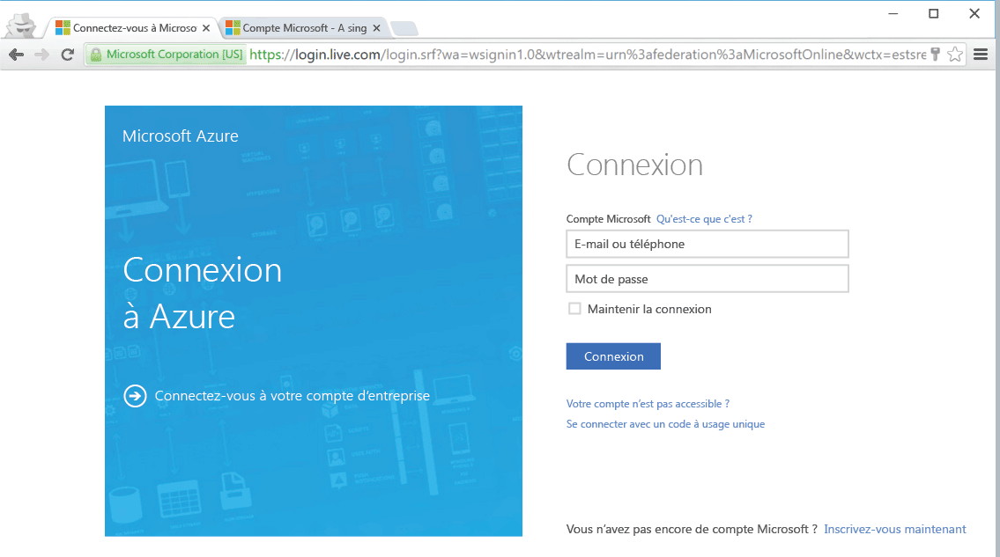

<!--
includes/azure-include-getting-started-v12portal-gettings-an-account.md

Latest Freshness check:  2016-04-11 , carlrab.

As of circa 2016-04-11, the following topics might include this include:
articles/sql-database/sql-database-get-started-tutorial.md

-->
## Connexion au portail Azure avec un abonnement
Vous devez disposer d’un abonnement pour vous connecter au portail Azure.

### Obtention d’un nouveau compte
Si vous n’avez pas de compte Azure existant, choisissez l’une des options suivantes pour obtenir un compte :

* Obtenir un [compte gratuit](https://azure.microsoft.com/get-started/).
* Utiliser un [abonnement MSDN](https://azure.microsoft.com/pricing/member-offers/msdn-benefits/).

### Connexion à l’aide de votre compte existant
À l’aide de votre [abonnement existant](https://account.windowsazure.com/Home/Index), suivez ces étapes pour vous connecter au portail Azure.

1. Ouvrez votre navigateur préféré et connectez-vous au [portail Azure](https://portal.azure.com/).
2. Connectez-vous au [portail Azure](https://portal.azure.com/).
3. Dans la page **de connexion** , entrez les informations d’identification de votre abonnement.
   
   

<!--HONumber=Nov16_HO2-->

