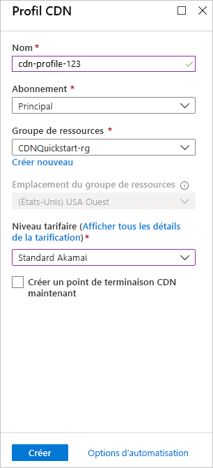

## Créer un profil CDN

Un profil CDN est un conteneur pour les points de terminaison CDN, qui spécifie un niveau tarifaire.

1. Dans le portail Azure en haut à gauche, sélectionnez **Créer une ressource**. 
    
    Le volet **Nouveau** s’affiche.
   
2. Sélectionnez **Web + Mobile**, puis **CDN**.
   
    

    Le volet du **profil CDN** s’affiche.

3. Pour les paramètres de profil CDN, utilisez les valeurs spécifiées dans le tableau suivant :
   
    | Paramètre  | Valeur |
    | -------- | ----- |
    | **Name** | Entrez *my-cdn-profile-123* comme nom de profil. Ce nom doit être globalement unique. S’il est déjà utilisé, vous pouvez en entrer un autre. |
    | **Abonnement** | Sélectionnez un abonnement Azure dans la liste déroulante. |
    | **Groupe de ressources** | Sélectionnez **Créer** et entrez *my-resource-group-123* comme nom pour votre groupe de ressources. Ce nom doit être globalement unique. S’il est déjà utilisé, vous pouvez entrer un nom différent, ou vous pouvez sélectionner **Utiliser un existant** et sélectionnez **my-resource-group-123** dans la liste déroulante. | 
    | **Emplacement du groupe de ressources** | Sélectionnez **Centre des États-Unis** dans la liste déroulante. |
    | **Niveau tarifaire** | Sélectionnez **Standard Verizon** dans la liste déroulante. |
    | **Créer un point de terminaison CDN maintenant** | Laissez non sélectionné. |  
   
    

4. Sélectionnez **Épingler au tableau de bord** pour enregistrer le profil sur votre tableau de bord après l’avoir créé.
    
5. Cliquez sur **Créer** pour créer le profil. 

    Pour finaliser les profils **Azure CDN standard fournis par Microsoft** uniquement, un délai de deux heures est habituellement nécessaire. 

