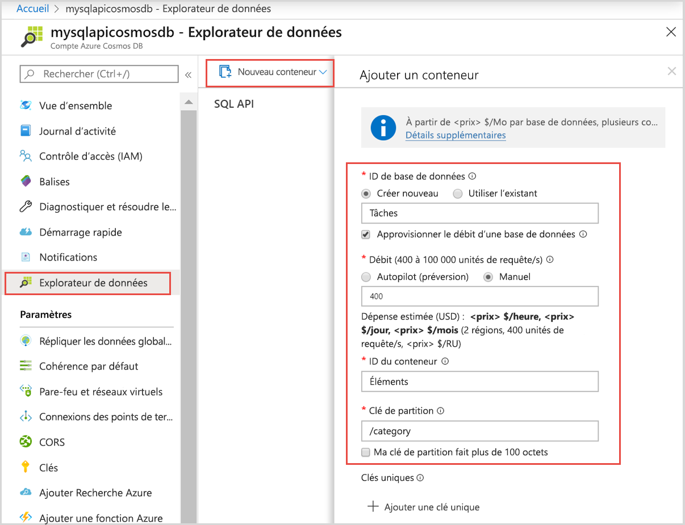

Vous pouvez désormais utiliser l’outil Explorateur de données dans le portail Azure pour créer une base de données et une collection. 

1. Cliquez sur **Explorateur de données** > **Nouvelle collection**. 
    
    La zone **Ajouter une collection** est affichée à l’extrême droite : il peut donc être nécessaire de faire défiler à droite pour l’afficher.

    

2. Dans la page **Ajouter une collection**, entrez les paramètres pour la nouvelle collection.

    Paramètre|Valeur suggérée|DESCRIPTION
    ---|---|---
    ID de base de données|Tâches|Entrez *Tasks* comme nom pour la nouvelle base de données. Les noms de base de données doivent comporter entre 1 et 255 caractères, et ne peuvent pas contenir les caractères /, \\, # ou ?, ni d’espace de fin.
    ID de la collection|Éléments|Entrez *Items* comme nom pour votre nouvelle collection. Les ID de collection sont soumis aux mêmes spécifications de caractères que les noms de base de données.
    Capacité de stockage| Fixe (10 Go)|Modifiez la valeur en sélectionnant **Fixe (10 Go)**. Cette valeur correspond à la capacité de stockage de la base de données.
    Throughput|400 RU|Changez le débit en indiquant 400 unités de requête par seconde (RU/s). La capacité de stockage doit être définie sur **Fixe (10 Go)** afin de définir le débit sur 400 RU/s. Si vous souhaitez réduire la latence, vous pourrez augmenter le débit par la suite. 
    
    Outre les paramètres précédents, vous pouvez ajouter des **clés uniques** pour la collection. Laissez le champ vide dans cet exemple. Les clés uniques permettent aux développeurs d’ajouter une couche d’intégrité des données à la base de données. En créant une stratégie de clé unique durant la création d’une collection, vous garantissez l’unicité d’une ou de plusieurs valeurs par clé de partition. Pour en savoir plus, référez-vous à l’article [Clés uniques dans Azure Cosmos DB](../articles/cosmos-db/unique-keys.md).
    
    Cliquez sur **OK**.

    L’Explorateur de données affiche la nouvelle base de données et la nouvelle collection.

    