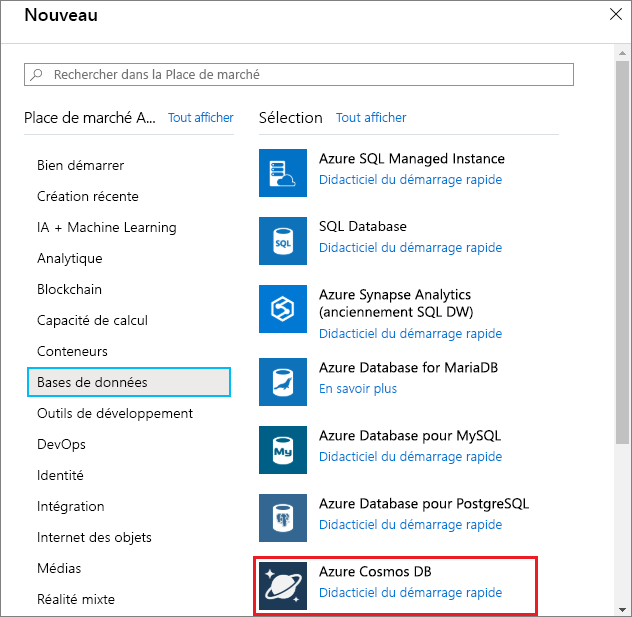

1. Dans une nouvelle fenêtre, connectez-vous au [portail Azure](https://portal.azure.com/).
2. Dans le menu de gauche, cliquez sur **Nouveau**, cliquez ensuite sur **Bases de données**, puis cliquez sur **Azure Cosmos DB**.
   
   

3. Dans le panneau **Nouveau compte**, indiquez la configuration souhaitée pour le compte Azure Cosmos DB. 

    Grâce à Azure Cosmos DB, vous pouvez choisir un des quatre modèles de programmation : Gremlin (graphique), MongoDB, SQL (DocumentDB) et Table (clé-valeur).  
       
    Dans ce guide de démarrage rapide, nous allons programmer sur l’API Graph, vous choisirez donc **Gremlin (graphique)** lors du remplissage du formulaire. Cependant, si vous avez des données de document provenant d’une application du catalogue, des données clé/valeur (table) ou des données migrées d’une application MongoDB, sachez qu’Azure Cosmos DB peut fournir une plate-forme de service de base de données hautement disponible et distribuée dans le monde entier pour toutes vos applications essentielles.

    Remplissez le panneau Nouveau compte en vous aidant des informations figurant dans la capture d’écran. Vous allez choisir des valeurs uniques lors de la configuration de votre compte, c’est pourquoi vos valeurs ne correspondront pas exactement à la capture d’écran. 
 
    

    Paramètre|Valeur suggérée|Description
    ---|---|---
    ID|*Valeur unique*|Un nom unique que vous choisissez pour identifier le compte Azure Cosmos DB. *documents.azure.com* est ajouté à l’ID que vous fournissez pour créer votre URI ; aussi, utilisez un ID unique mais identifiable. Cet ID ne peut contenir que des minuscules, des chiffres et le caractère « - », et il doit comporter entre 3 et 50 caractères.
    API|Gremlin (graphique)|Nous allons programmer sur [l’API Graph](../articles/cosmos-db/graph-introduction.md) plus loin dans cet article.|
    Abonnement|*Votre abonnement*|L’abonnement Azure que vous souhaitez utiliser pour le compte Azure Cosmos DB. 
    Groupe de ressources|*La même valeur que l’ID*|Le nouveau nom de groupe de ressources pour votre compte. Pour plus de simplicité, vous pouvez utiliser le même nom que votre ID. 
    Lieu|*La région la plus proche de vos utilisateurs*|La zone géographique dans laquelle héberger votre compte Azure Cosmos DB. Choisissez l’emplacement le plus proche de vos utilisateurs afin de leur donner l’accès le plus rapide aux données.

4. Cliquez sur **Créer** pour créer le compte.
5. Dans la barre d’outils, cliquez sur **Notifications** pour surveiller le processus de déploiement.

    

6.  Lorsque le déploiement est terminé, ouvrez le nouveau compte à partir de la mosaïque Toutes les ressources. 

    